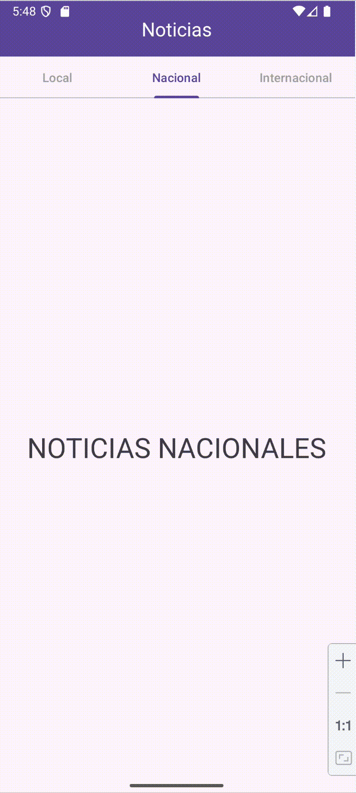
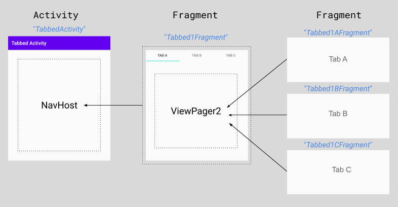
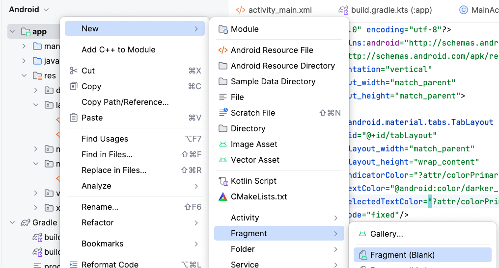

<div class="justify-text">

La **navegación mediante pestañas** es un patrón de diseño clásico y muy común en aplicaciones modernas. Se utiliza cuando queremos **agrupar contenido relacionado** y permitir al usuario **cambiar de sección deslizando o pulsando en las tabs**.

El componente principal es **`TabLayout`**, que se sincroniza con un **`ViewPager2`** para mostrar distintos **Fragments**.  
A diferencia de otros menús, **no forma parte del Navigation Component** y por tanto no se gestiona con `NavigationUI`.



---

## Estructura del sistema de pestañas

La navegación mediante pestañas se organiza en **una jerarquía de componentes** en la que cada nivel cumple una función específica:

1. **Activity principal (`MainActivity`)**
   Es la encargada de **alojar el `NavHostFragment`**, que actúa como contenedor de navegación.
   En este caso, solo carga un fragmento principal (`NewsFragment` o `Tabbed1Fragment`) que será el encargado de gestionar las pestañas.

   > 🔸 En otras palabras, la Activity sirve de “marco” para mostrar el conjunto de pestañas dentro de un único destino del grafo de navegación.

2. **Fragment contenedor (`NewsFragment` / `Tabbed1Fragment`)**
   Dentro de este fragment se define el **`TabLayout` y el `ViewPager2`**, que permiten la navegación interna entre las diferentes secciones.

   * El `TabLayout` muestra las pestañas visibles.
   * El `ViewPager2` contiene las páginas deslizables (cada una será un fragment independiente).

   > 💡 Este fragment es el **núcleo del sistema de pestañas**, ya que conecta la interfaz de usuario (las tabs) con el contenido dinámico (los fragments).

3. **Fragments de contenido (`LocalFragment`, `NacionalFragment`, `InternacionalFragment`)**
   Cada pestaña del `TabLayout` se asocia con un fragment de contenido, gestionado por el `ViewPager2` a través de un `FragmentStateAdapter`.

   * Cada uno representa una **sección independiente** dentro de la app (por ejemplo, “Noticias Locales”, “Noticias Nacionales”, etc.).
   * No están incluidos en el grafo de navegación, ya que la navegación entre ellos **no usa el Navigation Component**, sino el propio sistema del `ViewPager2`.




## Pasos para implementar un TabLayout con ViewPager2

### 1️⃣ Crear la estructura base de la Activity

En este ejemplo, crearemos una app de **Noticias** con tres secciones: **Local**, **Nacional** e **Internacional**.  

Cada sección será un `Fragment`, y estarán gestionadas por un `ViewPager2` sincronizado con un `TabLayout`.

El layout principal (`activity_main.xml`) contendrá un **Toolbar** y un **NavHostFragment** que cargará un único fragmento (`NewsFragment`), encargado de gestionar las pestañas.

```xml title="activity_main.xml"
<?xml version="1.0" encoding="utf-8"?>
<androidx.coordinatorlayout.widget.CoordinatorLayout
    xmlns:android="http://schemas.android.com/apk/res/android"
    xmlns:app="http://schemas.android.com/apk/res-auto"
    xmlns:tools="http://schemas.android.com/tools"
    android:layout_width="match_parent"
    android:layout_height="match_parent"
    tools:context=".MainActivity">

    <!-- AppBar superior -->
    <com.google.android.material.appbar.AppBarLayout
        android:layout_width="match_parent"
        android:layout_height="wrap_content"
        android:theme="@style/ThemeOverlay.Material3.Dark.ActionBar">

        <com.google.android.material.appbar.MaterialToolbar
            android:id="@+id/toolbar"
            android:layout_width="match_parent"
            android:layout_height="?attr/actionBarSize"
            android:background="?attr/colorPrimary"
            app:titleCentered="true"
            app:titleTextColor="@android:color/white" />
    </com.google.android.material.appbar.AppBarLayout>

    <!-- Contenido principal -->
    <androidx.fragment.app.FragmentContainerView
        android:id="@+id/nav_host_fragment"
        android:name="androidx.navigation.fragment.NavHostFragment"
        android:layout_width="match_parent"
        android:layout_height="match_parent"
        app:layout_behavior="@string/appbar_scrolling_view_behavior"
        app:defaultNavHost="true"
        app:navGraph="@navigation/nav_graph" />

</androidx.coordinatorlayout.widget.CoordinatorLayout>
```

También modificamos el `ActivityMain` para incluir la lógica asociada a la Toolbar.

```java title="MainActivity.java"
public class MainActivity extends AppCompatActivity {

    ActivityMainBinding binding;
    private NavController navController;
    private AppBarConfiguration appBarConfiguration;

    @Override
    protected void onCreate(Bundle savedInstanceState) {
        super.onCreate(savedInstanceState);
        setContentView((binding = ActivityMainBinding.inflate(getLayoutInflater())).getRoot());

        // 1. Obtenemos la referencia de la Toolbar del layout
        setSupportActionBar(binding.toolbar);

        // 2. Obtenemos el NavController desde el contenedor del grafo
        navController = ((NavHostFragment) getSupportFragmentManager().findFragmentById(R.id.nav_host_fragment)).getNavController();

        // 3. Configuramos la AppBar para que el título y el botón de navegación
        // se actualicen automáticamente al navegar entre fragments
        appBarConfiguration = new AppBarConfiguration.Builder(navController.getGraph()).build();
        NavigationUI.setupActionBarWithNavController(this, navController, appBarConfiguration);
    }

    // Método que se ejecuta cuando el usuario pulsa el botón de “navegación superior” de la barra de la app, es decir:
    // el icono de flecha atrás, o el icono de menú hamburguesa (si tienes un DrawerLayout).
    @Override
    public boolean onSupportNavigateUp() {
        return NavigationUI.navigateUp(navController, appBarConfiguration)
                || super.onSupportNavigateUp();
    }
}
```

---

### 2️⃣ Crear el grafo de navegación

El grafo (`nav_graph.xml`) solo contendrá un único fragmento: `NewsFragment`,
ya que la navegación entre pestañas **no se hace con NavigationUI**, sino con `ViewPager2`.

```xml title="nav_graph.xml"
<?xml version="1.0" encoding="utf-8"?>
<navigation xmlns:android="http://schemas.android.com/apk/res/android"
    xmlns:app="http://schemas.android.com/apk/res-auto"
    xmlns:tools="http://schemas.android.com/tools"
    android:id="@+id/nav_graph"
    app:startDestination="@id/newsFragment">

    <fragment
        android:id="@+id/newsFragment"
        android:name="es.iesagora.demotablayout.NewsFragment"
        android:label="Noticias"
        tools:layout="@layout/fragment_news" />
</navigation>
```

---

### 3️⃣ Crear el fragment principal con el TabLayout y el ViewPager2

El `NewsFragment` será el que contenga el `TabLayout` y el `ViewPager2`.

```xml title="fragment_news.xml"
<?xml version="1.0" encoding="utf-8"?>
<LinearLayout xmlns:android="http://schemas.android.com/apk/res/android"
    xmlns:app="http://schemas.android.com/apk/res-auto"
    android:orientation="vertical"
    android:layout_width="match_parent"
    android:layout_height="match_parent">

    <com.google.android.material.tabs.TabLayout
        android:id="@+id/tabLayout"
        android:layout_width="match_parent"
        android:layout_height="wrap_content"
        app:tabIndicatorColor="?attr/colorPrimary"
        app:tabTextColor="@android:color/darker_gray"
        app:tabSelectedTextColor="?attr/colorPrimary"
        app:tabMode="fixed"/>

    <androidx.viewpager2.widget.ViewPager2
        android:id="@+id/viewPager"
        android:layout_width="match_parent"
        android:layout_height="match_parent"/>
</LinearLayout>
```

---

### 4️⃣ Crear los fragments para cada sección

Creamos tres fragments sencillos: `LocalFragment`, `NacionalFragment` e `InternacionalFragment`.
Cada uno mostrará un texto o una imagen representativa.

:::info CREAR NUEVO FRAGMENTO SIN USAR EL GRAFO DE NAVEGACIÓN
Para crear un Fragment sin hacer uso del grafo de navegación:  
**Click derecho sobre la carpeta raíz del proyecto > New > Fragment > Fragment (blank)**



:::

Cambia el layout de cada fragmento para que muestre lo que tu app necesite, por ejemplo, un texto:

```xml title="fragment_local.xml"
<?xml version="1.0" encoding="utf-8"?>
<androidx.constraintlayout.widget.ConstraintLayout xmlns:android="http://schemas.android.com/apk/res/android"
    xmlns:app="http://schemas.android.com/apk/res-auto"
    xmlns:tools="http://schemas.android.com/tools"
    android:id="@+id/frameLayout"
    android:layout_width="match_parent"
    android:layout_height="match_parent"
    tools:context=".LocalFragment">

    <TextView
        android:id="@+id/textView2"
        android:layout_width="wrap_content"
        android:layout_height="wrap_content"
        android:text="NOTICIAS LOCALES"
        android:textSize="32sp"
        app:layout_constraintBottom_toBottomOf="parent"
        app:layout_constraintEnd_toEndOf="parent"
        app:layout_constraintStart_toStartOf="parent"
        app:layout_constraintTop_toTopOf="parent" />
</androidx.constraintlayout.widget.ConstraintLayout>
```

*(Los otros dos fragments son similares, solo cambia el texto.)*

---


### 5️⃣ Configurar el fragment contenedor del menú

El fragment principal (`NewsFragment`) es el encargado de **gestionar el TabLayout y el ViewPager2**, que permiten navegar entre las diferentes secciones de noticias.
Aquí es donde realizamos toda la configuración para que las pestañas y los fragments trabajen sincronizados.

```java title="NewsFragment.java"
public class NewsFragment extends Fragment {

    private FragmentNewsBinding binding;

    @Override
    public View onCreateView(LayoutInflater inflater, ViewGroup container,
                             Bundle savedInstanceState) {
        // Inflamos el layout usando ViewBinding (en lugar de findViewById)
        binding = FragmentNewsBinding.inflate(inflater, container, false);
        return binding.getRoot();
    }

    @Override
    public void onViewCreated(@NonNull View view, @Nullable Bundle savedInstanceState) {
        super.onViewCreated(view, savedInstanceState);

        // 1️⃣ Configuramos el adaptador que define qué fragment se muestra en cada pestaña
        establecerAdaptadorViewPager();

        // 2️⃣ Vinculamos el TabLayout con el ViewPager2 para sincronizar ambos componentes
        vincularTabLayoutConViewPager();
    }

    /**
     * Crea y asigna el adaptador del ViewPager2.
     * Este adaptador indica cuántas páginas (fragments) hay y cuál debe mostrarse según la posición.
     */
    private void establecerAdaptadorViewPager() {
        binding.viewPager.setAdapter(new FragmentStateAdapter(this) {
            @NonNull
            @Override
            public Fragment createFragment(int position) {
                // Devuelve el fragment correspondiente a cada pestaña
                switch (position) {
                    default:
                    case 0: return new LocalFragment();
                    case 1: return new NacionalFragment();
                    case 2: return new InternacionalFragment();
                }
            }

            @Override
            public int getItemCount() {
                // Número total de pestañas
                return 3;
            }
        });
    }

    /**
     * Sincroniza el TabLayout con el ViewPager2 usando TabLayoutMediator.
     * Esto permite que al tocar una pestaña cambie la página, y al deslizar se actualice la pestaña activa.
     */
    private void vincularTabLayoutConViewPager() {
        new TabLayoutMediator(binding.tabLayout, binding.viewPager,
                (tab, position) -> {
                    switch (position) {
                        case 0:
                            tab.setText("Local");
                            break;
                        case 1:
                            tab.setText("Nacional");
                            break;
                        case 2:
                            tab.setText("Internacional");
                            break;
                    }
                }).attach();
    }
}
```

</div>

