<div class="justify-text">

La **RecyclerView** es un componente de Android diseñado para mostrar **listas o cuadrículas de elementos** de manera **eficiente y flexible**. Es ideal para listas grandes o listas dinámicas en las que los datos pueden cambiar en tiempo de
ejecución. El RecyclerView reutiliza ("recicla") las vistas, lo cual mejora el rendimiento y reduce la carga de
memoria, ya que no crea una vista para cada elemento, sino solo para las que están en pantalla o próximas a
mostrarse. A diferencia del antiguo `ListView`, este componente **recicla las vistas** que salen de pantalla y solo mantiene en memoria las necesarias, lo que mejora el rendimiento.

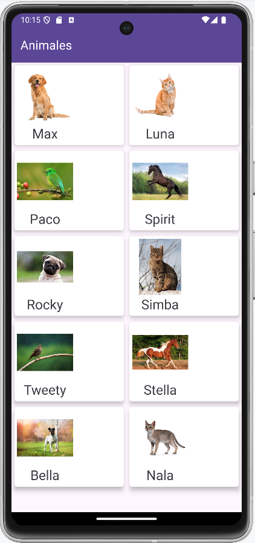

Un RecyclerView permite mostrar los datos con **cuatro disposiciones** diferentes:

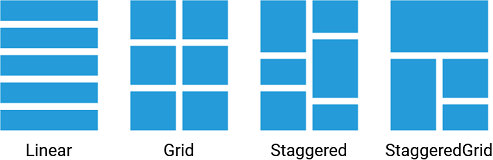

---

## Estructura general

Para implementar una RecyclerView completa necesitamos varios elementos que trabajan en conjunto:

| Elemento | Función |
|-----------|----------|
| **RecyclerView** | Contenedor que muestra los elementos en forma de lista o cuadrícula. |
| **Modelo (Model)** | Clase Java que define los datos de cada elemento (por ejemplo, `Animal`). |
| **Repository** | Clase que gestiona la lista de datos (por ahora, con patrón Singleton; más adelante utilizaremos ViewModel para mejorarlo). |
| **ViewHolder** | Describe la estructura visual de un solo elemento de la lista. |
| **Adapter** | Enlaza los datos del Repository con las vistas (ViewHolder). |
| **LayoutManager** | Controla la disposición de los elementos (vertical, horizontal o en cuadrícula). |

En resumen, **RecyclerView** es el contenedor principal para la interfaz de usuario y el **ViewHolder** es la plantilla para mostrar un elemento en el RecyclerView. Cada ítem que se muestra en el RecyclerView es una copia del ViewHolder. Por ejemplo, si el RecyclerView ha de mostrar una lista de productos, cada ViewHolder representa un único producto.

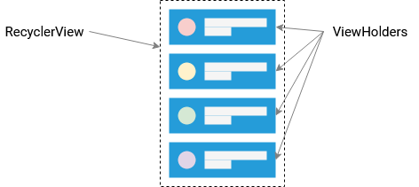

---

## Pasos para implementar un RecyclerView

En esta parte del tutorial vamos a implementar esta aplicación:

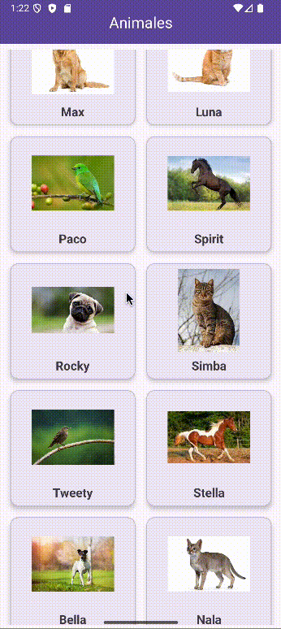

### 1️⃣ Crear la estructura base de la app

Partimos de una aplicación con **una sola Activity** que contendrá **dos fragments**:

* `AnimalesFragment`: muestra la lista de animales mediante un `RecyclerView`.
* `DetalleAnimalFragment`: muestra la información detallada del animal seleccionado.

Esta estructura se conoce como **Master/Detail**, ya que un fragmento actúa como lista principal (*master*) y el otro como detalle del elemento (*detail*).

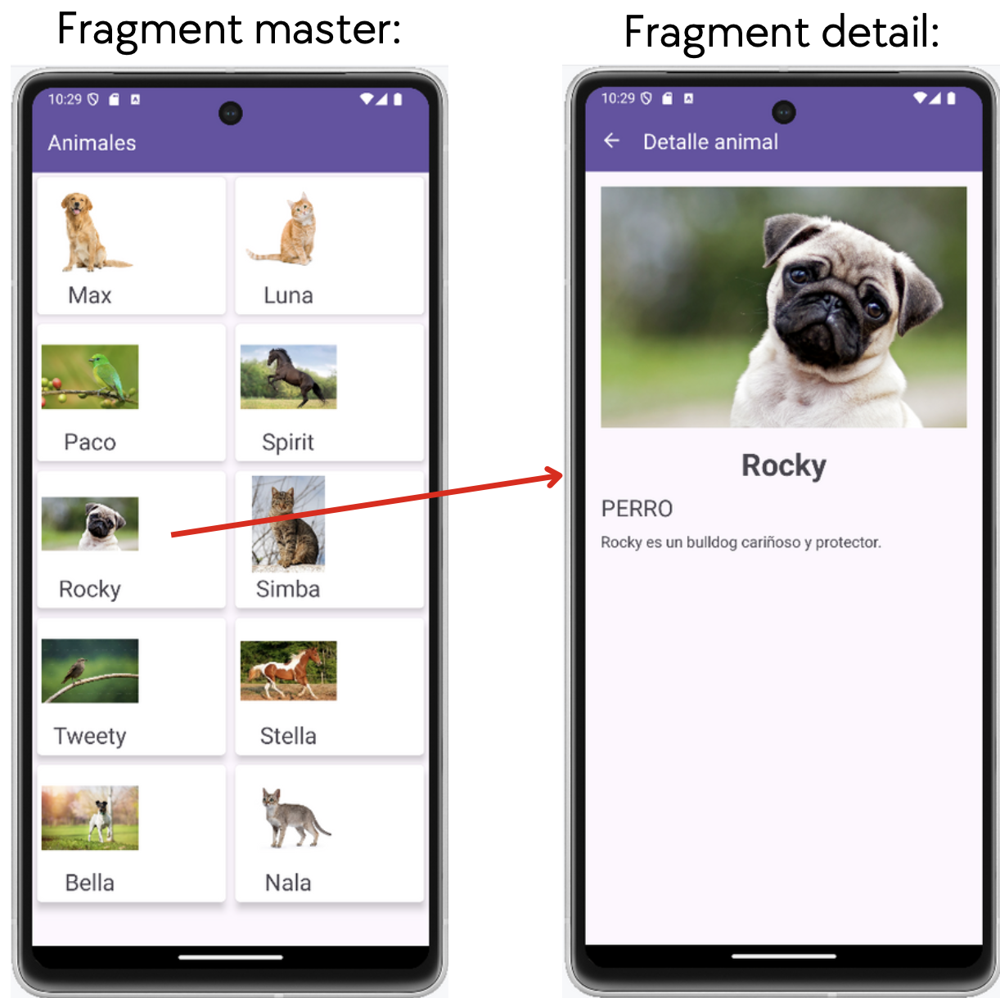

El **grafo de navegación** conecta ambos fragments.
Debemos definir una **acción de navegación** entre ellos, que se ejecutará al pulsar sobre un elemento del RecyclerView para mostrar su detalle.

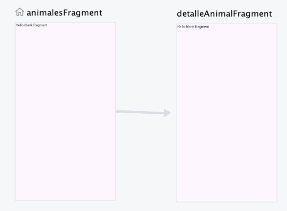

:::note Recordatorio
La incorporación de **Fragments dentro de una Activity** ya se explicó en apartados anteriores.  
Si tienes dudas sobre cómo añadir o gestionar fragments con Navigation, puedes revisar ese contenido antes de continuar.
:::

---

### 2️⃣ Crear el modelo de datos

Comenzamos definiendo la clase **`Animal.java`**, que actuará como **modelo de datos** para representar cada elemento que se mostrará en el `RecyclerView`.

Para crear una nueva clase Java:
➡️ **Click derecho sobre la carpeta `java` > New > Java Class**

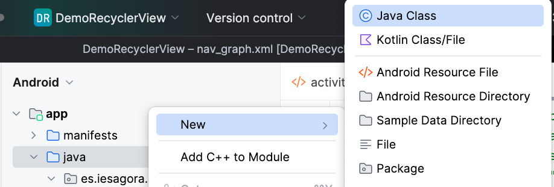

```java title="Animal.java"
public class Animal implements Serializable {

    private String nombre;
    private int imagen; // ID del recurso drawable
    private String descripcion;

    public Animal(String nombre, int imagen, String descripcion) {
        this.nombre = nombre;
        this.imagen = imagen;
        this.descripcion = descripcion;
    }

    public String getNombre() { return nombre; }
    public int getImagen() { return imagen; }
    public String getDescripcion() { return descripcion; }
}
```

:::info Sobre el atributo `imagen`
En este caso, el atributo `imagen` es de tipo **`int`** porque almacena el **identificador del recurso drawable** (por ejemplo, `R.drawable.perro`) incluido dentro del propio proyecto.  
Android asigna a cada recurso un ID numérico único, por eso el tipo debe ser `int`.  

Más adelante, cuando trabajemos con **APIs externas**, las imágenes no estarán dentro de la app, sino que se cargarán desde Internet. En ese caso, usaremos un **`String`** para guardar la **URL** de la imagen.
:::


:::tip Organización del proyecto
Es recomendable **crear paquetes** (por ejemplo: `model`, `repository`, `adapter`, `ui`)
para mantener el código organizado y facilitar su mantenimiento a medida que el proyecto crece.

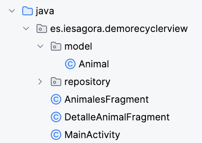
:::

---

### 3️⃣ Crear el repositorio de datos

El **Repository** será la clase encargada de **almacenar y proporcionar los datos** de los animales a los distintos fragments.
En este ejemplo, guardaremos la lista de animales en memoria mediante un **`ArrayList`**.

```java title="AnimalesRepository.java"
public class AnimalesRepository {

    private List<Animal> listaAnimales;

    private AnimalesRepository() {
        listaAnimales = new ArrayList<>();

        listaAnimales.add(new Animal("Max", R.drawable.perro1, "Max es un labrador leal y juguetón."));
        listaAnimales.add(new Animal("Luna", R.drawable.gato1, "Luna es una gata curiosa y cazadora."));
        listaAnimales.add(new Animal("Paco", R.drawable.pajaro1, "Paco es un loro que habla mucho."));
        listaAnimales.add(new Animal("Spirit", R.drawable.caballo1, "Spirit es un caballo fuerte y veloz."));
        listaAnimales.add(new Animal("Rocky", R.drawable.perro2, "Rocky es un bulldog cariñoso y protector."));
        listaAnimales.add(new Animal("Simba", R.drawable.gato2, "Simba es un gato persa muy tranquilo."));
        listaAnimales.add(new Animal("Tweety", R.drawable.pajaro2, "Tweety es un canario de color amarillo."));
        listaAnimales.add(new Animal("Stella", R.drawable.caballo2, "Stella es una yegua amigable y rápida."));
        listaAnimales.add(new Animal("Bella", R.drawable.perro3, "Bella es una golden retriever amistosa."));
        listaAnimales.add(new Animal("Nala", R.drawable.gato3, "Nala es una gata independiente y elegante."));
    }

    public List<Animal> getAnimales() {
        return listaAnimales;
    }

}
```

---


### 4️⃣ Crear el layout del fragment principal

El fragmento que mostrará la lista de animales contendrá un **`RecyclerView`**, que actúa como **contenedor de los datos**.
Por sí mismo, el RecyclerView **no muestra información**: solo define **dónde** y **cómo** se presentarán los elementos que le asigne el adaptador.

En esta fase el RecyclerView estará **vacío**, y más adelante lo **rellenaremos desde el código Java** con los datos del `ArrayList` del repositorio.

Cuando se añade al layout, es importante definir **cómo se organizarán los elementos** (los `ViewHolder`).
Esto se controla mediante el atributo `app:layoutManager`.
En nuestro caso, utilizaremos un **`GridLayoutManager`** para mostrar los animales en **cuadrícula**.

```xml title="fragment_animales.xml"
<?xml version="1.0" encoding="utf-8"?>
<FrameLayout xmlns:android="http://schemas.android.com/apk/res/android"
    xmlns:tools="http://schemas.android.com/tools"
    android:layout_width="match_parent"
    android:layout_height="match_parent"
    tools:context=".AnimalesFragment">

    <androidx.recyclerview.widget.RecyclerView
        android:id="@+id/recyclerView"
        android:layout_width="match_parent"
        android:layout_height="match_parent"
        android:padding="8dp"
        tools:listitem="@layout/viewholder_animal" />
</FrameLayout>
```

:::info Atributo listitem
El atributo `tools:listitem` indica al editor de Android Studio qué layout se usará para previsualizar cada elemento del RecyclerView.
:::

---


### 5️⃣ Diseñar el layout del ViewHolder

Este layout define la **apariencia de cada elemento** de la lista, es decir, cómo se mostrará **cada animal** dentro del `RecyclerView`.
Para conseguir un estilo moderno y limpio, utilizaremos un **`CardView`**, que permite mostrar cada elemento como una tarjeta con esquinas redondeadas y sombra.

Antes de ver el código, ten en cuenta lo siguiente:

* Al usar un **`GridLayout`**, el contenedor principal del *ViewHolder* (en este caso el `CardView`) debe tener:

  * `android:layout_width="match_parent"`
  * `android:layout_height="wrap_content"`
    
    Luego, en el código Java, definiremos el número de columnas del grid, y Android ajustará automáticamente el tamaño de cada tarjeta.

* En el **`ImageView`** se mostrará la **imagen** del animal.

* En el **`TextView`** se mostrará su **nombre**.


```xml title="viewholder_animal.xml"
<?xml version="1.0" encoding="utf-8"?>
<com.google.android.material.card.MaterialCardView xmlns:android="http://schemas.android.com/apk/res/android"
    xmlns:app="http://schemas.android.com/apk/res-auto"
    android:layout_width="wrap_content"
    android:layout_height="wrap_content"
    android:layout_margin="8dp"
    app:cardCornerRadius="12dp"
    app:cardElevation="4dp">

    <LinearLayout
        android:layout_width="match_parent"
        android:layout_height="wrap_content"
        android:orientation="vertical"
        android:padding="8dp"
        android:gravity="center_horizontal">

        <ImageView
            android:id="@+id/ivAnimal"
            android:layout_width="120dp"
            android:layout_height="120dp" />

        <TextView
            android:id="@+id/tvNombre"
            android:layout_width="wrap_content"
            android:layout_height="wrap_content"
            android:layout_marginTop="8dp"
            android:textSize="18sp"
            android:textStyle="bold" />
    </LinearLayout>
</com.google.android.material.card.MaterialCardView>
```

:::note Recordatorio
Para crear un nuevo **layout** en Android Studio:  
➡️ **Click derecho sobre la carpeta `res/layout` > New > Layout resource file**  
Después, asigna un nombre (por ejemplo, `viewholder_animal`) y selecciona el tipo de raíz que necesites (`ConstraintLayout`, `FrameLayout`, etc.).

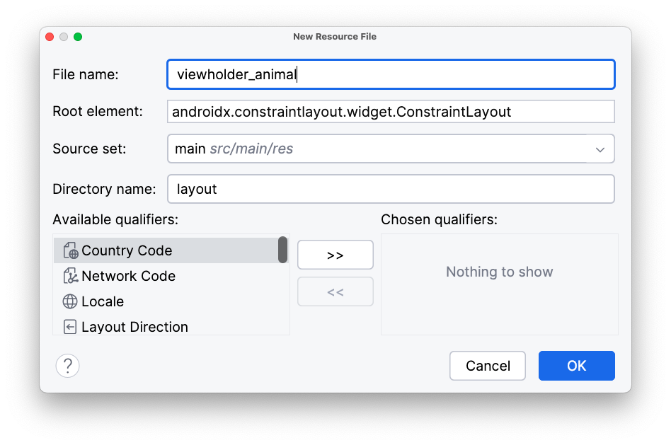
:::


---

### 6️⃣ Crear el Adapter y el ViewHolder

El `RecyclerView` **no sabe por sí mismo cómo debe mostrar los datos** ni qué hacer con cada elemento de la lista.
Para eso necesita dos piezas clave que trabajen juntas:

1. **`ViewHolder`** → Define **cómo se ve** un elemento (el diseño de una sola tarjeta).
2. **`Adapter`** → Define **qué datos se muestran** en ese diseño y **cuántos elementos hay** en total.

En nuestro caso, el adaptador se llamará **`AnimalesAdapter`** y su ViewHolder interno será **`AnimalViewHolder`**.

#### 🧱 La clase `AnimalViewHolder`

El `ViewHolder` representa **una sola fila o tarjeta del RecyclerView**, es decir, la vista de **un solo animal**.
Su función es **mantener las referencias a los elementos del layout** (el `TextView` y el `ImageView`) para no tener que buscarlos con `findViewById()` cada vez, lo que mejora el rendimiento.

En este caso usamos **ViewBinding**, por lo que el ViewHolder se encarga de **enlazar el layout XML `viewholder_animal.xml`** con un objeto `binding` que da acceso directo a sus vistas.

#### 🧩 La clase `AnimalesAdapter`

El adaptador actúa como **puente entre los datos (ArrayList de animales)** y el **RecyclerView** que los muestra en pantalla.

Sus principales responsabilidades son:

| Método                 | Función                                                                           |
| ---------------------- | --------------------------------------------------------------------------------- |
| `onCreateViewHolder()` | Crea (infla) una nueva vista para un elemento cuando el RecyclerView la necesita. |
| `onBindViewHolder()`   | Rellena la vista con los datos del animal correspondiente.                        |
| `getItemCount()`       | Indica cuántos elementos hay en total en la lista.                                |
| `establecerLista()`    | Permite actualizar la lista completa y notificar los cambios.                     |

---

```java title="AnimalesAdapter.java"
public class AnimalesAdapter extends RecyclerView.Adapter<AnimalesAdapter.AnimalViewHolder> {

    private List<Animal> animales;            // Lista de animales a mostrar
    private final LayoutInflater inflater;    // Crea (infla) las vistas desde XML

    // Constructor: recibe el contexto y la lista de animales
    public AnimalesAdapter(Context context, ArrayList<Animal> animales) {
        this.animales = animales;
        this.inflater = LayoutInflater.from(context);
    }

    // Crea un nuevo ViewHolder cuando el RecyclerView lo necesita
    @NonNull
    @Override
    public AnimalViewHolder onCreateViewHolder(@NonNull ViewGroup parent, int viewType) {
        // Infla el layout del ViewHolder (viewholder_animal.xml)
        View view = inflater.inflate(R.layout.viewholder_animal, parent, false);
        return new AnimalViewHolder(view);
    }

    // Rellena los datos en el ViewHolder correspondiente a una posición concreta
    @Override
    public void onBindViewHolder(@NonNull AnimalViewHolder holder, int position) {
        Animal animal = animales.get(position);

        // Enlazamos los datos con los elementos del layout
        holder.binding.tvNombre.setText(animal.getNombre());
        holder.binding.ivAnimal.setImageResource(animal.getImagen());
    }

    // Indica cuántos elementos hay en la lista
    @Override
    public int getItemCount() {
        return animales != null ? animales.size() : 0;
    }

    // Permite actualizar la lista completa desde fuera del adaptador
    public void establecerLista(List<Animal> animales) {
        this.animales = animales;
        notifyDataSetChanged(); // Notifica al RecyclerView que los datos han cambiado
    }

    // Clase interna ViewHolder que representa un solo elemento con ViewBinding
    public static class AnimalViewHolder extends RecyclerView.ViewHolder {

        // Objeto de enlace al layout viewholder_animal.xml
        ViewholderAnimalBinding binding;

        // El constructor recibe la vista del layout inflado
        public AnimalViewHolder(@NonNull View itemView) {
            super(itemView);
            // Asociamos el objeto binding con la vista
            binding = ViewholderAnimalBinding.bind(itemView);
        }
    }
}
```


> 💡 En resumen:
>
> * El **`AnimalViewHolder`** se encarga de **sostener las vistas** de un solo elemento.
> * El **`AnimalesAdapter`** decide **cuántos elementos hay**, **cuál mostrar** en cada posición y **cómo rellenarlo con datos**.
>   Juntos permiten que el `RecyclerView` funcione de forma eficiente y flexible.


---

### 7️⃣ Configurar el fragment principal

Ahora conectamos todo en el fragmento que mostrará la lista de animales.

```java title="AnimalesFragment.java"
public class AnimalesFragment extends Fragment {

    private FragmentAnimalesBinding binding;
    private AnimalesRepository repository;
    private AnimalesAdapter adapter;

    @Override
    public View onCreateView(LayoutInflater inflater, ViewGroup container,
                             Bundle savedInstanceState) {
        binding = FragmentAnimalesBinding.inflate(inflater, container, false);
        return binding.getRoot();
    }

    @Override
    public void onViewCreated(@NonNull View view, @Nullable Bundle savedInstanceState) {
        super.onViewCreated(view, savedInstanceState);

        // Obtenemos la lista desde el Repository
        repository = new AnimalesRepository();
        List<Animal> listaAnimales = repository.getAnimales();

        // Configuramos el RecyclerView
        adapter = new AnimalesAdapter(requireContext(), listaAnimales);
        binding.recyclerView.setAdapter(adapter);

        // Definimos el LayoutManager (en cuadrícula de 2 columnas)
        binding.recyclerView.setLayoutManager(new GridLayoutManager(requireContext(), 2));
    }
}
```

---


## Navegación a la pantalla de detalle

Ahora vamos a hacer que **al pulsar sobre un animal del RecyclerView**, se abra una **pantalla de detalle** (`DetalleAnimalFragment`) que muestre su información completa.  
Para ello utilizaremos el sistema de **Navigation Component** y los **argumentos entre fragments**.

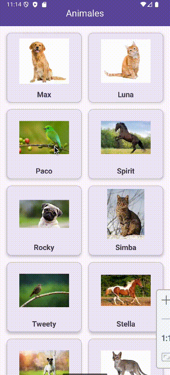

### 1️⃣ Añadir el argumento al grafo de navegación

En el paso 1 del tutorial anterior ya creamos el fragmento de detalle (`detalleAnimalFragment`) dentro del grafo de navegación.
Ahora vamos a añadirle el **argumento** que recibirá: el **animal seleccionado** en el fragmento principal (`AnimalesFragment`).

Llamaremos a este argumento **`animal`** y su tipo será **`Custom Serializable`**, ya que la clase `Animal` implementa la interfaz Serializable y podremos enviarla completa entre fragments.

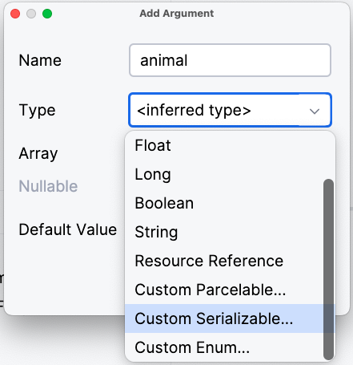

En la siguiente pantalla del wizard buscaremos la clase Java que creamos anteriormente para representar cada animal.

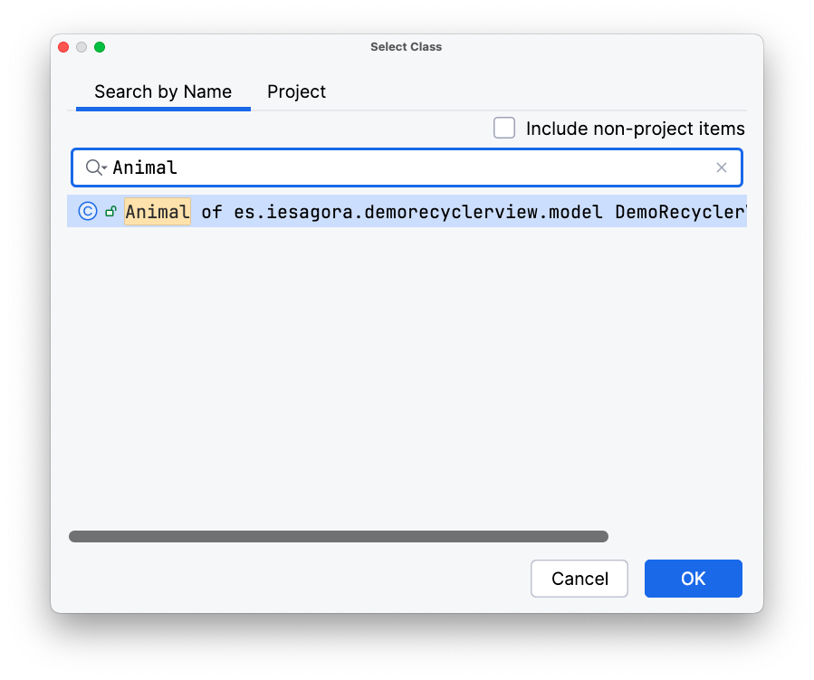

El grafo de navegación queda de la siguiente forma:

```xml title="nav_graph.xml"
<?xml version="1.0" encoding="utf-8"?>
<navigation xmlns:android="http://schemas.android.com/apk/res/android"
    xmlns:app="http://schemas.android.com/apk/res-auto"
    xmlns:tools="http://schemas.android.com/tools"
    android:id="@+id/nav_graph"
    app:startDestination="@id/animalesFragment">

    <fragment
        android:id="@+id/animalesFragment"
        android:name="es.iesagora.demorecyclerview.AnimalesFragment"
        android:label="Animales"
        tools:layout="@layout/fragment_animales" >
        <action
            android:id="@+id/action_animalesFragment_to_detalleAnimalFragment"
            app:destination="@id/detalleAnimalFragment" />
    </fragment>
    <fragment
        android:id="@+id/detalleAnimalFragment"
        android:name="es.iesagora.demorecyclerview.DetalleAnimalFragment"
        android:label="Detalle animal"
        tools:layout="@layout/fragment_detalle_animal" >
        <argument
            android:name="animal"
            app:argType="es.iesagora.demorecyclerview.model.Animal" />
    </fragment>
</navigation>
```

> 💡 Esto permitirá **enviar un objeto `Animal` completo** desde el fragmento principal hasta el de detalle.

---

### 2️⃣ Modificar el adaptador para detectar los clics

Cada `ViewHolder` tiene una propiedad `itemView`, que representa **la vista raíz del layout del elemento**.
Podemos asignarle un **OnClickListener** para detectar cuándo el usuario toca cualquier parte de la tarjeta.

Este código se coloca dentro del método `onBindViewHolder()` porque es el lugar donde **asociamos los datos de cada posición** con su vista correspondiente.
De esta forma, el clic siempre estará vinculado **al objeto `Animal` que se está mostrando en ese momento**.

En este ejemplo, al hacer clic sobre un animal:

* Obtenemos el objeto correspondiente.
* Navegamos al fragmento de detalle, enviando el `Animal` como argumento.

```java title="AnimalesAdapter.java (fragmento modificado)"
// Aquí va el resto del código que ya teníamos

@Override
public void onBindViewHolder(@NonNull AnimalViewHolder holder, int position) {
    Animal animal = animales.get(position);

    holder.binding.tvNombre.setText(animal.getNombre());
    holder.binding.ivAnimal.setImageResource(animal.getImagen());

    // Detectar el click sobre la tarjeta
    holder.itemView.setOnClickListener(v -> {
        // 1. Crear un Bundle con el animal seleccionado
        Bundle bundle = new Bundle();
        bundle.putSerializable("animal", animal);

        // 2. Navegar al fragmento de detalle usando NavController
        NavController navController = Navigation.findNavController(v);
        navController.navigate(R.id.action_animalesFragment_to_detalleAnimalFragment, bundle);
    });
}
```

> 🔹 Aquí estamos utilizando el método `navigate()` del `NavController` para movernos al destino definido en el grafo (`action_animalesFragment_to_detalleAnimalFragment`).

---

### 3️⃣ Crear el layout de detalle

En `fragment_detalle_animal.xml`, diseñamos la interfaz que mostrará la información completa del animal.
Podemos incluir su imagen, nombre y descripción.

```xml title="fragment_detalle_animal.xml"
<?xml version="1.0" encoding="utf-8"?>
<LinearLayout xmlns:android="http://schemas.android.com/apk/res/android"
    xmlns:tools="http://schemas.android.com/tools"
    android:orientation="vertical"
    android:layout_width="match_parent"
    android:layout_height="match_parent"
    android:gravity="center_horizontal"
    android:padding="16dp"
    tools:context=".DetalleAnimalFragment">

    <ImageView
        android:id="@+id/ivDetalle"
        android:layout_width="200dp"
        android:layout_height="200dp"
        android:layout_marginBottom="16dp" />

    <TextView
        android:id="@+id/tvNombreDetalle"
        android:layout_width="wrap_content"
        android:layout_height="wrap_content"
        android:textSize="22sp"
        android:textStyle="bold"
        android:layout_marginBottom="8dp" />

    <TextView
        android:id="@+id/tvDescripcion"
        android:layout_width="wrap_content"
        android:layout_height="wrap_content"
        android:textSize="18sp" />
</LinearLayout>
```

---

### 4️⃣ Implementar el fragmento de detalle

En el fragmento `DetalleAnimalFragment`, recuperamos el argumento recibido (en el método del ciclo de vida `onCreate`) y lo mostramos en pantalla.

```java title="DetalleAnimalFragment.java"
public class DetalleAnimalFragment extends Fragment {

    // Variable para almacenar el animal recibido
    private Animal animal;
    private FragmentDetalleAnimalBinding binding;

    @Override
    public void onCreate(@Nullable Bundle savedInstanceState) {
        super.onCreate(savedInstanceState);
        // Recuperamos el argumento enviado desde el adapter (antes de crear la vista)
        if (getArguments() != null) {
            animal = (Animal) getArguments().getSerializable("animal");
        }
    }

    @Override
    public View onCreateView(LayoutInflater inflater, ViewGroup container,
                             Bundle savedInstanceState) {
        binding = FragmentDetalleAnimalBinding.inflate(inflater, container, false);
        return binding.getRoot();
    }

    @Override
    public void onViewCreated(@NonNull View view, @Nullable Bundle savedInstanceState) {
        super.onViewCreated(view, savedInstanceState);

        if (animal != null) {
            // Mostramos los datos del animal en la interfaz
            binding.tvNombreDetalle.setText(animal.getNombre());
            binding.ivDetalle.setImageResource(animal.getImagen());
            binding.tvDescripcion.setText(animal.getDescripcion());
        } else {
            // En caso de error, podríamos volver atrás o mostrar un mensaje
            Toast.makeText(requireContext(), "No se pudo cargar el detalle del animal", Toast.LENGTH_SHORT).show();
            requireActivity().onBackPressed();
        }
    }
}
```

:::tip Recuerda
Para que la navegación funcione correctamente:

* La **acción** entre fragments debe estar creada en el **grafo de navegación**.
* La **clase `Animal`** debe implementar `Serializable` (ya lo hace).
* El **ID de la acción** usado en `navigate()` debe coincidir con el del grafo (`action_animalesFragment_to_detalleAnimalFragment`).
  :::

## Eliminar un elemento mediante gestos

En este apartado aprenderemos a **eliminar un elemento del RecyclerView deslizando el dedo** hacia la izquierda o hacia la derecha, igual que hacen muchas apps modernas (como la lista de correos o de tareas).

Para ello utilizaremos la clase **`ItemTouchHelper`**, que permite **detectar gestos de movimiento o desplazamiento** sobre los elementos del RecyclerView (los ViewHolders).

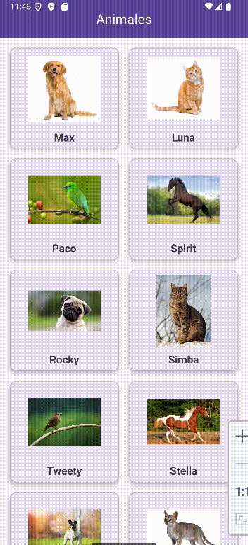

### 1️⃣ Añadir métodos al Repository

Antes de poder eliminar elementos desde el fragmento, debemos preparar nuestro **repositorio de datos** para ofrecer las operaciones necesarias.

Hemos añadido dos nuevos métodos a la clase `AnimalesRepository`:

```java title="AnimalesRepository.java (fragmento añadido)"
public class AnimalesRepository {

    private List<Animal> listaAnimales;

    public AnimalesRepository() {
        listaAnimales = new ArrayList<>();
        // ... Inicialización de la lista con los animales ...
    }

    // Devuelve el animal que ocupa una posición concreta
    public Animal getAnimal(int position) {
        if (position >= 0 && position < listaAnimales.size()) {
            return listaAnimales.get(position);
        }
        return null; // Devuelve null si la posición no es válida
    }

    // Elimina un animal de la lista
    public void eliminarAnimal(Animal animal) {
        listaAnimales.remove(animal);
    }

    public List<Animal> getAnimales() {
        return listaAnimales;
    }
}
```

* El método **`getAnimal(int position)`** nos permite **acceder fácilmente al objeto `Animal`** que se encuentra en una posición específica del `RecyclerView`.
  Esto es útil, por ejemplo, cuando el usuario desliza una tarjeta y necesitamos saber **qué animal corresponde a esa posición**.

* El método **`eliminarAnimal(Animal animal)`** encapsula la lógica de eliminación dentro del repositorio,
  evitando que otras clases modifiquen directamente la lista interna.
  Así mantenemos un **mejor control de los datos** y una estructura más limpia y mantenible.


### 2️⃣ Crear el objeto `ItemTouchHelper`

En el fragmento `AnimalesFragment`, dentro del método `onViewCreated()`, añadiremos el código para configurar un objeto `ItemTouchHelper`.  
Este objeto necesita un **callback** que defina qué debe hacer cuando se detecta un gesto de movimiento o deslizamiento.

```java title="AnimalesFragment.java (fragmento modificado)"
public class AnimalesFragment extends Fragment {

    private FragmentAnimalesBinding binding;
    AnimalesRepository repository;
    AnimalesAdapter adapter;

    ...

    @Override
    public void onViewCreated(@NonNull View view, @Nullable Bundle savedInstanceState) {
        super.onViewCreated(view, savedInstanceState);

        ...

        eventoEliminarElto(view);
    }

    private void eventoEliminarElto(View view) {
        ItemTouchHelper.SimpleCallback callback = new ItemTouchHelper.SimpleCallback(
                0, // No permitimos mover elementos (drag)
                ItemTouchHelper.LEFT | ItemTouchHelper.RIGHT // Permitimos deslizar a izquierda o derecha
        ) {
            @Override
            public boolean onMove(@NonNull RecyclerView recyclerView,
                                  @NonNull RecyclerView.ViewHolder viewHolder,
                                  @NonNull RecyclerView.ViewHolder target) {
                // No necesitamos implementar el movimiento (solo eliminación)
                return false;
            }

            @Override
            public void onSwiped(@NonNull RecyclerView.ViewHolder viewHolder, int direction) {
                // 1. Obtenemos la posición del elemento deslizado
                int position = viewHolder.getBindingAdapterPosition();

                if (position != RecyclerView.NO_POSITION) {
                    // 2. Recuperamos el animal correspondiente
                    Animal animalEliminado = repository.getAnimal(position);

                    // 3. Lo eliminamos del repositorio
                    repository.getAnimales().remove(animalEliminado);

                    // 4. Notificamos al adaptador para que actualice la interfaz
                    adapter.notifyItemRemoved(position);

                    // 5.(Opcional) Mostramos un mensaje al usuario
                    Snackbar.make(view, animalEliminado.getNombre() + " eliminado", Snackbar.LENGTH_SHORT).show();
                }
            }
        };

        // Asociamos el callback al RecyclerView
        new ItemTouchHelper(callback).attachToRecyclerView(binding.recyclerView);
    }
}
```

La explicación paso a paso del código anterior sería:

| Paso    | Acción                                                                                                                                                             |
| ------- | ------------------------------------------------------------------------------------------------------------------------------------------------------------------ |
| **1** | Obtenemos la **posición** del elemento deslizado usando `viewHolder.getBindingAdapterPosition()` y comprobamos que **no sea** `RecyclerView.NO_POSITION`.          |
| **2** | Con esa posición, recuperamos el **`Animal`** correspondiente desde el repositorio: `repository.getAnimal(position)`.                                              |
| **3** | Eliminamos ese objeto de la **fuente de datos**: `eliminarAnimal(animalEliminado)`. |
| **4** | Notificamos al adaptador para actualizar la interfaz y **quitar la tarjeta**: `adapter.notifyItemRemoved(position)`.                                               |
| **5** | Mostramos un **mensaje de confirmación** (por ejemplo, con `Snackbar`) indicando que el elemento se ha eliminado.                                                  |

---

### 3️⃣ Consideraciones importantes

Si tu clase `Animal` aún **no tiene implementado el método `equals()`**, es muy recomendable añadirlo.
Esto permitirá eliminar objetos por contenido (mismo nombre, imagen, etc.) y no solo por referencia.

```java title="Animal.java (añadir al final)"
@Override
public boolean equals(Object o) {
    if (!(o instanceof Animal)) return false;
    Animal animal = (Animal) o;
    return imagen == animal.imagen && Objects.equals(nombre, animal.nombre) && Objects.equals(descripcion, animal.descripcion);
    }

@Override
public int hashCode() {
    return Objects.hash(nombre, imagen, descripcion);
}
```

:::info PERSISTENCIA DEL BORRADO
Este sistema de gestos, tal y como lo hemos implementado, **solo elimina el elemento visualmente y de la lista en memoria**.
Más adelante, cuando usemos bases de datos, haremos que los cambios se guarden de forma persistente.
:::

:::info PROYECTO 1
**Realiza el proyecto 1: Generador de cartas.**
:::

</div>
