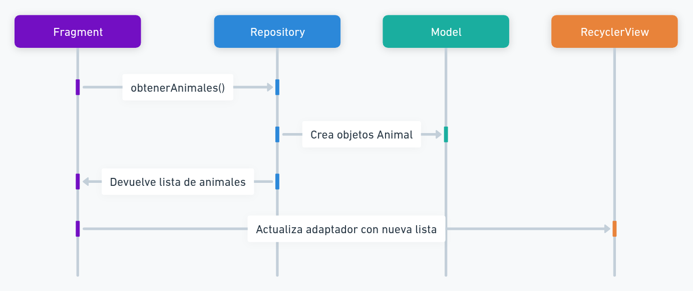
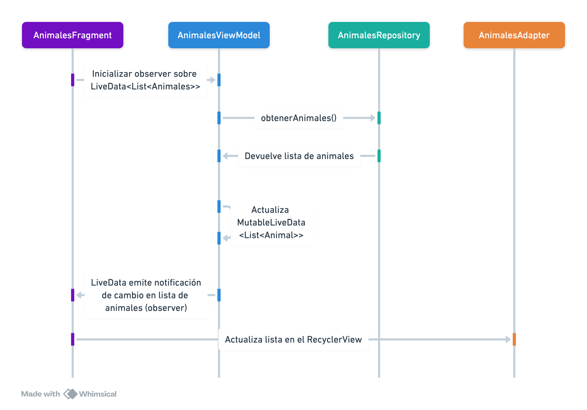
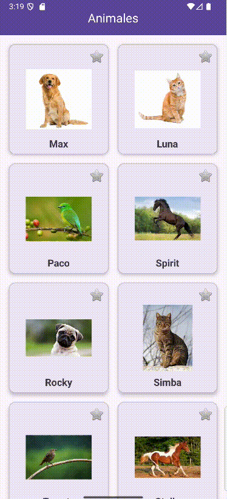

<div class="justify-text">

La **arquitectura MVVM (Model–View–ViewModel)** es un patrón de diseño recomendado por Android para **organizar el código de forma clara y mantenible**, separando la lógica de la interfaz de usuario.

Sus tres componentes principales son:

* **Model** → Representa los datos y las reglas de negocio (normalmente clases POJO o entidades de base de datos).
* **View** → Es la interfaz de usuario (Activities o Fragments). Solo muestra la información y responde a las acciones del usuario.
* **ViewModel** → Actúa como intermediario entre la View y el Model. Mantiene los datos, gestiona la lógica de presentación y expone la información mediante **LiveData** para que la vista se actualice automáticamente.

En la práctica, en Android moderno, se suele incluir también un **Repository**, que se encarga de obtener los datos (de una API, una base de datos o memoria local):


## Arquitectura previa

En el apartado anterior aprendimos a mostrar listas dinámicas de datos con **RecyclerView**, utilizando un **Repository** como fuente de datos para nuestros animales.  

La estructura que teníamos era algo así:



El `Fragment` obtenía directamente los datos del `Repository`, los mostraba en pantalla, y también gestionaba acciones como eliminar elementos. 

A primera vista, esto **parece funcionar perfectamente**… pero en cuanto la app crece o intentamos simular un caso real, consumiendo datos de una API o base de datos en la nube, **aparecen varios problemas importantes.**

### Problema: Pérdida de datos al girar la pantalla

Uno de los efectos visibles es lo que ocurre al **girar el dispositivo**.
Android destruye y recrea el `Fragment`, lo que implica que **vuelve a ejecutar su código desde cero**, incluido este fragmento:

```java
repository = new AnimalesRepository();
List<Animal> listaAnimales = repository.getAnimales();
```

Esto significa que:

* Se crea **un nuevo Repository** cada vez que se recrea el fragmento.
* Los **animales eliminados reaparecen**, porque la lista vuelve a su estado original.


Para solucionar este problema y otros que surgirían con el consumo de APIs o bases de datos, necesitamos una capa intermedia que:

* Mantenga los datos y su estado a lo largo del ciclo de vida.
* Ejecute las operaciones de forma asíncrona, sin congelar la interfaz.
* Permita que la vista simplemente observe los cambios y se actualice sola.

Esa capa intermedia es el **ViewModel**, eje central del patrón **MVVM** (*Model–View–ViewModel*), que aprenderemos a implementar en este tema.

---

## Arquitectura MVVM con Repository

El patrón **MVVM (Model–View–ViewModel)** nos permite **organizar el código en capas** bien definidas, para que cada una tenga una única responsabilidad. De esta forma, conseguimos aplicaciones más **robustas, mantenibles y escalables**.

Sus objetivos principales son:

1. **Separar responsabilidades**: cada capa tiene una función concreta y no depende directamente de las demás.  
2. **Mantener los datos al girar la pantalla o cambiar de configuración**.  
3. **Evitar bloqueos en la interfaz**, ejecutando las operaciones de datos fuera del hilo principal.  
4. **Actualizar automáticamente la interfaz** cuando cambian los datos, gracias a `LiveData`.  
5. **Preparar la app** para integrarse fácilmente con APIs, bases de datos locales (Room) o Firebase.

---

### Estructura general

En Android moderno, la estructura de MVVM con Repository sigue este esquema:



Cada capa tiene un **rol bien definido**:

| Capa | Rol principal | Qué contiene |
|------|----------------|---------------|
| **View (Activity / Fragment)** | Muestra los datos y gestiona la interacción del usuario. Observa los cambios en el `LiveData` expuesto por el ViewModel. | Código de interfaz (layouts, bindings, adapters, listeners). |
| **ViewModel** | Mantiene los datos para la interfaz y gestiona la lógica de presentación. Sobrevive a los cambios de configuración y se comunica con el Repository. | Propiedades `LiveData`, métodos de acceso a datos, lógica de presentación. |
| **Repository** | Proporciona los datos desde su fuente (API, base de datos o memoria). Es el intermediario entre el ViewModel y el origen real de los datos. | Métodos para obtener, insertar o eliminar información. |
| **Model (POJO)** | Define la estructura de los datos que maneja la app. | Clases simples (por ejemplo, `Animal.java`). |

---

### Ciclo de vida del ViewModel

Una de las grandes ventajas del ViewModel es que **mantiene los datos durante los cambios de configuración**, como la rotación de pantalla.  
El ViewModel vive mientras la Activity esté activa, y **solo se destruye cuando realmente se elimina del sistema**. Los datos del ViewModel son compartidos entre todos los Fragments contenidos en una misma Activity.


En el esquema anterior, podemos observar:

- Cuando se **crea la Activity**, también se crea el `ViewModel` asociado.
- Si la **Activity se rota**, Android destruye y recrea la vista (`onDestroy()` → `onCreate()`),  
  pero **mantiene el mismo ViewModel**, que conserva los datos cargados.
- Solo cuando la Activity finaliza por completo (`finish()`), se llama al método `onCleared()` del ViewModel, liberando recursos.

Esto significa que, **a diferencia del Fragment o la Activity**, el ViewModel no se destruye en cada recreación, lo que evita perder el estado de los datos.

---

### LiveData

Una de las piezas clave del patrón **MVVM** en Android es **LiveData**, una clase observable que forma parte de las **Architecture Components** de Jetpack.  
Su función es permitir que los datos del **ViewModel** se **comuniquen automáticamente con la interfaz (View)** de forma **reactiva** y **segura respecto al ciclo de vida**.


`LiveData` es un **contenedor de datos observable**, es decir, una clase que **notifica automáticamente a sus observadores** (normalmente Fragments o Activities) cuando los datos cambian.  

A diferencia de un `List` o una variable normal, `LiveData`:
- Está **vinculado al ciclo de vida** de la vista (solo notifica si está activa).
- **Evita fugas de memoria**, ya que deja de emitir cuando el fragmento se destruye.
- **Mantiene el último valor**, por lo que si la vista se recrea (por ejemplo, al girar la pantalla), el nuevo fragment recibe automáticamente los datos actuales sin volver a cargarlos.

Existen dos tipos principales:

| Tipo | Descripción | Quién puede modificarlo |
|------|--------------|--------------------------|
| **LiveData\<T>** | Dato observable de solo lectura. La vista solo puede observarlo. | Nadie (solo lectura). |
| **MutableLiveData\<T>** | Versión modificable del LiveData. Permite actualizar su valor mediante `setValue()` o `postValue()`. | El **ViewModel**. |

Ejemplo:

```java title="AnimalesViewModel.java"
public class AnimalesViewModel extends ViewModel {
    private final AnimalesRepository repository;
    // Lo hacemos Mutable porque cambiará su valor (p.e. cuando eliminamos un Animal)
    private final MutableLiveData<List<Animal>> animales = new MutableLiveData<>();

    public AnimalesViewModel() {
        repository = new AnimalesRepository();
        animales.setValue(repository.getAnimales());
    }

    public void eliminarAnimal(Animal animal) {
        repository.eliminarAnimal(animal);
        animales.setValue(repository.getAnimales()); // actualiza LiveData
    }
}
````

Y en el `Fragment` simplemente se observa ese `LiveData`:

```java title="AnimalesFragment.java"
viewModel.animales.observe(getViewLifecycleOwner(), lista -> {
    adapter.establecerLista(lista); // Actualiza el RecyclerView
});
```

> 💡 Cada vez que el ViewModel actualiza el `MutableLiveData`, el LiveData **emite automáticamente los cambios**, y la vista se actualiza sin tener que hacerlo manualmente.

#### ¿Por qué el ViewModel expone LiveData?

Porque permite que la **vista observe los datos sin controlarlos directamente**. Esto refuerza la **separación de responsabilidades**:

* El **ViewModel** gestiona y modifica los datos.
* La **View** solo los muestra y reacciona a los cambios.

Además:

* Si el usuario gira el dispositivo, el `LiveData` **mantiene el valor actual**, sin tener que volver a hacer la petición para recuperar los animales.
* Si se añaden nuevos observadores (por ejemplo, otro fragmento), estos **reciben inmediatamente el último dato emitido**.

---

## Tutorial de uso - Fragment con RecyclerView

A continuación implementaremos esta arquitectura paso a paso sobre nuestra aplicación de animales, transformando el acceso directo al `Repository` en un flujo completo con **ViewModel + LiveData**.

Partiremos del proyecto anterior, que ya muestra una lista de animales en un `RecyclerView`, y lo adaptaremos al patrón **MVVM**.

:::warning Importante
Los siguientes elementos **no se modifican** respecto a la versión anterior:
* **Modelo**: `Animal.java`
* **Repository**: `AnimalesRepository.java`
* **Adaptador y ViewHolder del RecyclerView**: `AnimalesAdapter.java` y `AnimalViewHolder`.
* Las **interfaces de usuario (layouts de activity y fragments)**.  

Todo su código sigue siendo válido y funcional. Por simplificar, en este tutorial solamente se incluirán las clases que sufren cambios para adaptarse a la nueva arquitectura.
:::

---

### Crear el ViewModel

El **ViewModel** es el componente que conserva los datos y la lógica de presentación.  
Su objetivo es **mantener el estado** a lo largo del ciclo de vida del fragmento y **exponer los datos** mediante un `MutableLiveData`.

Creamos la clase `AnimalesViewModel.java` dentro del paquete `viewmodel`:

```java title="AnimalesViewModel.java"
public class AnimalesViewModel extends ViewModel {

    // Ahora tendremos las referencias al repository en el ViewModel, no en el Fragment
    private AnimalesRepository repository;
    // LiveData que expone la lista de animales
    public MutableLiveData<List<Animal>> animales = new MutableLiveData<>();

    public AnimalesViewModel() {
        // Inicializamos el repository para tener los animales listos
        repository = new AnimalesRepository();
    }

    public void obtenerAnimales() {
        // Recuperamos los animales del repository y los almacenamos en el MLiveData
        animales.setValue(repository.getAnimales());
    }
}
```

📘 **Explicación:**

* El `ViewModel` se crea una sola vez y **se mantiene vivo aunque el Fragment o su Activity se recree**.
* `MutableLiveData` mantiene la lista de animales y **notifica automáticamente los cambios** a la interfaz.

---

### Modificar el Fragment principal

En lugar de acceder directamente al `Repository`, el fragmento obtendrá una instancia del **ViewModel** mediante el `ViewModelProvider`.
Luego, se **suscribirá (observer)** al `LiveData` para recibir actualizaciones automáticas. Ten en cuenta que hasta que no llames al método `viewModel.obtenerAnimales()` el `MutableLiveData` no cargará los animales del `Repositoy`.

:::info CODIGO NUEVO
En el siguiente código está subrayado en más oscuro aquellas líneas adicionales añadidas. Ten en cuenta también que se han eliminado algunas líneas, como la que creaba el repository.
:::

```java title="AnimalesFragment.java"
public class AnimalesFragment extends Fragment {

    private FragmentAnimalesBinding binding;
    // highlight-next-line
    private AnimalesViewModel viewModel;
    private AnimalesAdapter adapter;

    @Override
    public View onCreateView(LayoutInflater inflater, ViewGroup container,
                             Bundle savedInstanceState) {
        binding = FragmentAnimalesBinding.inflate(inflater, container, false);
        return binding.getRoot();
    }

    @Override
    public void onViewCreated(@NonNull View view, @Nullable Bundle savedInstanceState) {
        super.onViewCreated(view, savedInstanceState);

        // Obtenemos el ViewModel (persistente durante el ciclo de vida de la Activity, por ello usamos requireActivity)
        // highlight-next-line
        viewModel = new ViewModelProvider(requireActivity()).get(AnimalesViewModel.class);

        // Configuramos el RecyclerView y su adaptador
        // Ahora pasamos una lista vacía al constructor (podríamos quitar ese parámetro también)
        // highlight-next-line
        adapter = new AnimalesAdapter(requireContext(), new ArrayList<>());
        binding.recyclerView.setAdapter(adapter);
        binding.recyclerView.setLayoutManager(new GridLayoutManager(requireContext(), 2));

        // Observamos los datos del LiveData
        // highlight-start
        viewModel.animales.observe(getViewLifecycleOwner(), lista -> {
            // Si hay cambios, actualizamos la lista del adaptador del RecyclerView
            adapter.establecerLista(lista);
        });

        // Llamamos al método que recupera los animales
        viewModel.obtenerAnimales();
        // highlight-end
    }
}
```

:::info Explicación del observer

La línea:

```java
viewModel.animales.observe(getViewLifecycleOwner(), lista -> {
    adapter.establecerLista(lista);
});
```

establece un **observador** sobre el `LiveData` del `ViewModel`.
Esto significa que el fragmento **se suscribe** a los cambios de datos que emite el `MutableLiveData` `animales`.

**¿Qué ocurre en tiempo de ejecución?**

1. **El Fragment se crea** y se suscribe al `LiveData` mediante `observe()`.
   El método recibe dos parámetros:

   * `getViewLifecycleOwner()` → controla que el observer esté activo solo mientras el Fragment está visible.
   * Una función lambda que se ejecuta **cada vez que cambian los datos** y que recibe la lista actualizada.

2. **El ViewModel actualiza el MutableLiveData**, por ejemplo:

   ```java
   animales.setValue(repository.getAnimales());
   ```

3. **LiveData notifica automáticamente** a todos los observadores activos (en este caso, el Fragment).

4. El **código dentro del observer** se ejecuta:

   ```java
   adapter.establecerLista(lista);
   ```

    Dentro de ese método del adaptador:

   ```java
   public void establecerLista(List<Animal> animales) {
       this.animales = animales;
       notifyDataSetChanged(); // Notifica al RecyclerView que los datos cambiaron
   }
   ```

   El `RecyclerView` recibe el aviso y **redibuja automáticamente** las tarjetas en pantalla.

Cada capa tiene su función:

* El **Repository** obtiene los datos.
* El **ViewModel** los actualiza en el LiveData.
* El **Fragment** observa y reenvía los datos al Adapter.
* El **Adapter** reemplaza la lista y notifica al RecyclerView.

:::

---

## Tutorial de uso - Navegación pantalla detalle

En el tema anterior, la navegación entre fragments se realizaba **enviando el objeto `Animal` como argumento** desde el `RecyclerView` hasta el `DetalleAnimalFragment`.  
En esta versión con **MVVM**, aprovecharemos que el **ViewModel puede compartirse entre fragments**, lo que nos permite **mantener y compartir los datos sin necesidad de pasar argumentos explícitos.**

### Modificar el ViewModel

Hasta ahora, el `AnimalesViewModel` gestionaba solo la lista de animales. Ahora añadiremos un nuevo campo para guardar el **animal seleccionado**, que podrá ser observado por cualquier fragmento.

```java title="AnimalesViewModel.java
public class AnimalesViewModel extends ViewModel {

    private AnimalesRepository repository;
    public MutableLiveData<List<Animal>> animales = new MutableLiveData<>();
    // highlight-next-line
    public MutableLiveData<Animal> animalSeleccionado = new MutableLiveData<>();

    public AnimalesViewModel() {
        repository = new AnimalesRepository();
        animales.setValue(repository.getAnimales());
    }

    // Método para guardar el animal seleccionado
    // highlight-start
    public void seleccionarAnimal(Animal animal) {
        animalSeleccionado.setValue(animal);
    }
    // highlight-end
}
```

💬 Con este cambio:

* El `ViewModel` sigue gestionando la lista completa.
* Además, **almacena temporalmente** el `Animal` que se haya pulsado.
* Otros fragments podrán observar `animalSeleccionado` para mostrar los datos.

---

### Modificar el adaptador para seleccionar el elemento

Antes, el adaptador creaba un `Bundle` y enviaba el objeto `Animal` mediante `Navigation`.  
Ahora simplemente **recibirá el `ViewModel` en su constructor**, notificará al ViewModel del elemento pulsado y luego navegará al fragmento de detalle.

```java title="AnimalesAdapter.java"
public class AnimalesAdapter extends RecyclerView.Adapter<AnimalesAdapter.AnimalViewHolder> {

    private List<Animal> animales;
    private AnimalesViewModel viewModel;
    private final LayoutInflater inflater;

    // highlight-start
    public AnimalesAdapter(Context context, List<Animal> animales, AnimalesViewModel viewModel) {
        this.animales = animales;
        this.viewModel = viewModel;
        this.inflater = LayoutInflater.from(context);
    }
    // highlight-end

    @Override
    public void onBindViewHolder(@NonNull AnimalViewHolder holder, int position) {
        Animal animal = animales.get(position);
        holder.binding.tvNombre.setText(animal.getNombre());
        holder.binding.ivAnimal.setImageResource(animal.getImagen());

        // highlight-start
        holder.itemView.setOnClickListener(v -> {
            // Guardamos el animal seleccionado en el ViewModel
            viewModel.seleccionarAnimal(animal);

            // Navegamos al fragmento de detalle (ya no eviamos Bundle)
            NavController navController = Navigation.findNavController(v);
            navController.navigate(R.id.action_animalesFragment_to_detalleAnimalFragment);
        });
        // highlight-end
    }

    // Resto del código del adapter (ViewHolder, establecerLista, etc.)
}
```

Recuerda que ahora en el `AnimalesFragment` debemos pasar el `ViewModel` al crear el adaptador:

```java title="AnimalesFragment.java"
@Override
public void onViewCreated(@NonNull View view, @Nullable Bundle savedInstanceState) {
    super.onViewCreated(view, savedInstanceState);

    // Obtenemos el ViewModel compartido
    viewModel = new ViewModelProvider(requireActivity()).get(AnimalesViewModel.class);

    // Creamos el adapter pasándole el ViewModel
    // highlight-next-line
    adapter = new AnimalesAdapter(requireContext(), new ArrayList<>(), viewModel);
    binding.recyclerView.setLayoutManager(new GridLayoutManager(requireContext(), 2));
    binding.recyclerView.setAdapter(adapter);

    // Observamos los datos del LiveData
    viewModel.animales.observe(getViewLifecycleOwner(), lista -> {
        adapter.establecerLista(lista);
    });
}
```

---

### Recuperar el objeto desde el fragmento de detalle

En lugar de recibir los datos por argumentos, el `DetalleAnimalFragment` observará el `LiveData` del ViewModel compartido y mostrará el animal seleccionado.

```java title="DetalleAnimalFragment.java"
public class DetalleAnimalFragment extends Fragment {

    private FragmentDetalleAnimalBinding binding;
    private AnimalesViewModel viewModel;

    @Override
    public View onCreateView(LayoutInflater inflater, ViewGroup container,
                             Bundle savedInstanceState) {
        binding = FragmentDetalleAnimalBinding.inflate(inflater, container, false);
        return binding.getRoot();
    }

    @Override
    public void onViewCreated(@NonNull View view, @Nullable Bundle savedInstanceState) {
        super.onViewCreated(view, savedInstanceState);

        // Obtenemos el ViewModel compartido (misma instancia que en AnimalesFragment)
        viewModel = new ViewModelProvider(requireActivity()).get(AnimalesViewModel.class);

        // Observamos el animal seleccionado
        viewModel.animalSeleccionado.observe(getViewLifecycleOwner(), animal -> {
            if (animal != null) {
                // Si ha llegado un animal, cargamos sus datos en el layout
                binding.tvNombreDetalle.setText(animal.getNombre());
                binding.ivDetalle.setImageResource(animal.getImagen());
                binding.tvDescripcion.setText(animal.getDescripcion());
            } else {
                // En caso de error, podríamos volver atrás o mostrar un mensaje
                Toast.makeText(requireContext(), "No se pudo cargar el detalle del animal", Toast.LENGTH_SHORT).show();
                requireActivity().onBackPressed();
            }
        });
    }
}
```

:::info INSTANCIA DE VIEWMODEL
💬 Aquí, el **ViewModel es compartido entre fragments**, porque se obtiene con:

```java
new ViewModelProvider(requireActivity()).get(AnimalesViewModel.class);
```

Esto garantiza que ambos fragments utilicen **la misma instancia**, manteniendo los datos sincronizados.
:::

---

### Modificaciones en el grafo de navegación

Ya no es necesario pasar argumentos al fragmento de detalle.
Podemos **eliminar el argumento `animal`** del `nav_graph.xml`, quedando así:

```xml title="nav_graph.xml (fragmento simplificado)"
<fragment
    android:id="@+id/animalesFragment"
    android:name="es.iesagora.demomvvm.AnimalesFragment"
    android:label="Animales"
    tools:layout="@layout/fragment_animales" >
    <action
        android:id="@+id/action_animalesFragment_to_detalleAnimalFragment"
        app:destination="@id/detalleAnimalFragment" />
</fragment>

<fragment
    android:id="@+id/detalleAnimalFragment"
    android:name="es.iesagora.demomvvm.DetalleAnimalFragment"
    android:label="Detalle animal"
    tools:layout="@layout/fragment_detalle_animal" />
```

---


## Tutorial de uso – Eliminar un elemento mediante gestos

En el tema anterior aprendimos a eliminar un elemento del `RecyclerView` deslizando el dedo hacia la izquierda o derecha.  
En aquella versión, el `Fragment` accedía directamente al `Repository` para eliminar el animal y luego avisaba al adaptador.

Con **MVVM**, esa lógica cambia:  
ahora el **`ViewModel`** es el responsable de eliminar el elemento y **actualizar el `LiveData`**, que a su vez **notificará automáticamente a la vista** para refrescar el `RecyclerView`.


### Lógica de eliminación en el ViewModel

El `ViewModel` centraliza ahora la operación de borrado. Cada vez que eliminamos un animal, el `ViewModel` actualiza el `MutableLiveData`, y la vista recibe la nueva lista automáticamente.

```java title="AnimalesViewModel.java (fragmento)"
public class AnimalesViewModel extends ViewModel {

    private AnimalesRepository repository;
    public MutableLiveData<List<Animal>> animales = new MutableLiveData<>();

    public AnimalesViewModel() {
        repository = new AnimalesRepository();
        animales.setValue(repository.getAnimales());
    }

    // highlight-start
    // Elimina un animal del repositorio y actualiza el LiveData
    public void eliminarAnimal(int position) {
        // Obtenemos la lista actual del LiveData
        List<Animal> listaActual = animales.getValue();

        // Comprobamos que la lista existe y que la posición es válida
        if (listaActual != null && position >= 0 && position < listaActual.size()) {

            // Recuperamos el animal que queremos eliminar
            Animal eliminado = listaActual.get(position);

            // Lo eliminamos del repositorio (fuente de datos)
            repository.eliminarAnimal(eliminado);

            // Actualizamos el LiveData con la nueva lista
            animales.setValue(repository.getAnimales());
        }
    }
    // highlight-end
}
```

:::info
Recuerda que en Repository teníamos este método:
```java title="AnimalesRepository.java
public void eliminarAnimal(Animal animal) {
    listaAnimales.remove(animal);
}
```
:::

---

### Configurar el gesto en el Fragment

El `ItemTouchHelper` sigue siendo el mecanismo que detecta el gesto de deslizamiento, pero ahora delegamos la acción en el `ViewModel`.

```java title="AnimalesFragment.java (fragmento modificado)"
private void eventoEliminarElto(View view) {
    ItemTouchHelper.SimpleCallback callback = new ItemTouchHelper.SimpleCallback(
            0, // No se permite mover (drag)
            ItemTouchHelper.LEFT | ItemTouchHelper.RIGHT // Permite deslizar
    ) {
        @Override
        public boolean onMove(@NonNull RecyclerView recyclerView,
                              @NonNull RecyclerView.ViewHolder viewHolder,
                              @NonNull RecyclerView.ViewHolder target) {
            return false; // No necesitamos movimiento
        }

        @Override
        public void onSwiped(@NonNull RecyclerView.ViewHolder viewHolder, int direction) {
            int position = viewHolder.getBindingAdapterPosition();

            if (position != RecyclerView.NO_POSITION) {
                // Pedimos al ViewModel que elimine el animal de esa posición
                // highlight-next-line
                viewModel.eliminarAnimal(position);
            }
        }
    };

    // Asociamos el callback al RecyclerView
    new ItemTouchHelper(callback).attachToRecyclerView(binding.recyclerView);
}
```

:::info ¿Qué ocurre paso a paso?
1. El usuario desliza una tarjeta del `RecyclerView`.
2. El `ItemTouchHelper` detecta el gesto y llama a `onSwiped()`.
3. El `Fragment` obtiene la posición del elemento y llama a `viewModel.eliminarAnimal()`.
4. El `ViewModel` actualiza el `MutableLiveData` con la lista de animales.
5. El `LiveData` notifica al `Fragment`, que actualiza la lista a través del `Adapter`.
6. El `RecyclerView` redibuja la lista sin el elemento eliminado.
:::

:::info ACTIVIDAD DE SEGUIMIENTO 6 - FASE 1
**Realiza la Actividad de Seguimiento 6 - Fase 1: Pokédex.**
:::

---

## Tutorial de uso – Marcar como favorito

En este apartado aprenderemos a **marcar y desmarcar animales como favoritos**, lo que supone incorporar:

* Un atributo booleano `favorito` en el modelo (clase `Animal`)
* Un icono que cambia en el `ViewHolder`.
* El `ViewModel` actua de intermediario entre la vista (`Adapter`) y el `Repository`.
* El `Fragment` observa los datos.



---

### Modificar el layout del ViewHolder

Dentro del ViewHolder tenemos que incorporar el icono de favorito. Como imagen podemos utilizar una de las que nos proporciona Android.

Ejemplo de layout:

```xml title="viewholder_animal.xml"
<?xml version="1.0" encoding="utf-8"?>
<com.google.android.material.card.MaterialCardView xmlns:android="http://schemas.android.com/apk/res/android"
    xmlns:app="http://schemas.android.com/apk/res-auto"
    android:layout_width="match_parent"
    android:layout_height="wrap_content"
    android:layout_margin="8dp"
    app:cardCornerRadius="12dp"
    app:cardElevation="4dp">

    <!-- Contenedor para posicionar el icono arriba a la derecha -->
    <RelativeLayout
        android:layout_width="match_parent"
        android:layout_height="wrap_content"
        android:padding="8dp">

        <!-- Icono de favorito -->
        <ImageView
            android:id="@+id/icon_favorite"
            android:layout_width="28dp"
            android:layout_height="28dp"
            android:layout_alignParentEnd="true"
            android:layout_alignParentTop="true"
            android:src="@android:drawable/btn_star_big_off"
            android:clickable="true"
            android:focusable="true" />

        <!-- Contenedor del contenido -->
        <LinearLayout
            android:id="@+id/contenedorAnimal"
            android:layout_width="match_parent"
            android:layout_height="wrap_content"
            android:orientation="vertical"
            android:gravity="center_horizontal"
            android:layout_marginTop="4dp"
            android:layout_below="@id/icon_favorite">

            <ImageView
                android:id="@+id/ivAnimal"
                android:layout_width="120dp"
                android:layout_height="120dp" />

            <TextView
                android:id="@+id/tvNombre"
                android:layout_width="wrap_content"
                android:layout_height="wrap_content"
                android:layout_marginTop="8dp"
                android:textSize="18sp"
                android:textStyle="bold" />
        </LinearLayout>

    </RelativeLayout>

</com.google.android.material.card.MaterialCardView>
```

:::info Iconos de favoritos (estrella)
Los recursos **@android:drawable/btn_star_big_off** y **@android:drawable/btn_star_big_on** son iconos estándar incluidos en Android:

* **`btn_star_big_off`** → ⭐ *estrella gris* → indica que **no es favorito**.
* **`btn_star_big_on`** → ⭐ *estrella amarilla* → indica que **sí es favorito**.

Estos iconos son perfectos para marcar / desmarcar favoritos sin necesidad de añadir imágenes externas al proyecto.
:::

---

### Modificar el modelo (`Animal.java`)

Añadimos un atributo `boolean esFavorito`, que determinará eis el Pokemon se ha marcado como favorito o no.

```java
public class Animal {
    private String nombre;
    private int imagen;
    private String descripcion;
    // highlight-next-line
    private boolean favorito;

    public Animal(String nombre, int imagen, String descripcion) {
        this.nombre = nombre;
        this.imagen = imagen;
        this.descripcion = descripcion;
        // highlight-next-line
        this.favorito = false; // Por defecto no es favorito
    }

    // highlight-start
    public boolean isFavorito() {
        return favorito;
    }

    public void setFavorito(boolean favorito) {
        this.favorito = favorito;
    }
    // highlight-start

    // Resto del código que ya tuvieras...
}
```

---

### Cambios en el Adapter

En el adaptador es donde conectamos cada elemento de la lista con su tarjeta visual.
Para añadir la funcionalidad de “favoritos”, el método `onBindViewHolder()` debe hacer dos cosas adicionales:

* **Mostrar el icono correcto**: cuando se carga cada tarjeta, debe comprobar si el animal es favorito y poner la estrella encendida o apagada (método `establecerIconoFavorito`).

* **Responder al click en la estrella**: si se pulsa el icono, el adaptador debe cambiar el estado del animal, actualizar el icono y avisar al `ViewModel` para que guarde el cambio en base de datos, que para nosotros de momento será el repository.

De esta forma, el adaptador se encarga tanto de mostrar la información como de reaccionar a las acciones del usuario, mientras que el `ViewModel` mantiene el estado actualizado.


```java title="AnimalesAdapter.java"
public class AnimalesAdapter extends RecyclerView.Adapter<AnimalesAdapter.AnimalViewHolder> {

    // Aquí va el código que ya tenías...

    // Rellena los datos en el ViewHolder correspondiente a una posición concreta
    @Override
    public void onBindViewHolder(@NonNull AnimalViewHolder holder, int position) {
        Animal animal = animales.get(position);

        // Enlazamos los datos con los elementos del layout
        holder.binding.tvNombre.setText(animal.getNombre());
        holder.binding.ivAnimal.setImageResource(animal.getImagen());

        // Detectar el click sobre la tarjeta
        holder.itemView.setOnClickListener(v -> {
            // Guardamos el animal seleccionado en el ViewModel
            viewModel.seleccionarAnimal(animal);

            // Navegar al fragmento de detalle usando NavController
            NavController navController = Navigation.findNavController(v);
            navController.navigate(R.id.action_animalesFragment_to_detalleAnimalFragment);
        });

        // highlight-start
        // Cuando se cargue el RecyclerView, actualizamos el icono según el estado del animal
        establecerIconoFavorito(animal, holder);

        // Listener para el evento sobre el icono de favorito
        holder.binding.iconFavorite.setOnClickListener(v -> marcarFavorito(animal, holder));
        // highlight-end
    }

    // highlight-start
    // Método que se ejecuta en el evento de click sobre la estrella
    private void marcarFavorito(Animal animal, AnimalViewHolder holder) {
        // Cambiamos el estado del animal seleccionado
        if (animal.isFavorito()) animal.setFavorito(false);
        else animal.setFavorito(true);

        // Cambiamos el icono del animal seleccionado
        establecerIconoFavorito(animal, holder);

        // Actualizamos el estado del animal en base de datos (de momento el repository)
        // Recuerda que no podemos acceder al repository directamente, si no a través del ViewModel
        viewModel.actualizarAnimal(animal);
    }

    // Método que establece el icono según el estado del animal
    private void establecerIconoFavorito(Animal animal, AnimalViewHolder holder) {
        if (animal.isFavorito()) {
            holder.binding.iconFavorite.setImageResource(android.R.drawable.btn_star_big_on);
        } else {
            holder.binding.iconFavorite.setImageResource(android.R.drawable.btn_star_big_off);
        }
    }
    // highlight-end
}
```

---

### Gestionar favoritos en el ViewModel y Repisitory

El **ViewModel** actúa como puente entre la vista y el Repository.
Cuando el usuario pulsa la estrella y cambia el estado de un animal, el ViewModel recibe el objeto actualizado y se lo pasa al Repository para que lo guarde:

```java title="AnimalesViewModel.java"
public class AnimalesViewModel extends ViewModel {

    // Código previo...

    public void actualizarAnimal(Animal animal) {
        repository.actualizarAnimal(animal);
    }
}
```

En el **Repository** es donde realmente se modifican los datos.
Para evitar que el animal cambie de posición en la lista (y por tanto en el RecyclerView), primero buscamos su índice y luego lo reemplazamos por la versión actualizada:

```java
public class AnimalesRepository {

    private List<Animal> listaAnimales;

    // Código previo...

    public void actualizarAnimal(Animal animal) {
        // Recuperamos la posición previa para volver a colocarlo en el mismo sitio
        int posicion = listaAnimales.indexOf(animal);
        // Colocamos el animal modificado en el mismo sitio
        listaAnimales.set(posicion, animal);
    }
}
```

---

## Tutorial de uso – Búsqueda de elementos

La búsqueda es una de las funciones más útiles cuando trabajamos con listas grandes de datos.
En este apartado aprenderemos a implementar un campo de búsqueda que filtre la lista de animales **mientras el usuario escribe**, utilizando el mismo enfoque de MVVM que ya hemos aplicado en los apartados anteriores.

La idea principal es:

1. El usuario escribe en el `SearchView`.
2. El `Fragment` envía el texto al `ViewModel`.
3. El `ViewModel` pide la lista filtrada al `Repository`.
4. El `LiveData` se actualiza y notifica al `Fragment`.
5. El observer del `Fragment` envía la nueva lista al `Adapter` y la muestra automáticamente.

Así mantenemos la separación de responsabilidades:

💡 **El Fragment solo escucha y envía texto. El ViewModel actúa como intermediario y el Repository hace la lógica de filtrado.**


---

### Layout con SearchView

Creamos un layout similar al anterior, pero añadiendo un `SearchView` editable desde el inicio:

```xml title="
<LinearLayout xmlns:android="http://schemas.android.com/apk/res/android"
    xmlns:tools="http://schemas.android.com/tools"
    android:layout_width="match_parent"
    android:layout_height="match_parent"
    android:orientation="vertical"
    android:padding="8dp"
    tools:context=".AnimalesFragment">

    <!-- Barra de búsqueda -->
    <SearchView
        android:id="@+id/search_view"
        android:layout_width="match_parent"
        android:layout_height="wrap_content"
        android:iconifiedByDefault="false"
        android:queryHint="Buscar animal" />

    <!-- Lista -->
    <androidx.recyclerview.widget.RecyclerView
        android:id="@+id/recycler_view"
        android:layout_width="match_parent"
        android:layout_height="match_parent" />

</LinearLayout>
```

:::info ¿Qué es un SearchView?
`SearchView` es un componente de Android que permite al usuario escribir texto para realizar búsquedas dentro de una lista o conjunto de datos.
Es ideal para **filtrar resultados en tiempo real**, ya que detecta cada carácter escrito y puede enviarlo al `ViewModel` para actualizar la información mostrada.

**Atributos XML más útiles:**

* `android:iconifiedByDefault="false"` → Hace que el cuadro de búsqueda aparezca desplegado desde el inicio.
* `android:queryHint="Texto de ayuda"` → Muestra un texto guía dentro del campo de búsqueda.
* `android:layout_width / layout_height` → Controlan el tamaño del componente.
* `android:focusable="true"` → Permite activar el teclado al tocar el campo.

Estos atributos permiten personalizar fácilmente su apariencia y comportamiento.
:::


---

### Activar la búsqueda desde el Fragment

El `Fragment` configura el RecyclerView, observa los cambios y escucha lo que escribe el usuario en tiempo real. Al código que teníamos ya, debemos añadirle:

```java
public class AnimalesFragment extends Fragment {

    // Código anterior

    @Override
    public void onViewCreated(@NonNull View view, @Nullable Bundle savedInstanceState) {
        super.onViewCreated(view, savedInstanceState);

        // Código anterior

        // Evento de búsqueda sobre el searchView
        binding.searchView.setOnQueryTextListener(new SearchView.OnQueryTextListener() {
            
            // Método que se ejecuta cuando el usuario le da a intro
            // No nos interesa implementarlo
            @Override
            public boolean onQueryTextSubmit(String query) {
                return false;
            }

            // Método que se ejecuta cada vez que el usuario escribe una letra en el searchView
            @Override
            public boolean onQueryTextChange(String texto) {
                viewModel.buscarAnimalPorNombre(texto);
                return true;
            }
        });
    }
}
```

---

### Filtrar elementos en ViewModel y Repository

El `ViewModel` actúa como intermediario entre la vista y la capa de datos.
Cuando el usuario escribe en el `SearchView`, el `Fragment` envía ese texto al `ViewModel`, y este se encarga de pedir al `Repository` la lista filtrada.
Después, actualiza el `MutableLiveData` para que el `Fragment` reciba la nueva lista y el `Adapter` pueda mostrarla automáticamente.

```java title="AnimalesViewModel"
public class AnimalesViewModel extends ViewModel {

    // Usamos el mismo LiveData que ya mostraba la lista completa
    public MutableLiveData<List<Animal>> animales = new MutableLiveData<>();
    
    // Código previo

    // Recibe el texto del SearchView y pide al Repository la lista filtrada
    public void buscarAnimalPorNombre(String texto) {
        animales.setValue(repository.getAnimalesPorNombre(texto));
    }
}
```

Por su parte, el `Repository` es el encargado de realizar el filtrado.
Aquí es donde recorremos la lista original y seleccionamos solamente los animales cuyo nombre **comienza** por el texto introducido por el usuario:

```java title="AnimalesRepository"
public class AnimalesRepository {

    // Código anterior

    // Devuelve solo los animales cuyo nombre empieza por el texto indicado
    public List<Animal> getAnimalesPorNombre(String texto) {
        List<Animal> resultado = new ArrayList<>();
        for (Animal a : listaAnimales) {
            if (a.getNombre().toLowerCase().startsWith(texto)) {
                resultado.add(a);
            }
        }
        return resultado;
    }
}
```

:::info ACTIVIDAD DE SEGUIMIENTO 6 - FASE 2
**Realiza la Actividad de Seguimiento 6 - Fase 2: Pokédex.**
:::


</div>