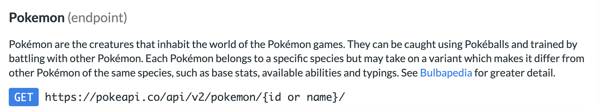
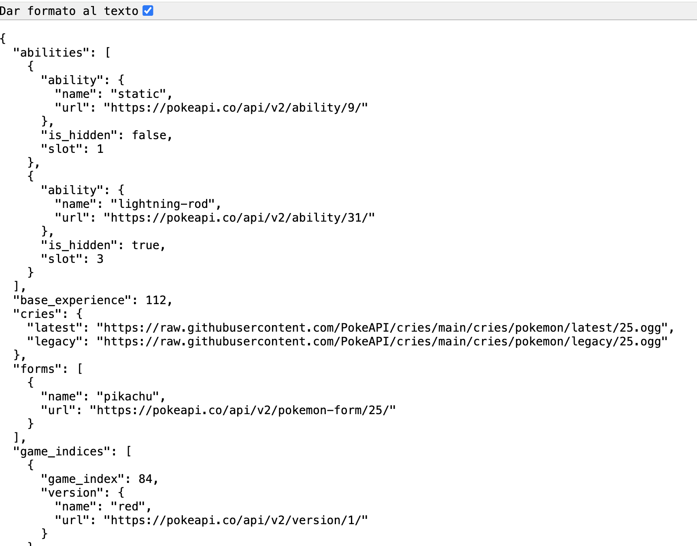
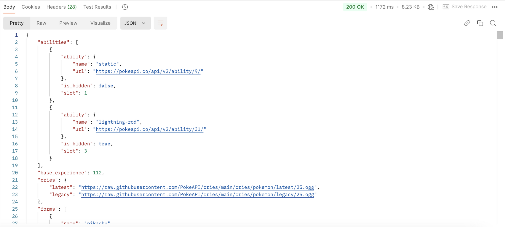
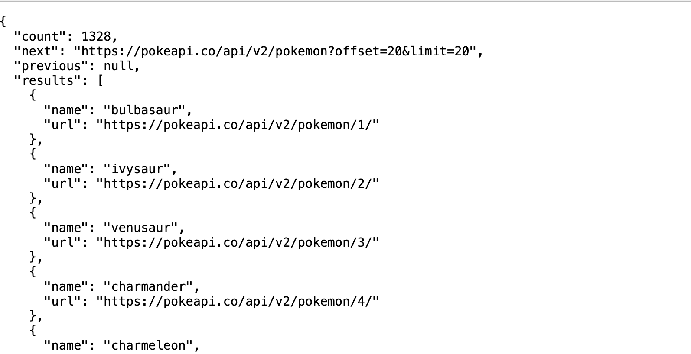

<div class="justify-text">

Antes de comenzar el desarrollo de nuestra aplicación, es fundamental **analizar qué información ofrece la API REST** que vamos a utilizar. Nuestra app debe construirse en función de los datos disponibles.

En este caso, vamos a trabajar con la **PokeAPI**, cuya [documentación oficial](https://pokeapi.co/docs/v2) describe todos los recursos que expone.
La app tendrá estas dos funcionalidades principales:

* **Buscador** de un Pokémon por su nombre.
* **Pokédex** que muestre todos los Pokémon en forma de lista, con navegación al detalle al pulsar uno de ellos.

Para poder implementarlas, primero debemos entender cómo funciona la API y qué endpoints necesitamos.


---

## URL base

La [documentación de la PokeAPI](https://pokeapi.co/docs/v2#resource-listspagination-section) establece una **URL base**, sobre la cual añadiremos los diferentes recursos:

```
https://pokeapi.co/api/v2/
```


---

## Endpoint obtener Pokémon

Dentro de los recursos disponibles, el que nos interesa para recuperar información sobre un Pokémon concreto es:



Todo lo que aparece entre llaves `{ }` es variable.
Esto significa que podemos solicitar un Pokémon tanto por:

* su **id** (por ejemplo, `25`),
* como por su **nombre** (por ejemplo, `pikachu`).

Este endpoint será la base para la funcionalidad de búsqueda.

---

### Ejemplo endpoint para Pikachu

Siguiendo el endpoint anterior, si queremos recuperar la información de **Pikachu**, simplemente sustituimos `{id or name}` por el valor correspondiente:

```
https://pokeapi.co/api/v2/pokemon/pikachu
```

Si abrimos esta URL en el navegador, veremos una respuesta en **formato JSON**, mostrando una gran cantidad de información: estadísticas, sprites, tipos, peso, altura, etc.
Esta respuesta será la que posteriormente mapearemos a clases Java para usarla en Android.




---

### Análisis de la respuesta JSON

Para trabajar cómodamente con el JSON devuelto por la API, se recomienda utilizar herramientas que permitan **formatear y explorar la estructura**. Uno de los clientes HTTP más recomendados es Postman.

Con Postman podemos:

* Introducir la URL del endpoint
* Elegir el método HTTP (en este caso, GET)
* Enviar la petición
* Visualizar la respuesta JSON de forma clara y legible

Después de loguearte (puedes descargarte la app de escritorio o trabajar directamente en el navegador), seleccionamos Send an API request:


Para cada petición que quieras analizar, debes rellenar los siguientes datos:


Este paso es importante para **identificar correctamente qué datos necesitamos** y facilitar el proceso de mapeo posterior. Esto nos permitirá crear **únicamente las clases Java necesarias**, evitando mapear datos irrelevantes para nuestra aplicación.

Ejemplo de respuesta a la URL https://pokeapi.co/api/v2/pokemon/pikachu:



Aquí tienes la admonición en formato Markdown:

:::info
No necesitas usar Postman si la documentación de la API ofrece ejemplos de respuesta, como sucede con la **PokeAPI**.  
En esos casos, puedes analizar el JSON directamente desde la propia documentación.
:::

---

## Endpoint obtener Pokédex

Lo primero que debemos realizar es analizar qué endpoint de la API nos ofrece todos los Pokémon.

En la siguiente imagen, sacada de la documentación, indican que para obtener todos los Pokémon, debemos llamar al mismo endpoint de antes pero sin un `id` específico. 

```
https://pokeapi.co/api/v2/pokemon
```

Además, introduce los siguientes conceptos:

* **Paginación**: la PokeAPI funciona con paginación, es decir, en vez de cargar todos los Pokémon de golpe, te devuelve un número determinado de ellos para no sobrecargar las aplicaciones con datos.
* **“offset”** y **“limit”** son parámetros de la URL, de forma que con offset indicamos cuántos Pokémon nos tenemos que saltar para empezar a devolver y con “limit” indicamos cuántos Pokémon nos debe devolver en la consulta. Por tanto, en la siguiente query que hagamos, nos saltaremos los primeros 20 Pokémon (que ya hemos recibido en esta query) y obtendremos los 20 siguientes (del 20 al 40).

Ejemplo de la primera query:

```
https://pokeapi.co/api/v2/pokemon?offset=0&limit=20
```

Ejemplo de la segunda query:

```
https://pokeapi.co/api/v2/pokemon?offset=20&limit=20
```

Y así sucesivamente...

Ejemplo de respuesta:




En la respuesta del endpoint de la Pokédex, la PokeAPI **no devuelve la información completa de cada Pokémon**.
Por cada elemento de la lista solo recibimos dos datos: su **nombre** y la **URL de sus detalles**. Esto significa que si queremos mostrar información adicional —por ejemplo, la imagen del Pokémon, su tipo o altura— debemos realizar **una segunda petición HTTP** usando esa URL individual para obtener sus datos completos. De esta forma, el proceso consiste en obtener primero la lista paginada y, después, **encadenar llamadas adicionales** para recuperar los detalles de cada Pokémon.

:::warning No todas las APIs implementan paginación.  
Antes de programar cualquier consulta que devuelva listas de elementos, revisa siempre la **documentación oficial** para confirmar si la API utiliza parámetros como `limit`, `offset`, `page`, `cursor`, etc.  
Cada API puede gestionarlo de forma distinta o incluso no utilizar paginación.
:::


</div>