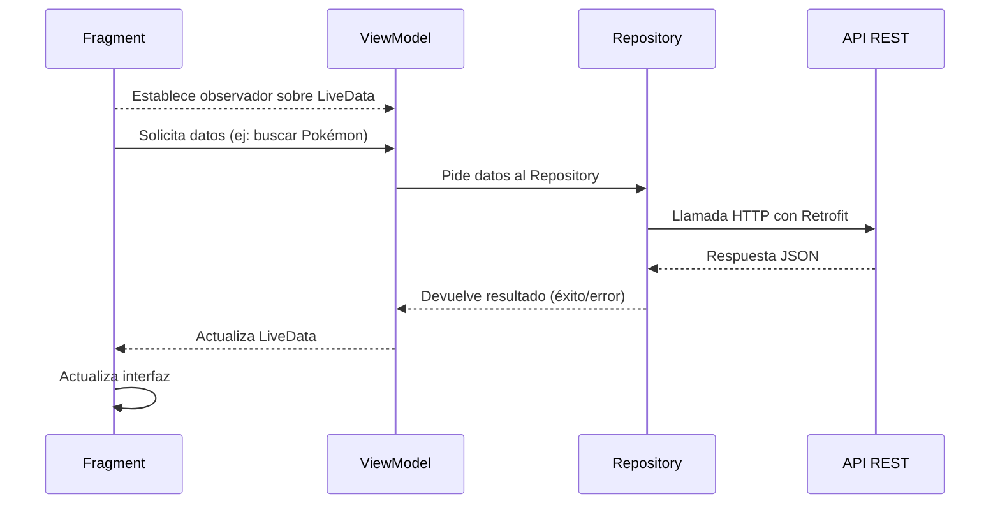

Cuando una aplicación Android consume datos de una API externa, es importante organizar el proyecto siguiendo una arquitectura clara que separe responsabilidades.
En este tema utilizaremos el patrón **MVVM (Model–View–ViewModel)** junto con un **Repository**, siguiendo la misma estructura que ya aprendimos en el tema anterior, lo que nos permitirá:

* Mantener el código limpio y ordenado.
* Evitar que el Fragment realice lógica pesada.
* Facilitar pruebas y mantenimiento.
* Reutilizar el código que gestiona la comunicación con la API.

En resumen: **cada capa se encarga de una tarea concreta**, evitando mezclar la lógica de red con la interfaz gráfica.

---

## Componentes de la arquitectura

La arquitectura que utilizaremos se basa en tres capas principales, acompañadas por Retrofit como herramienta para realizar las peticiones HTTP.

| Componente | Rol principal | Responsabilidades |
|-----------|----------------|-------------------|
| **Fragment (Vista)** | Interfaz de usuario | Muestra datos. Recoge acciones del usuario (búsqueda, clics...). Observa el ViewModel. No realiza llamadas a la API. |
| **ViewModel** | Intermediario entre vista y datos | Solicita datos al Repository. Expone LiveData. Mantiene el estado aunque se destruya el Fragment. No realiza llamadas a la API. |
| **Repository** | Capa de acceso a datos | Realiza peticiones HTTP usando Retrofit. Decide qué datos devolver. Gestiona errores de red o API. |
| **Retrofit (Cliente + Interface)** | Comunicación con la API | Cliente configurado con la URL base. Interface que define los endpoints. Realiza las peticiones HTTP. |

---

### Flujo de comunicación entre componentes

A nivel teórico, el flujo funciona así:

1. El **Fragment** solicita una búsqueda o carga de datos.
2. El **ViewModel** recibe la petición y llama al Repository.
3. El **Repository** usa Retrofit para enviar la petición a la API.
4. La API devuelve una respuesta (JSON), que el Repository transforma si es necesario.
5. El **ViewModel** recibe los datos y los expone a la vista.
6. El **Fragment** observa esos cambios y actualiza la UI.



---

### Componentes de Retrofit

Para consumir una API REST en Android utilizando Retrofit necesitamos **dos componentes fundamentales**:

1. **El cliente Retrofit**, encargado de configurar la conexión con la API.
2. **La interfaz de endpoints**, que define qué peticiones podemos realizar.

Retrofit divide estas responsabilidades para mantener el código limpio y fácil de mantener.

---

#### Cliente Retrofit (Retrofit Client)

El cliente Retrofit es el objeto responsable de:

* Establecer la **URL base** de la API.
* Indicar cómo se deben convertir las respuestas JSON (por ejemplo, usando Gson).
* Crear e inicializar la conexión con el servidor.

Normalmente este cliente se implementa usando el **patrón Singleton**, para que exista **una única instancia** durante toda la aplicación.

Ejemplo conceptual:

```java
public class RetrofitClient {

    private static final String BASE_URL = "https://pokeapi.co/api/v2/";
    private static Retrofit instance;

    public static Retrofit getInstance() {
        if (instance == null) {
            instance = new Retrofit.Builder()
                    .baseUrl(BASE_URL)
                    .addConverterFactory(GsonConverterFactory.create()) // Convierte JSON a Java
                    .build();
        }
        return instance;
    }
}
```

**Puntos clave:**

* `baseUrl()` → define la URL principal.
* `addConverterFactory()` → indica cómo interpretar el JSON (Gson).
* Esta clase **no hace peticiones por sí sola**; solo configura la conexión.

---

#### Interfaz de Endpoints (API Interface)

En Retrofit, las peticiones a la API se declaran en **una interfaz Java**.
Cada método representa un endpoint y utiliza anotaciones como `@GET`, `@POST`, `@Path`, `@Query`, etc.

Ejemplo teórico para obtener un Pokémon:

```java
public interface PokemonApi {

    @GET("pokemon/{name}")
    Call<Pokemon> getPokemonByName(@Path("name") String name);
}
```

**Explicación:**

* `@GET("pokemon/{name}")` → indica que es una petición GET al endpoint `/pokemon/{name}`.
* `{name}` es un valor variable que se sustituirá en tiempo de ejecución.
* `@Path("name")` vincula el parámetro del método con el valor del endpoint.
* `Call<Pokemon>` indica el tipo de dato que esperamos recibir mapeado desde el JSON.

Para usar esta interfaz junto al cliente:

```java
PokemonApi api = RetrofitClient.getInstance().create(PokemonApi.class);
```

---

### Clase Wrapper para gestionar estados

Cuando se trabaja con APIs, no basta con devolver datos:
es necesario gestionar también el estado de la petición.

Por eso utilizaremos una **clase Wrapper** que represente:

* **Loading** → La petición se está realizando.
* **Success** → La API devuelve datos correctamente.
* **Error** → Ha ocurrido un problema (404, red, etc.).

Esto permite que la vista pueda mostrar:

* un spinner
* un mensaje de error
* o los datos finales

dependiendo del estado.

Un ejemplo conceptual:

```java
public class Resource<T> {
    public T data;
    public String message;
    public Status status; // SUCCESS, ERROR, LOADING
}
```

Esto no es implementación completa, solo una referencia teórica.