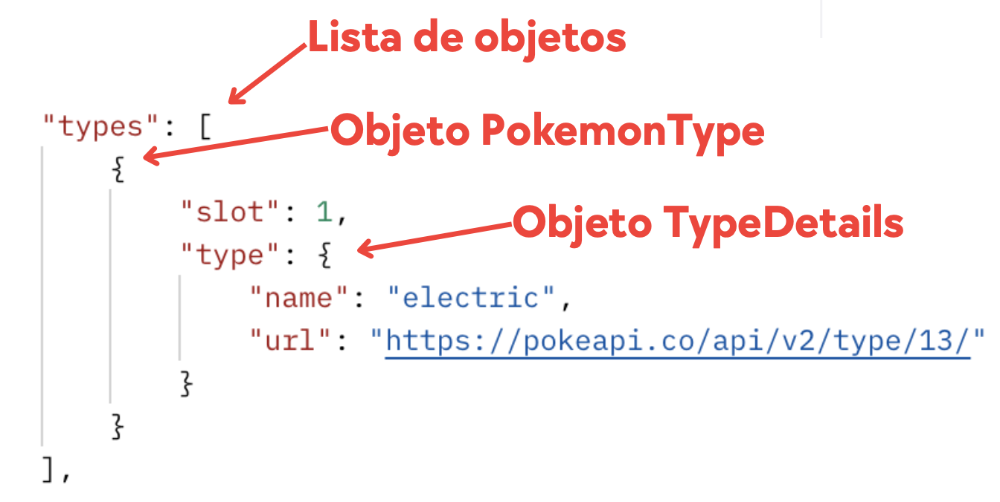

En este tutorial vamos a construir una pantalla que permita **buscar un Pokémon por nombre** usando la PokeAPI y mostrar algunos de sus datos.


Partimos de que ya tienes una **Activity** que contiene un **Fragment**.

---

## Paso 1. Añadir dependencias necesarias

En el `build.gradle` (Module: app), añade las dependencias para:

* Retrofit + Gson converter
* Glide (para cargar imágenes desde URL)

```gradle
dependencies {
    // Aquí van las dependencias ya cargadas

    // Retrofit
    implementation("com.squareup.retrofit2:retrofit:2.9.0")
    implementation("com.squareup.retrofit2:converter-gson:2.9.0")

    // Glide (imágenes)
    implementation("com.github.bumptech.glide:glide:4.16.0")
    annotationProcessor("com.github.bumptech.glide:compiler:4.16.0")
}
```

No olvides sincronizar el proyecto.

---

## Paso 2. Conceder permiso de Internet en el Manifest

En `AndroidManifest.xml`, añade el permiso:

```xml
<?xml version="1.0" encoding="utf-8"?>
<manifest xmlns:android="http://schemas.android.com/apk/res/android"
    xmlns:tools="http://schemas.android.com/tools">

    //highlight-next-line
    <uses-permission android:name="android.permission.INTERNET" />

    <application ...>
        ...
    </application>

</manifest>
```

Sin este permiso, la app no podrá acceder a la PokeAPI.

---

## Paso 3. Diseñar el layout del Fragment

Creamos el layout del fragmento, por ejemplo `fragment_busqueda_pokemon.xml`.
Arriba tendremos un `SearchView` y debajo los datos del Pokémon. Puedes mostrar los datos que más te interesen de entre los que trae la petición de la API.

Además, para gestionar correctamente la experiencia de usuario durante la búsqueda, el layout incorpora **tres secciones diferenciadas**, que iremos mostrando u ocultando según el resultado de la petición:

* **Sección 1: Loading (`ProgressBar`)**
  Se muestra únicamente mientras la aplicación está realizando la consulta a la API. El resto del contenido permanece oculto para evitar mostrar datos anteriores o incompletos.

* **Sección 2: Contenido (`layoutPokemonContent`)**
  Solo se muestra cuando la petición finaliza correctamente (**SUCCESS**) y el Pokémon existe. Dentro de este apartado se muestran todas las propiedades del Pokémon: nombre, imágenes, tipos, altura, peso, etc.

* **Sección 3: Error (`layoutError`)**
  Se muestra cuando la API devuelve un resultado incorrecto o no encuentra el Pokémon (**ERROR**). Incluye una imagen representativa y un mensaje indicando el problema, y oculta tanto la sección de loading como el contenido principal.

Estas tres secciones permiten controlar de forma clara el flujo del usuario y mostrar siempre información precisa y coherente según la fase en la que se encuentre la búsqueda.

```xml
<?xml version="1.0" encoding="utf-8"?>
<LinearLayout xmlns:android="http://schemas.android.com/apk/res/android"
    xmlns:tools="http://schemas.android.com/tools"
    android:layout_width="match_parent"
    android:layout_height="match_parent"
    android:orientation="vertical"
    android:padding="16dp"
    tools:context=".BuscarPkmFragment">

    <!-- 🔎 Search -->
    <androidx.appcompat.widget.SearchView
        android:id="@+id/searchViewPokemonName"
        android:layout_width="match_parent"
        android:layout_height="wrap_content"
        android:queryHint="Buscar Pokémon" />

    <!-- 🔄 LOADING (ProgressBar) -->
    <ProgressBar
        android:id="@+id/progressLoading"
        android:layout_width="wrap_content"
        android:layout_height="wrap_content"
        android:layout_gravity="center_horizontal"
        android:visibility="gone"
        android:layout_marginTop="24dp" />

    <!-- ❌ ERROR IMAGE -->
    <LinearLayout
        android:id="@+id/layoutError"
        android:layout_width="match_parent"
        android:layout_height="wrap_content"
        android:orientation="vertical"
        android:gravity="center"
        android:visibility="gone"
        android:layout_marginTop="24dp">

        <ImageView
            android:id="@+id/imgError"
            android:layout_width="120dp"
            android:layout_height="120dp"
            android:src="@drawable/icon_404"
            tools:src="@drawable/ic_launcher_foreground"
            android:contentDescription="Error image" />

        <TextView
            android:id="@+id/tvErrorMessage"
            android:layout_width="wrap_content"
            android:layout_height="wrap_content"
            android:text="Pokémon no encontrado"
            android:textSize="18sp"
            android:layout_marginTop="12dp"
            android:textStyle="bold" />
    </LinearLayout>

    <!-- ⭐ CONTENIDO COMPLETO DEL POKÉMON (se oculta en loading y error) -->
    <ScrollView
        android:id="@+id/layoutPokemonContent"
        android:layout_width="match_parent"
        android:layout_height="wrap_content"
        android:visibility="gone">

        <LinearLayout
            android:orientation="vertical"
            android:layout_width="match_parent"
            android:layout_height="wrap_content"
            android:padding="16dp">

            <!-- Nombre -->
            <TextView
                android:id="@+id/tvPokemonName"
                android:layout_width="wrap_content"
                android:layout_height="wrap_content"
                android:textStyle="bold"
                android:textSize="24sp"
                tools:text="Pikachu"
                android:layout_gravity="center_horizontal" />

            <!-- ID -->
            <TextView
                android:id="@+id/tvPokemonId"
                android:layout_width="wrap_content"
                android:layout_height="wrap_content"
                android:textSize="18sp"
                tools:text="#25"
                android:layout_gravity="center_horizontal"
                android:layout_marginTop="8dp" />

            <!-- Altura y peso -->
            <LinearLayout
                android:orientation="horizontal"
                android:layout_width="wrap_content"
                android:layout_height="wrap_content"
                android:layout_gravity="center_horizontal"
                android:layout_marginTop="8dp">

                <TextView android:text="Altura: " android:textStyle="bold"
                    android:layout_width="wrap_content" android:layout_height="wrap_content"/>
                <TextView android:id="@+id/tvPokemonHeight"
                    android:layout_width="wrap_content" android:layout_height="wrap_content" tools:text="4"/>

                <TextView android:text=" | "
                    android:layout_width="wrap_content" android:layout_height="wrap_content"/>

                <TextView android:text="Peso: " android:textStyle="bold"
                    android:layout_width="wrap_content" android:layout_height="wrap_content"/>
                <TextView android:id="@+id/tvPokemonWeight"
                    android:layout_width="wrap_content" android:layout_height="wrap_content" tools:text="60"/>
            </LinearLayout>

            <!-- Imágenes normal y shiny -->
            <LinearLayout
                android:orientation="horizontal"
                android:layout_width="match_parent"
                android:layout_height="wrap_content"
                android:gravity="center"
                android:layout_marginTop="16dp">

                <LinearLayout
                    android:orientation="vertical"
                    android:gravity="center_horizontal"
                    android:layout_height="wrap_content"
                    android:layout_width="wrap_content"
                    android:layout_marginEnd="16dp">

                    <ImageView
                        android:id="@+id/imgPokemonNormal"
                        android:layout_width="120dp"
                        android:layout_height="120dp"
                        tools:src="@drawable/ic_launcher_foreground"
                        android:contentDescription="Imagen normal" />

                    <TextView android:text="Normal"
                        android:layout_width="wrap_content"
                        android:layout_height="wrap_content"/>
                </LinearLayout>

                <LinearLayout
                    android:orientation="vertical"
                    android:layout_height="wrap_content"
                    android:layout_width="wrap_content"
                    android:gravity="center_horizontal">

                    <ImageView
                        android:id="@+id/imgPokemonShiny"
                        android:layout_width="120dp"
                        android:layout_height="120dp"
                        tools:src="@drawable/ic_launcher_foreground"
                        android:contentDescription="Imagen shiny" />

                    <TextView android:text="Shiny"
                        android:layout_width="wrap_content"
                        android:layout_height="wrap_content"/>
                </LinearLayout>
            </LinearLayout>

            <!-- Tipos -->
            <LinearLayout
                android:orientation="horizontal"
                android:layout_width="wrap_content"
                android:layout_height="wrap_content"
                android:layout_marginTop="8dp">

                <TextView
                    android:text="Tipos: "
                    android:textStyle="bold"
                    android:textSize="16sp"
                    android:layout_width="wrap_content"
                    android:layout_height="wrap_content"/>

                <TextView
                    android:id="@+id/tvPokemonTypes"
                    android:layout_width="wrap_content"
                    android:layout_height="wrap_content"
                    tools:text="electric"/>
            </LinearLayout>

        </LinearLayout>
    </ScrollView>

</LinearLayout>
```

---

## Paso 4. Crear los modelos para mapear el JSON

Definimos el modelo, que debe corresponderse con la estructura del JSON devuelto por la consulta. Por simplificar, de todos los datos que ofrece la API sobre un Pokémon, a nuestra aplicación le va a interesar:
* Nombre (atributo básico)
* Número de la Pokédex (atributo básico)
* Altura y peso (atributo básico)
* Imagen normal y shiny (dentro del objeto sprites) 
* Nombre de los tipos (lista de objetos Tipo)

Lo que puedes hacer es copiarte la respuesta completa de la PokeAPI (por ejemplo, de Pikachu, ya que para todos los Pokémon la estructura es la misma) en un blog de notas y eliminar los atributos que no te interesen, para aclararte con la estructura. Aquí puedes ver la respuesta limpia solo con los datos que queremos:

```json
{
    "height": 4,
    "id": 25,
    "name": "pikachu",
    "sprites": {
        "front_default": "https://raw.githubusercontent.com/PokeAPI/sprites/master/sprites/pokemon/25.png",
        "front_shiny": "https://raw.githubusercontent.com/PokeAPI/sprites/master/sprites/pokemon/shiny/25.png"
    },
    "types": [
        {
            "slot": 1,
            "type": {
                "name": "electric",
                "url": "https://pokeapi.co/api/v2/type/13/"
            }
        }
    ],
    "weight": 60
}
```

Ten en cuenta que:
* Sprites se ha creado como una clase interna del propio Pokemon, ya que no es necesario crear otro fichero externo `Sprites.java` para almacenar una clase tan sencilla (aunque tampoco estaría mal).
* PokemonType se ha creado como una clase independiente para que veáis también esa opción.

Creamos la clase `Pokemon` y las clases auxiliares (en el paquete `model`):

```java title="Pokemon.java"
public class Pokemon {

    private int id;
    private String name;
    private int height;
    private int weight;
    private Sprites sprites;
    private List<PokemonType> types;

    public int getId() { return id; }
    public String getName() { return name; }
    public int getHeight() { return height; }
    public int getWeight() { return weight; }
    public Sprites getSprites() { return sprites; }
    public List<PokemonType> getTypes() { return types; }
    public List<PokemonStat> getStats() { return stats; }


    //  Clase interna: Sprites
    public class Sprites {

        @SerializedName("front_default")
        private String frontDefault;

        @SerializedName("front_shiny")
        private String frontShiny;

        public String getFrontDefault() { return frontDefault; }
        public String getFrontShiny() { return frontShiny; }
    }
}
```

```java title="PokemonType.java"
public class PokemonType {
    private TypeDetails type;

    public TypeDetails getType() {
        return type;
    }

    //  Clase interna: TypeDetails
    public class TypeDetails {
        private String name;

        public String getName() {
            return name;
        }
    }
}
```



Con esto ya podemos mapear el JSON de cualquier Pokémon que consultemos a objetos Java.

---

## Paso 5. Crear los componentes de Retrofit

### Paso 5.1. Crear la interfaz de Retrofit

La interfaz define los endpoints que vamos a usar.

Recuerda que, según la documentación, a la URL base debemos añadir /pokemon/{name}, siendo {name} un valor variable que coincide con el nombre del Pokémon.

```
https://pokeapi.co/api/v2/pokemon/{id or name}
```

Creamos `PokemonApi.java`:

```java
public interface PokemonApi {

    @GET("pokemon/{name}")
    Call<Pokemon> getPokemonByName(@Path("name") String name);
}
```

* `@GET`: Es una anotación de Retrofit que especifica que este método realiza una solicitud HTTP de tipo GET.
* `"pokemon/{name}"`: Es el endpoint de la API. La parte {name} es un placeholder que será reemplazado dinámicamente con el nombre del Pokémon cuando se invoque el método.
* `Call<Pokemon>` es la respuesta que esperamos. Call es una clase de Retrofit que representa una solicitud HTTP pendiente y Pokemon es el modelo de datos que creamos antes basándonos en el JSON que recibiremos.
* `@Path("name")`: vincula el parámetro “name” del método al marcador {name} en el endpoint.

---

### Paso 5.2. Crear el cliente

Creamos `RetrofitClient.java` con patrón Singleton (nos asegura que solo se crea una instancia en toda la aplicación, ya que es una clase costosa de inicializar):

```java
public class RetrofitClient {

    // URL base de la PokeAPI, a partir de ella se construyen todos los endpoints
    private static final String BASE_URL = "https://pokeapi.co/api/v2/";
    private static Retrofit retrofit;

    // Inicializados de la instancia
    public static Retrofit getInstance() {
        if (retrofit == null) {
            // Inicializamos la instancia con la URL base
            // y la librería que mapea JSON a Java (Gson Converter)
            retrofit = new Retrofit.Builder()
                    .baseUrl(BASE_URL)
                    .addConverterFactory(GsonConverterFactory.create())
                    .build();
        }
        return retrofit;
    }

    // Inicializamos la interfaz, conectando con el cliente creado anteriormente
    public static PokemonApi getPokemonApi() {
        return getInstance().create(PokemonApi.class);
    }
}
```

Así, desde cualquier parte de la app podremos hacer `RetrofitClient.getPokemonApi()`.

---

### Paso 5.3. Crear la clase *Wrapper* que gestiona el estado

Cuando hacemos una petición a la API, no basta con obtener solo los datos del Pokémon.
En realidad, durante una llamada a la red se producen **varios estados diferentes**, y la interfaz debe reaccionar según cada uno de ellos:

1. **La aplicación está cargando** → se debe mostrar el `ProgressBar`.
2. **La API ha devuelto datos correctamente** → se muestran los datos del Pokémon.
3. **Ha habido un error** → se muestra un mensaje o una imagen de error.

Por defecto, Retrofit solo nos devuelve el resultado cuando la operación ha terminado, pero **no nos dice nada acerca del proceso intermedio**, y tampoco distingue entre éxito y error de una forma cómoda para la interfaz.

Para solucionar esto, creamos una clase auxiliar llamada **`Resource<T>`**, que envuelve el dato real y le añade un **estado**.
Esta clase es un *Wrapper* (envoltorio) que sirve exactamente para comunicarle al Fragment:

* **Qué ha ocurrido**
* **Qué datos están disponibles**
* **Qué tiene que mostrar la interfaz**

Esta clase utiliza una enumeración (`Status`) con tres posibles valores:

* `LOADING` → La petición está en proceso.
* `SUCCESS` → La petición finalizó correctamente y trae datos.
* `ERROR` → La petición falló o el Pokémon no existe.

El Repository devolverá siempre un `Resource<T>` indicando en qué estado se encuentra la operación, y el ViewModel lo enviará al Fragment a través de LiveData.
El Fragment, al observar estos estados, podrá decidir si muestra el spinner, el contenido o el panel de error.

:::info
**Nota:** En la clase `Resource<T>`, la **T** representa un *tipo genérico*.  
Esto significa que `Resource` puede envolver **cualquier clase**, como `Pokemon`, `List<Pokemon>`, `String`, etc.  
Gracias a los genéricos, el mismo Wrapper sirve para gestionar el estado de cualquier operación sin necesidad de crear clases diferentes para cada tipo de dato.
:::


Aquí tienes la implementación completa:

```java title="Resource.java"
public class Resource<T> {

    public enum Status { SUCCESS, ERROR, LOADING }

    public final T data;
    public final String message;
    public final Status status;

    // Constructor privado: solo se puede crear mediante los métodos estáticos
    private Resource(Status status, T data, String message) {
        this.status = status;
        this.data = data;
        this.message = message;
    }

    // Fábrica estática para estado de ÉXITO
    public static <T> Resource<T> success(T data) {
        return new Resource<>(Status.SUCCESS, data, null);
    }

    // Fábrica estática para ERROR, normalmente con un mensaje
    public static <T> Resource<T> error(String msg) {
        return new Resource<>(Status.ERROR, null, msg);
    }

    // Fábrica estática para el estado de CARGA
    public static <T> Resource<T> loading() {
        return new Resource<>(Status.LOADING, null, null);
    }
}
```

---

## Paso 6. Crear el Repository

Creamos el **Repository**, la capa encargada de comunicarse con la API y obtener los datos reales.
Su responsabilidad es **realizar las peticiones HTTP** y devolver el resultado procesado al `ViewModel`, sin que este tenga que preocuparse de detalles de red.

Cuando realizamos una petición HTTP, **la respuesta no llega de inmediato**: el servidor puede tardar unos milisegundos o incluso varios segundos.
Por ese motivo:

* No podemos devolver un valor directamente como en una función normal.
* Tampoco podemos bloquear el hilo principal esperando la respuesta, porque congelaría la interfaz y Android mostraría un ANR.
* Necesitamos que la operación se ejecute **en segundo plano** y que Android nos avise **cuando haya terminado**.

Retrofit hace este trabajo automáticamente mediante el método **`enqueue()`**, que ejecuta la petición en un hilo secundario.
Para recibir el resultado más tarde, Retrofit llama a uno de estos dos métodos:

* `onResponse()` → La API ha respondido correctamente
* `onFailure()` → Ha habido un error de red o no se pudo procesar la respuesta

Como el método `getPokemon()` termina **antes** de que la petición finalice, usamos un *callback* propio (`PokemonCallback`) para **devolver el resultado al ViewModel** en el momento adecuado.

En resumen:   
👉 **El callback `PokemonCallback` existe para avisar al ViewModel cuando la petición asíncrona ya ha terminado.**


```java title="PokemonRepository.java"
public class PokemonRepository {

    private final PokemonApi api;

    public PokemonRepository() {
        // Obtenemos la instancia de la API desde Retrofit
        api = RetrofitClient.getPokemonApi();
    }

    // Callback propio para enviar el resultado al ViewModel
    public interface PokemonCallback {
        void onResult(Resource<Pokemon> result);
    }

    public void getPokemon(String name, PokemonCallback callback) {

        // Avisamos al ViewModel de que hemos comenzado la operación
        callback.onResult(Resource.loading());

        // Llamada en segundo plano (asíncrona)
        api.getPokemonByName(name.toLowerCase()).enqueue(new Callback<Pokemon>() {

            @Override
            public void onResponse(Call<Pokemon> call, Response<Pokemon> response) {

                // La API respondió, ahora comprobamos si tiene cuerpo
                if (response.isSuccessful() && response.body() != null) {

                    // Enviamos al ViewModel el Pokémon recibido
                    callback.onResult(Resource.success(response.body()));

                } else {

                    // La API respondió, pero no hay Pokémon (404)
                    callback.onResult(Resource.error("Pokémon no encontrado"));
                }
            }

            @Override
            public void onFailure(Call<Pokemon> call, Throwable t) {

                // Fallo de red, sin respuesta de la API
                callback.onResult(Resource.error("Error de red: " + t.getMessage()));
            }
        });
    }
}
```

---

## Paso 7. Crear el ViewModel para la búsqueda

El **ViewModel** es la capa intermedia entre la interfaz (Fragment) y el Repository.
Su misión es coordinar la petición de datos y exponerlos a la vista de forma segura y reactiva.

El ViewModel se encarga de:

* Solicitar al Repository la búsqueda del Pokémon mediante el nombre.
* Recibir el resultado de forma asíncrona a través del callback.
* Actualizar el `LiveData<Resource<Pokemon>>`, que será observado por el Fragment.
* Mantener los datos aunque el usuario rote la pantalla o el Fragment se destruya temporalmente.

Al exponer `LiveData` hacia la vista, garantizamos que la interfaz se actualice automáticamente cuando lleguen los datos, sin necesidad de lógica adicional en la Activity o Fragment.

```java
public class PokemonViewModel extends ViewModel {

    private final PokemonRepository repository;

    // LiveData observado por el Fragment.
    // Contendrá Loading, Success o Error, junto al dato correspondiente.
    MutableLiveData<Resource<Pokemon>> informacionPokemon = new MutableLiveData<>();

    public PokemonViewModel() {
        // Inicializamos el Repository, capa encargada de hablar con la API
        repository = new PokemonRepository();
    }

    // Método usado por el Fragment para iniciar una búsqueda
    public void buscarPokemon(String name) {

        // Realizamos la búsqueda mediante el Repository
        // y recibimos la respuesta a través del callback
        repository.getPokemon(name, new PokemonRepository.PokemonCallback() {
            @Override
            public void onResult(Resource<Pokemon> result) {
                // Publicamos el resultado dentro del LiveData
                informacionPokemon.postValue(result);
            }
        });
    }
}
```

---

## Paso 8. Programar el Fragment para conectar todo

En primer lugar, obtenemos una instancia del `PokemonViewModel` y configuramos el `SearchView` para que, cuando el usuario pulse “buscar”, se invoque al método `buscarPokemon()` del ViewModel. A partir de ese momento, el Fragment solo debe **observar** el `LiveData` que expone el ViewModel.

Cada vez que cambia el estado (`LOADING`, `SUCCESS` o `ERROR`), el método `observarViewModel()` actualiza la interfaz:

* Si se está cargando, muestra el `ProgressBar` y oculta el resto.
* Si llega un Pokémon válido, muestra su información.
* Si hay un error, enseña un mensaje y una imagen de fallo.

El Fragment no sabe cómo se hace la petición ni cómo se gestiona la lógica interna: únicamente **reacciona a los cambios en el estado de la información**, logrando así una separación clara entre UI y lógica de negocio.


```java
public class BuscarPkmFragment extends Fragment {

    private FragmentBuscarPkmBinding binding;
    private PokemonViewModel viewModel;

    @Override
    public View onCreateView(LayoutInflater inflater, ViewGroup container,
                             Bundle savedInstanceState) {
        // Inflate the layout for this fragment
        return (binding = FragmentBuscarPkmBinding.inflate(inflater, container, false)).getRoot();
    }

    @Override
    public void onViewCreated(@NonNull View view, @Nullable Bundle savedInstanceState) {
        super.onViewCreated(view, savedInstanceState);

        viewModel = new ViewModelProvider(requireActivity()).get(PokemonViewModel.class);

        configurarSearchView();
        observarViewModel();
    }

    private void configurarSearchView() {
        binding.searchViewPokemonName.setOnQueryTextListener(new SearchView.OnQueryTextListener() {
            @Override
            public boolean onQueryTextSubmit(String query) {
                viewModel.buscarPokemon(query);
                binding.searchViewPokemonName.clearFocus();
                return true;
            }

            @Override
            public boolean onQueryTextChange(String newText) {
                return false;
            }
        });
    }

    private void observarViewModel() {
        viewModel.informacionPokemon.observe(getViewLifecycleOwner(), resource -> {

            if (resource == null) return;

            switch (resource.status) {

                case LOADING:
                    // Mostrar spinner
                    binding.progressLoading.setVisibility(View.VISIBLE);

                    // Ocultar el contenido y el error
                    binding.layoutPokemonContent.setVisibility(View.GONE);
                    binding.layoutError.setVisibility(View.GONE);
                    break;


                case SUCCESS:
                    // Ocultar spinner
                    binding.progressLoading.setVisibility(View.GONE);

                    // Mostrar contenido
                    binding.layoutPokemonContent.setVisibility(View.VISIBLE);
                    binding.layoutError.setVisibility(View.GONE);

                    // Cargar datos del pokemon
                    mostrarPokemon(resource.data);
                    break;


                case ERROR:
                    // Ocultar spinner y contenido
                    binding.progressLoading.setVisibility(View.GONE);
                    binding.layoutPokemonContent.setVisibility(View.GONE);

                    // Mostrar layout de error
                    binding.layoutError.setVisibility(View.VISIBLE);
                    binding.tvErrorMessage.setText(resource.message);

                    // Opcional: limpiar datos previos
                    limpiarVista();
                    break;
            }
        });
    }

    private void mostrarPokemon(Pokemon pokemon) {
        binding.tvPokemonName.setText(pokemon.getName());
        binding.tvPokemonId.setText("#" + String.valueOf(pokemon.getId()));
        binding.tvPokemonHeight.setText(String.valueOf(pokemon.getHeight()));
        binding.tvPokemonWeight.setText(String.valueOf(pokemon.getWeight()));

        String tipos = "";
        for (PokemonType pkmnType : pokemon.getTypes()) {
            tipos += " " + pkmnType.getType().getName();
        }
        binding.tvPokemonTypes.setText(tipos);

        // Vinculación de imagenes con Glide
        Glide.with(this)
                .load(pokemon.getSprites().getFrontDefault()) // URL de la imagen
                .into(binding.imgPokemonNormal);  // Elto en el que debe cargarse

        Glide.with(this)
                .load(pokemon.getSprites().getFrontShiny()) // URL de la imagen
                .into(binding.imgPokemonShiny);
    }

    private void limpiarVista() {
        binding.tvPokemonName.setText("");
        binding.tvPokemonId.setText("");
        binding.tvPokemonHeight.setText("");
        binding.tvPokemonWeight.setText("");
        binding.tvPokemonTypes.setText("");
        binding.imgPokemonNormal.setImageDrawable(null);
        binding.imgPokemonShiny.setImageDrawable(null);
    }
}
```

:::info
**Glide** es una librería especializada en cargar imágenes desde Internet de forma rápida y eficiente.  
Android no puede mostrar directamente una imagen a partir de una URL, por lo que necesitamos una herramienta que:

- Descargue la imagen en segundo plano  
- La convierta correctamente a un `Bitmap`  
- La almacene en caché para no volver a descargarla  
- La muestre en el `ImageView` sin bloquear la interfaz  

Por eso usamos:

```java
Glide.with(this)
     .load(url)
     .into(imageView);
```

Glide se encarga automáticamente de toda la gestión, haciendo que cargar imágenes desde URL sea sencillo, fluido y sin errores.
:::

## Estructura de paquetes recomendada

La siguiente estructura sigue el estándar moderno de Android y te permite localizar fácilmente cada pieza:

```
es.iesagora.demoretrofit
│
├── data
│   ├── model
│   │   ├── Pokemon.java
│   │   ├── PokemonType.java
│   │   └── PokedexResponse.java
│   │
│   ├── remote
│   │   ├── PokemonApi.java
│   │   ├── RetrofitClient.java
│   │   └── Resource.java
│   │
│   └── repository
│       └── PokemonRepository.java
│
├── ui
│   ├── pokedex
│   │   ├── PokedexFragment.java
│   │   ├── PokemonAdapter.java
│   │
│   ├── detalle
│   │   └── BuscarPkmFragment.java
│   │
│   └── main
│       └── MainActivity.java
│
└── viewmodel
    └── PokemonViewModel.java
```