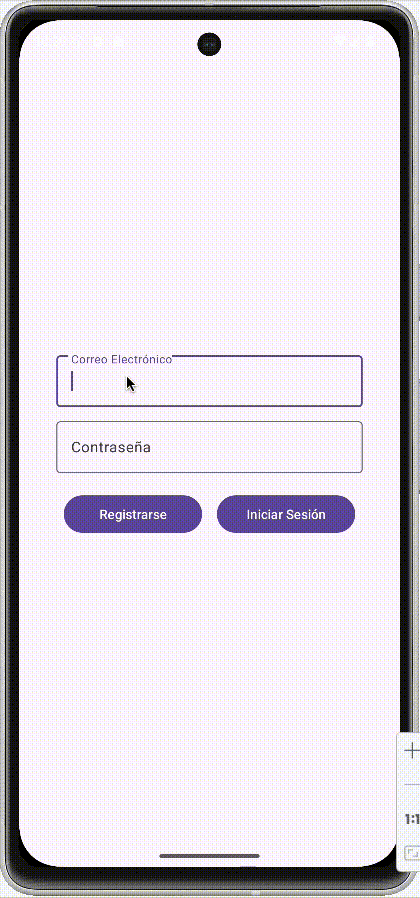
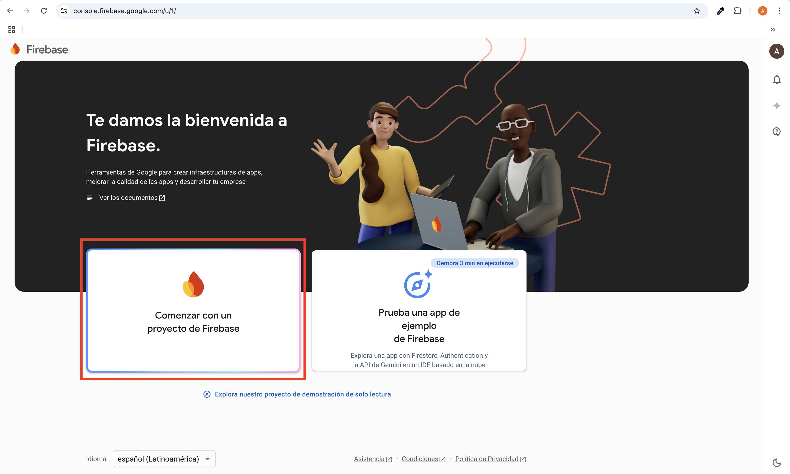
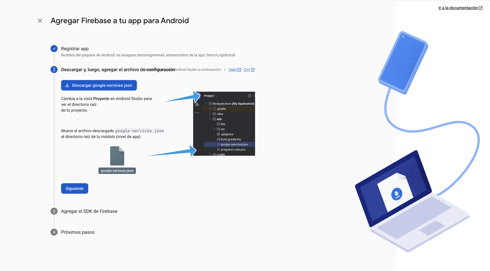
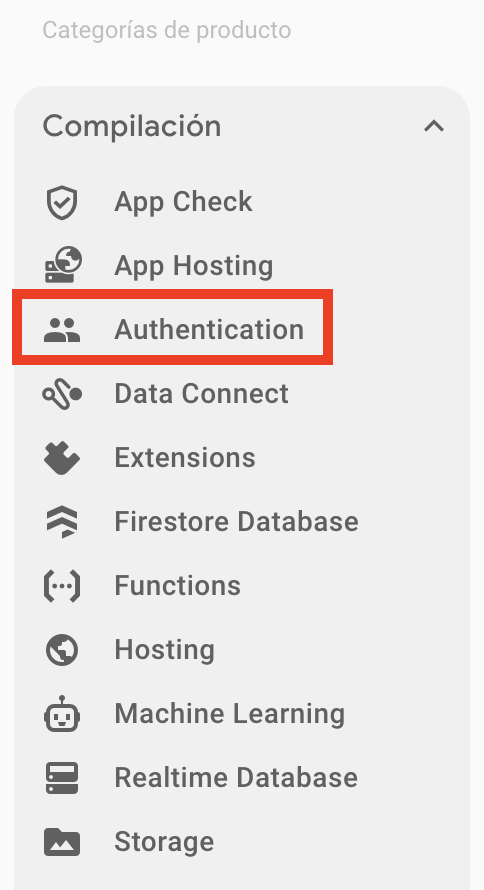
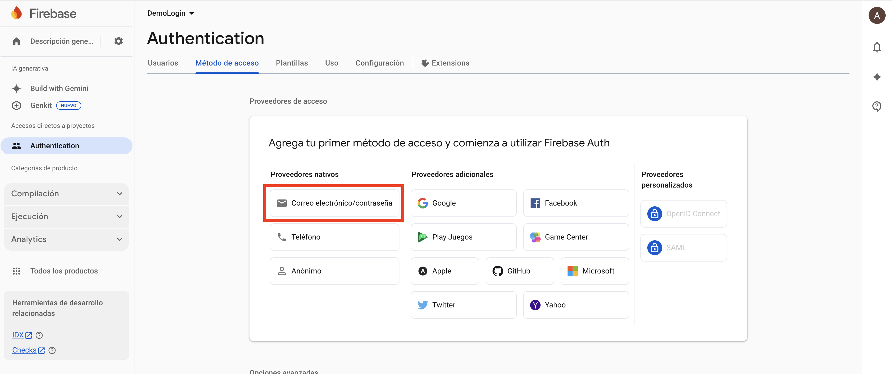
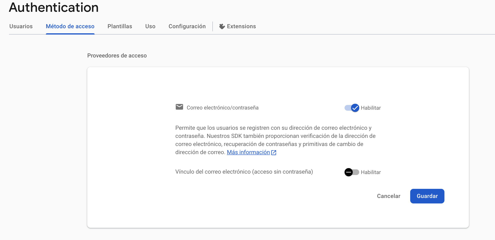

<div class="justify-text">
Vamos a implementar una aplicación sencilla con una pantalla única de log in y registro. Una vez que el usuario se haya logueado, pasarmos a la pantalla principal de la aplicación.



La arquitectura será MVVM con Repository, tal y como estamos ya acostumbrados:


## Paso 1. Configurar Firebase en tu Proyecto Android
Antes de comenzar a programar, debes configurar Firebase en tu aplicación.

### 1.1. Crear un Proyecto en Firebase
1. Ve a la [Firebase Console](https://console.firebase.google.com/) y crea un nuevo proyecto.



2. Agrega una aplicación **Android** e ingresa el **nombre del paquete** de tu app.


:::info Nombre del paquete
Por lo general, el nombre de tu paquete es el valor del applicationId en el archivo build.gradle de nivel de app.
:::


3. Descarga el archivo **google-services.json** y colócalo en `app/` dentro de tu proyecto. Para ello, **cambia la vista de Android a Proyecto en Android Studio**. Puedes seguir las instrucciones del wizard.




### 1.2. Agregar dependencias de Firebase
Abre el archivo `build.gradle (Project Level)` y agrega el plugin de Google Services:
```gradle
plugins {
    // ...

    // Add the dependency for the Google services Gradle plugin
    id("com.google.gms.google-services") version "4.4.4" apply false
}
```
Luego, en `build.gradle (Module: app)`, agrega el complemento de google-services y añade las dependencias de Firebase Authentication:
```gradle
plugins {

  // Add the Google services Gradle plugin
  id("com.google.gms.google-services")

  // ...
}

dependencies {
    // Firebase
    implementation(platform("com.google.firebase:firebase-bom:34.8.0"))
    // Firebase Authentication
    implementation("com.google.firebase:firebase-auth")
}
```

Después de esto, **sincroniza el proyecto** (`Sync Now` en Android Studio).

### 1.3. Habilita el método de acceso

En el panel de control, selecciona Compilación > Authentication.



En la pestaña `Método de acceso`, habilita los proveedores con los que quieres permitir el acceso. En este caso, con email y contraseña.



Dentro de las dos opciones, en nuestra aplicación será obligatorio establecer una contraseña. Por tanto, solo habilitamos la primera opción.



---

## Paso 2. Diseño de la Interfaz de Usuario

Partimos de una **aplicación muy sencilla con dos Activities**, sin uso de Fragmentos. Recuerda que en tus aplicaciones reales sí deberás usar fragmentos y todo lo aprendido hasta ahora.

### 2.1. Activity Login
En `activity_login.xml`, crea una interfaz para el **registro e inicio de sesión**.

```xml title="activity_login.xml"
<LinearLayout
    xmlns:android="http://schemas.android.com/apk/res/android"
    xmlns:app="http://schemas.android.com/apk/res-auto"
    xmlns:tools="http://schemas.android.com/tools"
    android:layout_width="match_parent"
    android:layout_height="match_parent"
    android:gravity="center"
    android:layout_gravity="center"
    android:orientation="vertical"
    android:padding="20dp"
    tools:context=".MainActivity">

    <LinearLayout
        android:layout_width="match_parent"
        android:layout_height="wrap_content"
        android:gravity="center"
        android:orientation="vertical"
        android:padding="20dp">

        <!-- Email -->
        <com.google.android.material.textfield.TextInputLayout
            android:layout_width="match_parent"
            android:layout_height="wrap_content"
            app:boxBackgroundMode="outline">

            <com.google.android.material.textfield.TextInputEditText
                android:id="@+id/emailEditText"
                android:layout_width="match_parent"
                android:layout_height="wrap_content"
                android:hint="Correo Electrónico"
                android:inputType="textEmailAddress"/>
        </com.google.android.material.textfield.TextInputLayout>

        <!-- Password -->
        <com.google.android.material.textfield.TextInputLayout
            android:layout_width="match_parent"
            android:layout_height="wrap_content"
            android:layout_marginTop="10dp"
            app:boxBackgroundMode="outline">

            <com.google.android.material.textfield.TextInputEditText
                android:id="@+id/passwordEditText"
                android:layout_width="match_parent"
                android:layout_height="wrap_content"
                android:hint="Contraseña"
                android:inputType="textPassword"/>
        </com.google.android.material.textfield.TextInputLayout>

        <!-- Botones -->
        <LinearLayout
            android:layout_width="match_parent"
            android:layout_height="wrap_content"
            android:layout_marginTop="20dp"
            android:gravity="center"
            android:orientation="horizontal"
            android:paddingHorizontal="8dp">

            <com.google.android.material.button.MaterialButton
                android:id="@+id/registerButton"
                android:layout_width="0dp"
                android:layout_height="wrap_content"
                android:layout_weight="1"
                android:text="Registrarse"
                android:layout_marginEnd="8dp" />

            <com.google.android.material.button.MaterialButton
                android:id="@+id/loginButton"
                android:layout_width="0dp"
                android:layout_height="wrap_content"
                android:layout_weight="1"
                android:text="Iniciar Sesión"
                android:layout_marginStart="8dp" />
        </LinearLayout>

        <!-- ProgressBar -->
        <ProgressBar
            android:id="@+id/progressBar"
            android:layout_width="wrap_content"
            android:layout_height="wrap_content"
            android:layout_marginTop="20dp"
            android:visibility="gone"
            android:indeterminate="true"/>

    </LinearLayout>

</LinearLayout>
```

:::info ACTIVITY INICIAL
Recuerda marcar Login Activity como actividad principal de tu aplicación:
```xml title="AndroidManifest.xml"
<activity
    android:name=".LoginActivity"
    android:exported="true">
    <intent-filter>
        <action android:name="android.intent.action.MAIN" />
        <category android:name="android.intent.category.LAUNCHER" />
    </intent-filter>
</activity>
<activity
    android:name=".MainActivity"
    android:exported="false">
</activity>
```
:::

---

### 2.2. Activity Principal

En esta Activity mostraremos información básica que devuelve Firebase Auth sobre el usuario. Además, ofreceremos un botón para cerrar la sesión.

```xml title="activity_main.xml"
<LinearLayout xmlns:android="http://schemas.android.com/apk/res/android"
    xmlns:app="http://schemas.android.com/apk/res-auto"
    xmlns:tools="http://schemas.android.com/tools"
    android:layout_width="match_parent"
    android:layout_height="match_parent"
    android:padding="20dp"
    android:gravity="center"
    android:orientation="vertical"
    tools:context=".MainActivity">

    <!-- Título -->
    <TextView
        android:layout_width="wrap_content"
        android:layout_height="wrap_content"
        android:text="Información del Usuario"
        android:textSize="22sp"
        android:textStyle="bold"
        android:paddingBottom="16dp"/>

    <!-- Sección: Correo -->
    <LinearLayout
        android:layout_width="match_parent"
        android:layout_height="wrap_content"
        android:orientation="horizontal"
        android:paddingBottom="8dp">

        <TextView
            android:layout_width="wrap_content"
            android:layout_height="wrap_content"
            android:text="Correo: "
            android:textSize="16sp"
            android:textStyle="bold"/>

        <TextView
            android:id="@+id/emailTextView"
            android:layout_width="wrap_content"
            android:layout_height="wrap_content"
            android:textSize="16sp"/>
    </LinearLayout>

    <!-- Sección: Fecha de Creación -->
    <LinearLayout
        android:layout_width="match_parent"
        android:layout_height="wrap_content"
        android:orientation="horizontal"
        android:paddingBottom="8dp">

        <TextView
            android:layout_width="wrap_content"
            android:layout_height="wrap_content"
            android:text="Fecha de Creación: "
            android:textSize="16sp"
            android:textStyle="bold"/>

        <TextView
            android:id="@+id/creationDateTextView"
            android:layout_width="wrap_content"
            android:layout_height="wrap_content"
            android:textSize="16sp"/>
    </LinearLayout>

    <!-- Sección: Última Conexión -->
    <LinearLayout
        android:layout_width="match_parent"
        android:layout_height="wrap_content"
        android:orientation="horizontal"
        android:paddingBottom="16dp">

        <TextView
            android:layout_width="wrap_content"
            android:layout_height="wrap_content"
            android:text="Última Conexión: "
            android:textSize="16sp"
            android:textStyle="bold"/>

        <TextView
            android:id="@+id/lastLoginTextView"
            android:layout_width="wrap_content"
            android:layout_height="wrap_content"
            android:textSize="16sp"/>
    </LinearLayout>

    <!-- Botón de Logout -->
    <com.google.android.material.button.MaterialButton
        android:id="@+id/logoutButton"
        android:layout_width="match_parent"
        android:layout_height="wrap_content"
        android:text="Cerrar Sesión"
        style="@style/Widget.MaterialComponents.Button"/>
</LinearLayout>
```

---

## Paso 3. Programar la lógica de usuario

### 3.1. Implementar el Repository

Creamos un repositorio que sea el único que conozca y se comunique con `FirebaseAuth`.

```java title="AuthRepository.java"
public class AuthRepository {

    // Instancia de FirebaseAuth que gestiona la autenticación en la app.
    private final FirebaseAuth auth;

    public AuthRepository() {
        auth = FirebaseAuth.getInstance();
    }

    /**
     * Callback para comunicar el resultado de una operación de autenticación (login/registro).
     * Se utiliza porque las llamadas a Firebase son asíncronas.
     */
    public interface AuthCallback {
        // Se ejecuta cuando la operación ha sido exitosa. Devuelve la información del usuario autenticado.
        void onSuccess(FirebaseUser user);
        // Se ejecuta cuando la operación falla.
        void onError(String message);
    }

    // Inicia sesión con email y contraseña.
    // Notifica el resultado mediante AuthCallback
    public void login(String email, String password, AuthCallback callback) {
        // Operación asíncrona: Firebase devuelve un Task y se resuelve en los listeners.
        auth.signInWithEmailAndPassword(email, password)
                // Si se autentica correctamente, devolvemos el usuario actual.
                .addOnSuccessListener(result -> callback.onSuccess(auth.getCurrentUser()))
                // Si falla, mapeamos la excepción a un mensaje y lo devolvemos.
                .addOnFailureListener(e -> callback.onError(mapError(e)));
    }

    // Registra un nuevo usuario con email y contraseña.
    // Notifica el resultado mediante AuthCallback
    public void register(String email, String password, AuthCallback callback) {
        auth.createUserWithEmailAndPassword(email, password)
                .addOnSuccessListener(result -> callback.onSuccess(auth.getCurrentUser()))
                .addOnFailureListener(e -> callback.onError(mapError(e)));
    }

    // Devuelve el usuario actualmente autenticado (si hay alguno).
    public FirebaseUser getCurrentUser() {
        return auth.getCurrentUser();
    }

    // Cierra sesión del usuario actual.
    public void logout() {
        auth.signOut();
    }

    // Convierte una excepción en un mensaje de error para mostrar.
    private String mapError(Exception e) {
        // Si no hay excepción o no hay mensaje, devolvemos un texto genérico.
        if (e == null || e.getMessage() == null) return "Error desconocido.";
        // Si no, devolvemos el mensaje original de Firebase.
        return e.getMessage();
    }
}
```

---

### 3.2. Clase Wrapper para gestionar estados de autenticación

En temas anteriores ya hemos trabajado con una **clase wrapper (`Resource`)** para representar el estado de una llamada a una **API REST**:
*cargando*, *éxito* o *error*.

Cuando trabajamos con **Firebase Authentication**, el problema es muy similar:

* Las operaciones de **login** y **registro** son **asíncronas**.
* La UI necesita saber en qué estado se encuentra la operación para:

  * mostrar o bloquear elementos de la interfaz,
  * navegar a otra pantalla si todo va bien,
  * o mostrar un mensaje de error si algo falla.

Por este motivo, reutilizamos el **mismo patrón**, pero adaptado al contexto de autenticación.

```java
public class AuthState {

    public boolean loading;
    public FirebaseUser user;
    public String error;

    public static AuthState loading() {
        AuthState s = new AuthState();
        s.loading = true;
        return s;
    }

    public static AuthState success(FirebaseUser user) {
        AuthState s = new AuthState();
        s.user = user;
        return s;
    }

    public static AuthState error(String msg) {
        AuthState s = new AuthState();
        s.error = msg;
        return s;
    }
}
```

:::info Significado de cada estado

* **Loading**

  * La operación de login o registro está en curso.
  * Se utiliza para desactivar botones, inputs o mostrar un indicador de carga.

* **Success**

  * La autenticación se ha realizado correctamente.
  * Contiene un `FirebaseUser` con la información del usuario autenticado.
  * La UI suele reaccionar navegando a otra pantalla.

* **Error**

  * La operación ha fallado.
  * Contiene un mensaje de error que puede mostrarse al usuario.
:::

---

### 3.3. Implementar el ViewModel

El ViewModel:

* valida las entradas del usuario
* actualiza estado (loading, error, user)
* llama al repositorio para realizar las operaciones de autenticación

```java title="AuthViewModel"
public class AuthViewModel extends AndroidViewModel {

    private final AuthRepository repo;

    // LiveData para los métodos asíncronos del repositorio
    private final MutableLiveData<AuthState> authState = new MutableLiveData<>();

    public AuthViewModel(@NonNull Application application) {
        super(application);
        repo = new AuthRepository();
    }

    // Getter público del LiveData
    public MutableLiveData<AuthState> getAuthState() {
        return authState;
    }

    // No es una petición asíncrona ni un cambio de estado, es una consulta directa y síncrona.
    // Podemos devolverlo sin necesidad de un LiveData
    public FirebaseUser getCurrentUser() {
        return repo.getCurrentUser();
    }

    // Método para realizar el logout
    public void logout() {
        repo.logout();
    }

    // Método para realizar el login
    public void login(String email, String password) {
        // Primera validación
        String error = validate(email, password);
        if (error != null) {
            // Si no pasa la validación, devolvemos mensaje de error
            authState.setValue(AuthState.error(error));
            return;
        }

        // Anunciamos que estamos lanzando la petición (puede tardar así que podemos
        // mostrar un progress bar)
        authState.setValue(AuthState.loading());

        // Lanzamos la petición a Firebase
        repo.login(email.trim(), password, new AuthRepository.AuthCallback() {
            @Override public void onSuccess(FirebaseUser user) {
                // Si va bien, devolvemos la información del usuario
                authState.postValue(AuthState.success(user));
            }
            @Override public void onError(String message) {
                // Si va mal, devolvemos el mensaje de error
                authState.postValue(AuthState.error(message));
            }
        });
    }

    // Método de registro, lógica similar al login
    public void register(String email, String password) {
        String error = validate(email, password);
        if (error != null) {
            authState.setValue(AuthState.error(error));
            return;
        }

        authState.setValue(AuthState.loading());
        repo.register(email.trim(), password, new AuthRepository.AuthCallback() {
            @Override public void onSuccess(FirebaseUser user) {
                authState.postValue(AuthState.success(user));
            }
            @Override public void onError(String message) {
                authState.postValue(AuthState.error(message));
            }
        });
    }


    // Validación básica de los campos que introduce el usuario
    // Recomendable antes de enviar petición a Firebase
    private String validate(String email, String password) {
        if (email == null || email.trim().isEmpty()) return "El correo es obligatorio.";
        if (password == null || password.isEmpty()) return "La contraseña es obligatoria.";
        return null;
    }

}
```

---

### 3.4. LoginActivity

Nuestro layout tiene dos botones: **registrarse** y **login**.
Así que el flujo es directo:

* `registerButton` → `viewModel.register(email, pass)`
* `loginButton` → `viewModel.login(email, pass)`

```java title="LoginActivity.java"
public class LoginActivity extends AppCompatActivity {

    private AuthViewModel viewModel;
    private ActivityLoginBinding binding;

    @Override
    protected void onCreate(Bundle savedInstanceState) {
        super.onCreate(savedInstanceState);
        setContentView((binding = ActivityLoginBinding.inflate(getLayoutInflater())).getRoot());

        viewModel = new ViewModelProvider(this).get(AuthViewModel.class);

        // Si ya hay usuario autenticado, saltamos directamente a la pantalla principal
        if (viewModel.getCurrentUser() != null) {
            goToMain();
            return;
        }

        // Inicialización de componentes
        observeAuthState();
        inicializarBotones();
    }

    private void observeAuthState() {
        viewModel.getAuthState().observe(this, state -> {
            if (state == null) return;

            // Deshabilita botones y muestra la progress bar si la petición está en proceso
            habilitarInterfaz(state.loading);

            // Si hay un error, mostramos el mensaje
            if (state.error != null) {
                Toast.makeText(this, state.error, Toast.LENGTH_LONG).show();
                return;
            }

            // Si todo va bien, pasamos a la pantalla principal
            if (state.user != null) {
                goToMain();
            }
        });
    }

    private void habilitarInterfaz(boolean cargando) {
        // Si está cargando, deshabilitamos todos los botones y mostramos la barra de progreso
        if (cargando) {
            binding.registerButton.setEnabled(false);
            binding.loginButton.setEnabled(false);
            binding.emailEditText.setEnabled(false);
            binding.passwordEditText.setEnabled(false);
            binding.progressBar.setVisibility(View.VISIBLE);
        } else {
            binding.registerButton.setEnabled(true);
            binding.loginButton.setEnabled(true);
            binding.emailEditText.setEnabled(true);
            binding.passwordEditText.setEnabled(true);
            binding.progressBar.setVisibility(View.GONE);
        }
    }

    private void inicializarBotones() {
        binding.registerButton.setOnClickListener(v -> {
            // Recuperamos mail y contraseña
            String email = binding.emailEditText.getText().toString();
            String pass = binding.passwordEditText.getText().toString();
            // Iniciamos el proceso de registro
            viewModel.register(email, pass);
        });

        binding.loginButton.setOnClickListener(v -> {
            // Recuperamos mail y contraseña
            String email = binding.emailEditText.getText().toString();
            String pass = binding.passwordEditText.getText().toString();
            // Iniciamos el proceso de login
            viewModel.login(email, pass);
        });
    }

    // Método que navega a la pantalla principal
    private void goToMain() {
        startActivity(new Intent(this, MainActivity.class));
        finish();
    }
}
```

---

### 3.5. MainActivity

Nuestro layout tiene un conjunto de campo para mostrar información básica del usuario, que recuperaremos de `Firebase`, concretamente del objeto `FirebaseUser`.

Además, tiene un botón de logout que cierra la sesión del usuario y devuelve a la actividad de login/registro.

```java title="MainActivity.java"
public class MainActivity extends AppCompatActivity {

    private AuthViewModel viewModel;

    private ActivityMainBinding binding;

    private FirebaseUser user;

    @Override
    protected void onCreate(Bundle savedInstanceState) {
        super.onCreate(savedInstanceState);
        setContentView((binding = ActivityMainBinding.inflate(getLayoutInflater())).getRoot());

        viewModel = new ViewModelProvider(this).get(AuthViewModel.class);

        user = viewModel.getCurrentUser();

        // Si no hay un usuario conectado (porque ha pasado mucho tiempo desde el último login,
        // se ha borrado caché de la aplicación, etc.)
        if (user == null) {
            goToLogin();
            return;
        }

        mostrarDatosUsuario();
        
        inicializarBotonLogout();
    }
    
    private void inicializarBotonLogout() {
        binding.logoutButton.setOnClickListener(v -> {
            viewModel.logout();
            goToLogin();
        });
    }

    private void mostrarDatosUsuario() {
        binding.emailTextView.setText(user.getEmail());

        // FirebaseUserMetadata contiene información adicional del usuario
        FirebaseUserMetadata meta = user.getMetadata();
        if (meta != null) {
            binding.creationDateTextView.setText(formatearFecha(meta.getCreationTimestamp()));
            binding.lastLoginTextView.setText(formatearFecha(meta.getLastSignInTimestamp()));
        } else {
            binding.creationDateTextView.setText("-");
            binding.lastLoginTextView.setText("-");
        }
    }

    private void goToLogin() {
        startActivity(new Intent(this, LoginActivity.class));
        finish();
    }

    private String formatearFecha(long timestamp) {
        // timestamp viene en ms
        SimpleDateFormat sdf = new SimpleDateFormat("dd/MM/yyyy HH:mm", Locale.getDefault());
        return sdf.format(new Date(timestamp));
    }
}
```

:::info Clases FirebaseUser y FirebaseUserMetadata

**FirebaseUser** representa al usuario autenticado en Firebase Authentication.  
Contiene la información básica de la cuenta, como el correo electrónico, el identificador único (UID) y el estado de verificación del email.

Algunos datos habituales que proporciona:
- `getUid()` → identificador único del usuario.
- `getEmail()` → correo electrónico asociado a la cuenta.
- `isEmailVerified()` → indica si el correo ha sido verificado.

**FirebaseUserMetadata** contiene información adicional sobre la cuenta del usuario, relacionada con su actividad en la aplicación.

Permite conocer, entre otros datos:
- `getCreationTimestamp()` → fecha y hora de creación de la cuenta.
- `getLastSignInTimestamp()` → fecha y hora del último inicio de sesión.

Esta clase se obtiene a través de:
```java
FirebaseUserMetadata metadata = user.getMetadata();
```

Estas clases permiten acceder a información del usuario autenticado **sin realizar llamadas adicionales a red**, ya que Firebase mantiene estos datos de forma local mientras la sesión esté activa.
:::


</div>