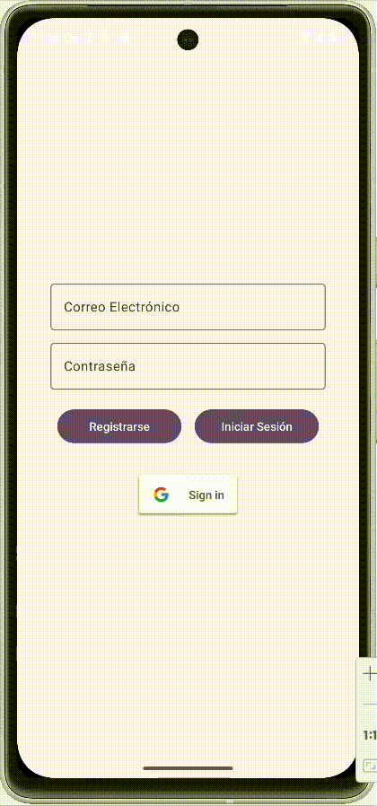
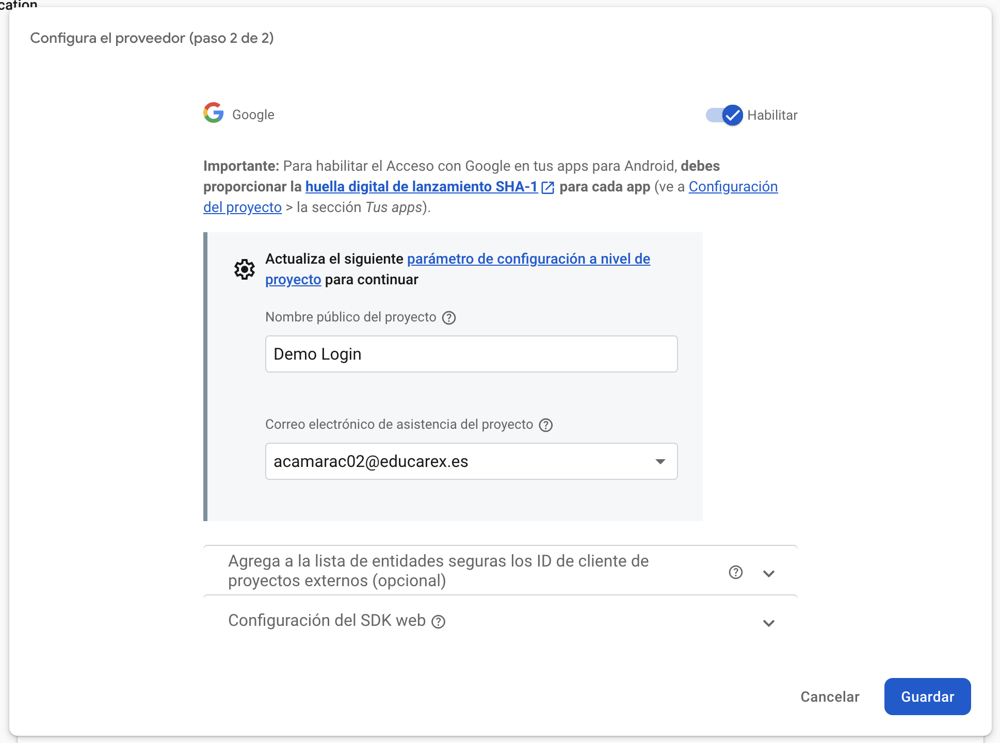
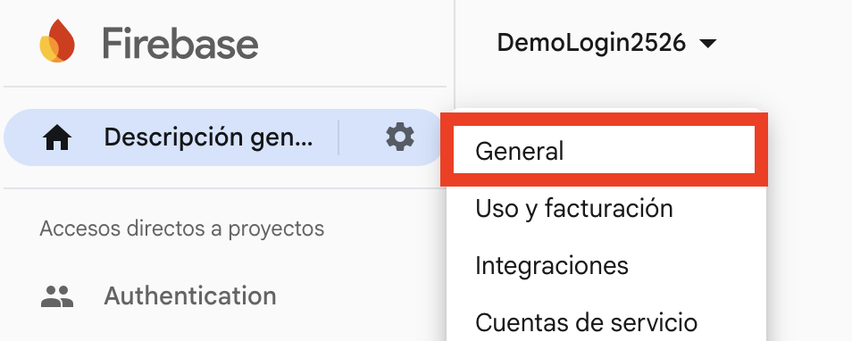
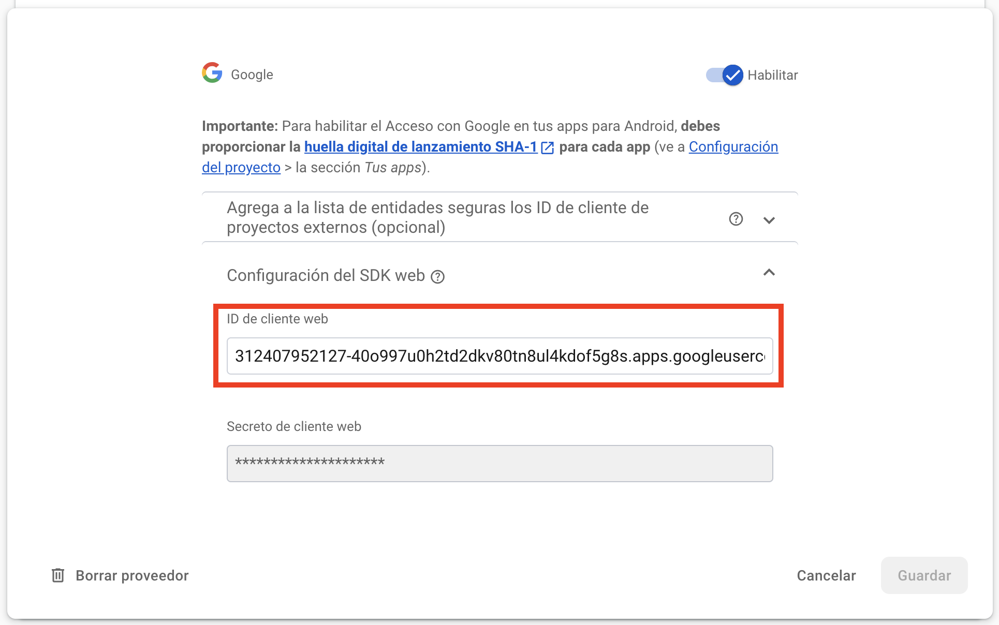

<div class="justify-text">

Vamos a **agregar la autenticación con Google** en nuestro proyecto anterior, donde implementamos login con email/contraseña.



Antes de empezar, entendamos las tecnologías que usaremos:  
- **Firebase Authentication**:  es un servicio que nos permite autenticar usuarios de forma segura sin necesidad de gestionar un backend propio.

- **OAuth 2.0**: Google utiliza **OAuth 2.0** para autenticar a los usuarios. Es un protocolo seguro que permite a las apps acceder a la información de Google del usuario sin exponer sus credenciales.

No obstante, **Firebase simplifica el proceso**, por lo que **no necesitas manejar tokens de OAuth manualmente**. Solo necesitas configurar Firebase y usar su SDK.

El uso de estas dos tecnologías independientes supone que el login con Google en Firebase tenga dos pasos fundamentales:  
- **Obtener el usuario de Google**: Se inicia el flujo de Google Sign-In para que el usuario seleccione su cuenta y se obtenga su información (correo, ID Token, etc.).  

- **Autenticar el usuario en Firebase Auth**: Se usa el ID Token obtenido para crear una credencial (`AuthCredential`), que luego se envía a Firebase para autenticar al usuario dentro de la app.  

---

## Paso 1. Habilitar Google Sign-In en Firebase
1. Ve a la **[Firebase Console](https://console.firebase.google.com/)**.  
2. Entra en tu proyecto y ve a **Authentication** > **Método de acceso**.  
3. Pulsa sobre el botón **Agregar proveedor nuevo**.
4. Habilita **Google** y **guarda los cambios**.  


5. Introduce el nombre de tu aplicación (será el que se muestre en el correo que les llega a los usuarios después de acceder por primera vez) y el correo de asistencia al proyecto.



---

## Paso 2. Huella digital SHA-1

Cuando activas **autenticación con Google en Firebase**, Firebase necesita **verificar** que tu aplicación está realmente conectada a tu proyecto de Firebase y a Google Cloud.

Para ello, requiere **una huella digital SHA-1**, que es un identificador único generado a partir de la clave de firma de la app. 

Esto es necesario porque **Google Sign-In usa OAuth 2.0**, y para que Firebase pueda autenticar a los usuarios con sus cuentas de Google, necesita asociar la app con un **SHA-1 válido**.

Hay dos tipos de claves SHA-1 que puedes agregar:

1. **SHA-1 de desarrollo** (para pruebas en Android Studio).  
2. **SHA-1 de producción** (para versiones firmadas y subidas a Google Play).  

A continuación se explica cómo obtener SHA-1 de Desarrollo (Modo Debug):

### 2.1. Obtener la huella SHA-1
1. **Abre Android Studio** y ve a la **terminal** (`View > Tool Windows > Terminal`).
2. Escribe el siguiente comando y presiona `Enter`:

   ```sh
   ./gradlew signingReport
   ```
   **En Windows**, usa:  
   ```sh
   gradlew signingReport
   ```

3. Espera unos segundos y verás una salida como esta:

   ```
   Variant: debug
   Config: debug
   Store: /Users/tuusuario/.android/debug.keystore
   Alias: AndroidDebugKey
   MD5:  A1:B2:C3:D4:E5:F6:G7:H8:I9:J0
   SHA1: 11:22:33:44:55:66:77:88:99:AA:BB:CC:DD:EE:FF:GG:HH:II:JJ
   SHA-256: XX:YY:ZZ...
   ```

4. **Copia el SHA-1** (solo los números después de `SHA1:`).


### 2.2. Agregar SHA-1 en Firebase
1. **Ve a la [Firebase Console](https://console.firebase.google.com/)**.
2. En tu proyecto, haz clic en ⚙ **General**.

    

3. En la sección **Tus apps**, selecciona tu app de Android. (Pestaña **General**, abajo del todo)
4. **En la parte de "Huellas digitales del certificado SHA"**, selecciona `Agregar huella digital`.

    

5. Guarda los cambios y vuelve a descargar y añadir a tu proyecto el archivo **google-services.json**.


---

## Paso 3. Agregar Dependencias en build.gradle
Abre `build.gradle (Module: app)` y **añade estas dependencias** (si has implementado el ejercicio anterior, ya debes tener las dos primera dependencias):

```gradle
dependencies {
    // Firebase BoM
    implementation(platform("com.google.firebase:firebase-bom:34.8.0"))
    // Firebase Auth
    implementation("com.google.firebase:firebase-auth")

    // Google Sign-In (Play Services Auth)
    implementation("com.google.android.gms:play-services-auth:21.5.0")
}
```
Luego, **sincroniza el proyecto** (`Sync Now`).

---

## Paso 4. Agregar el Botón de Google en LoginActivity
En `activity_login.xml`, **agrega un botón para iniciar sesión con Google**:

```xml
<com.google.android.gms.common.SignInButton
    android:id="@+id/googleSignInButton"
    android:layout_width="wrap_content"
    android:layout_height="wrap_content"
    android:layout_marginTop="30dp"/>
```

📌 **Este botón es el oficial de Google Sign-In** y se verá como el botón típico de **"Iniciar sesión con Google"**.

---

## Paso 5. Implementar la lógica

### 5.1. Añadir el login con Google en el Repository

En el caso del login con Google, **la app no envía directamente un email y una contraseña a Firebase**.
En su lugar, Google se encarga de autenticar al usuario y devuelve un **`idToken`**.

El **`idToken`** es un token seguro que:

* Identifica al usuario autenticado en Google
* Garantiza que la autenticación ha sido realizada por Google
* Puede ser verificado posteriormente por Firebase

A partir de este `idToken`, Firebase crea una **credencial (`AuthCredential`)**, que es el objeto que representa la identidad del usuario y permite a Firebase confiar en el proveedor externo (Google).

El `Repository` se encarga de transformar ese token en una credencial válida y realizar la autenticación en Firebase.

Añade el siguiente método:

```java title="AuthRepository.java"
// Inicia sesión utilizando una cuenta de Google.
// Recibe el idToken proporcionado por Google tras la autenticación
// y notifica el resultado mediante AuthCallback.
public void loginWithGoogle(String idToken, AuthCallback callback) {

    // Se crea una credencial de Firebase a partir del idToken de Google.
    // Esta credencial permite a Firebase verificar la identidad del usuario.
    AuthCredential credential = GoogleAuthProvider.getCredential(idToken, null);

    // Autenticación asíncrona en Firebase usando la credencial de Google.
    auth.signInWithCredential(credential)
            // Si la autenticación es correcta, devolvemos el usuario actual.
            .addOnSuccessListener(result -> callback.onSuccess(auth.getCurrentUser()))
            // Si ocurre un error, se mapea la excepción a un mensaje comprensible.
            .addOnFailureListener(e -> callback.onError(mapError(e)));
}
```

---

### 5.2. Añadir el login con Google en el ViewModel

El ViewModel actúa como intermediario entre la interfaz de usuario y el Repository.
Se encarga de validar los datos recibidos desde la UI, iniciar el proceso de autenticación y actualizar el estado observable (`AuthState`) para que la interfaz reaccione a los cambios (cargando, error o éxito).

```java title="AuthViewModel.java"
// Inicia el proceso de login con Google a partir del idToken obtenido en la UI.
public void loginWithGoogle(String idToken) {

    // Validación inicial: si no hay token, no se puede continuar con el login.
    if (idToken == null || idToken.trim().isEmpty()) {
        authState.setValue(AuthState.error("No se pudo obtener el token de Google."));
        return;
    }

    // Indicamos que comienza la operación de autenticación.
    authState.setValue(AuthState.loading());

    // Delegamos el login en el Repository.
    repo.loginWithGoogle(idToken, new AuthRepository.AuthCallback() {

        @Override
        public void onSuccess(FirebaseUser user) {
            // Si el login es correcto, publicamos el estado de éxito.
            authState.postValue(AuthState.success(user));
        }

        @Override
        public void onError(String message) {
            // Si ocurre un error, publicamos el estado de error.
            authState.postValue(AuthState.error(message));
        }
    });
}
```

---

### 5.3. Obtener el Web Client Id
El **Web Client ID** (o **Client ID de OAuth 2.0**) es un identificador único generado por **Google Cloud Platform (GCP)** que permite a tu aplicación comunicarse con los servidores de Google para autenticar a los usuarios mediante **Google Sign-In**.

- Es necesario para que Firebase pueda validar la identidad de los usuarios que inician sesión con Google.  
- Se usa en Android para obtener un "ID Token" que luego se intercambia con Firebase para autenticar al usuario.  
- Cada proyecto de Firebase tiene su propio Web Client ID, y debe configurarse correctamente para que Google Sign-In funcione en tu app.


Para obtener el Web Client ID en Firebase sigue estos pasos:

1. **Abre Firebase Console**: [https://console.firebase.google.com/](https://console.firebase.google.com/)  
2. **Selecciona tu proyecto**.  
3. En el menú lateral, ve a **"Authentication"** (⚙).  
4. Dirígete a la pestaña **"Métodos de acceso"**.  
5. Selecciona el proveedor **Google** que hemos configurado previamente.
6. Despliega el apartado **Configuración del SDK web** y copia el primer campo.

    

7. Agrégalo a `res/values/strings.xml` para mayor organización:
    ```xml
    <string name="default_web_client_id">1234567890-abcdefghij.apps.googleusercontent.com</string>
    ```

---

### 5.4. Gestionar el login con Google en `LoginActivity`

En este apartado se amplía la `LoginActivity` del demo anterior para añadir el inicio de sesión con Google.
La lógica de email y contraseña se mantiene sin cambios y se incorporan únicamente los elementos necesarios para lanzar el selector de Google, obtener el `idToken` y delegar la autenticación en el `ViewModel`.

```java title="LoginActivity.java"
public class LoginActivity extends AppCompatActivity {

    private AuthViewModel viewModel;
    private ActivityLoginBinding binding;
    //highlight-next-line
    private GoogleSignInClient googleClient;

    // Launcher moderno para recibir el resultado del Intent de Google
    //highlight-next-line
    private ActivityResultLauncher<Intent> googleLauncher;

    @Override
    protected void onCreate(Bundle savedInstanceState) {
        super.onCreate(savedInstanceState);
        setContentView((binding = ActivityLoginBinding.inflate(getLayoutInflater())).getRoot());

        viewModel = new ViewModelProvider(this).get(AuthViewModel.class);

        // Si ya hay usuario autenticado, saltamos directamente a la pantalla principal
        if (viewModel.getCurrentUser() != null) {
            goToMain();
            return;
        }

        // Inicialización de componentes comunes (igual que en el demo anterior)
        observeAuthState();
        inicializarBotones();

        // Inicialización específica del login con Google
        //highlight-next-line
        configurarGoogleSignIn();
        //highlight-next-line
        inicializarLauncherGoogleSignIn();
    }

    // Configura las opciones de Google Sign-In necesarias para Firebase
    //highlight-start
    private void configurarGoogleSignIn() {
        GoogleSignInOptions gso = new GoogleSignInOptions.Builder(GoogleSignInOptions.DEFAULT_SIGN_IN)
                .requestEmail()
                // Token necesario para autenticar posteriormente en Firebase
                .requestIdToken(getString(R.string.default_web_client_id))
                .build();

        googleClient = GoogleSignIn.getClient(this, gso);
    }
    //highlight-end
    

    // Inicializa el launcher que recibirá el resultado del selector de Google
    //highlight-start
    private void inicializarLauncherGoogleSignIn() {
        googleLauncher = registerForActivityResult(
                new ActivityResultContracts.StartActivityForResult(),
                result -> {

                    if (result.getResultCode() != Activity.RESULT_OK || result.getData() == null) {
                        // Usuario canceló el login o no se recibieron datos
                        Toast.makeText(this, "Login con Google cancelado.", Toast.LENGTH_SHORT).show();
                        return;
                    }

                    Task<GoogleSignInAccount> task =
                            GoogleSignIn.getSignedInAccountFromIntent(result.getData());

                    gestionarResultadoSignIn(task);
                }
        );
    }
    //highlight-end

    // Procesa el resultado del login con Google
    //highlight-start
    private void gestionarResultadoSignIn(Task<GoogleSignInAccount> task) {
        try {
            GoogleSignInAccount account = task.getResult(ApiException.class);

            if (account == null || account.getIdToken() == null) {
                Toast.makeText(this, "No se pudo obtener la cuenta de Google.", Toast.LENGTH_LONG).show();
                return;
            }

            // Enviamos el idToken al ViewModel para autenticar en Firebase
            viewModel.loginWithGoogle(account.getIdToken());

        } catch (ApiException e) {
            Toast.makeText(this, "Error Google Sign-In: " + e.getMessage(), Toast.LENGTH_LONG).show();
        }
    }
    //highlight-end

    private void observeAuthState() {
        viewModel.getAuthState().observe(this, state -> {
            if (state == null) return;

            // Deshabilita botones y muestra la progress bar si la petición está en proceso
            habilitarInterfaz(state.loading);

            // Si hay un error, mostramos el mensaje
            if (state.error != null) {
                Toast.makeText(this, state.error, Toast.LENGTH_LONG).show();
                return;
            }

            // Si todo va bien, pasamos a la pantalla principal
            if (state.user != null) {
                goToMain();
            }
        });
    }

    private void habilitarInterfaz(boolean cargando) {
        if (cargando) {
            binding.registerButton.setEnabled(false);
            binding.loginButton.setEnabled(false);
            //highlight-next-line
            binding.googleSignInButton.setEnabled(false);
            binding.emailEditText.setEnabled(false);
            binding.passwordEditText.setEnabled(false);
            binding.progressBar.setVisibility(View.VISIBLE);
        } else {
            binding.registerButton.setEnabled(true);
            binding.loginButton.setEnabled(true);
            //highlight-next-line
            binding.googleSignInButton.setEnabled(true);
            binding.emailEditText.setEnabled(true);
            binding.passwordEditText.setEnabled(true);
            binding.progressBar.setVisibility(View.GONE);
        }
    }

    private void inicializarBotones() {
        binding.registerButton.setOnClickListener(v -> {
            String email = binding.emailEditText.getText().toString();
            String pass = binding.passwordEditText.getText().toString();
            viewModel.register(email, pass);
        });

        binding.loginButton.setOnClickListener(v -> {
            String email = binding.emailEditText.getText().toString();
            String pass = binding.passwordEditText.getText().toString();
            viewModel.login(email, pass);
        });

        // Botón específico de login con Google
        //highlight-start
        binding.googleSignInButton.setOnClickListener(v -> {
            Intent signInIntent = googleClient.getSignInIntent();
            googleLauncher.launch(signInIntent);
        });
        //highlight-end
    }

    // Método que navega a la pantalla principal
    private void goToMain() {
        startActivity(new Intent(this, MainActivity.class));
        finish();
    }
}
```

:::info Explicación del flujo de login con Google en LoginActivity

A continuación se explica el código añadido para el login con Google, indicando **qué hace cada parte** y **por qué es necesaria**.

**1. Cliente de Google y launcher del intent**

```java
private GoogleSignInClient googleClient;
private ActivityResultLauncher<Intent> googleLauncher;
```

* `GoogleSignInClient` es el objeto que permite lanzar el selector de cuentas de Google.
* `ActivityResultLauncher` se utiliza para recibir el resultado del intent de Google de forma moderna y segura.

---

**2. Configuración de Google Sign-In**

```java
private void configurarGoogleSignIn() {
    GoogleSignInOptions gso =
            new GoogleSignInOptions.Builder(GoogleSignInOptions.DEFAULT_SIGN_IN)
                    .requestEmail()
                    .requestIdToken(getString(R.string.default_web_client_id))
                    .build();

    googleClient = GoogleSignIn.getClient(this, gso);
}
```

* Se configuran las opciones del login con Google.
* `requestEmail()` permite acceder al correo del usuario.
* `requestIdToken(...)` es imprescindible para Firebase:
  * Solicita a Google un `idToken`.
  * Este token es la prueba de que el usuario ha sido autenticado por Google.
* Con estas opciones se crea el `GoogleSignInClient`, que se usará para lanzar el login.

---

**3. Inicialización del launcher de Google**

```java
private void inicializarLauncherGoogleSignIn() {
    googleLauncher = registerForActivityResult(
            new ActivityResultContracts.StartActivityForResult(),
            result -> {
                if (result.getResultCode() != Activity.RESULT_OK || result.getData() == null) {
                    Toast.makeText(this, "Login con Google cancelado.", Toast.LENGTH_SHORT).show();
                    return;
                }

                Task<GoogleSignInAccount> task =
                        GoogleSignIn.getSignedInAccountFromIntent(result.getData());

                gestionarResultadoSignIn(task);
            }
    );
}
```

* Se registra el launcher que recibirá el resultado del selector de Google.
* Si el usuario cancela el proceso, se muestra un mensaje y no se continúa.
* Si hay datos, se obtiene un `Task<GoogleSignInAccount>` que contiene la información de la cuenta seleccionada.
* La lógica se delega a un método específico para mantener el código más claro.

---

**4. Gestión del resultado del login con Google**

```java
private void gestionarResultadoSignIn(Task<GoogleSignInAccount> task) {
    try {
        GoogleSignInAccount account = task.getResult(ApiException.class);

        if (account == null || account.getIdToken() == null) {
            Toast.makeText(this, "No se pudo obtener la cuenta de Google.", Toast.LENGTH_LONG).show();
            return;
        }

        viewModel.loginWithGoogle(account.getIdToken());

    } catch (ApiException e) {
        Toast.makeText(this, "Error Google Sign-In: " + e.getMessage(), Toast.LENGTH_LONG).show();
    }
}
```

* Se recupera la cuenta de Google autenticada.
* Se valida que exista un `idToken`:
  * Sin token no es posible autenticar en Firebase.
* El `idToken` se envía al `ViewModel`, que se encargará de iniciar el login en Firebase.
* Cualquier error se captura y se informa al usuario.

---

**5. Lanzar el login con Google desde el botón**

```java
binding.googleSignInButton.setOnClickListener(v -> {
    Intent signInIntent = googleClient.getSignInIntent();
    googleLauncher.launch(signInIntent);
});
```

* Al pulsar el botón, se obtiene el intent de Google.
* Se lanza mediante el `ActivityResultLauncher`.
* A partir de aquí, el flujo continúa en el launcher y en los métodos anteriores.

---

**Idea clave**

La `LoginActivity` **no autentica directamente en Firebase** cuando se usa Google.
Su responsabilidad es:

* Lanzar el selector de cuentas de Google.
* Obtener el `idToken`.
* Delegar la autenticación real en el `ViewModel`.

De esta forma se mantiene una separación clara de responsabilidades y se respeta la arquitectura MVVM.

:::

---

## Paso 6. Gestionar el cierre de sesión en `MainActivity.java`

En el demo de email y contraseña, el cierre de sesión consistía únicamente en llamar a `viewModel.logout()` (que ejecuta `FirebaseAuth.signOut()`).
Al añadir login con Google, incorporamos dos cambios: inicializar `GoogleSignInClient` en la `MainActivity` y, en el logout, cerrar también la sesión de Google **solo si** el usuario se autenticó con ese proveedor. Esto permite que, al volver al login, el usuario pueda seleccionar otra cuenta de Google.

```java title="MainActivity.java"
public class MainActivity extends AppCompatActivity {

    private AuthViewModel viewModel;

    private ActivityMainBinding binding;

    private FirebaseUser user;

    //highlight-next-line
    private GoogleSignInClient googleClient;

    @Override
    protected void onCreate(Bundle savedInstanceState) {
        super.onCreate(savedInstanceState);
        setContentView((binding = ActivityMainBinding.inflate(getLayoutInflater())).getRoot());

        viewModel = new ViewModelProvider(this).get(AuthViewModel.class);

        user = viewModel.getCurrentUser();

        // Si no hay un usuario conectado (porque ha pasado mucho tiempo desde el último login,
        // se ha borrado caché de la aplicación, etc.)
        if (user == null) {
            goToLogin();
            return;
        }

        mostrarDatosUsuario();

        inicializarBotonLogout();
        //highlight-next-line
        configurarGoogleSignIn();
    }

    //highlight-start
    private void configurarGoogleSignIn() {
        GoogleSignInOptions gso = new GoogleSignInOptions.Builder(GoogleSignInOptions.DEFAULT_SIGN_IN)
                .requestEmail()
                // MUY IMPORTANTE para Firebase:
                .requestIdToken(getString(R.string.default_web_client_id))
                .build();

        googleClient = GoogleSignIn.getClient(this, gso);
    }
    //highlight-end

    private void inicializarBotonLogout() {
        binding.logoutButton.setOnClickListener(v -> {
            viewModel.logout();

            // Además, cerramos la sesión de Google para que el usuario pueda cambiar de cuenta
            //highlight-start
            if (isGoogleLogin() && googleClient != null) {
                googleClient.signOut();
            }
            //highlight-end

            goToLogin();
        });
    }

    private void mostrarDatosUsuario() {
        binding.emailTextView.setText(user.getEmail());

        // FirebaseUserMetadata contiene información adicional del usuario
        FirebaseUserMetadata meta = user.getMetadata();
        if (meta != null) {
            binding.creationDateTextView.setText(formatearFecha(meta.getCreationTimestamp()));
            binding.lastLoginTextView.setText(formatearFecha(meta.getLastSignInTimestamp()));
        } else {
            binding.creationDateTextView.setText("-");
            binding.lastLoginTextView.setText("-");
        }
    }

    private void goToLogin() {
        startActivity(new Intent(this, LoginActivity.class));
        finish();
    }

    private String formatearFecha(long timestamp) {
        // timestamp viene en ms
        SimpleDateFormat sdf = new SimpleDateFormat("dd/MM/yyyy HH:mm", Locale.getDefault());
        return sdf.format(new Date(timestamp));
    }

    //highlight-start
    // Determina si el usuario ha iniciado sesión con Google
    private boolean isGoogleLogin() {
        for (UserInfo profile : user.getProviderData()) {
            if ("google.com".equals(profile.getProviderId())) {
                return true;
            }
        }
        return false;
    }
    //highlight-end
}
```

</div>