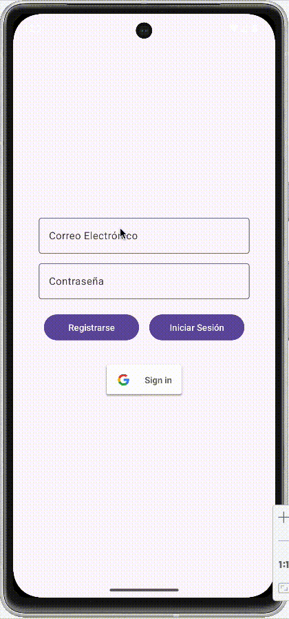
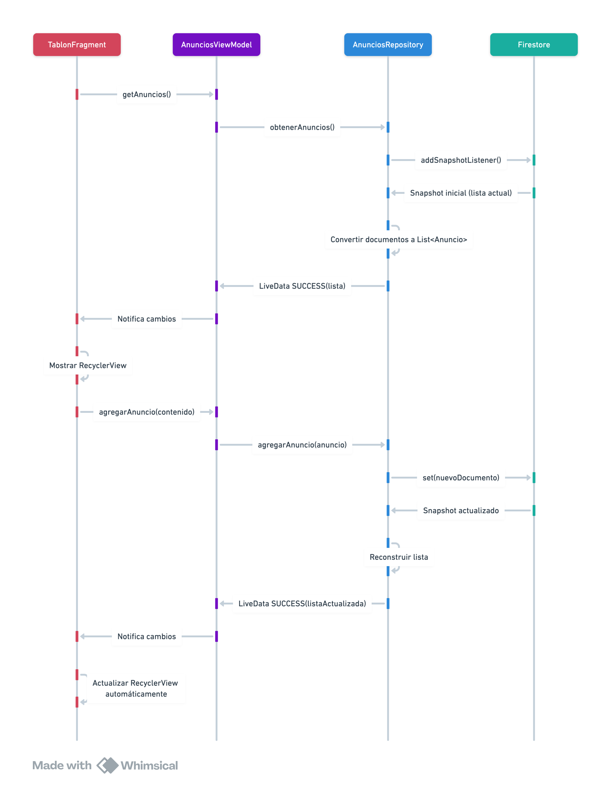

<div class="justify-text">


En este ejemplo, implementaremos un **Tablón de Anuncios**. Partiremos de la aplicación anterior en la que contamos con `LoginActivity` que se encarga de gestionar el registro del usuario. En `MainActivity` cargaremos `TablonFragment`, que permite insertar anuncios y consultar los últimos publicados. Además, el usuario propietario de un anuncio podrá eliminarlo si deliza el elemento a derecha o izquierda.

En el siguiente GIF podéis observar la lectura en tiempo real desde dos dispositivos:



**Estructura del proyecto:**  
1. **`LoginActivity`** → Maneja el inicio de sesión con Firebase Authentication.  
2. **`MainActivity`** → Contiene el `TablonFragment`, donde se muestran los anuncios.  
3. **`TablonFragment`** → Muestra los anuncios en un `RecyclerView` y permite agregar nuevos anuncios.  
4. **`AnuncioViewModel`** → Gestiona los datos entre la UI y Firestore.  
5. **`AnuncioRepository`** → Se encarga de la conexión con Firestore.  

**Diagrama de secuencia** que ilustra el flujo de llamadas entre las clases para recuperar y mostrar los anuncios en la aplicación:



---

## 1. Configurar las dependencias del proyecto
Revisa el apartado `Configuración de Firestore` y añade las dependencias necesarias para utilizar Firebase Authentication y Firestore.

## 2. Implementar `LoginActivity`
El usuario debe autenticarse antes de acceder al tablón de anuncios. Implementa el ejemplo práctico que estudiamos en la sección `Firebase Authentication`.


## 3. Implementar `MainActivity`
Esta `Activity` contiene el **`FragmentContainerView`** donde se cargará `TablonFragment` y se mostrarán los anuncios.

### 3.1. Layout 
```xml title="activity_main.xml"
<?xml version="1.0" encoding="utf-8"?>
<androidx.coordinatorlayout.widget.CoordinatorLayout
    xmlns:android="http://schemas.android.com/apk/res/android"
    xmlns:app="http://schemas.android.com/apk/res-auto"
    xmlns:tools="http://schemas.android.com/tools"
    android:layout_width="match_parent"
    android:layout_height="match_parent"
    tools:context=".MainActivity">

    <!-- AppBar superior -->
    <com.google.android.material.appbar.AppBarLayout
        android:id="@+id/appbar"
        android:layout_width="match_parent"
        android:layout_height="wrap_content"
        android:theme="@style/ThemeOverlay.Material3.Dark.ActionBar">

        <com.google.android.material.appbar.MaterialToolbar
            android:id="@+id/toolbar"
            android:layout_width="match_parent"
            android:layout_height="?attr/actionBarSize"
            android:background="?attr/colorPrimary"
            app:titleCentered="true"
            app:titleTextColor="@android:color/white" />
    </com.google.android.material.appbar.AppBarLayout>

    <!-- Contenedor principal de fragments -->
    <androidx.fragment.app.FragmentContainerView
        android:id="@+id/nav_host_fragment"
        android:name="androidx.navigation.fragment.NavHostFragment"
        android:layout_width="match_parent"
        android:layout_height="match_parent"
        android:layout_marginTop="?attr/actionBarSize"
        app:defaultNavHost="true"
        app:navGraph="@navigation/nav_graph" />

</androidx.coordinatorlayout.widget.CoordinatorLayout>
```

:::info RECUERDA...
Recuerda crear el grafo de navegación y añadir `TablonFragment` en él.
:::

### 3.2. Código
```java title="MainActivity.java"
public class MainActivity extends AppCompatActivity {

    private ActivityMainBinding binding;
    private NavController navController;
    private AppBarConfiguration appBarConfiguration;

    @Override
    protected void onCreate(Bundle savedInstanceState) {
        super.onCreate(savedInstanceState);
        setContentView((binding = ActivityMainBinding.inflate(getLayoutInflater())).getRoot());

        // 1. Obtenemos la referencia de la Toolbar del layout
        setSupportActionBar(binding.toolbar);

        // 2. Obtenemos el NavController desde el contenedor del grafo
        navController = ((NavHostFragment) getSupportFragmentManager().findFragmentById(R.id.nav_host_fragment)).getNavController();

        // 3. Configuramos la AppBar para que el título y el botón de navegación
        // se actualicen automáticamente al navegar entre fragments
        appBarConfiguration = new AppBarConfiguration.Builder(navController.getGraph()).build();
        NavigationUI.setupActionBarWithNavController(this, navController, appBarConfiguration);
    }

    @Override
    public boolean onSupportNavigateUp() {
        return NavigationUI.navigateUp(navController, appBarConfiguration)
                || super.onSupportNavigateUp();
    }
}
```

---

## 4. Implementar el modelo de datos
Se trata de la clase Java que representa la información que se almacena en cada documento de tu colección:
```java title="model/Anuncio.java"
public class Anuncio {

    private String id;
    private String contenido;
    private long fecha;
    private String uidAutor;
    private String emailAutor;

    // Constructor vacío requerido por Firestore
    public Anuncio() {}

    public Anuncio(String contenido, long fecha, String uidAutor, String emailAutor) {
        this.contenido = contenido;
        this.fecha = fecha;
        this.uidAutor = uidAutor;
        this.emailAutor = emailAutor;
    }

    // Getter y setters
}
```
:::warning CUIDADO
Al igual que sucede con MongoDB, nuestro modelo debe tener el **contructor por defecto y getters y setters de todos los atributos**. A parte, podrás añadir todos los constructores parametrizados que necesites.
:::

---

## 5. Implementar el acceso a datos

### 5.1. Clase Resource (gestión de estados)

Igual que hicimos con Retrofit, creamos una clase para representar el estado de la petición:

```java title="Resource.java"
public class Resource<T> {

    public enum Status { LOADING, SUCCESS, ERROR }

    public final Status status;
    public final T data;
    public final String message;

    private Resource(Status status, T data, String message) {
        this.status = status;
        this.data = data;
        this.message = message;
    }

    public static <T> Resource<T> loading() {
        return new Resource<>(Status.LOADING, null, null);
    }

    public static <T> Resource<T> success(T data) {
        return new Resource<>(Status.SUCCESS, data, null);
    }

    public static <T> Resource<T> error(String message) {
        return new Resource<>(Status.ERROR, null, message);
    }
}
```

---

### 5.2. Código de AnunciosRepository

En esta clase implementamos el **Repository**, cuya función dentro de la arquitectura MVVM es actuar como intermediario entre el ViewModel y Firestore.

En el constructor inicializamos la instancia de `FirebaseFirestore` y obtenemos la referencia a la colección `anuncios`. A partir de ahí, todas las operaciones (consultar, insertar y eliminar) se realizan sobre esa colección.

El método más importante es `obtenerAnuncios()`. En lugar de hacer una petición puntual, utilizamos `addSnapshotListener()`, que establece una **suscripción en tiempo real**. Esto significa que:

* Firestore envía inicialmente el estado actual de la colección.
* Cada vez que se añade, modifica o elimina un documento, el listener se ejecuta automáticamente.
* No es necesario volver a llamar al método tras insertar o borrar datos.

Cada vez que el listener se activa, recibimos un `QuerySnapshot` con el estado actual completo de la consulta. Recorremos sus documentos, los convertimos a objetos `Anuncio` mediante `toObject()` y enviamos la lista resultante al `LiveData` usando `Resource.success(lista)`. Si ocurre un error, enviamos `Resource.error(...)`, y antes de iniciar la escucha notificamos `Resource.loading()` para que la interfaz pueda mostrar un indicador de carga.

El listener se crea solo una vez (comprobando que sea `null`) para evitar múltiples suscripciones. Además, el método `stopListening()` permite eliminar la suscripción cuando el ViewModel se destruye.

Por último, los métodos `agregarAnuncio()` y `eliminarAnuncio()` insertan o eliminan documentos en Firestore. No es necesario actualizar manualmente la lista después, ya que el listener detectará automáticamente los cambios y notificará a la interfaz.

```java title="repository/AnunciosRepository.java"
public class AnunciosRepository {

    // Instancia de Firestore para acceder a la base de datos de anuncios
    private FirebaseFirestore db;

    // Referencia a la colección de anuncios
    private CollectionReference coleccionAnuncios;

    // Colección de anuncios cacheada
    private final MutableLiveData<Resource<List<Anuncio>>> anunciosLiveData = new MutableLiveData<>();

    // Referencia al listener en tiempo real
    private ListenerRegistration listener;

    public AnunciosRepository() {
        // Inicialización de los atributos de clase
        db = FirebaseFirestore.getInstance();
        // Obtenemos la colección "anuncios"
        coleccionAnuncios = db.collection("anuncios");
    }

    /**
     * Devuelve un LiveData con los anuncios en tiempo real.
     * Solo se crea el listener una vez.
     */
    public LiveData<Resource<List<Anuncio>>> obtenerAnuncios() {
        // Si el listener todavía no ha sido creado, lo creamos
        if (listener == null) {

            // Indicamos a la UI que estamos cargando datos
            anunciosLiveData.setValue(Resource.loading());

            // Solicitamos la consulta de anuncios ordenada por fecha descendente
            listener = coleccionAnuncios
                    .orderBy("fecha", Query.Direction.DESCENDING)
                    .addSnapshotListener((querySnapshot, e) -> {

                        // Si ocurre un error, notificamos a la UI
                        if (e != null) {
                            anunciosLiveData.setValue(
                                    Resource.error("Error al obtener anuncios")
                            );
                            return;
                        }

                        // Si la consulta devuelve datos
                        if (querySnapshot != null) {
                            List<Anuncio> lista = new ArrayList<>();

                            // Recorremos todos los documentos del snapshot
                            for (DocumentSnapshot doc : querySnapshot) {
                                // Convertimos cada documento en un objeto Anuncio y lo añadimos a la lista
                                Anuncio anuncio = doc.toObject(Anuncio.class);
                                if (anuncio != null) {
                                    lista.add(anuncio);
                                }
                            }

                            // Enviamos los datos actualizados a la UI
                            anunciosLiveData.setValue(
                                    Resource.success(lista)
                            );
                        }
                    });
        }

        // Devolvemos el LiveData que será observado desde el ViewModel / Fragment
        return anunciosLiveData;
    }

    // Detiene la escucha en tiempo real
    // Se suele llamar cuando el ViewModel se destruye
    public void stopListening() {
        if (listener != null) {
            listener.remove(); // Elimina la suscripción
            listener = null;
        }
    }

    public void agregarAnuncio(Anuncio anuncio) {
        // Generamos un ID único para el documento
        String idGenerado = coleccionAnuncios.document().getId();
        // Asignamos ese ID al objeto antes de guardarlo
        anuncio.setId(idGenerado);

        // Guardamos el anuncio en la base de datos
        coleccionAnuncios.document(idGenerado).set(anuncio);

        // OJO: No necesitamos actualizar la lista manualmente:
        // el listener detectará el cambio automáticamente.
    }

    public void eliminarAnuncio(Anuncio anuncio) {
        // Eliminamos el documento cuyo ID coincide con el anuncio recibido
        coleccionAnuncios.document(anuncio.getId()).delete();
    }

}
```

---

### 5.3. Código de AnunciosViewModel
El ViewModel contiene una instancia de `AnunciosRepository` e invoca sus métodos, actuando así de intermediario entre la vista y la fuente de datos.

```java title="viewmodel/AnunciosViewModel.java"
public class AnunciosViewModel extends AndroidViewModel {

    private final AnunciosRepository anunciosRepository;
    private final LiveData<Resource<List<Anuncio>>> anuncios;

    // Referencia al repository de Authentication
    private AuthRepository authRepository;

    public AnunciosViewModel(@NonNull Application application) {
        super(application);
        anunciosRepository = new AnunciosRepository();
        authRepository = new AuthRepository();

        // Recuperamos todos los anuncios al inicio al ser consultas en tiempo real
        anuncios = anunciosRepository.obtenerAnuncios();
    }

    public LiveData<Resource<List<Anuncio>>> getAnuncios() {
        return anuncios;
    }

    public void agregarAnuncio(String contenido) {

        FirebaseUser user = authRepository.getCurrentUser();

        Anuncio anuncio = new Anuncio(
                contenido,
                System.currentTimeMillis(),
                user.getUid(),
                user.getEmail()
        );

        anunciosRepository.agregarAnuncio(anuncio);
    }

    public void eliminarAnuncio(Anuncio anuncio) {
        anunciosRepository.eliminarAnuncio(anuncio);
    }

    @Override
    protected void onCleared() {
        super.onCleared();
        anunciosRepository.stopListening();
    }
}
```

---

## 6. Implementar `TablonFragment`
### 6.1. Layout
En el layout vamos a contar con un EditText para escribir el contenido del anuncio, un botón para guardarlo y el RecyclerView que muestre todos los anuncios.

También tendremos un ProgressBar, que marca el estado de carga y un TextView para mostrar un mensaje de error en caso de que no se carguen los anuncios.

```xml title="fragment_tablon.xml"
<?xml version="1.0" encoding="utf-8"?>
<LinearLayout xmlns:android="http://schemas.android.com/apk/res/android"
    xmlns:app="http://schemas.android.com/apk/res-auto"
    android:layout_width="match_parent"
    android:layout_height="match_parent"
    android:orientation="vertical"
    android:padding="16dp">

    <EditText
        android:id="@+id/etAnuncio"
        android:layout_width="match_parent"
        android:layout_height="wrap_content"
        android:hint="Escribe un anuncio..." />

    <Button
        android:id="@+id/btnPublicar"
        android:layout_width="match_parent"
        android:layout_height="wrap_content"
        android:text="Publicar" />

    <!-- Estado: cargando -->
    <ProgressBar
        android:id="@+id/progressBar"
        style="?android:attr/progressBarStyleLarge"
        android:layout_width="wrap_content"
        android:layout_height="wrap_content"
        android:layout_gravity="center"
        android:layout_marginTop="12dp"
        android:visibility="gone" />

    <!-- Estado: error -->
    <TextView
        android:id="@+id/tvError"
        android:layout_width="match_parent"
        android:layout_height="wrap_content"
        android:layout_marginTop="12dp"
        android:gravity="center"
        android:text="Ha ocurrido un error al cargar los anuncios"
        android:textAppearance="?attr/textAppearanceBodyMedium"
        android:textColor="@android:color/holo_red_dark"
        android:visibility="gone" />

    <!-- Estado: success -->
    <androidx.recyclerview.widget.RecyclerView
        android:id="@+id/recyclerAnuncios"
        app:layoutManager="androidx.recyclerview.widget.LinearLayoutManager"
        android:layout_width="match_parent"
        android:layout_height="0dp"
        android:layout_weight="1" />

</LinearLayout>
```

---

### 6.2. Layout de los ViewHolder
Este contendrá la información que se muestra de cada Anuncio en el RecyclerView.

```xml title="viewholder_anuncio.xml"
<?xml version="1.0" encoding="utf-8"?>
<androidx.cardview.widget.CardView xmlns:android="http://schemas.android.com/apk/res/android"
    xmlns:app="http://schemas.android.com/apk/res-auto"
    android:layout_width="match_parent"
    android:layout_height="wrap_content"
    android:layout_margin="8dp"
    app:cardCornerRadius="8dp"
    app:cardElevation="4dp">

    <LinearLayout
        android:layout_width="match_parent"
        android:layout_height="wrap_content"
        android:orientation="vertical"
        android:padding="16dp">

        <!-- Contenido del anuncio -->
        <TextView
            android:id="@+id/tvContenido"
            android:layout_width="wrap_content"
            android:layout_height="wrap_content"
            android:text="Contenido"
            android:textStyle="bold"
            android:textSize="16sp"
            android:textColor="@android:color/black" />

        <!-- Fecha del anuncio -->
        <TextView
            android:id="@+id/tvFecha"
            android:layout_width="wrap_content"
            android:layout_height="wrap_content"
            android:text="Fecha"
            android:textSize="14sp"
            android:textColor="@android:color/darker_gray"
            android:layout_marginTop="4dp" />

        <!-- Nombre del usuario -->
        <TextView
            android:id="@+id/tvUsuario"
            android:layout_width="wrap_content"
            android:layout_height="wrap_content"
            android:text="Usuario"
            android:textSize="14sp"
            android:textColor="@android:color/darker_gray"
            android:layout_marginTop="4dp"  />

    </LinearLayout>
</androidx.cardview.widget.CardView>
```

---

### 6.3. Código de `AnuncioAdapter`

El código del Adaptador y ViewHolder puede quedar así:

```java title="recyclerview/AnuncioAdapter"
public class AnuncioAdapter extends RecyclerView.Adapter<AnuncioAdapter.AnuncioViewHolder> {

    // Lista de anuncios que se muestra en el RecyclerView
    private List<Anuncio> anunciosList;

    @NonNull
    @Override
    public AnuncioViewHolder onCreateViewHolder(@NonNull ViewGroup parent, int viewType) {
        LayoutInflater inflater = LayoutInflater.from(parent.getContext());
        return new AnuncioViewHolder(ViewholderAnuncioBinding.inflate(inflater, parent, false));
    }

    @Override
    public void onBindViewHolder(@NonNull AnuncioViewHolder holder, int position) {
        Anuncio anuncio = anunciosList.get(position);
        holder.binding.tvContenido.setText(anuncio.getContenido());
        holder.binding.tvUsuario.setText("Usuario: " + anuncio.getEmailAutor());
        holder.binding.tvFecha.setText("Fecha: " + formatearFecha(anuncio.getFecha()));
    }

    @Override
    public int getItemCount() {
        return anunciosList != null ? anunciosList.size() : 0;
    }

    public void setAnunciosList(List<Anuncio> anunciosList) {
        this.anunciosList = anunciosList;
        notifyDataSetChanged();
    }

    // Devuelve el anuncio que esté en la posición pasada por parámetro
    // Lo utilizamos para saber qué anuncio eliminar con el gesto de desplazar
    public Anuncio obtenerAnuncio(int posicion) {
        return this.anunciosList.get(posicion);
    }

    // Elimina el anuncio que esté en la posición pasada por parámetro
    // Lo utilizamos para eliminar el anuncio de la lista
    public void eliminarAnuncio(int posicion) {
        this.anunciosList.remove(posicion);
        notifyItemRemoved(posicion);
    }

    // Retorna el timestamp en una fecha con el formato legible
    private String formatearFecha(long timestamp) {
        Date date = new Date(timestamp);
        SimpleDateFormat sdf = new SimpleDateFormat("dd/MM/yyyy HH:mm", Locale.getDefault());
        return sdf.format(date);
    }

    static class AnuncioViewHolder extends RecyclerView.ViewHolder {
        private final ViewholderAnuncioBinding binding;

        // Constructor: Asigna la vista inflada al ViewHolder
        public AnuncioViewHolder(@NonNull ViewholderAnuncioBinding binding) {
            super(binding.getRoot());
            this.binding = binding;
        }
    }
}
```

### 6.4. Código de `TablonFragment`
En la inicialización del Fragmento, invocaremos el método del ViewModel que devuelve todos los anuncios, estableciendo un observador para él. Cada vez que reciba un cambio, actualizaremos la lista del RecyclerView.

Además, se añadirá la lógica necesaria para insertar un nuevo anuncio cuando se pulse el botón y eliminar un anuncio al deslizarlo a derecha o izquierda. Se incluirá la comprobación necesaria para asegurar que solo el usuario propietario puede eliminar su anuncio.

```java
public class TablonFragment extends Fragment {

    private FragmentTablonBinding binding;
    private AnunciosViewModel anunciosViewModel;
    private AuthViewModel authViewModel;
    private AnuncioAdapter adapter;

    @Override
    public View onCreateView(LayoutInflater inflater, ViewGroup container,
                             Bundle savedInstanceState) {
        // Inflate the layout for this fragment
        return (binding = FragmentTablonBinding.inflate(inflater, container, false)).getRoot();
    }

    @Override
    public void onViewCreated(@NonNull View view, @Nullable Bundle savedInstanceState) {
        super.onViewCreated(view, savedInstanceState);

        adapter = new AnuncioAdapter();
        binding.recyclerAnuncios.setAdapter(adapter);

        anunciosViewModel = new ViewModelProvider(requireActivity()).get(AnunciosViewModel.class);
        authViewModel = new ViewModelProvider(requireActivity()).get(AuthViewModel.class);

        binding.btnPublicar.setOnClickListener(v -> publicarAnuncio());

        inicializarObservadorAnuncios();
        inicializarGestoEliminar();
    }

    private void inicializarObservadorAnuncios() {
        // Recuperamos los anuncios
        anunciosViewModel.getAnuncios()
                .observe(getViewLifecycleOwner(), resource -> {

                    switch (resource.status) {

                        case LOADING:
                            binding.progressBar.setVisibility(View.VISIBLE);
                            binding.recyclerAnuncios.setVisibility(View.GONE);
                            binding.tvError.setVisibility(View.GONE);
                            break;

                        case SUCCESS:
                            binding.progressBar.setVisibility(View.GONE);
                            binding.recyclerAnuncios.setVisibility(View.VISIBLE);
                            binding.tvError.setVisibility(View.GONE);

                            adapter.setAnunciosList(resource.data);
                            break;

                        case ERROR:
                            binding.progressBar.setVisibility(View.GONE);
                            binding.recyclerAnuncios.setVisibility(View.GONE);
                            binding.tvError.setVisibility(View.VISIBLE);
                            binding.tvError.setText(resource.message);
                            break;
                    }
                });

    }

    private void inicializarGestoEliminar() {
        // Gesto para eliminar anuncio
        ItemTouchHelper itemTouchHelper = new ItemTouchHelper(new ItemTouchHelper.SimpleCallback(
                ItemTouchHelper.UP | ItemTouchHelper.DOWN,
                ItemTouchHelper.RIGHT | ItemTouchHelper.LEFT) {
            @Override
            public boolean onMove(@NonNull RecyclerView recyclerView, @NonNull RecyclerView.ViewHolder viewHolder, @NonNull RecyclerView.ViewHolder target) {
                return false;
            }

            @Override
            public void onSwiped(@NonNull RecyclerView.ViewHolder viewHolder, int direction) {
                // Recuperamos el anuncio seleccionado
                int posicion = viewHolder.getBindingAdapterPosition();

                if (posicion != RecyclerView.NO_POSITION) {
                    Anuncio anuncio = adapter.obtenerAnuncio(posicion);

                    // Recuperamos el uid del usuario conectado para evitar
                    // que los usuarios eliminen anuncios de los que no son propietarios
                    String uidUsuarioActual = authViewModel.getCurrentUser().getUid();
                    if (anuncio.getUidAutor().equalsIgnoreCase(uidUsuarioActual)) {
                        mostrarDialogoAvisoEliminado(anuncio, posicion);
                    } else {
                        Toast.makeText(requireContext(), "No eres el propietario del anuncio", Toast.LENGTH_SHORT).show();
                        // Restaurar el elemento si el usuario no es el propietario
                        adapter.notifyItemChanged(posicion);
                    }
                }

            }
        });
        itemTouchHelper.attachToRecyclerView(binding.recyclerAnuncios);
    }

    private void mostrarDialogoAvisoEliminado(Anuncio anuncio, int posicion) {
        new AlertDialog.Builder(requireContext())
                .setTitle("Eliminar Anuncio")
                .setMessage("¿Estás seguro de que deseas eliminar este anuncio?")
                .setPositiveButton("Eliminar", (dialog, which) -> {
                    // Eliminamos el anuncio de la BBDD
                    anunciosViewModel.eliminarAnuncio(anuncio);
                    // Eliminamos el anuncio directamente de la lista, así evitamos repetir consulta a la BBDD
                    //adapter.eliminarAnuncio(posicion);
                    Toast.makeText(requireContext(), "Anuncio eliminado", Toast.LENGTH_SHORT).show();
                })
                .setNegativeButton("Cancelar", (dialog, which) -> {
                    // Restaurar el elemento si se cancela
                    adapter.notifyItemChanged(posicion);
                })
                .setCancelable(false)
                .show();
    }


    private void publicarAnuncio() {
        String contenido = binding.etAnuncio.getText().toString();
        if (!contenido.isEmpty()) {
            // Llamamos al método del ViewModel para insertar el anuncio
            anunciosViewModel.agregarAnuncio(contenido);
            // Reseteamos el valor del EditText
            binding.etAnuncio.setText("");
        }
    }
}
```

</div>