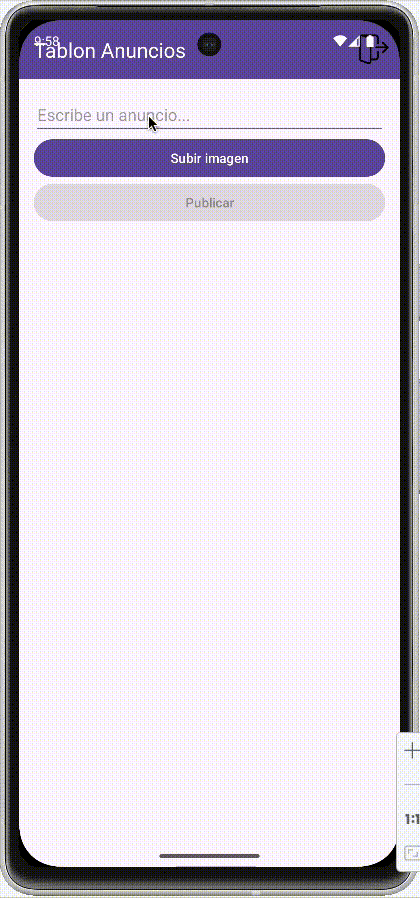
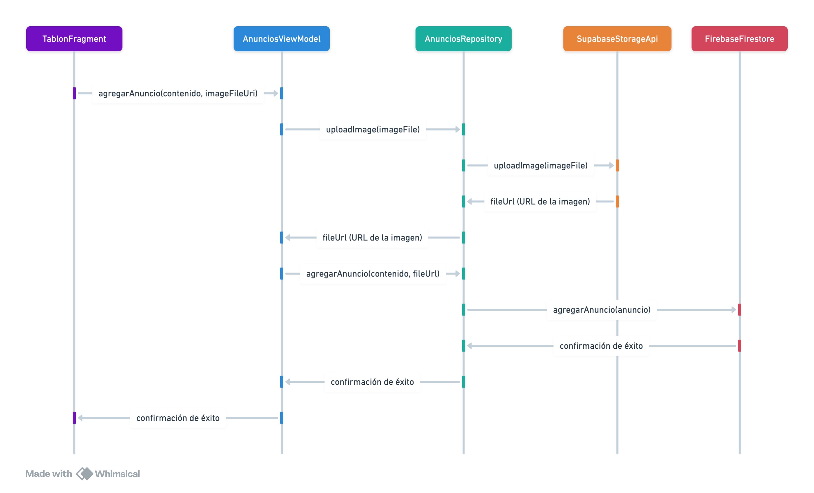

<div class="justify-text">


En este ejemplo, partimos del **Tablón de Anuncios** implementado con Firestore, pero añadiremos la capacidad de adjuntar imágenes a los anuncios utilizando **Supabase Storage**. 

En `TablonFragment` hemos añadido un botón para seleccionar la imagen. El botón de Publicar permanecerá deshabilitado hasta que el usuario seleccione una imagen.



**Estructura del proyecto:**  
1. **`LoginActivity`** → Maneja el inicio de sesión con Firebase Authentication.  
2. **`MainActivity`** → Contiene el `TablonFragment`.  
3. **`TablonFragment`** → Permite redactar el anuncio, seleccionar una imagen y publicarlo.  
4. **`AnunciosViewModel`** → Gestiona la lógica de negocio y la coordinación entre la subida a Supabase y el guardado en Firestore.  
5. **`AnunciosRepository`** → Se encarga de la comunicación con Firestore y con la API de Supabase Storage.
6. **`SupabaseClient`** → Configuración de Retrofit para Supabase.
7. **`SupabaseStorageApi`** → Interfaz de Retrofit para las peticiones a la API de Storage.

**Diagrama de secuencia** que ilustra el flujo de llamadas para publicar un anuncio con imagen:



---

## 1. Configurar las dependencias del proyecto
Asegúrate de haber añadido las dependencias de Retrofit y seguir los pasos del apartado [Configuración Inicial de Supabase](2-configuracion-inicial.md).

---

## 2. Modificar los Layouts
### 2.1. Layout de `TablonFragment`
Añadimos el botón `btnSubirImagen`, manteniendo el resto de componentes para gestionar los estados visuales.

```xml title="fragment_tablon.xml"
<?xml version="1.0" encoding="utf-8"?>
<LinearLayout xmlns:android="http://schemas.android.com/apk/res/android"
    xmlns:app="http://schemas.android.com/apk/res-auto"
    android:layout_width="match_parent"
    android:layout_height="match_parent"
    android:orientation="vertical"
    android:padding="16dp">

    <EditText
        android:id="@+id/etAnuncio"
        android:layout_width="match_parent"
        android:layout_height="wrap_content"
        android:hint="Escribe un anuncio..." />

    <!-- Botón para seleccionar imagen -->
    <Button
        android:id="@+id/btnSubirImagen"
        android:layout_width="match_parent"
        android:layout_height="wrap_content"
        android:text="Seleccionar imagen" />

    <Button
        android:id="@+id/btnPublicar"
        android:enabled="false"
        android:layout_width="match_parent"
        android:layout_height="wrap_content"
        android:text="Publicar" />

    <!-- Estado: cargando -->
    <ProgressBar
        android:id="@+id/progressBar"
        style="?android:attr/progressBarStyleLarge"
        android:layout_width="wrap_content"
        android:layout_height="wrap_content"
        android:layout_gravity="center"
        android:layout_marginTop="12dp"
        android:visibility="gone" />

    <!-- Estado: error -->
    <TextView
        android:id="@+id/tvError"
        android:layout_width="match_parent"
        android:layout_height="wrap_content"
        android:layout_marginTop="12dp"
        android:gravity="center"
        android:text="Ha ocurrido un error al cargar los anuncios"
        android:textAppearance="?attr/textAppearanceBodyMedium"
        android:textColor="@android:color/holo_red_dark"
        android:visibility="gone" />

    <!-- Estado: success -->
    <androidx.recyclerview.widget.RecyclerView
        android:id="@+id/recyclerAnuncios"
        app:layoutManager="androidx.recyclerview.widget.LinearLayoutManager"
        android:layout_width="match_parent"
        android:layout_height="0dp"
        android:layout_weight="1" />

</LinearLayout>
```

### 2.2. Layout de `AnuncioViewHolder`
Modificamos el ViewHolder para incluir un `ImageView` donde mostraremos la imagen del anuncio (puedes usar librerías como Glide o Picasso para cargar la URL).

```xml title="viewholder_anuncio.xml"
<?xml version="1.0" encoding="utf-8"?>
<androidx.cardview.widget.CardView xmlns:android="http://schemas.android.com/apk/res/android"
    xmlns:app="http://schemas.android.com/apk/res-auto"
    android:layout_width="match_parent"
    android:layout_height="wrap_content"
    android:layout_margin="8dp"
    app:cardCornerRadius="8dp"
    app:cardElevation="4dp">

    <LinearLayout
        android:layout_width="match_parent"
        android:layout_height="wrap_content"
        android:orientation="horizontal"
        android:padding="16dp">

        <!-- Imagen del anuncio -->
        <ImageView
            android:id="@+id/ivImagenNoticia"
            android:layout_width="80dp"
            android:layout_height="80dp"
            android:scaleType="centerCrop"
            android:src="@drawable/ic_launcher_background"
            android:layout_marginEnd="12dp"
            android:contentDescription="Imagen de la noticia" />

        <!-- Contenedor del contenido de la noticia -->
        <LinearLayout
            android:layout_width="0dp"
            android:layout_height="wrap_content"
            android:orientation="vertical"
            android:layout_weight="1">

            <!-- Contenido del anuncio -->
            <TextView
                android:id="@+id/tvContenido"
                android:layout_width="wrap_content"
                android:layout_height="wrap_content"
                android:text="Contenido"
                android:textStyle="bold"
                android:textSize="16sp"
                android:textColor="@android:color/black" />

            <!-- Fecha del anuncio -->
            <TextView
                android:id="@+id/tvFecha"
                android:layout_width="wrap_content"
                android:layout_height="wrap_content"
                android:text="Fecha"
                android:textSize="14sp"
                android:textColor="@android:color/darker_gray"
                android:layout_marginTop="4dp" />

            <!-- Nombre del usuario -->
            <TextView
                android:id="@+id/tvUsuario"
                android:layout_width="wrap_content"
                android:layout_height="wrap_content"
                android:text="Usuario"
                android:textSize="14sp"
                android:textColor="@android:color/darker_gray"
                android:layout_marginTop="4dp" />

        </LinearLayout>
    </LinearLayout>
</androidx.cardview.widget.CardView>
```

---

## 3. Modificar el modelo de datos
Añadimos el atributo `urlImagen` para almacenar la dirección pública del archivo en Supabase.

```java title="model/Anuncio.java"
public class Anuncio {
    private String id;
    private String contenido;
    private long fecha;
    private String emailAutor;
    private String urlImagen; // URL de Supabase Storage

    public Anuncio() {} // Requerido por Firestore

    public Anuncio(String contenido, long fecha, String emailAutor, String urlImagen) {
        this.contenido = contenido;
        this.fecha = fecha;
        this.emailAutor = emailAutor;
        this.urlImagen = urlImagen;
    }

    // Getters y setters
}
```

---

## 4. Gestión de estados de la API

### 4.1. Clase Resource
Al igual que en Firestore, utilizamos esta clase genérica para que el repositorio notifique al ViewModel (y este a la Vista) sobre el estado de la operación. 

:::tip 
Puedes utilizar la misma clase que ya tenías, no hace falta crearla otra vez.
:::

```java title="Resource.java"
public class Resource<T> {
    public enum Status { LOADING, SUCCESS, ERROR }
    public final Status status;
    public final T data;
    public final String message;

    private Resource(Status status, T data, String message) {
        this.status = status;
        this.data = data;
        this.message = message;
    }

    public static <T> Resource<T> loading() { return new Resource<>(Status.LOADING, null, null); }
    public static <T> Resource<T> success(T data) { return new Resource<>(Status.SUCCESS, data, null); }
    public static <T> Resource<T> error(String message) { return new Resource<>(Status.ERROR, null, message); }
}
```

---

## 5. Implementar el acceso a datos

### 5.1. Cliente de Retrofit e Interceptor
Definimos la conexión y la interfaz para subir archivos. En el cliente de Retrofit, utilizamos un **Interceptor** para añadir automáticamente el token de autorización a todas las peticiones.

#### 🔹 ¿Qué es un Interceptor?
Un **Interceptor** es un componente de la librería OkHttp que permite "interceptar" las peticiones HTTP antes de que se envíen al servidor. Es muy útil para tareas transversales como **añadir cabeceras de autenticación**, registrar logs o gestionar reintentos, evitando tener que repetir ese código en cada llamada a la API.

#### 🔹 Implementación del Interceptor
Creamos una clase específica que implemente la interfaz `Interceptor` para gestionar la seguridad de nuestras peticiones.

```java title="supabase/SupabaseAuthInterceptor.java"
public class SupabaseAuthInterceptor implements Interceptor {
    private String apiKey;

    public SupabaseAuthInterceptor(String apiKey) {
        this.apiKey = apiKey;
    }

    @Override
    public Response intercept(Chain chain) throws IOException {
        Request original = chain.request();
        // Construimos la nueva petición añadiendo el Header Authorization
        Request request = original.newBuilder()
                .header("Authorization", "Bearer " + apiKey)
                .method(original.method(), original.body())
                .build();
        return chain.proceed(request);
    }
}
```

#### 🔹 Cliente de Supabase (`SupabaseClient`)
La clase **SupabaseClient** actúa como un **Singleton** encargado de centralizar la configuración de **Retrofit**. Su función principal es instanciar y devolver un único cliente HTTP (`OkHttpClient`) configurado con nuestro interceptor de autenticación, asegurando que todas las peticiones a la API de Supabase utilicen la URL base correcta y las cabeceras de seguridad necesarias.

```java title="supabase/SupabaseClient.java"
public class SupabaseClient {
    private static Retrofit retrofit = null;
    private static final String BASE_URL = "https://<TU_PROYECTO>.supabase.co/";
    private static final String API_KEY = "<TU_API_KEY>";

    public static Retrofit getClient() {
        if (retrofit == null) {
            // Configuramos OkHttpClient con nuestro interceptor personalizado
            OkHttpClient client = new OkHttpClient.Builder()
                    .addInterceptor(new SupabaseAuthInterceptor(API_KEY))
                    .build();

            retrofit = new Retrofit.Builder()
                    .baseUrl(BASE_URL)
                    .client(client)
                    .addConverterFactory(GsonConverterFactory.create())
                    .build();
        }
        return retrofit;
    }
}
```

#### 🔹 Definición de los Endpoints (`SupabaseStorageApi`)
Esta interfaz define las operaciones disponibles en la API de Supabase Storage mediante anotaciones de Retrofit. 

En este caso, el método `uploadImage` nos permite enviar un archivo (como un `MultipartBody.Part`) a un bucket específico mediante una petición **POST**, abstrayendo toda la complejidad técnica de la comunicación HTTP.

```java title="supabase/SupabaseStorageApi.java"
public interface SupabaseStorageApi {
    @Multipart
    @POST("storage/v1/object/{bucket}/{fileName}")
    Call<Void> uploadImage(
            @Path("bucket") String bucket,
            @Path("fileName") String fileName,
            @Part MultipartBody.Part file
    );
}
```

### 5.2. Código de AnunciosRepository
Recuerda que el Repository debe actuar como **intermediario entre el ViewModel y las fuentes de datos**, por ello, añadimos en él el código necesario para subir una imagen.

El método **`uploadImage`** es el encargado de gestionar la subida de archivos a Supabase. Para ello, realiza los siguientes pasos:
1.  **Conversión a Multipart**: Transforma el objeto `File` en un `MultipartBody.Part`, que es el formato estándar para enviar archivos binarios en peticiones HTTP.
2.  **Llamada Asíncrona**: Utiliza `storageApi.uploadImage` enviando el nombre del bucket ("anuncios") y el archivo. La operación se ejecuta en segundo plano mediante `call.enqueue`.
3.  **Gestión del Resultado**: Al recibir la respuesta, actualiza un `MutableLiveData<Resource<String>>`. Si la subida tiene éxito, construye la URL pública del archivo para que el ViewModel pueda guardarla posteriormente en Firestore.

```java title="repository/AnunciosRepository.java"
public class AnunciosRepository {

    // Instancia de Firestore para acceder a la base de datos de anuncios
    private FirebaseFirestore db;

    // highlight-start
    // Instancia de Supabase Storage para almacenar imágenes
    private SupabaseStorageApi storageApi;
    // highlight-end

    // Referencia a la colección de anuncios
    private CollectionReference coleccionAnuncios;

    // Colección de anuncios cacheada
    private final MutableLiveData<Resource<List<Anuncio>>> anunciosLiveData = new MutableLiveData<>();

    // Referencia al listener en tiempo real
    private ListenerRegistration listener;

    public AnunciosRepository() {
        // Inicialización de los atributos de clase
        db = FirebaseFirestore.getInstance();
        // Obtenemos la colección "anuncios"
        coleccionAnuncios = db.collection("anuncios");
        // highlight-start
        // No necesitamos pasar la API_KEY aquí, el Interceptor se encarga
        storageApi = SupabaseClient.getClient().create(SupabaseStorageApi.class);
        // highlight-end
    }

    // highlight-start
    // Método para subir una imagen a Supabase Storage
    public LiveData<Resource<String>> uploadImage(File imageFile) {
        MutableLiveData<Resource<String>> result = new MutableLiveData<>();
        // Anunciamos que está cargando
        result.setValue(Resource.loading());

        // Creamos el cuerpo de la petición con la imagen a enviar
        RequestBody requestFile = RequestBody.create(MediaType.parse("image/*"), imageFile);
        MultipartBody.Part body = MultipartBody.Part.createFormData("file", imageFile.getName(), requestFile);

        // Llamada a la API de Supabase
        // Param 1: nombre de tu bucket
        // Param 2: nombre con el que se creará el fichero en Supabase
        // Param 3: cuerpo de la petición (imagen)
        Call<Void> call = storageApi.uploadImage("anuncios", imageFile.getName(), body);

        // Ejecutamos la petición en segundo plano
        call.enqueue(new Callback<Void>() {
            @Override
            public void onResponse(Call<Void> call, Response<Void> response) {
                if (response.isSuccessful()) {
                    // Si todo va bien, recuperamos la URL pública de la imagen en Supabase
                    // Esta URL será la que guardemos en nuestra base de datos
                    String fileUrl = response.raw().request().url().toString();
                    result.postValue(Resource.success(fileUrl));
                } else {
                    result.postValue(Resource.error("Error al subir a Supabase: " + response.code()));
                }
            }

            @Override
            public void onFailure(Call<Void> call, Throwable t) {
                result.postValue(Resource.error(t.getMessage()));
            }
        });
        return result;
    }
    // highlight-end

    // highlight-start
    // Código ligeramente modificado para que también devuelva el estado
    // de forma que se pueda informar al usuario
    public LiveData<Resource<Boolean>> agregarAnuncio(Anuncio anuncio) {
        MutableLiveData<Resource<Boolean>> result = new MutableLiveData<>();
        // Anunciamos que estamos guardando
        result.setValue(Resource.loading());

        String idGenerado = coleccionAnuncios.document().getId();
        anuncio.setId(idGenerado);

        // Guardamos el anuncio en la base de datos y recogemos el estado
        coleccionAnuncios.document(idGenerado).set(anuncio)
                .addOnSuccessListener(aVoid -> result.postValue(Resource.success(true)))
                .addOnFailureListener(e -> result.postValue(Resource.error(e.getMessage())));

        return result;
    }
    // highlight-end

    public LiveData<Resource<List<Anuncio>>> obtenerAnuncios() {
        // Este código no ha cambiado, se omite para resumir
    }

    public void stopListening() {
        // Este código no ha cambiado
    }

    public void eliminarAnuncio(Anuncio anuncio) {
        // Este código no ha cambiado
    }

}
```

### 5.3. Código de AnunciosViewModel

El ViewModel ofrece métodos independientes para cada operación (subida de la imagen y posterior almacenamiento del anuncio), siendo el Fragment quien coordina el flujo de trabajo.

```java title="viewmodel/AnunciosViewModel.java"
public class AnunciosViewModel extends AndroidViewModel {

    private final AnunciosRepository anunciosRepository;
    private final LiveData<Resource<List<Anuncio>>> anuncios;

    // Referencia al repository de Authentication
    private AuthRepository authRepository;

    public AnunciosViewModel(@NonNull Application application) {
        super(application);
        anunciosRepository = new AnunciosRepository();
        authRepository = new AuthRepository();

        // Recuperamos todos los anuncios al inicio al ser consultas en tiempo real
        anuncios = anunciosRepository.obtenerAnuncios();
    }

    public LiveData<Resource<List<Anuncio>>> getAnuncios() {
        return anuncios;
    }

    public void eliminarAnuncio(Anuncio anuncio) {
        anunciosRepository.eliminarAnuncio(anuncio);
    }

    // highlight-start
    // Paso 1: Subir la imagen a Supabase
    public LiveData<Resource<String>> uploadImage(Uri imageUri) {
        try {
            File file = ImageUtils.getFileFromUri(getApplication(), imageUri);
            return anunciosRepository.uploadImage(file);
        } catch (IOException e) {
            MutableLiveData<Resource<String>> errorRes = new MutableLiveData<>();
            errorRes.setValue(Resource.error("Error al procesar el archivo"));
            return errorRes;
        }
    }
    // highlight-end

    // highlight-start
    // Paso 2: Guardar el anuncio en Firestore
    // Método ya existente, modificado para que devuelva el estado de la operación
    // y que incluya la imagen
    public LiveData<Resource<Boolean>> agregarAnuncio(String contenido, String urlImagen) {
        FirebaseUser user = authRepository.getCurrentUser();

        Anuncio anuncio = new Anuncio(
                contenido,
                System.currentTimeMillis(),
                user.getUid(),
                user.getEmail(),
                urlImagen
        );
        return anunciosRepository.agregarAnuncio(anuncio);
    }
    // highlight-end

    @Override
    protected void onCleared() {
        super.onCleared();
        anunciosRepository.stopListening();
    }
}
```

:::info OBTENER EL FICHERO (FILE) A PARTIR DE LA URI
En la siguiente clase encontrarás el código para pasar de una URI a un fichero:

```java title="utils/ImageUtils.java"
public class ImageUtils {

    public static File getFileFromUri(Context context, Uri uri) throws IOException {
        InputStream inputStream = context.getContentResolver().openInputStream(uri);
        File tempFile = File.createTempFile("upload_", ".jpg", context.getCacheDir());
        tempFile.deleteOnExit();

        FileOutputStream outputStream = new FileOutputStream(tempFile);
        byte[] buffer = new byte[1024];
        int length;

        while ((length = inputStream.read(buffer)) > 0) {
            outputStream.write(buffer, 0, length);
        }

        outputStream.close();
        inputStream.close();

        return tempFile;
    }
}
```
:::

:::tip ¿Existe una forma mejor de gestionar esta secuencia?
¡Sí! En entornos profesionales, lo ideal es que el ViewModel sea el que "orqueste" todo el proceso para que la Vista solo observe un único LiveData. Esto se consigue usando el operador **`Transformations.switchMap`**, que permite encadenar procesos reactivos. 

Aunque en esta demo lo hacemos en dos pasos para que sea más fácil de entender didácticamente, el uso de `switchMap` es la práctica recomendada en arquitecturas MVVM robustas para mantener la lógica de negocio fuera de la vista.
:::


---

## 6. Implementar `TablonFragment`

En esta versión, el **`TablonFragment`** asume nuevas responsabilidades para coordinar la persistencia híbrida (Firestore + Supabase Storage). Sus funciones principales ahora incluyen:

1.  **Gestión de la Galería**: Utiliza un `ActivityResultLauncher` (`imagePickerLauncher`) para abrir la galería del dispositivo y recuperar la URI de la imagen seleccionada de forma segura.
2.  **Publicación en dos fases**: Coordina el flujo de trabajo orquestando dos llamadas sucesivas al ViewModel:
    *   **Fase 1**: Sube la imagen a **Supabase Storage**.
    *   **Fase 2**: Si la subida es exitosa, utiliza la URL devuelta para guardar el anuncio completo en **Firestore**.
3.  **Estado de la UI**: Observa los objetos `Resource` devueltos por el ViewModel para gestionar visualmente los estados de carga (`ProgressBar`), éxito y error.


```java title="TablonFragment.java"
public class TablonFragment extends Fragment {

    private FragmentTablonBinding binding;
    private AnunciosViewModel anunciosViewModel;
    private AuthViewModel authViewModel;
    private AnuncioAdapter adapter;

    // highlight-start
    // Lanzador que gestiona actividades externas
    private ActivityResultLauncher<Intent> imagePickerLauncher;
    private Uri selectedImageUri;
    // highlight-end

    @Override
    public View onCreateView(LayoutInflater inflater, ViewGroup container,
                             Bundle savedInstanceState) {
        // Inflate the layout for this fragment
        return (binding = FragmentTablonBinding.inflate(inflater, container, false)).getRoot();
    }

    @Override
    public void onViewCreated(@NonNull View view, @Nullable Bundle savedInstanceState) {
        super.onViewCreated(view, savedInstanceState);

        adapter = new AnuncioAdapter();
        binding.recyclerAnuncios.setAdapter(adapter);

        anunciosViewModel = new ViewModelProvider(requireActivity()).get(AnunciosViewModel.class);
        authViewModel = new ViewModelProvider(requireActivity()).get(AuthViewModel.class);

        binding.btnPublicar.setOnClickListener(v -> publicarAnuncio());

        inicializarObservadorAnuncios();
        inicializarGestoEliminar();

        // highlight-start
        // Indicamos al lanzador qué debe hacer cuando se haya seleccionado la imagen y hayamos vuelto al fragment
        imagePickerLauncher = registerForActivityResult(new ActivityResultContracts.StartActivityForResult(), result -> {
            // Si se ha seleccionado una imagen, la recuperamos del parámetro del método
            if (result.getResultCode() == RESULT_OK && result.getData() != null) {
                selectedImageUri = result.getData().getData();  // URI de la imagen seleccionada
                // Ponemos el botón de Publicar como habilitado
                binding.btnPublicar.setEnabled(true);
            }
        });

        binding.btnSubirImagen.setOnClickListener(v -> {
            Intent intent = new Intent(Intent.ACTION_PICK, MediaStore.Images.Media.EXTERNAL_CONTENT_URI);
            imagePickerLauncher.launch(intent);
        });
        // highlight-end
    }

    private void inicializarObservadorAnuncios() {
        // Este método no cambia
    }

    private void inicializarGestoEliminar() {
        // Este método no cambia
    }

    private void mostrarDialogoAvisoEliminado(Anuncio anuncio, int posicion) {
        // Este método no cambia
    }


    // highlight-start
    // Ahora la publicación se hace en dos fases
    // 1. Subimos la imagem
    // 2. Guardamos el anuncio (si se ha podido subir la imagen)
    private void publicarAnuncio() {
        String contenido = binding.etAnuncio.getText().toString();

        // 1. Subimos primero la imagen
        anunciosViewModel.uploadImage(selectedImageUri).observe(getViewLifecycleOwner(), uploadRes -> {
            switch (uploadRes.status) {
                case LOADING:
                    binding.progressBar.setVisibility(View.VISIBLE);
                    binding.btnPublicar.setEnabled(false);
                    break;
                case SUCCESS:
                    // 2. Si la imagen se sube con éxito, guardamos el anuncio
                    guardarDatosAnuncio(contenido, uploadRes.data);
                    break;
                case ERROR:
                    binding.progressBar.setVisibility(View.GONE);
                    binding.btnPublicar.setEnabled(true);
                    Toast.makeText(getContext(), "Error al subir imagen: " + uploadRes.message, Toast.LENGTH_LONG).show();
                    break;
            }
        });
    }

    // Método que guarda el anuncio en Firestore
    private void guardarDatosAnuncio(String contenido, String urlImagen) {
        anunciosViewModel.agregarAnuncio(contenido, urlImagen).observe(getViewLifecycleOwner(), result -> {
            switch (result.status) {
                case SUCCESS:
                    binding.progressBar.setVisibility(View.GONE);
                    Toast.makeText(getContext(), "¡Anuncio publicado con éxito!", Toast.LENGTH_SHORT).show();
                    resetForm();
                    break;
                case ERROR:
                    binding.progressBar.setVisibility(View.GONE);
                    binding.btnPublicar.setEnabled(true);
                    Toast.makeText(getContext(), "Error al guardar anuncio: " + result.message, Toast.LENGTH_LONG).show();
                    break;
            }
        });
    }

    // Método que limpia el formulario para publicar un nuevo anuncio
    private void resetForm() {
        binding.etAnuncio.setText("");
        selectedImageUri = null;
        binding.btnPublicar.setEnabled(false);
    }
    // highlight-end
}
```

---

## 7. Mostrar las imágenes en el `AnuncioAdapter`
Para visualizar la imagen en el `RecyclerView`, utilizamos la librería **Glide** (o Picasso), que se encarga de descargar la URL y mostrarla en el `ImageView` de forma eficiente.

```java title="adapter/AnuncioAdapter.java"
@Override
public void onBindViewHolder(@NonNull AnuncioViewHolder holder, int position) {
    Anuncio anuncio = anunciosList.get(position);
    holder.binding.tvContenido.setText(anuncio.getContenido());
    holder.binding.tvUsuario.setText("Usuario: " + anuncio.getEmailAutor());
    holder.binding.tvFecha.setText("Fecha: " + formatearFecha(anuncio.getFecha()));

    // highlight-start
    // Cargamos la imagen con Glide si existe
    if (anuncio.getUrlImagen() != null && !anuncio.getUrlImagen().isEmpty()) {
        Glide.with(holder.itemView.getContext())
                .load(anuncio.getUrlImagen())
                .placeholder(R.drawable.ic_launcher_background) // Mientras carga
                .error(R.drawable.ic_launcher_background)      // Si hay error
                .into(holder.binding.ivImagenNoticia);
    }
    // highlight-end
}
```

</div>