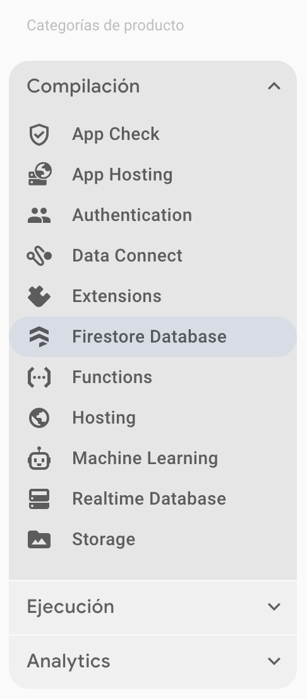
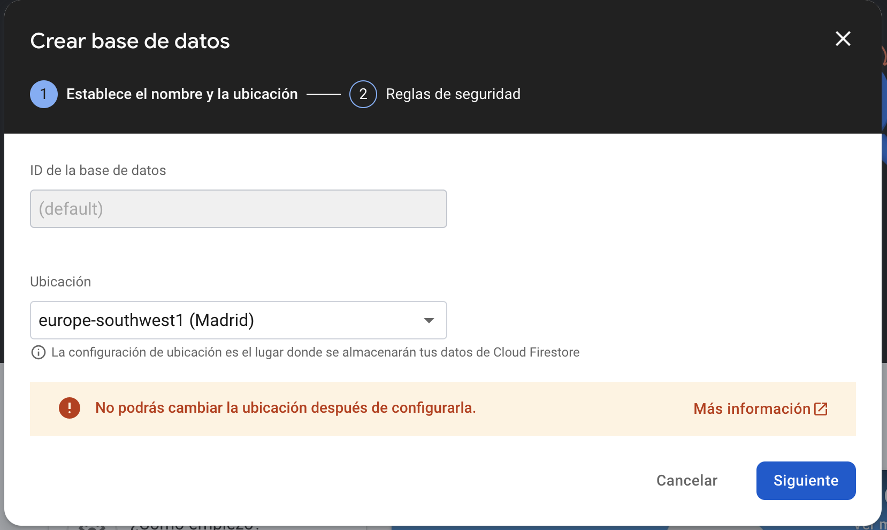

<div class="justify-text">

Antes de poder utilizar **Cloud Firestore** en una aplicación Android, es necesario configurar correctamente Firebase en el proyecto. En este apartado veremos los pasos detallados para:  

1️⃣ Crear un proyecto en Firebase  
2️⃣ Habilitar Firestore Database  
3️⃣ Agregar Firestore a la app Android  
4️⃣ Configurar permisos y reglas de seguridad  

---

## 🔹 1. Crear un proyecto en Firebase  

Para comenzar, sigue los mismos pasos que cuando estudiamos *Authentication*, es decir, accede a la consola de Firebase, crea un proyecto nuevo y realiza la configuración básica que indica el asistente. Finalmente, descarga el archivo `google-services.json` y pégalo en la carpeta `app` de tu proyecto.

---

## 🔹 2. Habilitar Firestore Database  

Una vez creado el proyecto en Firebase, es necesario **habilitar Firestore** para que la aplicación pueda interactuar con la base de datos.  

### Paso 1: Acceder a Firestore en la consola de Firebase  
1. En la [Consola de Firebase](https://console.firebase.google.com/), selecciona tu proyecto.  
2. En el menú lateral, haz clic en **"Firestore Database"**.

  
3. Pulsa el botón **"Crear Base de Datos"**.  
  

### Paso 2: Seleccionar la ubicación de Firestore  
1. Firebase te pedirá que selecciones la **región** donde se almacenarán los datos.  
2. Se recomienda elegir una ubicación cercana a la mayoría de tus usuarios para mejorar el rendimiento.  


### Paso 3: Elegir el modo de seguridad  
Firebase te preguntará cómo deseas configurar la seguridad inicial de Firestore. Hay dos opciones:  

1. **Modo de prueba (recomendado para desarrollo)**  
   - Permite acceso libre a la base de datos, sin autenticación.  
   - Selecciona esta opción si solo estás probando Firestore (nuestro caso).  
   - Las reglas se verán así:  

   ```json
   rules_version = '2';
   service cloud.firestore {
     match /databases/{database}/documents {
       match /{document=**} {
         allow read, write: if true;
       }
     }
   }
   ```

2. **Modo bloqueado (recomendado para producción)**  
   - Solo permite el acceso a usuarios autenticados o según reglas específicas.  
   - Se recomienda para aplicaciones en producción.  


📌 **Ahora Firestore está activado y listo para usarse en tu app Android.**  

---

## 🔹 3. Agregar Firestore a la app  

### Paso 1: Modificar `build.gradle` (nivel de proyecto)  
Abre el archivo **`build.gradle` (Proyecto: DemoFirestore)** y asegúrate de que tengas el siguiente bloque en `plugins`:

```gradle
plugins {
    ...

    // Add the dependency for the Google services Gradle plugin
    id("com.google.gms.google-services") version "4.4.2" apply false
}
```

### Paso 2: Modificar `build.gradle` (nivel de módulo: app)  
Abre el archivo **`build.gradle` (Módulo: app)** y agrega las siguientes dependencias dentro de `dependencies`:

```gradle
// Firebase BoM (Bill of Materials) para gestionar versiones automáticamente
implementation(platform("com.google.firebase:firebase-bom:33.8.0"))

// Dependencia de Firestore
implementation("com.google.firebase:firebase-firestore")
```

Luego, en la parte superior del archivo, asegúrate de aplicar el plugin de Google Services:

```gradle
plugins {
    ...
    id("com.google.gms.google-services")
}
```

### Paso 3: Sincronizar el proyecto  
- Guarda los cambios y haz clic en **"Sync Now"** en la parte superior de Android Studio.  
- Asegúrate de que la sincronización se realice sin errores.  

---

## 🔹 4. Configurar permisos y reglas de seguridad  

Firestore permite definir **reglas de seguridad** para controlar quién puede leer y escribir en la base de datos. Ya las configuramos al crear la base de datos pero aquí se explican brevemente por si necesitas aplicarlas en tus proyectos. Nosotros de momento dejaremos la base de datos abierta a cualquiera.  

### Paso 1: Acceder a las reglas en la consola de Firebase  
1. Ve a la **Consola de Firebase**.  
2. En la barra lateral, selecciona **"Firestore Database"**.  
3. Haz clic en **"Reglas"**.  

### Paso 2: Configurar reglas de acceso  

#### 🔐 **Reglas de seguridad básicas (Modo abierto - solo para pruebas)**  
Si solo quieres permitir **lectura y escritura para todos** (no recomendado en producción):

```json
rules_version = '2';
service cloud.firestore {
  match /databases/{database}/documents {
    match /{document=**} {
      allow read, write: if true;
    }
  }
}
```
🚨 **¡Cuidado!** Esta configuración permite que cualquiera pueda leer y escribir datos. Solo úsala en desarrollo.  

#### 🔐 **Reglas seguras con autenticación (Recomendado)**  
Para permitir acceso solo a usuarios autenticados con Firebase Authentication:

```json
rules_version = '2';
service cloud.firestore {
  match /databases/{database}/documents {
    match /users/{userId} {
      allow read, write: if request.auth != null && request.auth.uid == userId;
    }
  }
}
```

🔹 **Explicación:**  
- Solo los usuarios autenticados (`request.auth != null`) pueden acceder.  
- Un usuario solo puede acceder a sus propios documentos (`request.auth.uid == userId`).  

#### 🔐 **Reglas para una colección específica (Ejemplo: pedidos de un usuario)**  
```json
rules_version = '2';
service cloud.firestore {
  match /databases/{database}/documents {
    match /orders/{orderId} {
      allow read, write: if request.auth != null;
    }
  }
}
```
🔹 **Esto significa que solo los usuarios autenticados pueden leer y escribir en la colección `/orders/`**.  

</div>