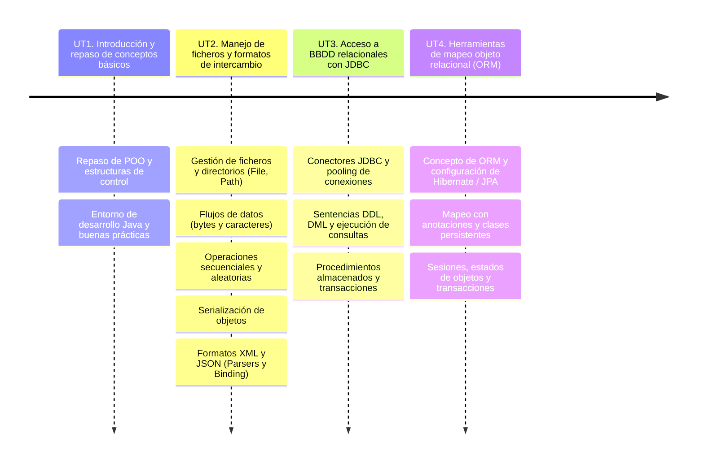
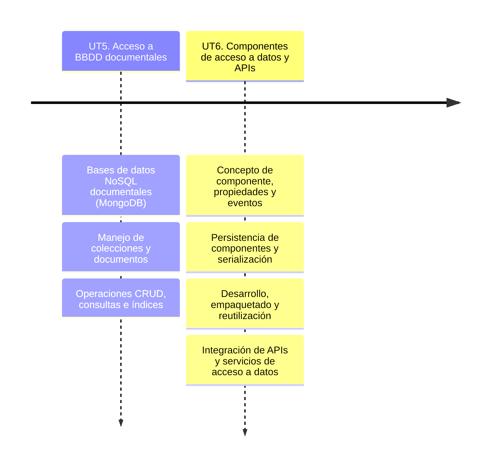
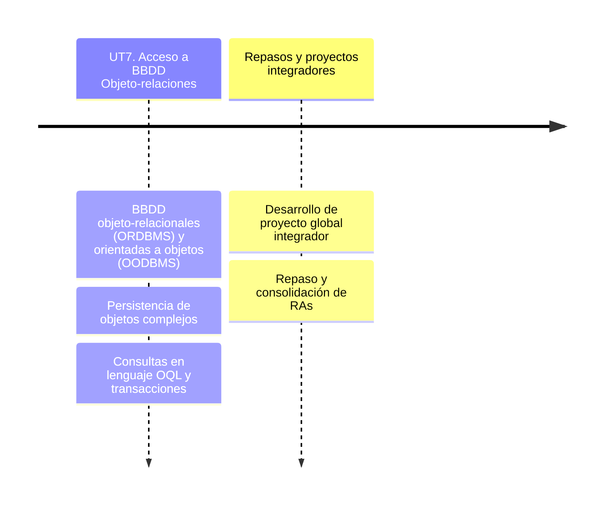

# Presentación

El módulo **Acceso a Datos** (ADA) se encuentra dentro del segundo curso del Ciclo Formativo de Grado Superior en **Desarrollo de Aplicaciones Multiplataforma**. Esta página web servirá de repositorio para agrupar los materiales y actividades de dicho módulo, impartido en el IES Ágora de Cáceres.

## Resultados de aprendizaje

Los **resultados de aprendizaje (RA)** trabajados en este módulo son los indicados en el **Real Decreto 450/2010, Real Decreto 405/2023 y Decreto 259/2011**:

| Código | Descripción |
|--------|-------------|
| RA1    | Desarrolla aplicaciones que gestionan información almacenada en ficheros identificando el campo de aplicación de los mismos y utilizando clases específicas. |
| RA2    | Desarrolla aplicaciones que gestionan información almacenada en bases de datos relacionales identificando y utilizando mecanismos de conexión. |
| RA3    | Gestiona la persistencia de los datos identificando herramientas de mapeo objeto relacional (ORM) y desarrollando aplicaciones que las utilizan. |
| RA4    | Desarrolla aplicaciones que gestionan la información almacenada en bases de datos objeto relacionales y orientadas a objetos valorando sus características y utilizando los mecanismos de acceso incorporados. |
| RA5    | Desarrolla aplicaciones que gestionan la información almacenada en bases de datos nativas XML evaluando y utilizando clases específicas. |
| RA6    | Programa componentes de acceso a datos identificando las características que debe poseer un componente y utilizando herramientas de desarrollo. |

## Unidades de trabajo

Los resultados de aprendizaje (RAs) mencionados se han organizado en 7 **unidades de trabajo (UT)**, que se desarrollarán a lo largo de las tres evaluaciones del curso.  

El módulo de ADA tiene una duración total de **190 horas**, con una **carga semanal de 6 horas**.

| UNIDAD                                            | RAs       | HORAS |
|---------------------------------------------------|-----------|-------|
| UT1. Introducción y repaso conceptos básicos      | -         | 10 h  |
| UT2. Manejo de ficheros y formatos de intercambio | RA1       | 20 h  |
| UT3. Acceso a BBDD relacionales con JDBC          | RA2       | 20 h  |
| UT4. Herramientas de mapeo objeto relacional      | RA3       | 35 h  |
| UT5. Acceso a BBDD documentales                   | RA5       | 20 h  |
| UT6. Componentes de acceso a datos y APIs         | RA6       | 50 h  |
| UT7. Acceso a BBDD Objeto-relaciones              | RA4       | 30 h  |
| Repasos y proyectos integradores                  | Todos     | 20 h  |

## Temporalización

Las unidades de trabajo (UTs) y sus contenidos se han organizado a lo largo de las tres evaluaciones del curso de la siguiente manera:

### 1ª Evaluación

### 2ª Evaluación

### 3ª Evaluación

## Materiales y recursos de software

Para el desarrollo y seguimiento de las clases, contaremos con los siguientes recursos:

**Materiales didácticos**  
- Apuntes disponibles en esta página web.  
- Enunciados de actividades y proyectos publicados en la plataforma *Evex*.  

**Software necesario**  
- Java JDK (versión 17 o superior).  
- Entorno de desarrollo (IDE) **IntelliJ IDEA**.  
- Sistemas de Gestión de Bases de Datos (MySQL/MariaDB).
- Gestor de paquetes Maven  
- Herramientas de Mapeo Objeto-Relacional (Hibernate / JPA).  
- Gestores de Bases de Datos NoSQL (MongoDB).  
- Virtualización con Docker.

