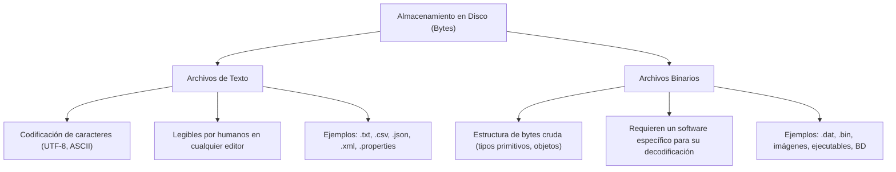
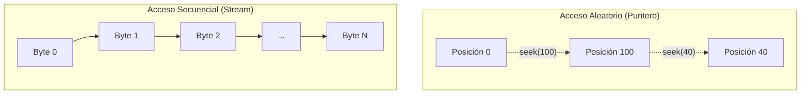

<div class="justify-text">

En las aplicaciones que has desarrollado hasta ahora, toda la información residía en estructuras de datos en memoria RAM (variables, objetos, listas, mapas). Sin embargo, la memoria principal es **volátil**: en el instante en que el proceso de Java termina o el equipo se apaga, los datos se pierden irreversiblemente.

Para resolver este problema surge la **persistencia de datos**: la capacidad de un programa de conservar su estado a lo largo del tiempo, almacenando la información en dispositivos de memoria secundaria (discos duros, unidades SSD). En esta unidad comenzaremos por el mecanismo más directo, universal y fundamental de persistencia: **el sistema de archivos**.

---

## Tipos de Archivos: Texto vs. Binario

Cualquier archivo almacenado en un disco físico es, en última instancia, una **secuencia de ceros y unos (bits)** agrupados en bytes. La diferencia fundamental entre un archivo de texto y un archivo binario radica en **cómo se interpretan esos bytes**:



### Archivos de Texto

En un archivo de texto, cada byte o grupo de bytes representa un **carácter** siguiendo una tabla de codificación predefinida (habitualmente **UTF-8**, o históricamente ASCII / ISO-8859-1).

* **Ventajas**: Son legibles e interpretables por humanos mediante cualquier editor de texto básico (Bloc de notas, VS Code, Nano). Resultan ideales para intercambiar información entre lenguajes y plataformas distintas.
* **Inconvenientes**: Tienen mayor sobrecarga de espacio (un número como `12345678` ocupa 8 bytes en texto plano, mientras que en binario como entero `int` ocuparía solo 4 bytes) y requieren tiempo de procesamiento adicional para parsear cadenas de texto a números o fechas.

### Archivos Binarios

En un archivo binario, la información se almacena respetando directamente la representación interna de los datos en memoria o siguiendo un formato propietario de bytes.

* **Ventajas**: Son mucho más compactos y eficientes en lectura/escritura, ya que la CPU no tiene que transformar el texto a tipos primitivos ni viceversa.
* **Inconvenientes**: No son legibles por personas (abrir un archivo binario con un editor de texto mostrará caracteres extraños o basura). Si cambia la definición de la clase o la arquitectura de lectura, el archivo puede quedar corrupto o ilegible.

---

## Modos de Acceso: Secuencial vs. Aleatorio

A la hora de procesar un archivo existen dos grandes filosofías de acceso:



### Acceso Secuencial

Se procesa el archivo de principio a fin, como si se tratara de una cinta magnética o un flujo continuo (*stream*). Para llegar al registro 50 es obligatorio haber leído previamente los 49 anteriores.
* **Casos de uso**: Archivos de texto plano, archivos de configuración, logs de eventos, lectura de documentos JSON o XML.

### Acceso Aleatorio (*Random Access*)

Permite mover un **puntero de archivo** directamente a una posición arbitraria en bytes para leer o escribir información sin necesidad de recorrer el resto del archivo.
* **Casos de uso**: Motores de bases de datos, ficheros de audio/vídeo (para saltar a un segundo específico) o archivos estructurados en registros de longitud fija.

---

## Propiedades del Sistema 

Uno de los mayores errores al trabajar con archivos es utilizar rutas absolutas con separadores fijos (como `C:\usuarios\alumno\...` en Windows o `/home/usuario/...` en Linux). Esto rompe de inmediato la portabilidad del código.

La máquina virtual de Java (JVM) expone la clase `java.lang.System`, que permite consultar propiedades clave del entorno del sistema operativo en el que se ejecuta la aplicación mediante el método estático `System.getProperty(String clave)`:

| Propiedad | Descripción | Ejemplo típico |
| :--- | :--- | :--- |
| `file.separator` | Carácter separador de rutas del sistema (`/` en Linux/macOS, `\` en Windows). | `/` o `\` |
| `line.separator` | Salto de línea nativo del sistema operativo (`\n` en Linux/macOS, `\r\n` en Windows). | `\n` o `\r\n` |
| `user.dir` | Directorio de trabajo actual desde donde se ejecutó la aplicación. | `/Users/alicia/Desktop/DevTacora` |
| `user.home` | Ruta del directorio personal del usuario del sistema operativo. | `/home/alicia` o `C:\Users\alicia` |

:::tip Ubicación portable de datos
Propiedades como `user.dir` (directorio de trabajo de la aplicación) y `user.home` (carpeta del usuario del sistema) son indispensables para localizar y almacenar archivos de datos o configuraciones en ubicaciones válidas independientemente del equipo donde se ejecute el programa.
:::

### Ejemplo Práctico: Inspección del Entorno de Ejecución

Crea un proyecto Java en IntelliJ IDEA y ejecuta la siguiente clase para comprobar los valores de tu entorno:

```java title="src/es/iesagora/ada/ficheros/DemoSystemProperties.java"
package es.iesagora.ada.ficheros;

public class DemoSystemProperties {

    public static void main(String[] args) {
        System.out.println("=== CONFIGURACIÓN DEL SISTEMA OPERATIVO ===");

        // Separadores de archivos y líneas
        String separadorRuta = System.getProperty("file.separator");
        String separadorLinea = System.getProperty("line.separator");

        System.out.println("Separador de rutas (file.separator): " + separadorRuta);
        System.out.println("Longitud salto de línea (bytes): " + separadorLinea.getBytes().length);

        // Directorios del usuario y del proyecto
        String directorioActual = System.getProperty("user.dir");
        String carpetaPersonal = System.getProperty("user.home");
        String versionJava = System.getProperty("java.version");

        System.out.println("Directorio de trabajo actual (user.dir): " + directorioActual);
        System.out.println("Carpeta personal del usuario (user.home): " + carpetaPersonal);
        System.out.println("Versión de Java en ejecución: " + versionJava);
    }
}
```

</div>
