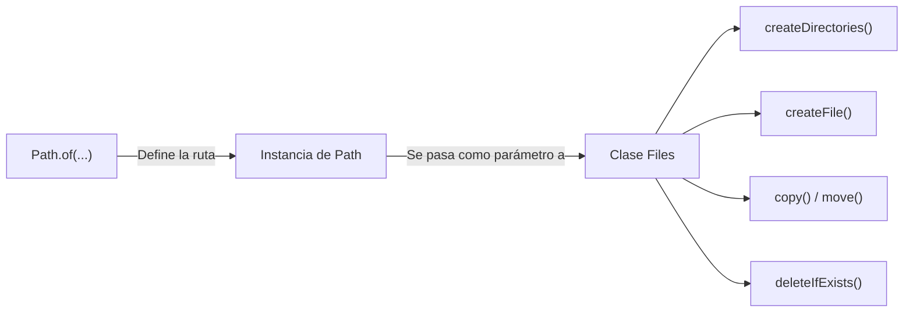
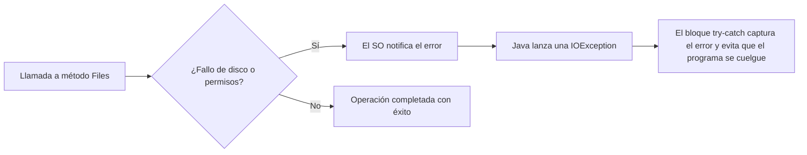

<div class="justify-text">

En Java, el trabajo con el sistema de archivos se estructura a través de dos herramientas fundamentales del paquete `java.nio.file`:

1. **La interfaz `Path`**: Representa la **localización** o ruta de un archivo o directorio en el disco (dónde está).
2. **La clase `Files`**: Contiene métodos estáticos para realizar **acciones y operaciones** sobre el sistema de archivos (crear, copiar, mover, eliminar y consultar).



---

## Representación de Rutas: La Interfaz `Path`

La interfaz `java.nio.file.Path` es el tipo estándar en Java para modelar cualquier ruta del sistema de archivos. Para obtener una instancia de `Path`, se utiliza el método estático factoría **`Path.of(...)`**:

```java
// Java ensambla los nombres utilizando el separador de carpetas propio del SO
Path ruta = Path.of("datos", "partidas", "jugador1.dat");
```

### Rutas Relativas vs. Rutas Absolutas

Comprender la diferencia entre una ruta relativa y una absoluta es fundamental para garantizar que una aplicación funcione en cualquier sistema operativo y ordenador:

* **Ruta Relativa**: Se define tomando como punto de partida la carpeta raíz donde se está ejecutando el programa (la propiedad `user.dir` del sistema):
  ```java
  Path rutaRelativa = Path.of("recursos", "config.properties");
  ```
  ¿Cómo resuelve Java esta ruta?
  - Si estás ejecutando tu proyecto en macOS o Linux en `/Users/usuario/proyectos/mi_app`, Java la resolverá internamente como:
    `/Users/usuario/proyectos/mi_app/recursos/config.properties`
  - Si un compañero abre ese mismo proyecto en Windows en `C:\proyectos\mi_app`, esa misma línea apuntará a:
    `C:\proyectos\mi_app\recursos\config.properties`
  
  **Por esta razón, la ruta relativa es 100% portable:** no cambia el código fuente y funciona en cualquier máquina.

* **Ruta Absoluta**: Especifica la ruta completa desde la raíz del sistema de archivos:
  ```java
  // ❌ PÉSIMA PRÁCTICA: Escribir a mano (hardcoding) una ruta absoluta fija
  Path rutaFija = Path.of("C:", "Users", "alumno", "Desktop", "archivo.txt");
  ```
  Escribir rutas absolutas fijas a mano en el código fuente hace que la aplicación **no sea portable**. Si ejecutas ese código en otro ordenador o en otro sistema operativo, el programa fallará de inmediato al no encontrar la ruta.

:::tip ¿Cómo generar rutas absolutas de forma dinámica?
Jamás se debe escribir una ruta absoluta a mano. Si tu aplicación necesita obtener la ruta absoluta (por ejemplo, para registrarla en un archivo de log o mostrársela al usuario), **debe generarse siempre de manera dinámica**:

1. **A partir de una ruta relativa con `.toAbsolutePath()`**:
   ```java
   Path relativa = Path.of("recursos", "config.properties");
   Path absolutaDinamica = relativa.toAbsolutePath(); // Calculada por Java según el equipo actual
   ```

2. **Anclada al directorio personal del usuario con `user.home`**:
   ```java
   // Se adapta dinámicamente al usuario que tenga la sesión iniciada en el SO
   Path rutaUsuario = Path.of(System.getProperty("user.home"), ".mi_app", "config.properties");
   ```
:::

### Métodos Principales de `Path`

* `getFileName()`: Devuelve el nombre del archivo o carpeta al final de la ruta.
* `getParent()`: Devuelve la ruta del directorio contenedor (o `null` si no tiene padre relativo).
* `getRoot()`: Devuelve la raíz del sistema de archivos (ej. `/` o `C:\`).
* `toAbsolutePath()`: Convierte una ruta relativa en su equivalente absoluta en función de la ubicación de ejecución.
* `resolve(String o Path)`: Une rutas de forma segura sin preocuparse por si llevan o no barras de separación.
* `normalize()`: Elimina redundancias lógicas de la ruta, como `./` (directorio actual) o `../` (subir un nivel).

### Ejemplo: Manipulación de Rutas

```java title="src/es/iesagora/ada/ficheros/DemoRutas.java"
package es.iesagora.ada.ficheros;

import java.nio.file.Path;

public class DemoRutas {

    public static void main(String[] args) {
        System.out.println("=== MANEJO DE RUTAS CON PATH ===");

        // 1. Creación de una ruta relativa multiplataforma
        Path rutaRelativa = Path.of("datos", "almacen", "inventario.dat");
        System.out.println("Ruta: " + rutaRelativa);
        System.out.println("Nombre del archivo: " + rutaRelativa.getFileName());
        System.out.println("Directorio padre: " + rutaRelativa.getParent());

        // 2. Generación dinámica de ruta absoluta
        Path rutaAbsoluta = rutaRelativa.toAbsolutePath();
        System.out.println("Ruta absoluta dinámica: " + rutaAbsoluta);

        // 3. Concatenación de rutas con resolve()
        Path directorioBase = Path.of("configuracion");
        Path archivoAjustes = directorioBase.resolve("app.properties");
        System.out.println("Ruta concatenada: " + archivoAjustes);

        // 4. Limpieza de rutas con normalize()
        Path rutaSucia = Path.of("datos", "almacen", "..", "almacen", "backups", ".", "copia.bin");
        System.out.println("Ruta con redundancias: " + rutaSucia);
        System.out.println("Ruta limpia: " + rutaSucia.normalize());
    }
}
```

---

## Operaciones sobre el Sistema de Archivos: La Clase `Files`

La clase `java.nio.file.Files` proporciona métodos estáticos para interactuar directamente con el almacenamiento secundario del equipo. Sin embargo, antes de ver sus métodos, es crucial entender por qué **todas estas operaciones deben ir obligatoriamente dentro de un bloque `try-catch`**.

### ¿Por qué las operaciones con archivos exigen `try-catch`?

Cuando trabajamos con variables en memoria RAM, el entorno está completamente controlado por la máquina virtual de Java. Sin embargo, el disco duro es un **recurso externo gobernado por el sistema operativo**, donde pueden ocurrir multitud de imprevistos fuera del control de nuestro programa:

1. **El archivo no existe**: Intentamos leer o copiar un archivo cuya ruta está mal escrita o que ha sido borrado.
2. **Falta de permisos**: El usuario que ejecuta el programa no tiene permisos de lectura o escritura en esa carpeta del sistema operativo.
3. **Bloqueo por otros procesos**: El archivo está abierto y bloqueado exclusivamente por otra aplicación (ej. un antivirus o un editor de texto).
4. **Fallo físico o disco lleno**: El disco se queda sin espacio en mitad de una operación de escritura o se desconecta una unidad extraíble (USB).



#### Excepciones comprobadas (*Checked Exceptions*)

En Java, los errores de entrada/salida heredan de la clase **`java.io.IOException`**, que es una **excepción comprobada (*checked exception*)**:

* **Obligación del compilador**: A diferencia de excepciones en tiempo de ejecución como `NullPointerException` o `ArrayIndexOutOfBoundsException`, el compilador de Java **te obliga** a gestionar `IOException`. Si intentas llamar a un método como `Files.createFile()` o `Files.copy()` sin envolverlo en un bloque `try-catch` (o sin declararlo con `throws`), **el código directamente no compilará**.
* **Robustez de la aplicación**: El objetivo del `try-catch` no es solo evitar que el programa se cierre de golpe (*crash*), sino capturar el problema a tiempo para informar amigablemente al usuario o tomar medidas alternativas.

#### Excepciones habituales en Java NIO.2

Dentro de la familia `IOException`, NIO.2 incluye excepciones específicas muy descriptivas:

| Excepción | Causa habitual |
| :--- | :--- |
| `NoSuchFileException` | La ruta indicada no existe en el sistema de archivos. |
| `FileAlreadyExistsException` | Se intenta crear un archivo que ya existe o copiarlo sin reemplazo. |
| `AccessDeniedException` | No se disponen de permisos suficientes en el sistema operativo. |
| `DirectoryNotEmptyException` | Se intenta eliminar un directorio que todavía contiene archivos o subcarpetas. |
| `IOException` | Superclase que captura cualquier otro fallo general de entrada/salida. |

---

### 1. Comprobaciones y Metadatos

Antes de operar sobre un archivo o directorio, es habitual comprobar su estado:

| Método | Retorno | Descripción |
| :--- | :---: | :--- |
| `Files.exists(Path)` | `boolean` | Comprueba si el recurso existe en disco. |
| `Files.notExists(Path)` | `boolean` | Comprueba si el recurso NO existe. |
| `Files.isDirectory(Path)` | `boolean` | Determina si la ruta apunta a un directorio. |
| `Files.isRegularFile(Path)` | `boolean` | Determina si la ruta apunta a un archivo estándar. |
| `Files.size(Path)` | `long` | Devuelve el tamaño del archivo en bytes. |

```java
Path ruta = Path.of("datos", "usuarios.txt");

if (Files.exists(ruta)) {
    System.out.println("¿Es carpeta?: " + Files.isDirectory(ruta));
    System.out.println("¿Es archivo regular?: " + Files.isRegularFile(ruta));
    System.out.println("Tamaño en bytes: " + Files.size(ruta));
}
```

---

### 2. Creación de Directorios y Archivos

Uno de los errores más frecuentes al crear un archivo es intentar generarlo dentro de una carpeta que aún no existe en el disco. Para evitar excepciones, debemos conocer la función de cada método:

* **`Files.createDirectory(Path ruta)`**: Crea **únicamente el directorio final**. Si alguna carpeta intermedia de la ruta no existe, la operación falla inmediatamente con una excepción `NoSuchFileException`. Además, si la carpeta ya existía, lanza `FileAlreadyExistsException`.
* **`Files.createDirectories(Path ruta)`**: Crea el directorio final y **toda la cadena de carpetas intermedias (padres)** que hagan falta. Si alguna carpeta ya existe, simplemente la ignora sin lanzar errores. Es el método estándar y más seguro.
* **`Files.createFile(Path ruta)`**: Crea un archivo vacío. Requiere obligatoriamente que **la carpeta que lo va a contener ya exista**; de lo contrario, lanza `NoSuchFileException`.

---

### 3. Copia y Movimiento de Recursos

Para duplicar o reubicar archivos se emplean `Files.copy()` y `Files.move()`:

* **`Files.copy(Path origen, Path destino, CopyOption... opciones)`**: Copia el archivo de origen al destino.
* **`Files.move(Path origen, Path destino, CopyOption... opciones)`**: Mueve o renombra un archivo o directorio.

:::warning Sobreescritura por defecto
Por defecto, tanto `copy` como `move` fallan con una excepción `FileAlreadyExistsException` si el archivo de destino ya existe. Para permitir la sobreescritura, se debe pasar la opción `StandardCopyOption.REPLACE_EXISTING`:
```java
Files.copy(origen, destino, StandardCopyOption.REPLACE_EXISTING);
Files.move(origen, destino, StandardCopyOption.REPLACE_EXISTING);
```
:::

---

### 4. Eliminación de Archivos y Carpetas

Existen dos estrategias para borrar un recurso:

1. **`Files.delete(Path ruta)`**: Elimina el archivo o directorio. Lanza excepción si el archivo no existe (`NoSuchFileException`) o si la carpeta que se intenta borrar no está vacía (`DirectoryNotEmptyException`).
2. **`Files.deleteIfExists(Path ruta)`**: Elimina el archivo solo si existe, devolviendo `true` si lo borró o `false` si no existía, evitando excepciones innecesarias.

:::tip Recomendación de seguridad
Utiliza siempre que sea posible **`Files.deleteIfExists(Path)`**, ya que hace que tu código sea idempotente y evita capturar excepciones cuando el archivo simplemente ya no estaba allí.
:::

---

## Demo Completa: Ciclo de Vida de Ficheros y Directorios

Para asentar todo lo visto, vamos a implementar un caso práctico completo: la gestión de un archivo de registro (*log*) y su posterior copia de seguridad.

En este flujo cubriremos paso a paso las operaciones reales que realiza un backend:
1. **Crear carpetas**: Asegurar la jerarquía de directorios `datos_app/logs` sin lanzar errores.
2. **Crear archivo**: Crear el archivo `actividad.txt` comprobando previamente si ya existe.
3. **Inspeccionar**: Consultar si es un archivo regular, si existe y cuánto ocupa en disco.
4. **Copiar**: Crear un duplicado de respaldo llamado `actividad_backup.txt` con reemplazo activado.
5. **Mover/Renombrar**: Renombrar la copia a `actividad_historico.txt`.
6. **Borrar de forma segura**: Eliminar los archivos con `deleteIfExists()` y limpiar las carpetas creadas.

```java title="src/es/iesagora/ada/ficheros/DemoOperacionesArchivos.java"
package es.iesagora.ada.ficheros;

import java.io.IOException;
import java.nio.file.Files;
import java.nio.file.Path;
import java.nio.file.StandardCopyOption;

public class DemoOperacionesArchivos {

    public static void main(String[] args) {
        System.out.println("=== CICLO DE VIDA DE ARCHIVOS Y DIRECTORIOS ===");

        try {
            // PASO 1: Asegurar que la carpeta contenedora existe antes de crear archivos
            Path rutaArchivoOriginal = Path.of("datos_app", "logs", "actividad.txt");
            Path carpetaLogs = rutaArchivoOriginal.getParent();

            if (carpetaLogs != null && Files.notExists(carpetaLogs)) {
                Files.createDirectories(carpetaLogs);
                System.out.println("1. Estructura de carpetas creada: " + carpetaLogs);
            }

            // PASO 2: Crear el archivo original vacío
            if (Files.notExists(rutaArchivoOriginal)) {
                Files.createFile(rutaArchivoOriginal);
                System.out.println("2. Archivo original creado: " + rutaArchivoOriginal);
            }

            // PASO 3: Consultar metadatos del archivo
            System.out.println("3. Metadatos del archivo:");
            System.out.println("   - ¿Existe?: " + Files.exists(rutaArchivoOriginal));
            System.out.println("   - ¿Es archivo regular?: " + Files.isRegularFile(rutaArchivoOriginal));
            System.out.println("   - Tamaño inicial: " + Files.size(rutaArchivoOriginal) + " bytes");

            // PASO 4: Crear una copia de respaldo
            Path rutaCopia = Path.of("datos_app", "logs", "actividad_backup.txt");
            Files.copy(rutaArchivoOriginal, rutaCopia, StandardCopyOption.REPLACE_EXISTING);
            System.out.println("4. Archivo copiado a: " + rutaCopia);

            // PASO 5: Mover / Renombrar la copia
            Path rutaHistorico = Path.of("datos_app", "logs", "actividad_historico.txt");
            Files.move(rutaCopia, rutaHistorico, StandardCopyOption.REPLACE_EXISTING);
            System.out.println("5. Archivo renombrado a: " + rutaHistorico);

            // PASO 6: Borrado seguro de los archivos temporales
            boolean borradoOriginal = Files.deleteIfExists(rutaArchivoOriginal);
            boolean borradoHistorico = Files.deleteIfExists(rutaHistorico);
            System.out.println("6. Archivos eliminados con deleteIfExists:");
            System.out.println("   - Original borrado: " + borradoOriginal);
            System.out.println("   - Histórico borrado: " + borradoHistorico);

            // PASO 7: Limpieza de carpetas vacías
            boolean borradaCarpetaLogs = Files.deleteIfExists(carpetaLogs);
            boolean borradaCarpetaPrincipal = Files.deleteIfExists(Path.of("datos_app"));
            System.out.println("7. Carpetas eliminadas:");
            System.out.println("   - Carpeta logs: " + borradaCarpetaLogs);
            System.out.println("   - Carpeta datos_app: " + borradaCarpetaPrincipal);

        } catch (IOException e) {
            System.err.println("Error durante la operación con archivos: " + e.getMessage());
            e.printStackTrace();
        }
    }
}
```

</div>
