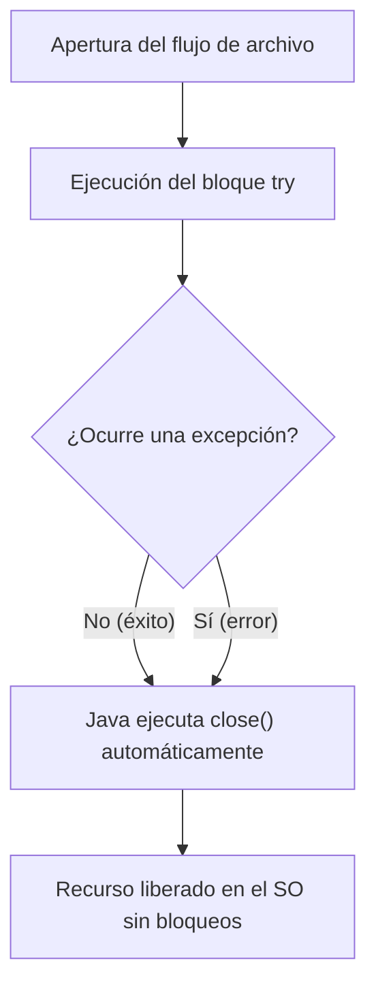
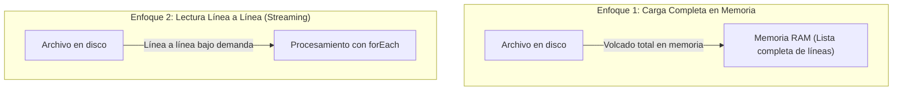

<div class="justify-text">

Los archivos de texto plano son el formato más extendido para almacenar información legible por personas: archivos de configuración, registros de actividad (*logs*) y volcados de datos.

En este tema aprenderemos a leer y escribir texto en disco utilizando las utilidades de **Java NIO.2**, garantizando la liberación segura de memoria y descriptores del sistema operativo mediante **`try-with-resources`**.

---

## La Codificación de Caracteres: UTF-8

Un archivo de texto no guarda letras directamente, sino números binarios que representan caracteres según una tabla de conversión. Si un archivo se escribe con una codificación (ej. `ISO-8859-1` en Windows clásico) y se lee con otra (ej. `UTF-8` en Linux o macOS), aparecen los temidos caracteres corruptos como `ñ` o símbolos extraños (*mojibake*).

En el desarrollo de software actual, el estándar universal indiscutible es **UTF-8**:
* Representa cualquier carácter de cualquier idioma (alfabeto latino, tildes, eñes, caracteres asiáticos, emojis).
* En Java se encuentra definido como constante estática en `java.nio.charset.StandardCharsets.UTF_8`.

:::tip UTF-8 por defecto en Java moderno
A partir de **Java 18**, la máquina virtual de Java utiliza **UTF-8 como codificación predeterminada en todas las plataformas**. No obstante, en código profesional se recomienda explicitar siempre el juego de caracteres en los métodos de lectura y escritura para garantizar la portabilidad total entre entornos.
:::

---

## Gestión Segura de Recursos

Cada vez que abrimos un flujo de lectura o escritura hacia un archivo, la máquina virtual de Java le solicita al sistema operativo un **descriptor de archivo** (*file handle*). Este descriptor es un recurso finito:

* Si el programa no cierra el flujo tras utilizarlo, se produce una **fuga de recursos** (*resource leak*).
* El archivo queda **bloqueado por el sistema operativo**, impidiendo que otros procesos o la propia aplicación puedan renombrarlo, moverlo o borrarlo.
* Si se abren miles de archivos sin cerrarlos, el sistema operativo denegará nuevas aperturas lanzando un error del tipo *"Too many open files"*.

<div class="flex justify-center" style={{ display: 'flex', justifyContent: 'center' }}>



</div>

### Control y Cierre Automático de Recursos

Para resolver este problema de raíz, Java dispone de la sentencia **`try-with-resources`**. Cualquier recurso que implemente la interfaz `java.lang.AutoCloseable` (como los flujos abiertos con `Files.lines()` o flujos de bytes) puede declararse dentro de los paréntesis del `try`:

```java
// El flujo 'lineas' se cerrará SIEMPRE al salir del bloque, ocurra o no una excepción
try (Stream<String> lineas = Files.lines(rutaArchivo, StandardCharsets.UTF_8)) {
    lineas.forEach(linea -> {
        System.out.println(linea);
    });
} catch (IOException e) {
    System.err.println("Error al leer el archivo: " + e.getMessage());
}
```

:::info Adiós al bloque `finally` manual
Antes de la llegada de `try-with-resources`, los desarrolladores debían invocar manualmente el método `close()` dentro de un bloque `finally`, lo que requería anidar nuevos bloques `try-catch` para capturar posibles excepciones al cerrar el recurso. Con `try-with-resources` el compilador de Java inyecta ese cierre automático de forma limpia y garantizada.
:::

---

## Estrategias de Lectura de Texto Plano

Java NIO.2 ofrece dos estrategias principales para leer texto plano. La elección de una u otra depende fundamentalmente del **tamaño del archivo** y de la memoria RAM disponible:



### Carga Completa en Memoria

Para archivos pequeños o medianos (de unos pocos kilobytes o megabytes), la forma más rápida y cómoda es volcar todo el contenido directamente en memoria:

* **`Files.readString(Path ruta)`**: Lee todo el archivo y lo devuelve como un único `String`.
* **`Files.readAllLines(Path ruta)`**: Lee todas las líneas y las devuelve almacenadas en una lista `List<String>`.

Como devuelve una lista estándar de Java, se puede recorrer con un bucle `for` tradicional:

```java
Path ruta = Path.of("datos", "usuarios.txt");

try {
    // Lectura completa como lista de cadenas
    List<String> lineas = Files.readAllLines(ruta, StandardCharsets.UTF_8);
    
    // Recorrido clásico con bucle for
    for (String linea : lineas) {
        System.out.println(linea);
    }
} catch (IOException e) {
    System.err.println("Error de lectura: " + e.getMessage());
}
```

:::warning Peligro en archivos gigantes
Si intentas leer un archivo de logs de varios gigabytes con `Files.readAllLines()`, Java intentará cargarlo entero en la memoria RAM, lo que provocará irremediablemente un error fatal **`OutOfMemoryError`**.
:::

---

### Lectura en Flujo Continuo

Cuando el archivo es muy grande o no conocemos su tamaño, la mejor alternativa es **`Files.lines(Path ruta)`**, que va leyendo las líneas del disco una a una bajo demanda en lugar de cargarlas todas a la vez en la memoria.

Para procesar cada línea utilizamos el método **`forEach`**, colocando nuestro código dentro de las llaves `{ ... }`:

```java
Path ruta = Path.of("datos", "servidor_acceso.log");

// IMPORTANTE: Files.lines() implementa AutoCloseable, por lo que debe abrirse en un try-with-resources
try (Stream<String> lineas = Files.lines(ruta, StandardCharsets.UTF_8)) {
    lineas.forEach(linea -> {
        // Imprimimos directamente cada línea leída del archivo:
        System.out.println(linea);
    });
} catch (IOException e) {
    System.err.println("Error procesando el archivo: " + e.getMessage());
}
```

---

## Estrategias de Escritura de Texto Plano

Para escribir texto plano en disco disponemos de dos métodos de conveniencia de la clase `Files`:

### Métodos de Escritura

* **`Files.writeString(Path ruta, CharSequence texto, OpenOption... opciones)`**: Escribe una única cadena de texto en el archivo.
* **`Files.write(Path ruta, Iterable<? extends CharSequence> lineas, OpenOption... opciones)`**: Escribe una colección de líneas (por ejemplo, un `List<String>`), añadiendo automáticamente el salto de línea al final de cada una.

### Opciones de Apertura

El tercer parámetro opcional permite controlar el comportamiento de la escritura mediante el enumerado `java.nio.file.StandardOpenOption`:

| Opción | Comportamiento |
| :--- | :--- |
| `CREATE` | Crea el archivo si no existe previamente. |
| `CREATE_NEW` | Crea el archivo solo si NO existe. Si ya existía, lanza excepción. |
| `TRUNCATE_EXISTING` | **Comportamiento por defecto**. Si el archivo existe, borra todo su contenido previo y escribe desde cero. |
| `APPEND` | Conserva el contenido existente y añade el nuevo texto al final del archivo. |

#### Ejemplo de Sobreescritura vs. Anexión (*Append*)

```java
Path ruta = Path.of("datos", "registro.txt");

try {
    // 1. Sobreescribir el archivo (o crearlo si no existe)
    Files.writeString(ruta, "Primera línea de inicio\n", 
                      StandardOpenOption.CREATE, 
                      StandardOpenOption.TRUNCATE_EXISTING);

    // 2. Añadir nuevas líneas al final sin borrar lo anterior (APPEND)
    List<String> nuevasLineas = List.of("Evento 1 registrado", "Evento 2 registrado");
    Files.write(ruta, nuevasLineas, 
                StandardOpenOption.CREATE, 
                StandardOpenOption.APPEND);

} catch (IOException e) {
    System.err.println("Error durante la escritura: " + e.getMessage());
}
```

---

## Demo Completa: Lectura y Escritura de Texto Plano

Para consolidar las estrategias de lectura y escritura de texto plano, implementamos una demo completa que crea un archivo de registro (*log*), añade nuevos eventos sin sobreescribir y lee los datos usando tanto carga completa como procesamiento línea a línea:

```java title="src/es/iesagora/ada/ficheros/DemoTextoPlano.java"
package es.iesagora.ada.ficheros;

import java.io.IOException;
import java.nio.charset.StandardCharsets;
import java.nio.file.Files;
import java.nio.file.Path;
import java.nio.file.StandardOpenOption;
import java.util.List;
import java.util.stream.Stream;

public class DemoTextoPlano {

    public static void main(String[] args) {
        System.out.println("=== MANEJO DE ARCHIVOS DE TEXTO PLANO ===");

        Path carpeta = Path.of("datos_texto");
        Path archivoLog = carpeta.resolve("sistema.log");

        try {
            // PASO 1: Asegurar que la carpeta existe
            if (Files.notExists(carpeta)) {
                Files.createDirectories(carpeta);
            }

            // PASO 2: Escribir encabezado inicial sobrescribiendo si existía
            Files.writeString(archivoLog, "=== REGISTRO DEL SISTEMA ===\n", 
                              StandardCharsets.UTF_8, 
                              StandardOpenOption.CREATE, 
                              StandardOpenOption.TRUNCATE_EXISTING);
            System.out.println("1. Archivo inicial creado.");

            // PASO 3: Añadir eventos al final sin borrar lo anterior (APPEND)
            List<String> eventos = List.of(
                    "[INFO] Servidor iniciado correctamente",
                    "[INFO] Conexión establecida con el servicio",
                    "[WARN] Tiempo de respuesta elevado en consulta",
                    "[INFO] Tarea programada ejecutada con éxito"
            );
            Files.write(archivoLog, eventos, StandardCharsets.UTF_8, 
                        StandardOpenOption.CREATE, 
                        StandardOpenOption.APPEND);
            System.out.println("2. Eventos añadidos con APPEND.");

            // PASO 4: Lectura completa en memoria
            System.out.println("\n3. Lectura completa con Files.readAllLines():");
            List<String> lineasMemoria = Files.readAllLines(archivoLog, StandardCharsets.UTF_8);
            for (String linea : lineasMemoria) {
                System.out.println("   > " + linea);
            }

            // PASO 5: Lectura en flujo continuo línea a línea con Files.lines()
            System.out.println("\n4. Lectura línea a línea con Files.lines():");
            try (Stream<String> lineasFlujo = Files.lines(archivoLog, StandardCharsets.UTF_8)) {
                lineasFlujo.forEach(linea -> {
                    System.out.println("   [Stream] " + linea);
                });
            }

        } catch (IOException e) {
            System.err.println("Error en las operaciones de texto plano: " + e.getMessage());
            e.printStackTrace();
        }
    }
}
```

</div>
