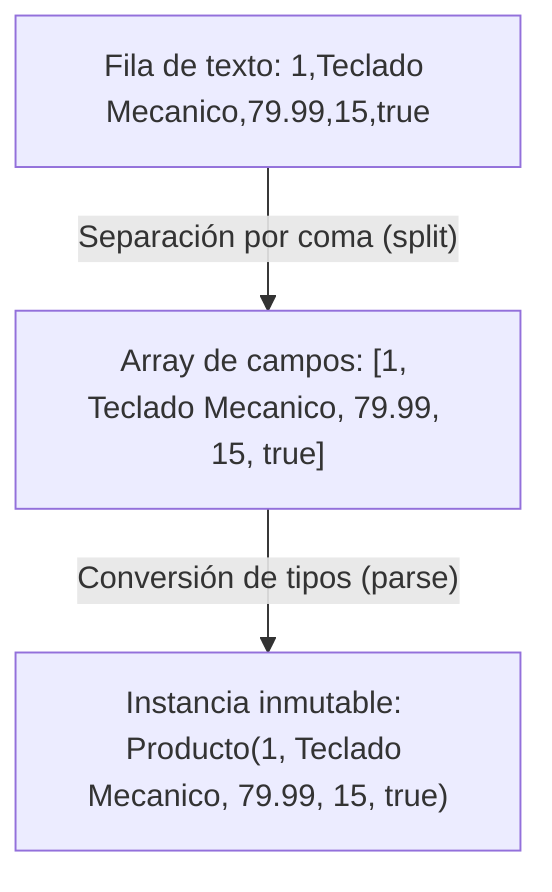

<div class="justify-text">

El formato **CSV** (*Comma-Separated Values*) es uno de los estándares más utilizados en la industria del software para exportar, importar e intercambiar datos tabulares entre aplicaciones heterogéneas (bases de datos relacionales, hojas de cálculo, sistemas ERP y herramientas de análisis de datos).

En este tema abordaremos qué es y cómo estructurar un archivo CSV, cómo transformar sus líneas de texto en objetos Java de forma robusta y por qué los **Java Records** constituyen la mejor herramienta del lenguaje moderno para representar y manipular estos registros de datos.

---

## El Formato CSV

Un archivo CSV es un archivo de texto plano estructurado en filas y columnas:
* **Filas**: Cada línea de texto representa un registro de datos independiente terminado por un salto de línea (`\n` o `\r\n`).
* **Columnas**: Dentro de cada fila, los valores de cada campo están separados por un delimitador específico. El delimitador estándar es la coma (`,`), aunque en entornos europeos o cuando los datos numéricos usan coma decimal es muy habitual encontrar el punto y coma (`;`).
* **Fila de cabecera**: Opcionalmente, la primera línea del archivo define los nombres de los atributos o campos de cada columna.

```text
id,nombre,precio,stock,disponible
1,Teclado Mecanico,79.99,15,true
2,Raton Ergonomico,34.50,40,true
3,Monitor 27 Pulgadas,199.90,0,false
```



---

## Modelos Inmutables de Datos: Java Records

### ¿Qué es un Record?

Introducidos de forma definitiva en **Java 16**, los **Records** son un tipo especial de clase diseñada específicamente para actuar como **portadores transparentes e inmutables de datos** (*data carriers*).

En aplicaciones empresariales y de acceso a datos, gran parte de las clases que creamos sirven únicamente para transportar información entre capas (por ejemplo, desde un archivo hacia la lógica de negocio). Tradicionalmente, crear una clase de datos en Java requería escribir docenas de líneas de código repetitivo (*boilerplate*):
* Declarar cada atributo como `private final`.
* Escribir un constructor completo con todos los parámetros.
* Escribir métodos *getter* para cada campo.
* Sobrescribir `equals()` y `hashCode()` para comparar objetos por su contenido y no por su dirección en memoria.
* Sobrescribir `toString()` para imprimir la información legiblemente en consola.

Un **Record** condensa todo ese código en **una única línea**:

```java
public record Producto(int id, String nombre, double precio, int stock, boolean disponible) {}
```

Con solo esta declaración, el compilador de Java genera automáticamente:
1. **Atributos privados e inmutables**: `final int id`, `final String nombre`, etc.
2. **Constructor canónico**: Acepta todos los componentes en el orden exacto en que se declararon.
3. **Métodos de lectura (*accessors*)**: Con el mismo nombre del campo (`producto.id()`, `producto.nombre()`, `producto.precio()`), sin el prefijo *get*.
4. **`equals()` y `hashCode()`**: Basados en el valor de todos los campos.
5. **`toString()` formateado**: Por ejemplo, `Producto[id=1, nombre=Teclado Mecanico, precio=79.99, stock=15, disponible=true]`.

---

### ¿Para qué se utilizan los Records?

Los Records son la opción ideal para:
* **Modelos de transferencia de datos (DTOs)**: Transportar registros leídos de archivos, bases de datos o servicios web hacia el resto de la aplicación.
* **Inmutabilidad garantizada**: Una vez instanciado un record, sus valores no pueden ser modificados accidentalmente por otros métodos o hilos, evitando errores de estado corrupto.
* **Claves seguras en colecciones**: Al tener implementados correctamente `equals()` y `hashCode()`, funcionan de forma inmediata y fiable dentro de colecciones `HashSet` o como claves de un `HashMap`.

:::info Records vs. Clases Tradicionales
Un Record no sustituye a las clases tradicionales de Java cuando se necesita mutabilidad (modificar atributos mediante *setters*) o herencia de clases (los records no pueden heredar de otras clases porque extienden implícitamente de `java.lang.Record`). Sin embargo, para leer información de fuentes externas como CSV, JSON o bases de datos, los records son hoy el estándar de diseño recomendado.
:::

---

## ¿Por qué los Records son la Forma más Fácil de Leer CSV?

Al procesar un archivo CSV con Java clásico nos encontramos con dos tareas continuas:
1. **Conversión de tipos**: El archivo contiene solo texto (`String`), pero nuestro modelo necesita números (`int`, `double`), booleanos (`boolean`) o fechas.
2. **Transformación bidireccional**: Necesitamos pasar de una línea de texto a un objeto (`fromCsvLine`), y de un objeto a una línea de texto para guardarlo (`toCsvLine`).

Integrando estos métodos estáticos y de instancia directamente dentro del Record, conseguimos un diseño **autocontenido y extremadamente limpio**:

```java
public record Producto(int id, String nombre, double precio, int stock, boolean disponible) {

    // Método factoría estático: Convierte una línea CSV en un Producto
    public static Producto fromCsvLine(String linea, String separador) {
        String[] partes = linea.split(separador);
        
        int id = Integer.parseInt(partes[0].trim());
        String nombre = partes[1].trim();
        double precio = Double.parseDouble(partes[2].trim());
        int stock = Integer.parseInt(partes[3].trim());
        boolean disponible = Boolean.parseBoolean(partes[4].trim());

        return new Producto(id, nombre, precio, stock, disponible);
    }

    // Método de instancia: Convierte el Producto en una línea CSV lista para guardar
    public String toCsvLine(String separador) {
        return id + separador + nombre + separador + precio + separador + stock + separador + disponible;
    }
}
```

### Ventajas frente al enfoque tradicional

* **Encapsulación total**: La lógica de cómo se interpreta y formatea un producto en CSV pertenece al propio modelo, no dispersa por la aplicación.
* **Sin constructores engorrosos ni setters**: La creación es atómica mediante `new Producto(...)`.
* **Seguridad frente a espacios accidentales**: El uso sistemático de `.trim()` al procesar los campos previene excepciones numéricas (`NumberFormatException`) debidas a espacios en blanco invisibles.

---

## Procesamiento de un Archivo CSV Paso a Paso

El ciclo completo para procesar un CSV en memoria consiste en los siguientes pasos:

1. **Lectura completa**: Obtenemos todas las líneas del archivo con `Files.readAllLines(ruta, StandardCharsets.UTF_8)`.
2. **Omisión de cabecera**: Si el archivo tiene encabezado de columnas, comenzamos el bucle en el índice `i = 1` en lugar de `i = 0`.
3. **Mapeo a Records**: Convertimos cada línea de texto a una instancia del Record invocando `fromCsvLine()`.
4. **Filtrado y lógica**: Evaluamos condiciones de negocio sobre los objetos usando bucles `for` e instrucciones condicionales `if`.
5. **Exportación**: Transformamos los records resultantes a cadenas mediante `toCsvLine()` y los guardamos con `Files.write()`.

---

## Demo Completa: Procesamiento de CSV

A continuación se muestra el código completo del modelo de datos y el programa principal que crea un archivo CSV, lo lee, lo convierte en una lista de objetos inmutables, aplica un filtro de inventario y guarda un nuevo archivo con los productos filtrados:

### El Modelo de Datos

```java title="src/es/iesagora/ada/ficheros/Producto.java"
package es.iesagora.ada.ficheros;

public record Producto(int id, String nombre, double precio, int stock, boolean disponible) {

    /**
     * Parsea una línea de texto CSV y devuelve una instancia de Producto.
     */
    public static Producto fromCsvLine(String linea, String separador) {
        String[] campos = linea.split(separador);
        
        int id = Integer.parseInt(campos[0].trim());
        String nombre = campos[1].trim();
        double precio = Double.parseDouble(campos[2].trim());
        int stock = Integer.parseInt(campos[3].trim());
        boolean disponible = Boolean.parseBoolean(campos[4].trim());

        return new Producto(id, nombre, precio, stock, disponible);
    }

    /**
     * Serializa este Producto a una línea de texto delimitada para exportar a CSV.
     */
    public String toCsvLine(String separador) {
        return id + separador + nombre + separador + precio + separador + stock + separador + disponible;
    }
}
```

---

### El Programa de Procesamiento

```java title="src/es/iesagora/ada/ficheros/DemoProcesamientoCsv.java"
package es.iesagora.ada.ficheros;

import java.io.IOException;
import java.nio.charset.StandardCharsets;
import java.nio.file.Files;
import java.nio.file.Path;
import java.nio.file.StandardOpenOption;
import java.util.ArrayList;
import java.util.List;

public class DemoProcesamientoCsv {

    public static void main(String[] args) {
        System.out.println("=== PROCESAMIENTO DE ARCHIVOS CSV CON JAVA RECORDS ===");

        Path carpeta = Path.of("datos_csv");
        Path archivoOrigen = carpeta.resolve("catalogo.csv");
        Path archivoFiltrado = carpeta.resolve("productos_disponibles.csv");
        String separador = ",";

        try {
            // PASO 1: Asegurar el directorio de trabajo
            if (Files.notExists(carpeta)) {
                Files.createDirectories(carpeta);
            }

            // PASO 2: Escribir un archivo CSV de ejemplo con cabecera
            List<String> filasIniciales = List.of(
                    "id,nombre,precio,stock,disponible",
                    "1,Teclado Mecanico,79.99,15,true",
                    "2,Raton Ergonomico,34.50,40,true",
                    "3,Monitor 27 Pulgadas,199.90,0,false",
                    "4,Auriculares Inalambricos,59.00,12,true",
                    "5,Webcam Full HD,45.20,0,false"
            );

            Files.write(archivoOrigen, filasIniciales, StandardCharsets.UTF_8,
                    StandardOpenOption.CREATE, StandardOpenOption.TRUNCATE_EXISTING);
            System.out.println("1. Archivo '" + archivoOrigen.getFileName() + "' creado con " + (filasIniciales.size() - 1) + " registros.");

            // PASO 3: Leer el archivo completo a memoria
            List<String> lineasArchivo = Files.readAllLines(archivoOrigen, StandardCharsets.UTF_8);

            // PASO 4: Convertir las líneas de texto a objetos Producto (Java Records)
            List<Producto> catalogo = new ArrayList<>();

            // Comenzamos en i = 1 para saltarnos la fila 0 (cabecera con los nombres de columna)
            for (int i = 1; i < lineasArchivo.size(); i++) {
                String linea = lineasArchivo.get(i);
                
                // Evitamos procesar líneas vacías que puedan existir al final del archivo
                if (!linea.isBlank()) {
                    Producto producto = Producto.fromCsvLine(linea, separador);
                    catalogo.add(producto);
                }
            }

            System.out.println("\n2. Registros cargados e instanciados como Records:");
            for (Producto p : catalogo) {
                System.out.println("   > " + p);
            }

            // PASO 5: Filtrar productos disponibles y con stock positivo
            List<Producto> productosActivos = new ArrayList<>();
            for (Producto p : catalogo) {
                if (p.disponible() && p.stock() > 0) {
                    productosActivos.add(p);
                }
            }

            // PASO 6: Exportar los resultados a un nuevo archivo CSV
            List<String> lineasSalida = new ArrayList<>();
            lineasSalida.add("id,nombre,precio,stock,disponible"); // Cabecera

            for (Producto p : productosActivos) {
                lineasSalida.add(p.toCsvLine(separador));
            }

            Files.write(archivoFiltrado, lineasSalida, StandardCharsets.UTF_8,
                    StandardOpenOption.CREATE, StandardOpenOption.TRUNCATE_EXISTING);

            System.out.println("\n3. Exportación completada:");
            System.out.println("   Se guardaron " + productosActivos.size() + " productos activos en '" + archivoFiltrado.getFileName() + "'.");

        } catch (IOException e) {
            System.err.println("Error procesando los archivos CSV: " + e.getMessage());
            e.printStackTrace();
        }
    }
}
```

:::tip ¿Cuándo usar una librería externa como OpenCSV?
Para archivos CSV estándar y limpios, el método `split(separador)` junto con `fromCsvLine()` es rápido, no requiere librerías externas y permite a los alumnos entender exactamente cómo se transforman los datos. Si un campo de texto contiene comas dentro del propio valor entrecomillado (ej. `"Calle Mayor, 14, 2ºB"`), entonces es cuando se justifica el uso de un analizador sintáctico especializado como **OpenCSV** o **Apache Commons CSV**.
:::

</div>
