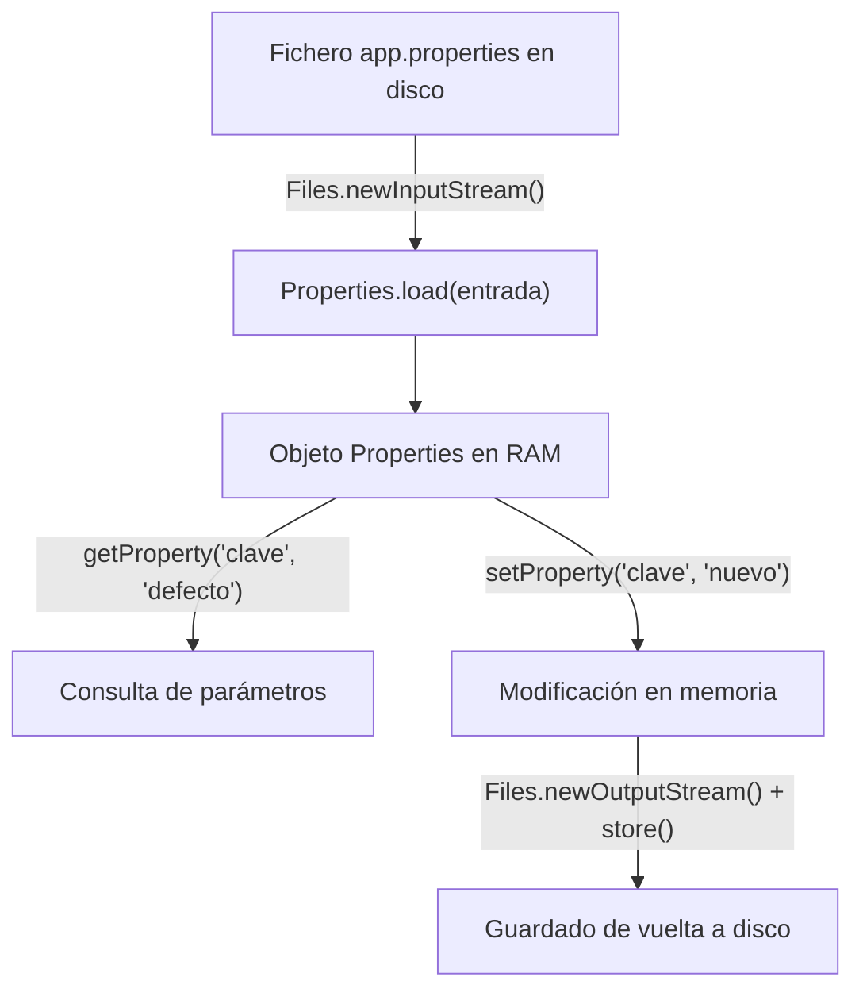

<div class="justify-text">

En cualquier aplicación de software profesional, los parámetros que controlan el comportamiento del sistema (rutas de almacenamiento, puertos de red, credenciales de acceso o límites operativos) **nunca deben escribirse directamente en el código fuente** (*hardcoding*).

Si dejamos un valor fijo dentro de una clase Java, cualquier cambio requerirá modificar el código, recompilar el proyecto y volver a desplegar la aplicación. La solución a este problema es la **externalización de la configuración**, utilizando ficheros externos que el programa lee dinámicamente al iniciarse.

En este tema aprenderemos a trabajar con el formato estándar **`.properties`** mediante la clase nativa `java.util.Properties` de Java, abordando su carga, consulta de valores con salvaguardas por defecto, modificación y guardado en disco.

---

## El Formato de Propiedades

Un fichero `.properties` es un archivo de texto plano estructurado en pares **clave=valor**:

* **Clave y Valor**: Separados por un signo de igualdad (`=`) o dos puntos (`:`). La clave identifica el parámetro y el valor representa su contenido textual.
* **Comentarios**: Las líneas que comienzan con una almohadilla (`#`) o un signo de exclamación (`!`) son ignoradas automáticamente por el motor de lectura de Java.
* **Codificación**: Tradicionalmente utilizaban `ISO-8859-1`, pero en el desarrollo moderno con Java se manejan de forma transparente en **UTF-8**.

```properties title="config/app.properties"
# Configuración general de la aplicación
app.nombre=GestorEmpresarial
app.version=2.4.0
app.puerto=8080
app.modoDebug=true
app.limiteRegistros=100
```

---

## La Clase `java.util.Properties`

En el paquete estándar `java.util`, Java proporciona la clase `Properties`. Hereda de `Hashtable<Object, Object>`, aunque está diseñada específicamente para almacenar tanto claves como valores de tipo cadena (`String`).



### Operaciones Fundamentales

#### 1. Carga desde disco con `load()`

Lee el archivo a través de un flujo `InputStream` o `Reader` y puebla el diccionario de propiedades en memoria. Aplicamos siempre `try-with-resources`:

```java
Path rutaArchivo = Path.of("config", "app.properties");
Properties props = new Properties();

try (InputStream entrada = Files.newInputStream(rutaArchivo)) {
    props.load(entrada);
    System.out.println("Configuración cargada correctamente.");
} catch (IOException e) {
    System.err.println("Error leyendo el archivo: " + e.getMessage());
}
```

#### 2. Consulta con valor por defecto con `getProperty()`

Obtiene el valor asociado a una clave. Es una buena práctica utilizar la sobrecarga que acepta un segundo parámetro como **valor de seguridad (*fallback*)**, el cual se devuelve si la clave no existe en el fichero:

```java
// Si 'app.nombre' no existe en el archivo, devuelve "AplicacionAnonima"
String nombre = props.getProperty("app.nombre", "AplicacionAnonima");
```

#### 3. Conversión segura de tipos

Dado que `Properties` almacena internamente todos los valores como cadenas de texto (`String`), cuando necesitamos valores numéricos o booleanos realizamos la conversión explícita:

```java
// Conversión a int con valor de respaldo
int puerto = 8080;
String puertoTexto = props.getProperty("app.puerto");
if (puertoTexto != null) {
    try {
        puerto = Integer.parseInt(puertoTexto.trim());
    } catch (NumberFormatException e) {
        System.err.println("Puerto no válido en archivo. Usando valor por defecto: " + puerto);
    }
}

// Conversión a boolean
boolean debug = Boolean.parseBoolean(props.getProperty("app.modoDebug", "false"));
```

#### 4. Modificación y persistencia en disco con `setProperty()` y `store()`

Podemos añadir nuevas propiedades o modificar las existentes en memoria con `setProperty()`, y posteriormente volcarlas al disco mediante `store()`. El método `store()` añade automáticamente una cabecera con el comentario indicado y la fecha y hora de la operación:

```java
props.setProperty("app.puerto", "9090");
props.setProperty("app.ultimaModificacion", "2026-09-28");

try (OutputStream salida = Files.newOutputStream(rutaArchivo)) {
    props.store(salida, "Configuracion actualizada");
} catch (IOException e) {
    System.err.println("Error al guardar: " + e.getMessage());
}
```

---

## Demo Completa: Gestión de Ficheros Properties

En esta demo práctica trabajaremos con un fichero `.properties` real preexistente para poner en práctica las operaciones fundamentales de lectura, consulta, modificación y almacenamiento.

:::info Descarga del fichero de ejemplo
Puedes descargar el fichero de configuración para utilizarlo directamente en tus pruebas:
* 📥 **<a href="/DevTacora/recursos/ada_ut2/app.properties" download="app.properties">Descargar app.properties</a>**

Coloca el archivo descargado dentro de una carpeta llamada `config` en la raíz de tu proyecto Java.
:::

El fichero `app.properties` contiene la siguiente configuración base:

```properties title="config/app.properties"
# Configuracion del sistema empresarial
app.nombre=GestorEmpresarial
app.version=1.0.0
app.puerto=8080
app.modoDebug=false
app.limiteRegistros=50
```

A continuación se muestra el programa completo que:
1. Comprueba si el fichero existe y lo carga en memoria con `load()`.
2. Muestra los valores de sus propiedades por consola.
3. Actualiza una propiedad existente (`app.puerto`).
4. Añade una nueva propiedad (`app.emailContacto`).
5. Guarda los cambios de vuelta en el archivo con `store()`.

```java title="src/es/iesagora/ada/ficheros/DemoFicherosProperties.java"
package es.iesagora.ada.ficheros;

import java.io.IOException;
import java.io.InputStream;
import java.io.OutputStream;
import java.nio.file.Files;
import java.nio.file.Path;
import java.util.Properties;

public class DemoFicherosProperties {

    public static void main(String[] args) {
        System.out.println("=== GESTIÓN DE FICHEROS DE CONFIGURACIÓN (.PROPERTIES) ===");

        Path rutaConfig = Path.of("config", "app.properties");

        // Comprobamos si el fichero existe antes de intentar leerlo
        if (Files.notExists(rutaConfig)) {
            System.err.println("El archivo no existe en la ruta: " + rutaConfig.toAbsolutePath());
            System.err.println("Descarga 'app.properties' y colócalo en la carpeta 'config'.");
            return;
        }

        Properties propiedades = new Properties();

        try {
            // PASO 1: Cargar el fichero en memoria
            try (InputStream entrada = Files.newInputStream(rutaConfig)) {
                propiedades.load(entrada);
            }
            System.out.println("1. Propiedades cargadas con éxito desde 'app.properties'.");

            // PASO 2: Mostrar los valores leídos por consola
            System.out.println("\n2. Valores leídos de la configuración:");
            System.out.println("   Nombre de la App : " + propiedades.getProperty("app.nombre"));
            System.out.println("   Versión          : " + propiedades.getProperty("app.version"));
            System.out.println("   Puerto actual    : " + propiedades.getProperty("app.puerto"));
            System.out.println("   Modo Debug       : " + propiedades.getProperty("app.modoDebug"));
            System.out.println("   Límite Registros : " + propiedades.getProperty("app.limiteRegistros"));

            // PASO 3: Actualizar una propiedad existente
            System.out.println("\n3. Actualizando el puerto...");
            propiedades.setProperty("app.puerto", "9090");

            // PASO 4: Añadir una nueva propiedad que no existía
            System.out.println("4. Añadiendo nueva propiedad 'app.emailContacto'...");
            propiedades.setProperty("app.emailContacto", "soporte@iesagora.es");

            // PASO 5: Guardar los cambios en el fichero en disco
            try (OutputStream salida = Files.newOutputStream(rutaConfig)) {
                propiedades.store(salida, "Configuracion actualizada por DemoFicherosProperties");
            }
            System.out.println("\n5. Cambios guardados en disco correctamente.");

            // PASO 6: Verificación de los nuevos valores en memoria
            System.out.println("\n--- VALORES FINALES TRAS GUARDAR ---");
            System.out.println("   Nuevo puerto   : " + propiedades.getProperty("app.puerto"));
            System.out.println("   Email contacto : " + propiedades.getProperty("app.emailContacto"));

        } catch (IOException e) {
            System.err.println("Error procesando el fichero de propiedades: " + e.getMessage());
            e.printStackTrace();
        }
    }
}
```

:::tip Aplicación en proyectos reales
Este formato de fichero es el estándar que emplearemos más adelante en la asignatura para almacenar las credenciales de acceso a bases de datos relacionales en **JDBC** (como `db.url`, `db.user` y `db.password`), desacoplándolas por completo de nuestro código Java.
:::

</div>
