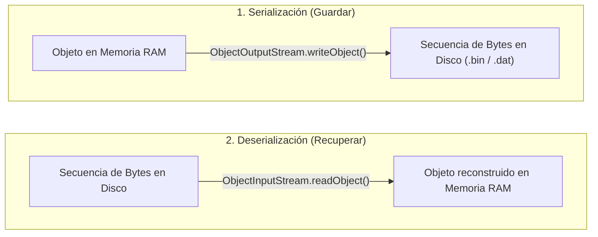

<div class="justify-text">

Hasta ahora hemos trabajado con archivos de texto plano (logs, CSV y `.properties`), donde la información se codifica en caracteres legibles por personas. Sin embargo, en el desarrollo de software frecuentemente surge la necesidad de **guardar el estado íntegro de los objetos que residen en la memoria RAM** (con todas sus referencias, atributos y estructuras complejas) directamente en el disco para recuperarlos exactamente en el mismo estado en una ejecución posterior.

Este proceso de convertir un objeto en una secuencia ordenada de bytes para su almacenamiento o transmisión se denomina **serialización**.

En este tema aprenderemos cómo funciona la serialización nativa de Java, cómo utilizar los flujos `ObjectOutputStream` y `ObjectInputStream` con `try-with-resources`, la importancia del identificador de versiones `serialVersionUID`, el modificador `transient` y las razones por las cuales la industria actual complementa o sustituye este mecanismo con formatos estructurados como JSON.

---

## Persistencia Textual vs. Persistencia Binaria

La elección entre guardar datos en texto plano o en formato binario depende del caso de uso de la aplicación:

| Característica | Archivos de Texto (CSV, Properties, JSON) | Archivos Binarios Nativos |
| :--- | :--- | :--- |
| **Legibilidad** | Inmediata (se puede abrir e inspeccionar con cualquier editor). | Ilegible para humanos sin un visor hexadecimal o deserializador. |
| **Tamaño y Rendimiento** | Mayor tamaño por representación de caracteres y coste de parseo. | Muy compacto en disco y alta velocidad de lectura/escritura directa. |
| **Interoperabilidad** | Universal (compatible con Python, C#, Node.js, etc.). | Estrictamente acoplado al ecosistema de la Máquina Virtual de Java (JVM). |
| **Grafos de Objetos** | Requiere transformar y vincular manualmente IDs o relaciones. | Almacena automáticamente árboles y listas de objetos vinculados. |



---

## La Interfaz `java.io.Serializable`

Para que una clase Java pueda ser serializada por la máquina virtual, debe implementar obligatoriamente la interfaz **`java.io.Serializable`**:

```java
public class Jugador implements Serializable {
    // ...
}
```

:::info ¿Qué es una interfaz marcadora?
`Serializable` es una **interfaz marcadora** (*marker interface*): no contiene ningún método que debamos implementar obligatoriamente. Su única finalidad es autorizar a la JVM a inspeccionar la memoria del objeto y convertir sus campos en una secuencia de bytes. Si intentamos serializar un objeto de una clase que no implementa `Serializable`, Java lanzará en tiempo de ejecución una excepción fatal **`NotSerializableException`**.
:::

### Requisitos de los Objetos Anidados

Cuando serializamos un objeto que contiene referencias a otros objetos (o colecciones de objetos como `List<Habilidad>` o `Inventario`), **todos los objetos del grafo deben implementar también `Serializable`**. Si un solo objeto de la jerarquía no lo implementa, la serialización fallará por completo.

Los tipos primitivos (`int`, `double`, `boolean`) y las clases estándar del JDK como `String`, `ArrayList` o `HashMap` ya implementan `Serializable` de forma nativa.

---

## Control de Versiones con `serialVersionUID`

Cada clase serializable debe declarar una constante estática de tipo `long` denominada **`serialVersionUID`**:

```java
private static final long serialVersionUID = 1L;
```

### ¿Para qué sirve?

El `serialVersionUID` actúa como el **número de versión del modelo de datos**. Durante la deserialización, la máquina virtual compara el identificador guardado dentro del archivo binario con el `serialVersionUID` de la clase compilada en el proyecto:

* **Si coinciden**: Java asume que la estructura de la clase es compatible y reconstruye el objeto.
* **Si no coinciden**: Java rechaza la carga y lanza una excepción **`InvalidClassException`**, impidiendo que se lean datos corruptos o incompatibles.

:::warning ¿Qué ocurre si no declaramos `serialVersionUID` explícitamente?
Si no lo escribes tú, el compilador de Java calcula uno automáticamente en base a los métodos, nombres y tipos de atributos de la clase. Esto es muy peligroso: el más mínimo cambio en la clase (como añadir un método o cambiar el orden de un getter) alterará el código generado, provocando que los archivos binarios guardados previamente queden **inutilizables para siempre**. Por ello, es una regla de oro declarar siempre `serialVersionUID = 1L` manualmente.
:::

---

## Atributos Omitidos: La Palabra Clave `transient`

En ocasiones, ciertos atributos de una clase **no deben guardarse** en el archivo binario:
1. **Datos confidenciales**: Contraseñas en texto claro, tokens de sesión o claves secretas.
2. **Datos calculados o efímeros**: Temporizadores, variables de caché o contadores de sesión que no tiene sentido restaurar.
3. **Recursos vinculados al sistema operativo**: Conexiones de red (`Socket`), descriptores de archivos o hilos (`Thread`), que no pueden sobrevivir al reinicio de la aplicación.

Marcando un atributo con la palabra clave **`transient`**, Java lo ignora por completo durante el guardado:

```java
public class Usuario implements Serializable {
    private static final long serialVersionUID = 1L;

    private String login;
    private transient String passwordTemporal; // NO se guardará en el archivo
    private transient int intentosFallidosSesion; // NO se guardará en el archivo
}
```

:::tip ¿Qué valor toma un campo `transient` al deserializar?
Al recuperar el objeto desde el archivo, los atributos `transient` se inicializan con su valor por defecto en Java (`null` para objetos, `0` para números y `false` para booleanos).
:::

---

## Flujos de Objetos: `ObjectOutputStream` y `ObjectInputStream`

Para trabajar con archivos binarios combinamos la API moderna **Java NIO.2** (`Files.newOutputStream` y `Files.newInputStream`) con los flujos de objetos tradicionales del JDK bajo bloques **`try-with-resources`**:

### Escritura de Objetos

```java
Path ruta = Path.of("datos", "jugador.dat");

try (ObjectOutputStream oos = new ObjectOutputStream(Files.newOutputStream(ruta))) {
    Jugador jugador = new Jugador("Alex", 15, 2500.0);
    oos.writeObject(jugador);
    System.out.println("Objeto serializado correctamente.");
} catch (IOException e) {
    System.err.println("Error al guardar: " + e.getMessage());
}
```

### Lectura de Objetos

El método `readObject()` lee los bytes y devuelve una referencia genérica `Object`, por lo que es necesario realizar una **conversión explícita (*casting*)** a la clase concreta:

```java
Path ruta = Path.of("datos", "jugador.dat");

try (ObjectInputStream ois = new ObjectInputStream(Files.newInputStream(ruta))) {
    Jugador jugador = (Jugador) ois.readObject();
    System.out.println("Jugador recuperado: " + jugador.getNombre());
} catch (IOException | ClassNotFoundException e) {
    System.err.println("Error al leer el archivo: " + e.getMessage());
}
```

:::info Manejo de `ClassNotFoundException`
El método `readObject()` puede lanzar `ClassNotFoundException` si el archivo contiene una clase que la máquina virtual actual no encuentra en el proyecto o en sus paquetes.
:::

---

## Demo Completa: Persistencia del Estado de una Partida

A continuación implementamos una demo completa compuesta por dos clases:
1. La clase de dominio **`EstadoPartida`**, que modela los datos a guardar implementando `Serializable`, definiendo su `serialVersionUID` y marcando atributos `transient`.
2. El programa principal **`DemoSerializacionBinaria`**, que guarda el estado de la partida en un archivo `.bin` y posteriormente lo recupera comprobando la persistencia de los datos.

### La Clase Serializable

```java title="src/es/iesagora/ada/ficheros/EstadoPartida.java"
package es.iesagora.ada.ficheros;

import java.io.Serializable;
import java.time.LocalDateTime;
import java.util.ArrayList;
import java.util.List;

public class EstadoPartida implements Serializable {

    // Identificador único para el control de versiones de la clase
    private static final long serialVersionUID = 1L;

    private String nombreJugador;
    private int nivel;
    private int puntosExperiencia;
    private List<String> logrosDesbloqueados;

    // Campo efímero: no queremos guardarlo en disco
    private transient String tokenSesionTemporal;

    public EstadoPartida(String nombreJugador, int nivel, int puntosExperiencia, String tokenSesionTemporal) {
        this.nombreJugador = nombreJugador;
        this.nivel = nivel;
        this.puntosExperiencia = puntosExperiencia;
        this.tokenSesionTemporal = tokenSesionTemporal;
        this.logrosDesbloqueados = new ArrayList<>();
    }

    public void agregarLogro(String logro) {
        this.logrosDesbloqueados.add(logro);
    }

    // Getters
    public String getNombreJugador() {
        return nombreJugador;
    }

    public int getNivel() {
        return nivel;
    }

    public int getPuntosExperiencia() {
        return puntosExperiencia;
    }

    public List<String> getLogrosDesbloqueados() {
        return logrosDesbloqueados;
    }

    public String getTokenSesionTemporal() {
        return tokenSesionTemporal;
    }

    @Override
    public String toString() {
        return "EstadoPartida{" +
                "nombreJugador='" + nombreJugador + '\'' +
                ", nivel=" + nivel +
                ", puntosExperiencia=" + puntosExperiencia +
                ", logrosDesbloqueados=" + logrosDesbloqueados +
                ", tokenSesionTemporal='" + tokenSesionTemporal + '\'' +
                '}';
    }
}
```

---

### El Programa de Serialización y Deserialización

```java title="src/es/iesagora/ada/ficheros/DemoSerializacionBinaria.java"
package es.iesagora.ada.ficheros;

import java.io.IOException;
import java.io.InputStream;
import java.io.ObjectInputStream;
import java.io.ObjectOutputStream;
import java.io.OutputStream;
import java.nio.file.Files;
import java.nio.file.Path;

public class DemoSerializacionBinaria {

    public static void main(String[] args) {
        System.out.println("=== SERIALIZACIÓN Y PERSISTENCIA BINARIA DE OBJETOS ===");

        Path carpeta = Path.of("datos_binarios");
        Path archivoPartida = carpeta.resolve("partida_guardada.bin");

        try {
            // PASO 1: Asegurar que la carpeta de destino existe
            if (Files.notExists(carpeta)) {
                Files.createDirectories(carpeta);
            }

            // PASO 2: Crear el objeto en memoria con sus datos iniciales
            System.out.println("\n1. Creando partida en memoria...");
            EstadoPartida partidaActual = new EstadoPartida("AdaLovelace", 12, 4580, "TOKEN-XYZ-9981");
            partidaActual.agregarLogro("Primeros pasos");
            partidaActual.agregarLogro("Explorador novato");
            partidaActual.agregarLogro("Maestro de la lógica");

            System.out.println("   Objeto original antes de guardar:");
            System.out.println("   " + partidaActual);

            // PASO 3: Serializar el objeto hacia el archivo binario
            System.out.println("\n2. Guardando estado en archivo binario '" + archivoPartida.getFileName() + "'...");
            try (OutputStream flujoArchivo = Files.newOutputStream(archivoPartida);
                 ObjectOutputStream oos = new ObjectOutputStream(flujoArchivo)) {

                oos.writeObject(partidaActual);
            }
            System.out.println("   Partida serializada y guardada con éxito.");

            // PASO 4: Deserializar el objeto desde el archivo binario
            System.out.println("\n3. Leyendo y recuperando el objeto desde el disco...");
            EstadoPartida partidaRecuperada;
            try (InputStream flujoLectura = Files.newInputStream(archivoPartida);
                 ObjectInputStream ois = new ObjectInputStream(flujoLectura)) {

                partidaRecuperada = (EstadoPartida) ois.readObject();
            }

            // PASO 5: Verificar los datos restaurados y el comportamiento de transient
            System.out.println("   Objeto restaurado en memoria:");
            System.out.println("   " + partidaRecuperada);

            System.out.println("\n--- COMPROBACIÓN DE CAMPOS ---");
            System.out.println("   Jugador             : " + partidaRecuperada.getNombreJugador());
            System.out.println("   Nivel               : " + partidaRecuperada.getNivel());
            System.out.println("   Logros guardados    : " + partidaRecuperada.getLogrosDesbloqueados().size());
            System.out.println("   Token temporal      : " + partidaRecuperada.getTokenSesionTemporal() 
                    + " (nulo porque se marcó como transient)");

        } catch (IOException e) {
            System.err.println("Error de entrada/salida en el archivo binario: " + e.getMessage());
            e.printStackTrace();
        } catch (ClassNotFoundException e) {
            System.err.println("No se encontró la definición de la clase a recuperar: " + e.getMessage());
            e.printStackTrace();
        }
    }
}
```

---

## Limitaciones de la Serialización Nativa

Aunque la serialización binaria nativa es muy cómoda en Java para proyectos pequeños o volcados locales rápidos, presenta serias desventajas en el desarrollo profesional:

1. **Incompatibilidad con otros lenguajes**: Un archivo generado con `ObjectOutputStream` solo puede ser interpretado por una Máquina Virtual de Java. No puede ser consumido por aplicaciones en JavaScript/TypeScript, Python o bases de datos externas.
2. **Fragilidad ante cambios**: Cambiar el paquete de la clase, renombrar atributos o modificar tipos puede invalidar todos los archivos binarios existentes en producción.
3. **Riesgos de seguridad**: La deserialización de streams procedentes de fuentes no confiables (como peticiones de red) es una de las vulnerabilidades más conocidas en Java (*deserialization vulnerabilities*), ya que permite la inyección y ejecución de código malicioso.

:::tip La alternativa moderna en la industria: JSON y XML
Debido a estas limitaciones, en los sistemas distribuidos y arquitecturas empresariales actuales se prefieren formatos abiertos basados en texto estructurado como **JSON** y **XML**. En el siguiente tema aprenderemos a gestionar dependencias con **Maven** y a utilizar **Jackson** para serializar objetos de forma interoperable y segura.
:::

</div>
