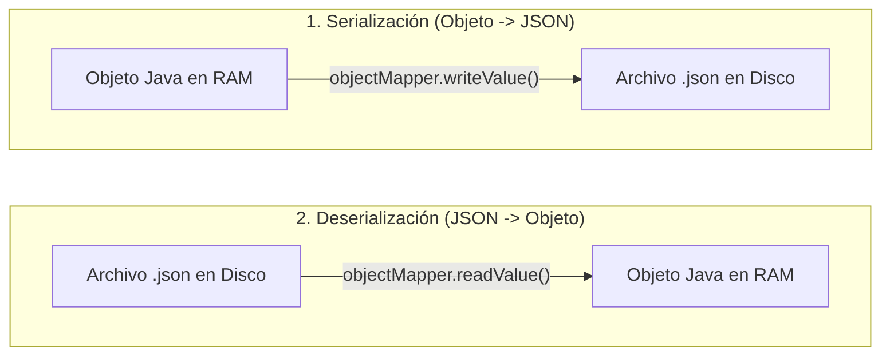

<div class="justify-text">

Hasta este punto de la unidad hemos desarrollado todos los ejemplos utilizando únicamente las clases estándar integradas en el Java Development Kit (JDK). Sin embargo, en el desarrollo de software real, los proyectos se apoyan continuamente en **librerías de terceros** creadas por la comunidad o empresas tecnológicas para resolver tareas complejas: procesar formatos modernos como JSON o XML, conectar a bases de datos relacionales o manejar pools de conexiones.

Para no tener que descargar y enlazar archivos `.jar` manualmente en cada ordenador, el estándar en el ecosistema Java es emplear un **gestor de dependencias y construcción**.

En este tema introduciremos **Apache Maven** y su archivo `pom.xml`, y utilizaremos la librería de referencia en la industria (**Jackson**) para serializar y deserializar el formato de intercambio de datos rey de la web: **JSON**.

---

## Introducción a Apache Maven

**Apache Maven** es una herramienta de gestión y automatización de proyectos para Java. Sus dos responsabilidades primordiales son:

1. **Gestión centralizada de dependencias**: Descarga automáticamente desde repositorios remotos (como *Maven Central*) las librerías que nuestro proyecto necesita, resolviendo además sus dependencias transitivas (librerías que a su vez dependen de otras).
2. **Estructura homogénea de directorios**: Cualquier desarrollador o sistema de integración continua (CI/CD) sabe dónde encontrar el código fuente, los recursos y los tests sin importar el IDE utilizado (IntelliJ IDEA, Eclipse o VS Code).

### Estructura Estándar de un Proyecto Maven

```text
mi-proyecto/
├── pom.xml                     # Fichero descriptor de configuración y dependencias
└── src/
    ├── main/
    │   ├── java/               # Código fuente Java de la aplicación
    │   │   └── es/iesagora/ada/...
    │   └── resources/          # Archivos de configuración (.properties, .json, etc.)
    └── test/
        └── java/               # Pruebas unitarias automatizadas
```

---

## Instalación de Apache Maven

Para poder compilar y gestionar proyectos con Maven desde el terminal y permitir que herramientas de línea de comandos lo detecten globalmente en el sistema operativo, es necesario instalarlo.

:::info Prerrequisito: Tener instalado el JDK
Maven requiere que tengas instalado un **Java Development Kit (JDK 21 o superior)** y que la variable de entorno `JAVA_HOME` esté configurada. Puedes comprobarlo ejecutando en tu terminal:
```bash
java -version
```
:::

### Instalación en Windows

Para instalar Maven en sistemas Windows dispones de dos alternativas (mediante gestor de paquetes o manual):

#### Opción A: Mediante Winget (Recomendada y automática)

Abre una consola de **PowerShell** o **Símbolo del sistema (CMD)** como Administrador y ejecuta:

```powershell
winget install Apache.Maven
```

Cierra y vuelve a abrir la consola para que se recarguen las variables de entorno.

#### Opción B: Instalación Manual mediante archivo ZIP

1. Accede a la página oficial de descargas: [https://maven.apache.org/download.cgi](https://maven.apache.org/download.cgi).
2. Descarga el archivo comprimido **Binary zip archive** (por ejemplo, `apache-maven-3.9.16-bin.zip`).
3. Descomprime la carpeta en una ruta limpia y sin espacios (por ejemplo, en `C:\Program Files\apache-maven-3.9.16` o `C:\maven`).
4. Añade Maven a las **Variables de Entorno del Sistema**:
   * Presiona `Win + S`, escribe **Variables de entorno** y pulsa *Editar las variables de entorno del sistema*.
   * Haz clic en el botón **Variables de entorno...**.
   * En el panel inferior (*Variables del sistema*), pulsa **Nueva...**:
     * **Nombre de la variable**: `MAVEN_HOME`
     * **Valor de la variable**: `C:\Program Files\apache-maven-3.9.16` (la ruta donde descomprimiste la carpeta).
   * En ese mismo panel inferior, busca la variable llamada **`Path`**, selecciónala y pulsa **Editar...**.
   * Pulsa **Nuevo** y escribe: `%MAVEN_HOME%\bin` (o la ruta completa hacia la carpeta `bin`).
   * Pulsa **Aceptar** en todas las ventanas abiertas para guardar los cambios.

---

### Instalación en Linux

En los equipos de las aulas de informática, los alumnos habitualmente no disponen de permisos de administrador (`sudo`/`root`) para ejecutar `apt`. Por ello, la instalación se realiza en el espacio de usuario descomprimiendo el archivo binario oficial y añadiéndolo al archivo de configuración de la shell (`~/.bashrc`):

1. **Descargar Maven**:
   Accede a la web oficial [https://maven.apache.org/download.cgi](https://maven.apache.org/download.cgi) y descarga el archivo comprimido **Binary tar.gz archive** (ejemplo: `apache-maven-3.9.16-bin.tar.gz`).

2. **Descomprimir en tu carpeta de usuario**:
   Mueve el archivo descargado a tu directorio personal (o partición de usuario, ej. `/media/sda1/tunombre_usuario` o en tu `$HOME`) y descomprímelo:
   ```bash
   tar -xvf apache-maven-3.9.16-bin.tar.gz
   ```

3. **Editar el archivo de configuración de tu terminal (`~/.bashrc`)**:
   Abre tu archivo `.bashrc` con el editor `nano`:
   ```bash
   nano ~/.bashrc
   ```

4. **Añadir Maven a tu PATH**:
   Desplázate con las flechas hasta el final del archivo y añade la siguiente línea (ajustando la ruta a tu carpeta exacta de usuario y versión descargada):
   ```bash
   export PATH=/media/sda1/tunombre_usuario/apache-maven-3.9.16/bin:$PATH
   ```
   *(Pulsa `Ctrl + O` y luego `Enter` para guardar, y después `Ctrl + X` para salir del editor nano).*

5. **Aplicar los cambios en la terminal actual**:
   ```bash
   source ~/.bashrc
   ```

---

### Instalación en macOS

En macOS la instalación recomendada es a través del gestor de paquetes **Homebrew**:

```bash
brew install maven
```

*(Si no dispones de Homebrew, puedes seguir los mismos pasos manuales que en Linux añadiendo la línea al final de tu archivo `~/.zshrc`).*

---

### Verificación de la Instalación

Una vez instalado en tu sistema operativo, abre una **nueva ventana de terminal** (PowerShell, CMD, Bash o Zsh) y ejecuta el siguiente comando para verificar que Maven está disponible globalmente:

```bash
mvn -version
```

Deberás ver una salida similar a la siguiente indicando la versión de Maven, la versión del JDK detectada y el sistema operativo:

```text
Apache Maven 3.9.16 (8e8579a9e76f7d015ee5ec7bfcdc97d260186937)
Maven home: /opt/homebrew/Cellar/maven/3.9.16/libexec
Java version: 21.0.2, vendor: Homebrew, runtime: /Library/Java/...
Default locale: es_ES, platform encoding: UTF-8
OS name: "mac os x", version: "15.0", arch: "aarch64", family: "mac"
```

:::tip Integración nativa con IntelliJ IDEA
IntelliJ IDEA incluye internamente un instalador de Maven integrado (*Bundled Maven*). Sin embargo, instalarlo a nivel de sistema operativo te permite compilar proyectos directamente desde terminal, automatizar tareas y ejecutar plugins sin depender exclusivamente de una interfaz gráfica.
:::

---

## Creación de un Proyecto Maven en IntelliJ IDEA

A partir de este tema, cada vez que creemos un nuevo proyecto en IntelliJ IDEA que utilice librerías externas ya no utilizaremos el sistema de construcción por defecto de IntelliJ, sino que **seleccionaremos Maven como sistema de construcción (*Build system*)**.

Al iniciar el asistente de creación de proyecto (**File $\rightarrow$ New $\rightarrow$ Project...**):
1. Selecciona **Java** en el menú lateral izquierdo.
2. Asigna un nombre al proyecto y su ubicación en disco.
3. En el apartado **Build system**, selecciona la opción **Maven** (en lugar de IntelliJ):

<div style={{ textAlign: 'center', margin: '20px 0' }}>
  
</div>

Al pulsar **Create**, IntelliJ IDEA generará automáticamente la estructura estándar de carpetas y el fichero descriptor **`pom.xml`** en la raíz de tu proyecto.

---

## Anatomía del Archivo `pom.xml`

El archivo `pom.xml` (*Project Object Model*) reside en la raíz del proyecto y define su configuración en formato XML.

Toda librería en Maven se localiza unívocamente mediante sus **coordenadas GAV**:
* **`groupId`**: Identifica la organización o empresa creadora (suele ser el dominio web invertido, ej. `com.fasterxml.jackson.core`).
* **`artifactId`**: Nombre específico de la librería o artefacto (ej. `jackson-databind`).
* **`version`**: Número de versión de la librería (ej. `2.22.3`).

```xml title="pom.xml"
<?xml version="1.0" encoding="UTF-8"?>
<project xmlns="http://maven.apache.org/POM/4.0.0"
         xmlns:xsi="http://www.w3.org/2001/XMLSchema-instance"
         xsi:schemaLocation="http://maven.apache.org/POM/4.0.0 
         https://maven.apache.org/xsd/maven-4.0.0.xsd">
    <modelVersion>4.0.0</modelVersion>

    <groupId>es.iesagora.ada</groupId>
    <artifactId>ut2-manejo-ficheros</artifactId>
    <version>1.0-SNAPSHOT</version>

    <properties>
        <maven.compiler.source>21</maven.compiler.source>
        <maven.compiler.target>21</maven.compiler.target>
        <project.build.sourceEncoding>UTF-8</project.build.sourceEncoding>
    </properties>

    <dependencies>
        <!-- Dependencia de Jackson Databind para JSON -->
        <dependency>
            <groupId>com.fasterxml.jackson.core</groupId>
            <artifactId>jackson-databind</artifactId>
            <version>2.22.3</version>
        </dependency>
    </dependencies>
</project>
```

:::tip Cómo recargar dependencias en IntelliJ IDEA
Al añadir o modificar una etiqueta `<dependency>` en el `pom.xml`, aparecerá un pequeño icono flotante con la **M** de Maven en la esquina superior derecha del editor en IntelliJ IDEA. Haz clic en él (o pulsa `Ctrl + Shift + O` / `Cmd + Shift + I`) para que Maven descargue los `.jar` automáticamente y los indexe en el proyecto.
:::

---

## El Formato de Intercambio JSON

**JSON** (*JavaScript Object Notation*) es un formato de texto ligero, universal y fácilmente comprensible tanto por humanos como por ordenadores. Es el estándar *de facto* para la comunicación cliente-servidor en servicios web RESTful, microservicios y bases de datos documentales NoSQL como MongoDB.

### Estructura y Tipos de Datos en JSON

Un documento JSON está formado por dos estructuras fundamentales:
* **Objetos `{}`**: Colecciones desordenadas de pares `clave: valor`. Las claves siempre van entre comillas dobles (`"nombre": "Monitor"`).
* **Arrays `[]`**: Listas ordenadas de valores separados por comas.

Los valores admitidos son: cadenas de texto (`"..."`), números (`42`, `19.99`), booleanos (`true`, `false`), valores nulos (`null`), otros objetos anidados u otros arrays.

#### Ejemplo Básico: Objeto Simple con Array

```json title="datos/producto_ejemplo.json"
{
  "id": 101,
  "nombre": "Portatil Gaming",
  "categoria": "Informatica",
  "precio": 1199.99,
  "etiquetas": ["electronica", "ordenadores", "gaming"]
}
```

#### Ejemplo Complejo: Estructura Jerárquica Empresarial

En el desarrollo backend y en las APIs reales, los documentos JSON representan frecuentemente **estructuras jerárquicas completas**: objetos que contienen otros objetos anidados, arrays de objetos independientes y metadatos del sistema.

Observa el siguiente ejemplo de un pedido comercial:
* Contiene datos primitivos (`idPedido`, `fecha`, `total`).
* Contiene un **objeto anidado** (`cliente`) con su propia dirección también anidada (`direccion`).
* Contiene un **array de objetos** (`lineasPedido`), donde cada elemento representa un producto con su identificador, cantidad y precio unitario:

```json title="datos/pedido_complejo.json"
{
  "idPedido": "PED-2026-8941",
  "fecha": "2026-09-29T10:30:00",
  "estado": "PROCESANDO",
  "cliente": {
    "nif": "12345678Z",
    "nombre": "Elena Gomez",
    "contacto": {
      "email": "elena.gomez@empresa.com",
      "telefono": "+34 600 123 456"
    },
    "direccion": {
      "calle": "Avenida de la Constitucion, 45",
      "ciudad": "Badajoz",
      "codigoPostal": "06001",
      "pais": "Espana"
    }
  },
  "lineasPedido": [
    {
      "posicion": 1,
      "productoId": 101,
      "descripcion": "Portatil Gaming 16GB RAM",
      "cantidad": 1,
      "precioUnitario": 1199.99
    },
    {
      "posicion": 2,
      "productoId": 103,
      "descripcion": "Teclado Mecanico RGB",
      "cantidad": 2,
      "precioUnitario": 89.50
    }
  ],
  "pago": {
    "metodo": "TARJETA",
    "transaccionId": "TXN-984210",
    "confirmado": true
  },
  "subtotal": 1378.99,
  "impuestos": 289.59,
  "total": 1668.58
}
```

:::info ¿Qué estructura de clases crees que deberíamos crear?
Observando el JSON anterior, reflexiona:
* ¿Bastaría con una sola clase Java para almacenar toda esta información?
* ¿Qué clases independientes necesitaríamos modelar en nuestro proyecto?
* ¿Cómo se relacionarían entre sí en Java para que Jackson sea capaz de reconstruir recursivamente todo este árbol de objetos?
:::

---

## Data Binding con Jackson: `ObjectMapper`

Para transformar datos entre texto JSON y objetos Java utilizaremos la librería **Jackson**, estándar absoluto de la industria adoptado por grandes frameworks como Spring Framework.

El componente central de Jackson es la clase **`ObjectMapper`**, que realiza el proceso de **Data Binding** (vinculación automática de datos entre claves JSON y atributos Java):



### Operaciones Esenciales

1. **Serialización a JSON con formato legible (*Pretty Print*)**:
   ```java
   ObjectMapper mapper = new ObjectMapper();
   // Escribe con saltos de línea e indentación para facilitar su lectura
   mapper.writerWithDefaultPrettyPrinter().writeValue(Path.of("datos", "producto.json").toFile(), producto);
   ```

2. **Deserialización de un único objeto desde archivo**:
   ```java
   // Lee el archivo y mapea automáticamente sus claves a los atributos de la clase Producto
   Producto p = mapper.readValue(Path.of("datos", "producto.json").toFile(), Producto.class);
   ```

3. **Deserialización de colecciones (Listas) con `TypeReference`**:
   Cuando el archivo JSON contiene una lista (`[...]`), Java pierde la información del tipo genérico en tiempo de compilación (*type erasure*). Para deserializar correctamente una `List<Producto>`, Jackson proporciona la clase abstracta **`TypeReference`**:
   ```java
   List<Producto> lista = mapper.readValue(
           Path.of("datos", "catalogo.json").toFile(),
           new TypeReference<List<Producto>>() {}
   );
   ```

---

## Demo Completa: Procesamiento de JSON con Jackson

Para afianzar el uso de Maven, Jackson y el procesamiento de JSON, implementaremos un modelo de datos `Producto` con sus getters/setters habituales y un programa ejecutable que:
1. Lee un archivo JSON de productos preexistente en disco.
2. Muestra los productos y sus etiquetas por pantalla.
3. Modifica el precio de un producto y añade uno nuevo a la colección.
4. Serializa la lista actualizada a un nuevo archivo JSON con formato indentado (*pretty printing*).

### Archivo de Ejemplo Descargable

:::info Descarga del catálogo JSON de prueba
Puedes descargar el archivo de datos base para realizar las pruebas:
* 📥 **<a href="/DevTacora/recursos/ada_ut2/catalogo_productos.json" download="catalogo_productos.json">Descargar catalogo_productos.json</a>**

Coloca el archivo descargado dentro de una carpeta llamada `datos_json` en la raíz de tu proyecto.
:::

El contenido del archivo `catalogo_productos.json` es el siguiente:

```json title="datos_json/catalogo_productos.json"
[
  {
    "id": 101,
    "nombre": "Portatil Gaming",
    "categoria": "Informatica",
    "precio": 1199.99,
    "etiquetas": ["electronica", "ordenadores", "gaming"]
  },
  {
    "id": 102,
    "nombre": "Raton Inalambrico",
    "categoria": "Accesorios",
    "precio": 29.95,
    "etiquetas": ["perifericos", "inalambrico"]
  },
  {
    "id": 103,
    "nombre": "Teclado Mecanico RGB",
    "categoria": "Accesorios",
    "precio": 89.50,
    "etiquetas": ["perifericos", "gaming", "teclados"]
  }
]
```

---

### La Clase de Modelo

Jackson requiere para deserializar clases estándar que exista un **constructor vacío por defecto** y métodos **getters y setters** para acceder y asignar cada propiedad:

```java title="src/main/java/es/iesagora/ada/ficheros/Producto.java"
package es.iesagora.ada.ficheros;

import java.util.List;

public class Producto {

    private int id;
    private String nombre;
    private String categoria;
    private double precio;
    private List<String> etiquetas;

    // Constructor vacío OBLIGATORIO para que Jackson pueda instanciar la clase por reflexión
    public Producto() {
    }

    public Producto(int id, String nombre, String categoria, double precio, List<String> etiquetas) {
        this.id = id;
        this.nombre = nombre;
        this.categoria = categoria;
        this.precio = precio;
        this.etiquetas = etiquetas;
    }

    // Getters y Setters
    public int getId() {
        return id;
    }

    public void setId(int id) {
        this.id = id;
    }

    public String getNombre() {
        return nombre;
    }

    public void setNombre(String nombre) {
        this.nombre = nombre;
    }

    public String getCategoria() {
        return categoria;
    }

    public void setCategoria(String categoria) {
        this.categoria = categoria;
    }

    public double getPrecio() {
        return precio;
    }

    public void setPrecio(double precio) {
        this.precio = precio;
    }

    public List<String> getEtiquetas() {
        return etiquetas;
    }

    public void setEtiquetas(List<String> etiquetas) {
        this.etiquetas = etiquetas;
    }

    @Override
    public String toString() {
        return "Producto{" +
                "id=" + id +
                ", nombre='" + nombre + '\'' +
                ", categoria='" + categoria + '\'' +
                ", precio=" + precio + " €" +
                ", etiquetas=" + etiquetas +
                '}';
    }
}
```

---

### El Programa de Procesamiento JSON

```java title="src/main/java/es/iesagora/ada/ficheros/DemoProcesamientoJson.java"
package es.iesagora.ada.ficheros;

import com.fasterxml.jackson.core.type.TypeReference;
import com.fasterxml.jackson.databind.ObjectMapper;

import java.io.IOException;
import java.nio.file.Files;
import java.nio.file.Path;
import java.util.ArrayList;
import java.util.List;

public class DemoProcesamientoJson {

    public static void main(String[] args) {
        System.out.println("=== PROCESAMIENTO DE FORMATO JSON CON JACKSON ===");

        Path carpeta = Path.of("datos_json");
        Path archivoOriginal = carpeta.resolve("catalogo_productos.json");
        Path archivoCopia = carpeta.resolve("catalogo_backup.json");

        // Comprobamos la existencia del archivo antes de operar
        if (Files.notExists(archivoOriginal)) {
            System.err.println("El archivo no existe en: " + archivoOriginal.toAbsolutePath());
            System.err.println("Descarga 'catalogo_productos.json' y colócalo en la carpeta 'datos_json'.");
            return;
        }

        // Instancia principal de Jackson
        ObjectMapper mapper = new ObjectMapper();

        try {
            // PASO 1: Deserializar el archivo JSON a una lista de objetos Java
            System.out.println("\n1. Leyendo catálogo desde '" + archivoOriginal.getFileName() + "'...");
            List<Producto> productos = mapper.readValue(
                    archivoOriginal.toFile(),
                    new TypeReference<List<Producto>>() {}
            );
            System.out.println("   Productos cargados: " + productos.size());

            // PASO 2: Mostrar los productos leídos por consola
            System.out.println("\n2. Listado de productos:");
            for (Producto p : productos) {
                System.out.println("   > " + p.getNombre() + " (" + p.getCategoria() + ") - " + p.getPrecio() + " €");
                System.out.println("     Etiquetas: " + String.join(", ", p.getEtiquetas()));
            }

            // PASO 3: Modificar un producto existente (rebaja del portátil)
            Producto primerProducto = productos.get(0);
            primerProducto.setPrecio(1049.99);
            System.out.println("\n3. Precio del producto '" + primerProducto.getNombre() + "' rebajado a " + primerProducto.getPrecio() + " €");

            // PASO 4: Añadir un nuevo producto a la lista
            // Creamos una lista mutable auxiliar por si la devuelta fuera de tamaño fijo
            List<Producto> listaActualizada = new ArrayList<>(productos);
            Producto nuevoProducto = new Producto(
                    104,
                    "Monitor Curvo 34 Pulgadas",
                    "Monitores",
                    389.00,
                    List.of("ultrawide", "pantallas", "oficina")
            );
            listaActualizada.add(nuevoProducto);
            System.out.println("4. Añadido nuevo producto: " + nuevoProducto.getNombre());

            // PASO 5: Guardar los datos actualizados (Dos casos de uso habituales)

            // CASO A: Sobreescribir el propio archivo original (Persistencia directa)
            // Jackson trunca y sobreescribe automáticamente todo el contenido del archivo con el nuevo estado
            System.out.println("\n5.A. Sobreescribiendo el archivo original '" + archivoOriginal.getFileName() + "'...");
            mapper.writerWithDefaultPrettyPrinter().writeValue(archivoOriginal.toFile(), listaActualizada);
            System.out.println("     Archivo original actualizado correctamente.");

            // CASO B: Guardar en un archivo nuevo (Copia de seguridad / Exportación)
            // Ideal si queremos conservar un histórico o snapshot sin alterar la fuente de partida
            System.out.println("\n5.B. Exportando copia de respaldo en '" + archivoCopia.getFileName() + "'...");
            mapper.writerWithDefaultPrettyPrinter().writeValue(archivoCopia.toFile(), listaActualizada);
            System.out.println("     Copia de respaldo generada con éxito (" + listaActualizada.size() + " productos).");

        } catch (IOException e) {
            System.err.println("Error procesando los datos JSON: " + e.getMessage());
            e.printStackTrace();
        }
    }
}
```

:::tip Diferencias clave con la serialización nativa
A diferencia de los archivos binarios vistos en el tema anterior:
* El archivo resultante `catalogo_actualizado.json` puede abrirse con cualquier editor de texto o enviarse por la red hacia cualquier frontend o servicio externo.
* El archivo no depende de la JVM ni de un `serialVersionUID`, lo que proporciona máxima interoperabilidad y tolerancia ante versiones.
:::

</div>
