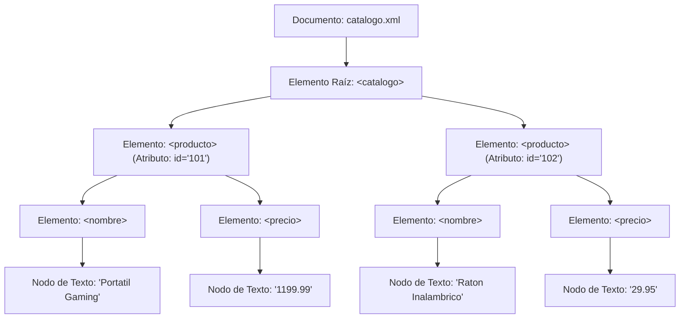
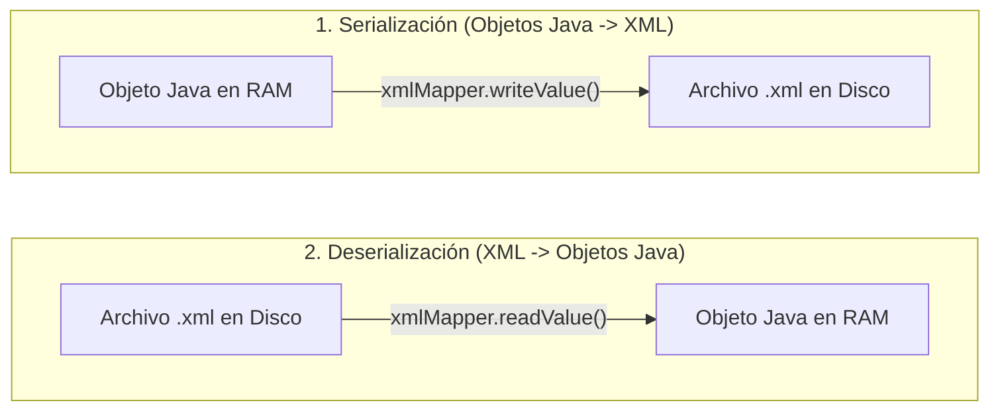

<div class="justify-text">

Junto a JSON, el formato **XML** (*eXtensible Markup Language*) ha sido históricamente el gran estándar de intercambio y persistencia de información en entornos corporativos. Aunque en las aplicaciones web modernas predomina JSON, XML sigue siendo el lenguaje fundamental en la configuración de servidores empresariales, servicios web SOAP, especificaciones gubernamentales (como la facturación electrónica) y en los propios descriptores de proyectos como el `pom.xml` de Maven o el `AndroidManifest.xml` de Android.

En este tema aprenderemos la estructura del formato XML, analizaremos brevemente la arquitectura conceptual en árbol (**DOM**) y utilizaremos la aproximación más ágil y estándar de la industria actual: el **Data Binding con Jackson XML** (`XmlMapper`), reutilizando el mismo modelo de clases que en JSON.

---

## Estructura del Formato XML

Un documento XML es un archivo de texto plano estructurado de forma estrictamente jerárquica en elementos delimitados por etiquetas:

* **Prólogo XML**: La primera línea declara la versión y la codificación utilizada:
  ```xml
  <?xml version="1.0" encoding="UTF-8"?>
  ```
* **Elemento Raíz (*Root Element*)**: Todo documento XML bien formado debe contener **un único elemento raíz** que envuelve a todos los demás:
  ```xml
  <catalogo>
      <!-- El resto de elementos anidados residen aquí -->
  </catalogo>
  ```
* **Etiquetas y Contenido**: Cada elemento tiene una etiqueta de apertura (`<nombre>`), su contenido textual y una etiqueta de cierre (`</nombre>`). Si un elemento no tiene contenido, puede cerrarse de forma abreviada (`<foto />`).
* **Atributos**: Metadatos que se colocan dentro de la etiqueta de apertura en formato `nombre="valor"`:
  ```xml
  <producto id="101" categoria="Informatica">
  ```

### XML vs. JSON

| Aspecto | JSON | XML |
| :--- | :--- | :--- |
| **Sintaxis** | Clave-valor compacta (`{"clave": "valor"}`) | Etiquetas con apertura y cierre (`<clave>valor</clave>`) |
| **Atributos** | No existen (todo son pares en el objeto) | Permite atributos dentro de la etiqueta (`<item id="1">`) |
| **Sobrecarga (Verbosity)** | Muy ligero, menor consumo de ancho de banda | Más verboso debido a la repetición de etiquetas de cierre |
| **Validación de esquema** | Opcional (JSON Schema) | Potente y estricta (XSD / DTD) |
| **Uso habitual** | APIs REST, apps móviles, bases de datos NoSQL | Configuración empresarial, servicios SOAP, Android, Maven |

---

## La Arquitectura DOM Bajo el Capó

Históricamente, la lectura y modificación de archivos XML en Java se ha enseñado a través de la API estándar **DOM** (*Document Object Model*) provista por el paquete `javax.xml.parsers`.

### ¿Cómo funciona el árbol DOM?

El analizador sintáctico (*parser*) DOM lee el archivo XML completo y construye en la memoria RAM una **representación en árbol de objetos**, donde absolutamente todo es un nodo (`org.w3c.dom.Node`):
* El propio documento es un nodo (`Document`).
* Las etiquetas son nodos elemento (`Element`).
* El texto dentro de las etiquetas es un nodo hijo de tipo texto (`TextNode`).
* Los atributos son nodos de atributo (`Attr`).

Por ejemplo, si partimos del siguiente archivo XML:

```xml title="catalogo.xml"
<?xml version="1.0" encoding="UTF-8"?>
<catalogo>
    <producto id="101">
        <nombre>Portatil Gaming</nombre>
        <precio>1199.99</precio>
    </producto>
    <producto id="102">
        <nombre>Raton Inalambrico</nombre>
        <precio>29.95</precio>
    </producto>
</catalogo>
```

Al cargarlo en memoria con DOM, el analizador genera la siguiente jerarquía de nodos en RAM:



### El problema de manipular DOM a mano

Aunque comprender este árbol es esencial para entender cómo el software visualiza un documento jerárquico, manipularlo directamente con Java clásico requiere decenas de líneas de código repetitivo:
* Instanciar `DocumentBuilderFactory` y `DocumentBuilder`.
* Recorrer listas genéricas de nodos (`NodeList`) comprobando si cada nodo es de tipo `Node.ELEMENT_NODE` para descartar los saltos de línea invisibles.
* Obtener el texto hijo haciendo `elemento.getElementsByTagName("nombre").item(0).getTextContent()`.
* Para guardar, crear un `TransformerFactory`, un `Transformer` y configurar la indentación manualmente.

Por esta razón, la industria del software actual utiliza de forma masiva el **Data Binding**, delegando todo ese trabajo tedioso en librerías especializadas como **Jackson XML**.

---

## Data Binding con Jackson XML (`XmlMapper`)

Del mismo modo que en el tema anterior utilizamos `ObjectMapper` para vincular JSON con objetos Java, el módulo **Jackson Dataformat XML** proporciona la clase **`XmlMapper`**:

* **Mismo diseño y métodos**: Las operaciones para leer (`readValue()`) y escribir (`writeValue()`) son exactamente idénticas a las de JSON.
* **Mapeo automático**: Vincula las etiquetas XML con los atributos de nuestras clases Java POJO de forma transparente.



### Configuración de Dependencias en Maven

Para habilitar el soporte XML en nuestro proyecto, añadimos la dependencia `jackson-dataformat-xml` al archivo `pom.xml`:

```xml title="pom.xml"
<dependencies>
    <!-- Módulo de Jackson para soporte de XML -->
    <dependency>
        <groupId>com.fasterxml.jackson.dataformat</groupId>
        <artifactId>jackson-dataformat-xml</artifactId>
        <version>2.22.3</version>
    </dependency>
</dependencies>
```

---

## Anotaciones Clave de Jackson XML

Cuando modelamos nuestras clases Java para mapear documentos XML, utilizamos tres anotaciones fundamentales del paquete `com.fasterxml.jackson.dataformat.xml.annotation`:

### 1. `@JacksonXmlRootElement`
Permite definir el nombre de la etiqueta raíz del documento XML. Por defecto, Jackson utilizaría el nombre de la clase Java:
```java
@JacksonXmlRootElement(localName = "catalogo")
public class Catalogo { ... }
```

### 2. `@JacksonXmlProperty`
Permite personalizar cómo se mapea un atributo de la clase Java:
* Cambiar el nombre de la etiqueta: `@JacksonXmlProperty(localName = "coste")`.
* **Indicar que es un atributo XML** (en lugar de una etiqueta hija anidada):
```java
@JacksonXmlProperty(isAttribute = true)
private int id;
```

### 3. `@JacksonXmlElementWrapper`

En XML existen dos formas habituales de representar una lista o colección de elementos:

#### Forma A: Lista "Envuelta" (*Wrapped* — Comportamiento por defecto)
Por defecto, cuando Jackson encuentra una lista en Java como `List<Producto> productos`, asume que el documento XML cuenta con una **etiqueta contenedora intermedia** (un "envoltorio") con el nombre del atributo, y dentro de ella cada elemento hijo:

```xml
<catalogo>
    <!-- Etiqueta envoltorio intermedia <productos> -->
    <productos>
        <producto id="101">...</producto>
        <producto id="102">...</producto>
    </productos>
</catalogo>
```

#### Forma B: Lista "Directa" o Plana (*Unwrapped*)
Sin embargo, en muchos archivos XML (como en el que usaremos en esta unidad), los elementos cuelgan **directamente de la raíz** `<catalogo>`, sin ninguna etiqueta intermedia que los agrupe:

```xml
<catalogo>
    <!-- Elementos repetidos directamente dentro de <catalogo> -->
    <producto id="101">...</producto>
    <producto id="102">...</producto>
</catalogo>
```

#### ¿Cómo indicarle a Jackson que la lista no tiene envoltorio?

Si nuestro documento XML sigue la **Forma B (directa)**, debemos desactivar el contenedor con `useWrapping = false`. Al mismo tiempo, usamos `@JacksonXmlProperty(localName = "producto")` para especificar cómo se llama cada una de las etiquetas repetidas:

```java
// useWrapping = false: NO busques ni generes una etiqueta contenedora intermedia (<productos>)
@JacksonXmlElementWrapper(useWrapping = false)
// localName = "producto": Cada elemento de la lista corresponde a una etiqueta <producto>
@JacksonXmlProperty(localName = "producto")
private List<Producto> productos;
```

:::warning ¿Qué ocurre si olvidamos `useWrapping = false`?
Si el archivo XML tiene los productos directos pero no indicamos `useWrapping = false`:
* **Al leer (deserializar):** Jackson buscará una etiqueta `<productos>` que no existe. Como resultado, la lista en Java quedará vacía (`0` productos).
* **Al guardar (serializar):** Jackson creará automáticamente una etiqueta intermedia `<productos>`, cambiando la estructura del XML original.
:::

---

## Demo Completa: Procesamiento de Catálogo XML con Jackson

Para consolidar el aprendizaje, implementaremos un modelo de clases Java y un programa ejecutable que procesará un catálogo de productos informáticos en XML.

### Archivo de Ejemplo Descargable

:::info Descarga del catálogo XML de prueba
Puedes descargar el archivo de datos para realizar las pruebas en tu proyecto:
* 📥 **<a href="/DevTacora/recursos/ada_ut2/catalogo_productos.xml" download="catalogo_productos.xml">Descargar catalogo_productos.xml</a>**

Coloca el archivo descargado dentro de una carpeta llamada `datos_xml` en la raíz de tu proyecto Java.
:::

El archivo `catalogo_productos.xml` contiene la siguiente estructura con atributos y elementos anidados:

```xml title="datos_xml/catalogo_productos.xml"
<?xml version="1.0" encoding="UTF-8"?>
<catalogo>
    <producto id="101" categoria="Informatica">
        <nombre>Portatil Gaming</nombre>
        <precio>1199.99</precio>
        <stock>15</stock>
        <proveedor>
            <cif>B12345678</cif>
            <nombre>TechDistribuciones S.L.</nombre>
            <pais>España</pais>
        </proveedor>
        <etiquetas>
            <etiqueta>gaming</etiqueta>
            <etiqueta>portatil</etiqueta>
            <etiqueta>nvidia</etiqueta>
        </etiquetas>
    </producto>
    <producto id="102" categoria="Accesorios">
        <nombre>Raton Inalambrico</nombre>
        <precio>29.95</precio>
        <stock>40</stock>
        <proveedor>
            <cif>B87654321</cif>
            <nombre>Perifericos Global S.A.</nombre>
            <pais>España</pais>
        </proveedor>
        <etiquetas>
            <etiqueta>ergonomico</etiqueta>
            <etiqueta>inalambrico</etiqueta>
            <etiqueta>oficina</etiqueta>
        </etiquetas>
    </producto>
    <producto id="103" categoria="Accesorios">
        <nombre>Teclado Mecanico RGB</nombre>
        <precio>89.50</precio>
        <stock>25</stock>
        <proveedor>
            <cif>B87654321</cif>
            <nombre>Perifericos Global S.A.</nombre>
            <pais>España</pais>
        </proveedor>
        <etiquetas>
            <etiqueta>gaming</etiqueta>
            <etiqueta>mecanico</etiqueta>
            <etiqueta>rgb</etiqueta>
        </etiquetas>
    </producto>
    <producto id="104" categoria="Monitores">
        <nombre>Monitor Curvo 34 Pulgadas</nombre>
        <precio>389.00</precio>
        <stock>8</stock>
        <proveedor>
            <cif>B99887766</cif>
            <nombre>VisualTech Iberia</nombre>
            <pais>Portugal</pais>
        </proveedor>
        <etiquetas>
            <etiqueta>ultrawide</etiqueta>
            <etiqueta>curvo</etiqueta>
            <etiqueta>144hz</etiqueta>
        </etiquetas>
    </producto>
</catalogo>
```

---

### Modelo Anidado: `Proveedor.java`

Para mapear la etiqueta hija `<proveedor>` dentro de cada producto, creamos una clase POJO estándar. Jackson vinculará de forma automática las etiquetas `<cif>`, `<nombre>` y `<pais>` con los atributos de esta clase:

```java title="src/main/java/es/iesagora/ada/ficheros/Proveedor.java"
package es.iesagora.ada.ficheros;

public class Proveedor {

    private String cif;
    private String nombre;
    private String pais;

    // Constructor vacío OBLIGATORIO para Jackson
    public Proveedor() {
    }

    public Proveedor(String cif, String nombre, String pais) {
        this.cif = cif;
        this.nombre = nombre;
        this.pais = pais;
    }

    public String getCif() {
        return cif;
    }

    public void setCif(String cif) {
        this.cif = cif;
    }

    public String getNombre() {
        return nombre;
    }

    public void setNombre(String nombre) {
        this.nombre = nombre;
    }

    public String getPais() {
        return pais;
    }

    public void setPais(String pais) {
        this.pais = pais;
    }

    @Override
    public String toString() {
        return nombre + " (" + pais + ", CIF: " + cif + ")";
    }
}
```

---

### Modelo Principal: `Producto.java`

Observa cómo esta clase ilustra simultáneamente todos los casos posibles de mapeo XML:
1. **Atributos XML**: `@JacksonXmlProperty(isAttribute = true)` para `id` y `categoria`.
2. **Propiedades simples**: `nombre`, `precio` y `stock` mapeadas a etiquetas estándar.
3. **Objeto complejo anidado**: `proveedor` se vincula automáticamente a la etiqueta `<proveedor>`.
4. **Lista envuelta (*Wrapped*)**: `etiquetas` utiliza `@JacksonXmlElementWrapper(localName = "etiquetas")` para definir la etiqueta contenedora intermedia y `@JacksonXmlProperty(localName = "etiqueta")` para cada elemento hijo repetido.

```java title="src/main/java/es/iesagora/ada/ficheros/Producto.java"
package es.iesagora.ada.ficheros;

import com.fasterxml.jackson.dataformat.xml.annotation.JacksonXmlElementWrapper;
import com.fasterxml.jackson.dataformat.xml.annotation.JacksonXmlProperty;

import java.util.ArrayList;
import java.util.List;

public class Producto {

    // isAttribute = true indica que se lee del atributo <producto id="101" ...>
    @JacksonXmlProperty(isAttribute = true)
    private int id;

    @JacksonXmlProperty(isAttribute = true)
    private String categoria;

    // Elementos hijos directos
    private String nombre;
    private double precio;
    private int stock;

    // Objeto anidado: Jackson mapea automáticamente los campos dentro de <proveedor>
    private Proveedor proveedor;

    // Lista envuelta: <etiquetas> es el contenedor que agrupa cada <etiqueta>
    @JacksonXmlElementWrapper(localName = "etiquetas")
    @JacksonXmlProperty(localName = "etiqueta")
    private List<String> etiquetas;

    // Constructor vacío OBLIGATORIO para Jackson
    public Producto() {
        this.etiquetas = new ArrayList<>();
    }

    public Producto(int id, String categoria, String nombre, double precio, int stock, Proveedor proveedor, List<String> etiquetas) {
        this.id = id;
        this.categoria = categoria;
        this.nombre = nombre;
        this.precio = precio;
        this.stock = stock;
        this.proveedor = proveedor;
        this.etiquetas = (etiquetas != null) ? new ArrayList<>(etiquetas) : new ArrayList<>();
    }

    // Getters y Setters
    public int getId() {
        return id;
    }

    public void setId(int id) {
        this.id = id;
    }

    public String getCategoria() {
        return categoria;
    }

    public void setCategoria(String categoria) {
        this.categoria = categoria;
    }

    public String getNombre() {
        return nombre;
    }

    public void setNombre(String nombre) {
        this.nombre = nombre;
    }

    public double getPrecio() {
        return precio;
    }

    public void setPrecio(double precio) {
        this.precio = precio;
    }

    public int getStock() {
        return stock;
    }

    public void setStock(int stock) {
        this.stock = stock;
    }

    public Proveedor getProveedor() {
        return proveedor;
    }

    public void setProveedor(Proveedor proveedor) {
        this.proveedor = proveedor;
    }

    public List<String> getEtiquetas() {
        return etiquetas;
    }

    public void setEtiquetas(List<String> etiquetas) {
        this.etiquetas = etiquetas;
    }

    @Override
    public String toString() {
        return "Producto{" +
                "id=" + id +
                ", categoria='" + categoria + '\'' +
                ", nombre='" + nombre + '\'' +
                ", precio=" + precio + " €" +
                ", stock=" + stock +
                ", proveedor=" + proveedor +
                ", etiquetas=" + etiquetas +
                '}';
    }
}
```

---

### Modelo Contenedor Raíz: `Catalogo.java`

Fíjate en el contraste clave con `Producto`: aquí los productos **no están envueltos** en ninguna etiqueta intermedia `<productos>`, sino que cuelgan directamente de `<catalogo>`. Por eso usamos `useWrapping = false`:

```java title="src/main/java/es/iesagora/ada/ficheros/Catalogo.java"
package es.iesagora.ada.ficheros;

import com.fasterxml.jackson.dataformat.xml.annotation.JacksonXmlElementWrapper;
import com.fasterxml.jackson.dataformat.xml.annotation.JacksonXmlProperty;
import com.fasterxml.jackson.dataformat.xml.annotation.JacksonXmlRootElement;

import java.util.ArrayList;
import java.util.List;

// Define el nombre del elemento raíz <catalogo>
@JacksonXmlRootElement(localName = "catalogo")
public class Catalogo {

    // useWrapping = false: la lista NO tiene contenedor intermedio <productos>,
    // y localName = "producto" mapea cada elemento directo a la etiqueta <producto>
    @JacksonXmlElementWrapper(useWrapping = false)
    @JacksonXmlProperty(localName = "producto")
    private List<Producto> productos;

    public Catalogo() {
        this.productos = new ArrayList<>();
    }

    public Catalogo(List<Producto> productos) {
        this.productos = productos;
    }

    public List<Producto> getProductos() {
        return productos;
    }

    public void setProductos(List<Producto> productos) {
        this.productos = productos;
    }
}
```

---

### El Programa de Procesamiento XML

```java title="src/main/java/es/iesagora/ada/ficheros/DemoProcesamientoXml.java"
package es.iesagora.ada.ficheros;

import com.fasterxml.jackson.dataformat.xml.XmlMapper;

import java.io.IOException;
import java.nio.file.Files;
import java.nio.file.Path;
import java.util.ArrayList;
import java.util.List;

public class DemoProcesamientoXml {

    public static void main(String[] args) {
        System.out.println("=== PROCESAMIENTO DE FORMATO XML CON JACKSON ===");

        Path carpeta = Path.of("datos_xml");
        Path archivoOriginal = carpeta.resolve("catalogo_productos.xml");
        Path archivoCopia = carpeta.resolve("catalogo_backup.xml");

        // Comprobamos la existencia del archivo antes de operar
        if (Files.notExists(archivoOriginal)) {
            System.err.println("El archivo no existe en: " + archivoOriginal.toAbsolutePath());
            System.err.println("Descarga 'catalogo_productos.xml' y colócalo en la carpeta 'datos_xml'.");
            return;
        }

        // Instancia principal de Jackson XML
        XmlMapper xmlMapper = new XmlMapper();

        try {
            // PASO 1: Deserializar el archivo XML completo al objeto Catalogo
            System.out.println("\n1. Leyendo catálogo XML desde '" + archivoOriginal.getFileName() + "'...");
            Catalogo catalogo = xmlMapper.readValue(archivoOriginal.toFile(), Catalogo.class);
            System.out.println("   Productos encontrados: " + catalogo.getProductos().size());

            // PASO 2: Mostrar los productos leídos por consola (incluyendo objeto y lista interna)
            System.out.println("\n2. Listado de productos parseados:");
            for (Producto p : catalogo.getProductos()) {
                System.out.println("   [ID " + p.getId() + "] " + p.getNombre() 
                        + " (" + p.getCategoria() + ") - " + p.getPrecio() + " €"
                        + " | Stock: " + p.getStock() + " ud.");
                System.out.println("     Proveedor: " + p.getProveedor());
                System.out.println("     Etiquetas: " + String.join(", ", p.getEtiquetas()));
            }

            // PASO 3: Modificar un producto existente (incrementar stock y añadir etiqueta)
            for (Producto p : catalogo.getProductos()) {
                if (p.getId() == 103) {
                    p.setStock(p.getStock() + 10);
                    p.getEtiquetas().add("oferta");
                    System.out.println("\n3. Producto #" + p.getId() + " actualizado -> "
                            + "Nuevo stock: " + p.getStock() + " | Etiquetas: " + p.getEtiquetas());
                    break;
                }
            }

            // PASO 4: Añadir un nuevo producto completo con su proveedor y lista de etiquetas
            Proveedor nuevoProveedor = new Proveedor("B55443322", "AudioPro Iberia", "España");
            List<String> nuevasEtiquetas = new ArrayList<>(List.of("audio", "bluetooth", "portatil"));
            Producto nuevoProducto = new Producto(
                    105,
                    "Audio",
                    "Altavoces Bluetooth 20W",
                    49.99,
                    12,
                    nuevoProveedor,
                    nuevasEtiquetas
            );
            catalogo.getProductos().add(nuevoProducto);
            System.out.println("\n4. Añadido nuevo producto: " + nuevoProducto.getNombre() 
                    + " con proveedor " + nuevoProveedor.getNombre());

            // PASO 5: Guardar los datos actualizados (Dos casos de uso habituales)

            // CASO A: Sobreescribir el propio archivo original (Persistencia directa)
            // Jackson trunca y sobreescribe automáticamente todo el contenido XML con el nuevo estado
            System.out.println("\n5.A. Sobreescribiendo el archivo original '" + archivoOriginal.getFileName() + "'...");
            xmlMapper.writerWithDefaultPrettyPrinter().writeValue(archivoOriginal.toFile(), catalogo);
            System.out.println("     Archivo original actualizado correctamente.");

            // CASO B: Guardar en un archivo nuevo (Copia de seguridad / Exportación)
            // Ideal si queremos conservar un histórico o snapshot sin alterar la fuente de partida
            System.out.println("\n5.B. Exportando copia de respaldo en '" + archivoCopia.getFileName() + "'...");
            xmlMapper.writerWithDefaultPrettyPrinter().writeValue(archivoCopia.toFile(), catalogo);
            System.out.println("     Copia de respaldo generada con éxito.");

        } catch (IOException e) {
            System.err.println("Error procesando el archivo XML: " + e.getMessage());
            e.printStackTrace();
        }
    }
}
```

:::tip ¿Cuándo usar DOM frente a Jackson XML?
* **Jackson XML**: Es la opción ideal cuando trabajamos con datos estructurados (listas, entidades, modelos de negocio) y queremos transformar XML en objetos Java sin escribir código de parseo manual.
* **DOM**: Es útil cuando no conocemos la estructura previa del documento XML, cuando necesitamos manipular la estructura del árbol de forma dinámica o cuando debemos evaluar expresiones complejas mediante **XPath**.
:::

</div>
