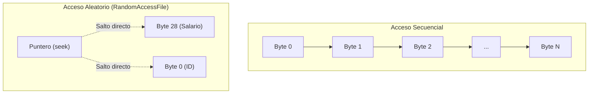
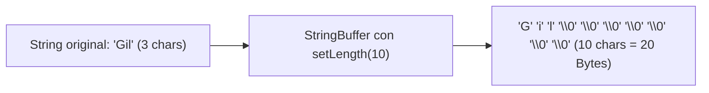

<div class="justify-text">

## Introducción: Acceso Secuencial vs. Acceso Aleatorio

Hasta ahora, en todos los tipos de ficheros que hemos estudiado (texto plano, CSV, Properties, JSON y XML), el acceso a la información ha sido **secuencial**:

* **Acceso Secuencial (como una cinta de casete):** Para leer el dato número 10.000, estamos obligados a leer y procesar previamente los 9.999 anteriores. Del mismo modo, si queremos modificar un valor en medio del fichero, nos vemos forzados a cargar todo el contenido en memoria y sobreescribir el archivo por completo.
* **Acceso Aleatorio (como un reproductor digital o disco):** Permite mover un **puntero de lectura/escritura** directamente a cualquier byte exacto del archivo en tiempo constante $O(1)$, leyendo o modificando únicamente el dato deseado sin tocar el resto del archivo.



:::warning La regla de oro del acceso aleatorio
Para trabajar con ficheros de acceso aleatorio es **obligatorio conocer de antemano la estructura exacta de los datos almacenados y el tamaño en bytes de cada uno de los registros**.

Sin este cálculo riguroso, mover el puntero a ciegas provocará la lectura de **bytes desalineados (basura)**, corrompiendo la interpretación de los datos.
:::

---

## El Alfabeto de los Bytes en Java

Para calcular con precisión matemática la posición a la que debemos saltar en disco, necesitamos tener siempre presente el tamaño exacto en bits y bytes de cada tipo de dato primitivo en Java:

| Tipo de Dato | Tamaño en Bits | Tamaño en Bytes | Constante en Java | Rango / Descripción |
| :--- | :---: | :---: | :--- | :--- |
| **`boolean`** | 8 bits | **1 byte** | — | `true` o `false` |
| **`byte`** | 8 bits | **1 byte** | `Byte.BYTES` | Entero con signo (-128 a 127) |
| **`short`** | 16 bits | **2 bytes** | `Short.BYTES` | Entero corto (-32.768 a 32.767) |
| **`char`** | 16 bits | **2 bytes** | `Character.BYTES` | Carácter Unicode UTF-16 (`\u0000` a `\uffff`) |
| **`int`** | 32 bits | **4 bytes** | `Integer.BYTES` | Entero estándar (-2.147.483.648 a 2.147.483.647) |
| **`float`** | 32 bits | **4 bytes** | `Float.BYTES` | Decimal simple precisión (IEEE 754) |
| **`long`** | 64 bits | **8 bytes** | `Long.BYTES` | Entero largo de 64 bits |
| **`double`** | 64 bits | **8 bytes** | `Double.BYTES` | Decimal doble precisión (IEEE 754) |

> **Consejo profesional:** En lugar de recordar todos los números de memoria, acostúmbrate a utilizar las constantes integradas de las clases envoltorio de Java, como `Integer.BYTES` o `Double.BYTES`.

---

## La Clase `RandomAccessFile` y el Puntero de Archivo

Para trabajar con acceso posicional en Java utilizamos la clase **`java.io.RandomAccessFile`**.

### Modos de apertura
Al instanciar un `RandomAccessFile`, debemos indicar el modo de operación mediante una cadena de texto:
* **`"r"` (Read only):** Abre el fichero exclusivamente en modo lectura. Si el archivo no existe en la ruta indicada, lanza una excepción `FileNotFoundException`.
* **`"rw"` (Read / Write):** Abre el fichero en modo lectura y escritura. **Si el fichero no existe, Java lo crea automáticamente**. Si ya existe, mantiene su contenido intacto para permitir modificaciones.

```java
// Apertura para lectura y escritura
RandomAccessFile raf = new RandomAccessFile("datos/empleados.dat", "rw");
```

### Métodos fundamentales
* **`long getFilePointer()`**: Devuelve la posición actual (offset en bytes) en la que se encuentra el puntero dentro del fichero. El primer byte es la posición `0`.
* **`void seek(long pos)`**: Mueve el puntero de lectura/escritura directamente al byte número `pos`.
* **`long length()`**: Devuelve la longitud total actual del fichero en bytes.
* **`void close()`**: Cierra el canal del archivo y libera los recursos del sistema operativo.
* **Métodos tipados de lectura/escritura:** `readInt()`, `writeInt(int v)`, `readDouble()`, `writeDouble(double v)`, `readBoolean()`, `writeBoolean(boolean v)`, `readChar()`, `writeChars(String s)`.

### ¿Cómo se desplaza el puntero al leer o escribir?
Cada vez que invocamos un método de lectura o escritura tipado, **el puntero avanza de forma automática tantos bytes como ocupe el tipo de dato procesado**:


* Antes de llamar a `readInt()`, el puntero se encuentra en una posición determinada.
* Tras leer los 4 bytes que componen el entero, el puntero se sitúa exactamente al inicio del siguiente elemento en el archivo.

---

## Lectura y Escritura de Datos Primitivos

Comenzaremos por el escenario más elemental: almacenar y recuperar una secuencia de números enteros (`int`).

:::warning Gestión de excepciones en los ejemplos
En los fragmentos explicativos de este tema omitimos los bloques `catch (IOException e)` para no sobrecargar el código y focalizar la atención exclusivamente en la lógica de navegación con `RandomAccessFile`. Recuerda que en tus proyectos (como verás en la demo completa al final del tema) estas operaciones siempre deben estar dentro de un bloque `try-catch` o declarar `throws IOException`.
:::

### Escritura y lectura secuencial

```java
// 1. Escribimos 10 números enteros en el archivo
try (RandomAccessFile raf = new RandomAccessFile("numeros.dat", "rw")) {
    for (int i = 1; i <= 10; i++) {
        raf.writeInt(i * 10); // Cada entero ocupa 4 bytes
    }
}

// 2. Lectura secuencial de todos los enteros
try (RandomAccessFile raf = new RandomAccessFile("numeros.dat", "r")) {
    // Mientras el puntero no alcance el final del archivo (length en bytes)
    while (raf.getFilePointer() < raf.length()) {
        int numero = raf.readInt();
        System.out.print(numero + " ");
    }
    System.out.println();
}
```

### Acceso directo a una posición concreta
Si queremos acceder directamente al $N$-ésimo número (por ejemplo, el 6º número), calculamos su desplazamiento (*offset*) multiplicando la posición deseada por el tamaño de cada dato:

$$\text{offset} = (N - 1) \times \text{Integer.BYTES}$$

Para leer el 6º número:
$$\text{offset} = (6 - 1) \times 4 = 5 \times 4 = 20\text{ bytes}$$

```java
try (RandomAccessFile raf = new RandomAccessFile("numeros.dat", "r")) {
    int posicionDeseada = 6;
    long offset = (posicionDeseada - 1) * Integer.BYTES;

    // Saltamos directamente al byte 20
    raf.seek(offset);
    int sextoNumero = raf.readInt();
    System.out.println("El 6º número es: " + sextoNumero); // Imprime 60
}
```

### El gran peligro: La desalineación de bytes
¿Qué sucedería si nos equivocamos en el cálculo y saltamos al **byte 19** en lugar del byte 20?

```java
try (RandomAccessFile raf = new RandomAccessFile("numeros.dat", "rw")) {

    // Insertamos los primeros 10 números naturales (0 al 9)
    for (int i = 0; i < 10; i++) {
        raf.writeInt(i);
    }

    // Un int ocupa 4 bytes por lo que cada elemento estará en
    // una posición múltiplo de 4: 0, 4, 8, etc.

    // Vamos a suponer que intentamos leer el 6º entero (4 * 5 = 20)
    // pero nos hemos confundido y hemos leído desde el byte 19:
    raf.seek(19);

    // Desglose de bytes en memoria binaria:
    // Bytes 0 - 3   (num = 0)  00000000 00000000 00000000 00000000
    // Bytes 4 - 7   (num = 1)  00000000 00000000 00000000 00000001
    // Bytes 8 - 11  (num = 2)  00000000 00000000 00000000 00000010
    // Bytes 12 - 15 (num = 3)  00000000 00000000 00000000 00000011
    // Bytes 16 - 19 (num = 4)  00000000 00000000 00000000 00000100  <-- el byte 19 tiene el valor 00000100
    // Bytes 20 - 23 (num = 5)  00000000 00000000 00000000 00000101  <-- el 6º número empieza en el byte 20
    // Bytes 24 - 27 (num = 6)  00000000 00000000 00000000 00000110

    // Leemos 4 bytes a partir del byte 19 (bytes 19 a 22):
    int sextoNumero = raf.readInt();
    System.out.println("El sexto número es: " + sextoNumero);
}
```

**Salida obtenida por consola:**
```text
El sexto número es: 67108864

Process finished with exit code 0
```

Como los enteros ocupan bloques exactos de 4 bytes (del 0 al 3, del 4 al 7, del 8 al 11, etc.), si leemos desde el byte 19:
1. Java tomará el último byte del 5º número (el byte 19, que vale `00000100`).
2. Tomará los 3 primeros bytes del 6º número (bytes 20, 21 y 22, que valen `00000000 00000000 00000000`).
3. Al combinarlos como si fueran un único entero, reconstruye una secuencia binaria desalineada que da como resultado el valor basura **`67108864`**.

---

## Cadenas de Texto y Registros de Tamaño Fijo

En las aplicaciones reales no solo manejamos números, sino también nombres, apellidos o descripciones. Aquí surge un problema crítico:

> **El problema del `String`:** Una cadena de texto tiene una **longitud variable**. El apellido `"Gil"` tiene 3 caracteres, mientras que `"Fernández"` tiene 9. Si la longitud de los registros varía de un elemento a otro, **es imposible calcular a qué byte saltar matemáticamente**.

### La solución: `StringBuffer` y longitud fija
Para resolver este problema, definimos un **tamaño fijo de caracteres** para cada campo de texto y utilizamos la clase `StringBuffer` junto con su método `setLength(int longitud)`:

* Si el texto tiene menos caracteres, `setLength()` lo rellena automáticamente con caracteres nulos (`\0`).
* Si el texto supera el límite establecido, `setLength()` lo trunca de forma segura para no invadir el espacio del siguiente registro.



:::caution Atención: En Java, cada carácter ocupa 2 Bytes
Java utiliza internamente codificación **Unicode UTF-16** para representar caracteres. Por tanto, cada `char` ocupa exactamente **2 bytes**.

$$\text{Tamaño en disco (Bytes)} = \text{Número de caracteres} \times 2$$

Una cadena configurada a 10 caracteres consumirá exactamente **20 bytes** en disco al guardarla con `raf.writeChars()`.
:::

### Ejemplo práctico: Escritura y lectura de cadenas fijas

Veamos qué sucede en la práctica cuando manejamos apellidos de diferente longitud, incluyendo un **apellido compuesto largo**:

```java
// ESCRITURA DE CADENAS DE TAMAÑO FIJO (10 caracteres = 20 bytes)
try (RandomAccessFile raf = new RandomAccessFile("apellidos.dat", "rw")) {
    // Probamos tres casos: corto (3 letras), medio (9 letras) y compuesto largo (11 letras)
    String[] apellidos = {"Gil", "Fernandez", "De la Torre"};

    for (String ape : apellidos) {
        StringBuffer buffer = new StringBuffer(ape);
        buffer.setLength(10); // Forzamos exactamente 10 caracteres
        raf.writeChars(buffer.toString()); // Escribe siempre 20 bytes por apellido
    }
}

// LECTURA DE CADENAS FIJAS
try (RandomAccessFile raf = new RandomAccessFile("apellidos.dat", "r")) {
    // Caso 1: Leemos el segundo apellido "Fernandez" (índice 1 -> 1 * 20 bytes = byte 20)
    raf.seek(20);
    char[] caracteres2 = new char[10];
    for (int i = 0; i < 10; i++) {
        caracteres2[i] = raf.readChar();
    }
    String segundo = new String(caracteres2).replace("\0", "").trim();
    System.out.println("Segundo apellido: " + segundo); // Imprime: Fernandez

    // Caso 2: Leemos el tercer apellido "De la Torre" (índice 2 -> 2 * 20 bytes = byte 40)
    raf.seek(40);
    char[] caracteres3 = new char[10];
    for (int i = 0; i < 10; i++) {
        caracteres3[i] = raf.readChar();
    }
    String tercero = new String(caracteres3).replace("\0", "").trim();
    System.out.println("Tercer apellido (truncado): " + tercero); // Imprime: De la Torr
}
```

:::info ¿Qué ha ocurrido con el apellido compuesto?
* **`"Gil"` (3 caracteres):** `setLength(10)` conservó las 3 letras y añadió 7 caracteres nulos `\0` al final para completar los 10 caracteres (20 bytes).
* **`"Fernandez"` (9 caracteres):** Añadió 1 carácter nulo `\0` para completar los 10 caracteres (20 bytes).
* **`"De la Torre"` (11 caracteres):** Al superar el límite de 10, `StringBuffer.setLength(10)` **truncó el texto**, descartando la última letra (`e`) para no invadir los bytes del siguiente registro. Por eso se leyó `"De la Torr"`.

Por esta razón, al diseñar sistemas con ficheros de acceso aleatorio debemos elegir una longitud de buffer suficientemente amplia para evitar pérdidas de información, pero sin sobredimensionar en exceso para no desperdiciar espacio en disco.
:::

:::tip Ejercicio: Lectura secuencial completa
¿Cómo programarías un bucle para recorrer el fichero `apellidos.dat` de principio a fin y mostrar **todos** los apellidos almacenados, sin importar cuántos haya guardados?
:::

---

## Registros Complejos Heterogéneos (Caso Empleados)

Ahora que comprendemos el cálculo de bytes en datos primitivos y cadenas de longitud fija, podemos ensamblar **registros heterogéneos completos**.

Supongamos que deseamos gestionar el personal de una empresa directamente sobre disco sin cargar toda la base de datos en RAM. Para cada empleado almacenamos:


### Desglose de la estructura en disco

| Campo | Tipo Java | Tamaño en Bytes | Rango de Bytes dentro del registro |
| :--- | :--- | :---: | :--- |
| **`id`** | `int` | **4 bytes** | Byte 0 a 3 |
| **`apellido`** | `String` (fijo 10 chars) | **20 bytes** | Byte 4 a 23 |
| **`departamento`** | `int` | **4 bytes** | Byte 24 a 27 |
| **`salario`** | `double` | **8 bytes** | Byte 28 a 35 |
| **TAMAÑO TOTAL REGISTRO** | | **36 bytes** | |

Con esta distribución fija:
* El **Empleado 1** ocupa del byte `0` al `35`.
* El **Empleado 2** ocupa del byte `36` al `71`.
* El **Empleado 3** ocupa del byte `72` al `107`.
* El **Empleado 4** ocupa del byte `108` al `143`.

### ¿A qué posición mover el puntero para consultar un campo concreto?

> **Pregunta típica de examen:** ¿A qué byte exacto debemos mover el puntero si queremos recuperar únicamente el **departamento del empleado 4** sin leer el resto del archivo?

1. **Saltar los empleados anteriores (1, 2 y 3):**
   $$3 \text{ empleados} \times 36\text{ bytes} = 108\text{ bytes}$$
2. **Saltar los campos previos dentro del propio empleado 4 (`id` y `apellido`):**
   $$4\text{ bytes (id)} + 20\text{ bytes (apellido)} = 24\text{ bytes}$$
3. **Posición final del puntero:**
   $$\text{Posición} = 108 + 24 = 132\text{ bytes}$$

En código Java, en lugar de escribir el número `132` "a fuego", definimos una constante para la longitud del apellido y calculamos el **tamaño del registro y el desplazamiento de forma 100% dinámica**:

```java
// Constante para la longitud fija del apellido
final int LONGITUD_APELLIDO = 10; // 10 caracteres

// Tamaño dinámico del registro sumando los bytes de cada campo:
final int TAMANO_REGISTRO = Integer.BYTES                      // id (4 bytes)
        + (LONGITUD_APELLIDO * Character.BYTES)                // apellido (10 * 2 = 20 bytes)
        + Integer.BYTES                                        // departamento (4 bytes)
        + Double.BYTES;                                        // salario (8 bytes)
        // Total = 4 + 20 + 4 + 8 = 36 bytes

int numEmpleado = 4;

// Saltamos los (4 - 1) empleados completos + el id (4B) y el apellido (20B) del empleado 4:
long offset = (long) (numEmpleado - 1) * TAMANO_REGISTRO 
        + Integer.BYTES + (LONGITUD_APELLIDO * Character.BYTES);

raf.seek(offset); // Se posiciona dinámicamente en el byte 132
int departamento = raf.readInt();
```

---

### Modificación Quirúrgica en Disco

Una de las mayores ventajas de `RandomAccessFile` es la capacidad de **actualizar un campo de un registro en disco sin tener que reescribir todo el fichero**:

Por ejemplo, si la empresa decide aumentar el salario del empleado número 2 a `2850.50 €`:
1. El empleado 2 comienza en el byte $(2 - 1) \times 36 = 36$.
2. El campo `salario` comienza tras el `id` (4B), el `apellido` (20B) y el `departamento` (4B): $4 + 20 + 4 = 28$ bytes de desplazamiento interno.
3. Posición absoluta del salario del empleado 2:
   $$\text{offset} = 36 + 28 = 64\text{ bytes}$$

En código Java calculamos dinámicamente el desplazamiento exacto del campo `salario`:

```java
final int LONGITUD_APELLIDO = 10;
final int TAMANO_REGISTRO = Integer.BYTES + (LONGITUD_APELLIDO * Character.BYTES) 
        + Integer.BYTES + Double.BYTES;

int numEmpleado = 2;

// Desplazamiento dinámico hasta el salario del empleado 2:
// Saltamos (2 - 1) empleados completos + id (4B) + apellido (20B) + depto (4B) = 36 + 28 = 64
long offsetSalario = (long) (numEmpleado - 1) * TAMANO_REGISTRO 
        + Integer.BYTES + (LONGITUD_APELLIDO * Character.BYTES) + Integer.BYTES;

try (RandomAccessFile raf = new RandomAccessFile("empleados.dat", "rw")) {
    raf.seek(offsetSalario); // Se posiciona dinámicamente en el byte 64
    raf.writeDouble(2850.50); // Sobreescribe quirúrgicamente únicamente esos 8 bytes
}
```

---

### Demo Completa: Gestión de Empleados en Disco

A continuación se presenta un programa completo y ejecutable en una única clase, donde gestionamos los registros de empleados directamente en binario sobre disco, sin necesidad de cargar ni instanciar objetos en memoria RAM:

```java title="src/main/java/es/iesagora/ada/ficheros/DemoAccesoAleatorio.java"
package es.iesagora.ada.ficheros;

import java.io.IOException;
import java.io.RandomAccessFile;
import java.nio.file.Files;
import java.nio.file.Path;

public class DemoAccesoAleatorio {

    private static final String RUTA_FICHERO = "datos_raf/empleados.dat";

    // Constantes de diseño para los registros de tamaño fijo
    public static final int LONGITUD_APELLIDO = 10; // 10 caracteres * 2 bytes = 20 bytes
    public static final int TAMANO_REGISTRO = Integer.BYTES                      // id (4 bytes)
            + (LONGITUD_APELLIDO * Character.BYTES)                              // apellido (20 bytes)
            + Integer.BYTES                                                      // depto (4 bytes)
            + Double.BYTES;                                                      // salario (8 bytes)
            // Total = 36 bytes por registro

    public static void main(String[] args) {
        System.out.println("=== GESTIÓN DE FICHEROS DE ACCESO ALEATORIO (RAF) ===\n");

        // Creamos la carpeta contenedora si no existe
        Path rutaDirectorio = Path.of("datos_raf");
        try {
            if (Files.notExists(rutaDirectorio)) {
                Files.createDirectories(rutaDirectorio);
            }
        } catch (IOException e) {
            System.err.println("No se pudo crear la carpeta: " + e.getMessage());
            return;
        }

        // Datos iniciales de prueba en arrays paralelos
        int[] ids = {1, 2, 3, 4};
        String[] apellidos = {"Garcia", "Fernandez", "Lopez", "Martinez"};
        int[] departamentos = {10, 20, 10, 30};
        double[] salarios = {1850.00, 2100.50, 1950.00, 2400.75};

        try {
            // PASO 1: Escribir los registros iniciales en el fichero binario
            escribirEmpleados(ids, apellidos, departamentos, salarios);

            // PASO 2: Mostrar todos los empleados leyendo secuencialmente de disco
            System.out.println("1. Listado completo de empleados:");
            mostrarTodos();

            // PASO 3: Acceso directo por posición (Consultar el departamento del empleado 4)
            System.out.println("\n2. Acceso directo al departamento del empleado #4:");
            consultarDepartamento(4);

            // PASO 4: Modificación quirúrgica (Actualizar salario del empleado 2 directamente en disco)
            System.out.println("\n3. Actualizando salario del empleado #2 a 2850.50 €...");
            modificarSalario(2, 2850.50);

            // PASO 5: Comprobar el cambio volviendo a listar
            System.out.println("\n4. Listado tras la actualización quirúrgica en disco:");
            mostrarTodos();

        } catch (IOException e) {
            System.err.println("Error operando con el fichero RAF: " + e.getMessage());
            e.printStackTrace();
        }
    }

    /**
     * Escribe los registros iniciales en el archivo binario asegurando el tamaño fijo de 36 bytes.
     */
    public static void escribirEmpleados(int[] ids, String[] apellidos, int[] departamentos, double[] salarios) throws IOException {
        try (RandomAccessFile raf = new RandomAccessFile(RUTA_FICHERO, "rw")) {
            raf.setLength(0); // Vaciamos el fichero si ya existía de pruebas anteriores

            for (int i = 0; i < ids.length; i++) {
                // 1. ID (4 bytes)
                raf.writeInt(ids[i]);

                // 2. Apellido con tamaño fijo de 10 caracteres (20 bytes)
                StringBuffer buffer = new StringBuffer(apellidos[i]);
                buffer.setLength(LONGITUD_APELLIDO);
                raf.writeChars(buffer.toString());

                // 3. Departamento (4 bytes)
                raf.writeInt(departamentos[i]);

                // 4. Salario (8 bytes)
                raf.writeDouble(salarios[i]);
            }
            System.out.println("-> Fichero creado con éxito. Tamaño total: " + raf.length() 
                    + " bytes (" + TAMANO_REGISTRO + " B por registro).\n");
        }
    }

    /**
     * Recorre secuencialmente todos los registros leyendo directamente de disco campo a campo.
     */
    public static void mostrarTodos() throws IOException {
        try (RandomAccessFile raf = new RandomAccessFile(RUTA_FICHERO, "r")) {
            while (raf.getFilePointer() < raf.length()) {
                int id = raf.readInt();

                // Leemos los 10 caracteres del apellido
                char[] caracteres = new char[LONGITUD_APELLIDO];
                for (int i = 0; i < LONGITUD_APELLIDO; i++) {
                    caracteres[i] = raf.readChar();
                }
                String apellido = new String(caracteres).replace("\0", "").trim();

                int departamento = raf.readInt();
                double salario = raf.readDouble();

                System.out.printf("   [ID: %d] Apellido: %-10s | Depto: %d | Salario: %.2f €%n",
                        id, apellido, departamento, salario);
            }
        }
    }

    /**
     * Salta directamente a consultar el campo departamento de un empleado mediante su offset.
     */
    public static void consultarDepartamento(int numeroEmpleado) throws IOException {
        try (RandomAccessFile raf = new RandomAccessFile(RUTA_FICHERO, "r")) {
            // Offset dinámico: saltar (N - 1) registros + ID (4B) + Apellido (20B)
            long offset = (long) (numeroEmpleado - 1) * TAMANO_REGISTRO 
                    + Integer.BYTES + (LONGITUD_APELLIDO * Character.BYTES);

            if (offset >= raf.length()) {
                System.out.println("   El empleado #" + numeroEmpleado + " no existe.");
                return;
            }

            raf.seek(offset); // Salto directo en tiempo constante O(1)
            int departamento = raf.readInt();
            System.out.println("   -> Puntero situado en el byte " + offset 
                    + " | Departamento del empleado #" + numeroEmpleado + ": " + departamento);
        }
    }

    /**
     * Modifica quirúrgicamente únicamente los 8 bytes del salario del empleado indicado.
     */
    public static void modificarSalario(int numeroEmpleado, double nuevoSalario) throws IOException {
        try (RandomAccessFile raf = new RandomAccessFile(RUTA_FICHERO, "rw")) {
            // Offset dinámico: saltar (N - 1) registros + ID (4B) + Apellido (20B) + Depto (4B) = (N-1)*36 + 28
            long offset = (long) (numeroEmpleado - 1) * TAMANO_REGISTRO 
                    + Integer.BYTES + (LONGITUD_APELLIDO * Character.BYTES) + Integer.BYTES;

            if (offset + Double.BYTES > raf.length()) {
                System.out.println("   El empleado #" + numeroEmpleado + " no existe.");
                return;
            }

            raf.seek(offset); // Salto directo a los 8 bytes del salario
            raf.writeDouble(nuevoSalario); // Sobreescribe solo el salario sin tocar nada más
            System.out.println("   -> Salario actualizado quirúrgicamente en el byte " + offset + " con éxito.");
        }
    }
}
```

---

## Comparativa: ¿Cuándo usar cada tecnología de persistencia?

Con el estudio de los archivos de acceso aleatorio completamos el catálogo de formatos de ficheros de la unidad:

| Formato | Ventajas | Inconvenientes | Caso de Uso Ideal |
| :--- | :--- | :--- | :--- |
| **Texto Plano / CSV** | Máxima compatibilidad, legible directamente por humanos. | Todo se trata como cadenas, sin tipos fuertes ni saltos aleatorios. | Logs de eventos, exportación para hojas de cálculo (Excel). |
| **Properties** | Soporte nativo Java, formato clave-valor directo. | Sin jerarquías ni estructuras complejas. | Parámetros de configuración de la app (rutas, credenciales). |
| **Binarios (`Serializable`)** | Persistencia directa de grafos de objetos Java en memoria. | Específico de Java, incompatible entre versiones si cambia la clase. | Caché rápida en disco, sesiones locales de escritorio. |
| **JSON (Jackson)** | Estándar de la industria, ligero, estructurado, interoperable. | Requiere librería externa, carga documentos completos en memoria. | APIs REST, aplicaciones web y móviles, microservicios. |
| **XML (Jackson)** | Validación estricta, atributos, soporte empresarial consolidado. | Mayor verbosidad que JSON. | Configuración avanzada (Maven, Android), servicios SOAP/B2B. |
| **Acceso Aleatorio (RAF)** | Modificación y lectura directa en tiempo $O(1)$ sin cargar en RAM. | Registros obligatoriamente de longitud fija, cálculo manual de bytes. | Motores de bases de datos internas, índices posicionales, archivos binarios gigantes. |

</div>

