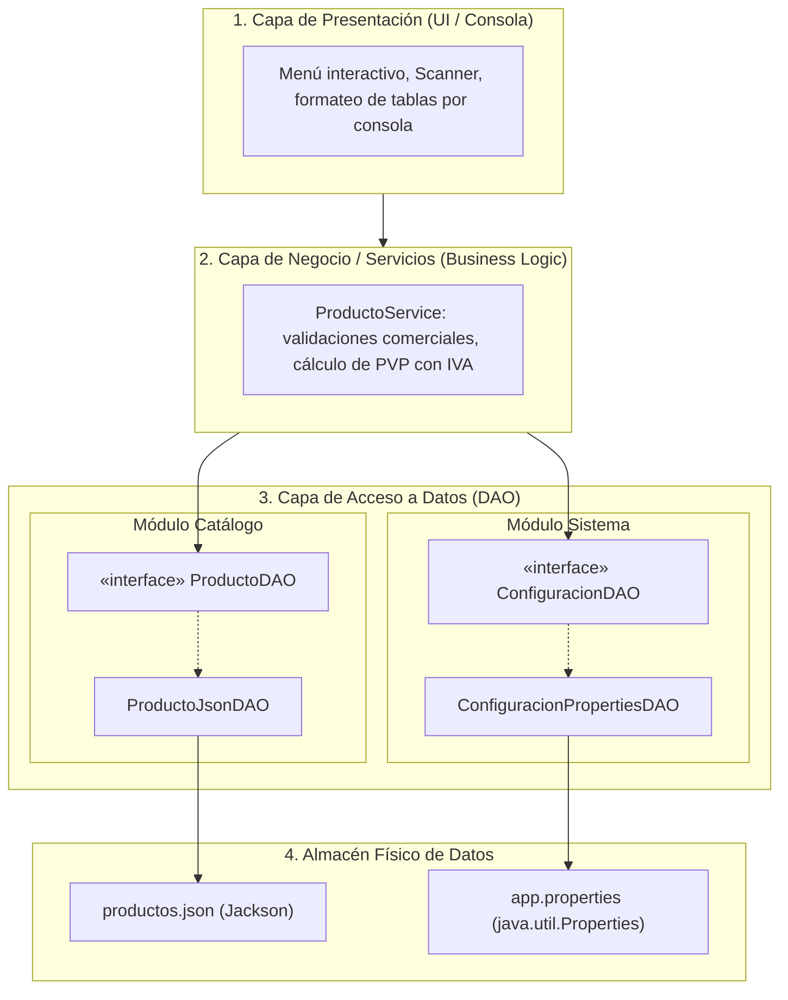
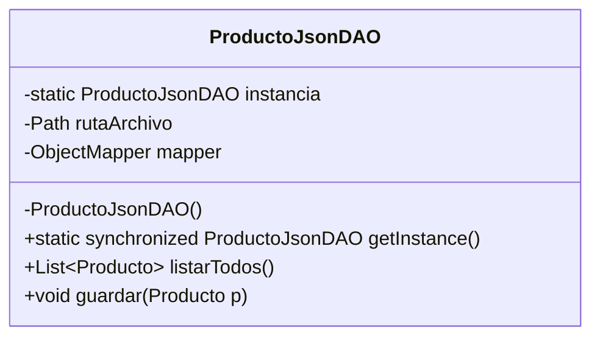

<div class="justify-text">

## Introducción: El Problema del Código Monolítico

A lo largo de los temas anteriores hemos aprendido a leer y escribir datos en diversos formatos: texto plano, CSV, Properties, ficheros binarios nativos, JSON, XML y ficheros de acceso aleatorio (RAF).

Sin embargo, en casi todos los ejemplos iniciales hemos colocado el código de acceso a ficheros, las comprobaciones de rutas, la lógica del programa y las entradas y salidas de consola directamente dentro de un método `main()`.

En el mundo del desarrollo de software profesional, esta estructura se conoce como **código monolítico o espagueti**, y presenta serios problemas de ingeniería:

1. **Acoplamiento extremo:** Si el programa principal conoce directamente las rutas de los archivos y las clases de Jackson (`ObjectMapper` / `XmlMapper`), cualquier cambio en el formato del fichero obliga a reescribir media aplicación.
2. **Duplicación de código:** Si varias partes de la aplicación necesitan consultar o guardar productos, el código de lectura y escritura se copia y pega en múltiples sitios.
3. **Imposibilidad de realizar pruebas (Testabilidad):** No se puede verificar si la lógica de negocio (por ejemplo, calcular un descuento o validar un stock) funciona correctamente sin depender de que exista un archivo físico en el disco duro.
4. **Resistencia al cambio:** ¿Qué ocurrirá en la siguiente unidad cuando sustituyamos los archivos por una **base de datos relacional (MySQL/PostgreSQL con JDBC)**? Si el código está mezclado, tendríamos que tirar el proyecto a la basura y empezar de cero.

Para resolver estos problemas aplicamos dos principios fundamentales del diseño de software:
* **Separación de Responsabilidades (*Separation of Concerns - SoC*):** Cada componente debe ocuparse exclusivamente de una tarea específica.
* **Principio de Responsabilidad Única (*Single Responsibility Principle - SRP*):** Una clase debe tener una, y solo una, razón para cambiar.

---

## Arquitectura por Capas

La solución estándar en la industria para estructurar aplicaciones mantenibles es la **Arquitectura en Capas (*N-Tier Architecture*)**. En este modelo, el sistema se divide horizontalmente en niveles con funciones claramente delimitadas:



### Responsabilidades de cada capa

1. **Capa de Presentación (`app`):** Es la cara visible. Captura las acciones del usuario por teclado (`Scanner`) o interfaz gráfica y muestra los resultados por pantalla. **No sabe dónde ni cómo se guardan los datos, ni contiene reglas de negocio.**
2. **Capa de Negocio / Servicios (`service`):** Contiene la lógica central de la aplicación: valida que un precio no sea negativo, aplica promociones, comprueba que haya stock suficiente, etc. Cuando necesita leer o guardar datos, se lo pide a la capa de persistencia.
3. **Capa de Acceso a Datos (`dao`):** Es la única parte del sistema autorizada para comunicarse con el almacenamiento físico (ficheros, bases de datos o APIs). Aísla por completo al resto de la aplicación de los detalles técnicos de I/O.
4. **Modelos de Dominio (`model`):** Clases POJO estándar (como `Producto`) que viajan verticalmente a través de todas las capas transportando la información.

---

## El Patrón de Diseño DAO (*Data Access Object*)

El **patrón DAO** es un patrón de diseño estructural cuyo propósito es **abstraer y encapsular todos los accesos a la fuente de datos**.

### La regla de oro: Programar contra interfaces

El secreto del patrón DAO reside en la **inversión de dependencias**: la capa de negocio nunca depende de una clase concreta (como `ProductoJsonDAO`), sino de una **interfaz abstracta** (como `ProductoDAO`):

$$\text{Capa de Negocio} \longrightarrow \text{«interface» ProductoDAO} \longleftarrow \text{Implementación concreta (JSON, XML, BD)}$$

Al programar contra la interfaz:
* La lógica de negocio solo conoce los métodos declarados en el contrato: `listarTodos()`, `buscarPorId()`, `guardar()`, `eliminar()`.
* La tecnología subyacente (un fichero JSON, un archivo XML o una tabla SQL) puede reemplazarse en cualquier momento **sin modificar ni una sola línea de la capa de servicio ni de la interfaz de usuario**.

### Operaciones CRUD estándar
Toda interfaz DAO suele ofrecer las cuatro operaciones fundamentales de persistencia conocidas como **CRUD**:

| Operación | Significado | Método habitual en la interfaz DAO |
| :--- | :--- | :--- |
| **C** (*Create*) | Registrar un nuevo elemento | `void guardar(Producto p)` |
| **R** (*Read*) | Consultar todos o uno específico | `List<Producto> listarTodos()` / `Optional<Producto> buscarPorId(int id)` |
| **U** (*Update*) | Actualizar un registro existente | `void actualizar(Producto p)` |
| **D** (*Delete*) | Dar de baja un registro | `boolean eliminar(int id)` |

> **Buenas prácticas con `Optional<T>`:** Al buscar un elemento por su identificador (`buscarPorId`), es una excelente práctica devolver un `Optional<Producto>`. De este modo, obligamos al código que llama a gestionar de forma explícita y segura la posibilidad de que el elemento buscado no exista en el almacén de datos, evitando los temidos `NullPointerException`.

---

## El Patrón Singleton en la Capa DAO

Cuando una aplicación trabaja con un almacén de datos centralizado (como un fichero de persistencia `productos.json` o una configuración), surge una necesidad crítica de arquitectura:

> **Problema:** Si dos partes del programa instancian de forma independiente `new ProductoJsonDAO()`, tendríamos múltiples objetos manipulando el mismo archivo en disco, lo que puede provocar bloqueos concurrentes de archivo o inconsistencias en memoria.

Para solucionar este escenario recurrimos al **Patrón Singleton**:

> **Patrón Singleton:** Garantiza que una clase tenga **una única instancia en toda la memoria de la aplicación** y proporciona un punto de acceso global y centralizado a ella.

### Cómo se implementa un Singleton canónico en Java

Para construir un Singleton en Java seguimos tres reglas estrictas:



1. **Constructor privado:** Al marcar el constructor como `private`, impedimos que nadie desde fuera pueda hacer `new ProductoJsonDAO()`.
2. **Atributo estático privado:** Almacena la única referencia creada en memoria de la clase (`private static ProductoJsonDAO instancia`).
3. **Método estático público (`getInstance()`):** Es el único punto de entrada para obtener la instancia. Si la instancia aún no ha sido creada (*lazy initialization*), la crea; si ya existe, devuelve la referencia existente:

```java
public class ProductoJsonDAO implements ProductoDAO {

    // 1. Variable estática donde se almacena la única instancia
    private static ProductoJsonDAO instancia;

    // 2. Constructor PRIVADO: nadie desde fuera puede hacer "new"
    private ProductoJsonDAO() {
        // Inicialización de rutas y librerías
    }

    // 3. Método global de acceso (thread-safe con synchronized)
    public static synchronized ProductoJsonDAO getInstance() {
        if (instancia == null) {
            instancia = new ProductoJsonDAO();
        }
        return instancia;
    }
}
```

:::info Singleton en el mundo profesional
En aplicaciones de escritorio, herramientas CLI o proyectos académicos, el Singleton clásico con `getInstance()` es la forma más limpia de compartir un recurso de persistencia único.

En entornos empresariales modernos con frameworks como **Spring Boot**, las clases no suelen escribirse con constructor privado; en su lugar, se escriben como clases normales y el **contenedor de inyección de dependencias** se encarga de instanciarlas una única vez (alcance *Singleton* gestionado con anotaciones como `@Repository` o `@Service`). El concepto de fondo, sin embargo, es exactamente el mismo.
:::

### ¿Cuándo debemos usar Singleton y cuándo NO?

Una duda recurrente al aprender arquitectura es si debemos convertir en Singleton todas las clases o todos los ficheros del proyecto. La respuesta es un rotundo **no**:

* **¿Cuándo SÍ tiene sentido usar Singleton?**
  * **DAOs que gestionan ficheros centrales de datos:** Ficheros como `productos.json`, `usuarios.xml` o ficheros binarios/RAF que actúan como la base de datos de la aplicación. Solo debe existir un objeto coordinando el acceso para evitar bloqueos del sistema de archivos e inconsistencias entre copias en memoria.
  * **Gestores de configuración global:** Ficheros como `app.properties` con parámetros generales (IVA, divisa, rutas de almacenamiento, timeouts) que se leen una sola vez al arrancar y son compartidos por todos los servicios.
  * **Pools de conexiones:** Como el gestor de conexiones a la base de datos que utilizaremos en la siguiente unidad con JDBC.

* **¿Cuándo NO debemos usar Singleton?**
  * **Exportaciones e importaciones puntuales:** Si la aplicación tiene una función para exportar un listado de ventas a `informe_octubre.csv` o importar un archivo temporal que sube el usuario, se trata de una operación transitoria de "usar y tirar". Instanciar un objeto ordinario es lo correcto.
  * **Ficheros con estado por usuario/sesión:** Cuando cada hilo o usuario concurrente requiere un archivo de trabajo aislado.
  * **Entidades del Modelo (POJOs):** Clases como `Producto` o `Configuracion` representan registros de datos; de ellas se crean tantas instancias como elementos existan.

---

## Implementación Completa: Catálogo de Productos con DAO

Vamos a implementar una solución completa y profesional para gestionar un catálogo de productos informáticos.

### Organización de paquetes recomendada

Para mantener un proyecto ordenado y limpio, organizamos el código en los siguientes paquetes bajo `es.iesagora.ada.ficheros`:

```text
src/main/java/es/iesagora/ada/ficheros/
├── model/
│   ├── Producto.java                  <-- Modelo de catálogo (POJO)
│   └── Configuracion.java             <-- Modelo de configuración del sistema (POJO)
├── dao/
│   ├── ProductoDAO.java               <-- Contrato CRUD para catálogo
│   ├── ProductoJsonDAO.java           <-- Persistencia en JSON con Jackson (Singleton)
│   ├── ConfiguracionDAO.java          <-- Contrato de configuración del sistema
│   └── ConfiguracionPropertiesDAO.java<-- Persistencia en app.properties (Singleton)
├── service/
│   └── ProductoService.java           <-- Negocio: orquesta ProductoDAO y ConfiguracionDAO
└── app/
    └── DemoArquitecturaDao.java       <-- Capa de Presentación / Programa ejecutable
```

---

### 1. Modelo de Dominio: `Producto.java`

Una clase Java estándar (POJO) limpia de dependencias externas. No sabe nada de Jackson, ficheros ni bases de datos:

```java title="src/main/java/es/iesagora/ada/ficheros/model/Producto.java"
package es.iesagora.ada.ficheros.model;

public class Producto {

    private int id;
    private String nombre;
    private String categoria;
    private double precio;
    private int stock;

    // Constructor vacío obligatorio para librerías de serialización
    public Producto() {
    }

    public Producto(int id, String nombre, String categoria, double precio, int stock) {
        this.id = id;
        this.nombre = nombre;
        this.categoria = categoria;
        this.precio = precio;
        this.stock = stock;
    }

    // Getters y Setters
    public int getId() {
        return id;
    }

    public void setId(int id) {
        this.id = id;
    }

    public String getNombre() {
        return nombre;
    }

    public void setNombre(String nombre) {
        this.nombre = nombre;
    }

    public String getCategoria() {
        return categoria;
    }

    public void setCategoria(String categoria) {
        this.categoria = categoria;
    }

    public double getPrecio() {
        return precio;
    }

    public void setPrecio(double precio) {
        this.precio = precio;
    }

    public int getStock() {
        return stock;
    }

    public void setStock(int stock) {
        this.stock = stock;
    }

    @Override
    public String toString() {
        return String.format("[ID: %d] %-25s | Cat: %-12s | Precio: %8.2f € | Stock: %3d ud.",
                id, nombre, categoria, precio, stock);
    }
}
```

#### Modelo de Configuración: `Configuracion.java`

Para gestionar los parámetros globales del sistema (IVA, nombre de la tienda, divisa), creamos un segundo POJO:

```java title="src/main/java/es/iesagora/ada/ficheros/model/Configuracion.java"
package es.iesagora.ada.ficheros.model;

public class Configuracion {

    private String nombreTienda;
    private double ivaPorcentaje;
    private String moneda;

    public Configuracion() {
    }

    public Configuracion(String nombreTienda, double ivaPorcentaje, String moneda) {
        this.nombreTienda = nombreTienda;
        this.ivaPorcentaje = ivaPorcentaje;
        this.moneda = moneda;
    }

    public String getNombreTienda() {
        return nombreTienda;
    }

    public void setNombreTienda(String nombreTienda) {
        this.nombreTienda = nombreTienda;
    }

    public double getIvaPorcentaje() {
        return ivaPorcentaje;
    }

    public void setIvaPorcentaje(double ivaPorcentaje) {
        this.ivaPorcentaje = ivaPorcentaje;
    }

    public String getMoneda() {
        return moneda;
    }

    public void setMoneda(String moneda) {
        this.moneda = moneda;
    }

    @Override
    public String toString() {
        return String.format("Tienda: %s | IVA: %.1f%% | Moneda: %s",
                nombreTienda, ivaPorcentaje, moneda);
    }
}
```

---

### 2. La Interfaz DAO: `ProductoDAO.java`

El contrato formal que define **qué operaciones de persistencia existen**, sin especificar **cómo** se llevan a cabo:

```java title="src/main/java/es/iesagora/ada/ficheros/dao/ProductoDAO.java"
package es.iesagora.ada.ficheros.dao;

import es.iesagora.ada.ficheros.model.Producto;

import java.io.IOException;
import java.util.List;
import java.util.Optional;

public interface ProductoDAO {

    /**
     * Recupera todos los productos disponibles en el almacén de datos.
     */
    List<Producto> listarTodos() throws IOException;

    /**
     * Busca un producto específico a partir de su identificador único.
     */
    Optional<Producto> buscarPorId(int id) throws IOException;

    /**
     * Inserta un nuevo producto en el almacén de datos.
     */
    void guardar(Producto producto) throws IOException;

    /**
     * Actualiza la información de un producto existente.
     */
    void actualizar(Producto producto) throws IOException;

    /**
     * Elimina un producto del almacén por su ID.
     * @return true si se eliminó con éxito, false si no se encontró.
     */
    boolean eliminar(int id) throws IOException;
}
```

#### La Interfaz de Configuración: `ConfiguracionDAO.java`

Para desacoplar el acceso a la configuración de la aplicación, definimos un contrato específico para leer y actualizar los parámetros globales:

```java title="src/main/java/es/iesagora/ada/ficheros/dao/ConfiguracionDAO.java"
package es.iesagora.ada.ficheros.dao;

import es.iesagora.ada.ficheros.model.Configuracion;

import java.io.IOException;

public interface ConfiguracionDAO {

    /**
     * Carga la configuración actual del sistema.
     */
    Configuracion cargar() throws IOException;

    /**
     * Guarda y hace persistentes los parámetros de configuración en el soporte físico.
     */
    void guardar(Configuracion configuracion) throws IOException;
}
```

---

### 3. Implementación DAO en JSON: `ProductoJsonDAO.java`

Esta clase implementa la interfaz `ProductoDAO`, utiliza **Jackson (`ObjectMapper`)** para comunicarse con el disco y aplica el patrón **Singleton**:

```java title="src/main/java/es/iesagora/ada/ficheros/dao/ProductoJsonDAO.java"
package es.iesagora.ada.ficheros.dao;

import com.fasterxml.jackson.core.type.TypeReference;
import com.fasterxml.jackson.databind.ObjectMapper;
import es.iesagora.ada.ficheros.model.Producto;

import java.io.IOException;
import java.nio.file.Files;
import java.nio.file.Path;
import java.util.ArrayList;
import java.util.List;
import java.util.Optional;

public class ProductoJsonDAO implements ProductoDAO {

    // 1. Instancia única (Singleton)
    private static ProductoJsonDAO instancia;

    // Configuración interna de persistencia
    private final Path rutaArchivo;
    private final ObjectMapper mapper;

    // 2. Constructor PRIVADO
    private ProductoJsonDAO() {
        this.rutaArchivo = Path.of("datos_dao", "productos.json");
        this.mapper = new ObjectMapper();
        asegurarDirectorioYArchivo();
    }

    // 3. Método de acceso global a la instancia única
    public static synchronized ProductoJsonDAO getInstance() {
        if (instancia == null) {
            instancia = new ProductoJsonDAO();
        }
        return instancia;
    }

    private void asegurarDirectorioYArchivo() {
        try {
            if (rutaArchivo.getParent() != null && Files.notExists(rutaArchivo.getParent())) {
                Files.createDirectories(rutaArchivo.getParent());
            }
            if (Files.notExists(rutaArchivo)) {
                // Si el archivo no existe, lo inicializamos con una lista vacía
                mapper.writerWithDefaultPrettyPrinter().writeValue(rutaArchivo.toFile(), new ArrayList<Producto>());
            }
        } catch (IOException e) {
            throw new RuntimeException("Error inicializando el archivo JSON del DAO: " + e.getMessage(), e);
        }
    }

    @Override
    public List<Producto> listarTodos() throws IOException {
        if (Files.notExists(rutaArchivo) || Files.size(rutaArchivo) == 0) {
            return new ArrayList<>();
        }
        return mapper.readValue(rutaArchivo.toFile(), new TypeReference<List<Producto>>() {});
    }

    @Override
    public Optional<Producto> buscarPorId(int id) throws IOException {
        List<Producto> productos = listarTodos();
        return productos.stream()
                .filter(p -> p.getId() == id)
                .findFirst();
    }

    @Override
    public void guardar(Producto producto) throws IOException {
        List<Producto> productos = new ArrayList<>(listarTodos());

        // Comprobamos que el ID no esté duplicado
        boolean existe = productos.stream().anyMatch(p -> p.getId() == producto.getId());
        if (existe) {
            throw new IllegalArgumentException("Ya existe un producto con el ID #" + producto.getId());
        }

        productos.add(producto);
        volcarADisco(productos);
    }

    @Override
    public void actualizar(Producto producto) throws IOException {
        List<Producto> productos = new ArrayList<>(listarTodos());
        boolean encontrado = false;

        for (int i = 0; i < productos.size(); i++) {
            if (productos.get(i).getId() == producto.getId()) {
                productos.set(i, producto);
                encontrado = true;
                break;
            }
        }

        if (!encontrado) {
            throw new IllegalArgumentException("No se encontró el producto #" + producto.getId() + " para actualizar.");
        }

        volcarADisco(productos);
    }

    @Override
    public boolean eliminar(int id) throws IOException {
        List<Producto> productos = new ArrayList<>(listarTodos());
        boolean eliminado = productos.removeIf(p -> p.getId() == id);

        if (eliminado) {
            volcarADisco(productos);
        }
        return eliminado;
    }

    private void volcarADisco(List<Producto> productos) throws IOException {
        mapper.writerWithDefaultPrettyPrinter().writeValue(rutaArchivo.toFile(), productos);
    }
}
```

#### Implementación DAO en Properties: `ConfiguracionPropertiesDAO.java`

Aquí implementamos el DAO de configuración consumiendo un fichero `.properties` nativo mediante `java.util.Properties`. Al igual que el DAO de productos, aplicamos el patrón **Singleton** para garantizar una única instancia gestora de los parámetros del sistema:

```java title="src/main/java/es/iesagora/ada/ficheros/dao/ConfiguracionPropertiesDAO.java"
package es.iesagora.ada.ficheros.dao;

import es.iesagora.ada.ficheros.model.Configuracion;

import java.io.IOException;
import java.io.InputStream;
import java.io.OutputStream;
import java.nio.file.Files;
import java.nio.file.Path;
import java.util.Properties;

public class ConfiguracionPropertiesDAO implements ConfiguracionDAO {

    // 1. Instancia única (Singleton)
    private static ConfiguracionPropertiesDAO instancia;

    // Configuración interna de persistencia
    private final Path rutaArchivo;

    // 2. Constructor PRIVADO
    private ConfiguracionPropertiesDAO() {
        this.rutaArchivo = Path.of("datos_dao", "app.properties");
        asegurarArchivoPorDefecto();
    }

    // 3. Punto de acceso global (Singleton thread-safe)
    public static synchronized ConfiguracionPropertiesDAO getInstance() {
        if (instancia == null) {
            instancia = new ConfiguracionPropertiesDAO();
        }
        return instancia;
    }

    private void asegurarArchivoPorDefecto() {
        try {
            if (rutaArchivo.getParent() != null && Files.notExists(rutaArchivo.getParent())) {
                Files.createDirectories(rutaArchivo.getParent());
            }
            if (Files.notExists(rutaArchivo)) {
                Configuracion configDefecto = new Configuracion("TechStore Ágora", 21.0, "EUR");
                guardar(configDefecto);
            }
        } catch (IOException e) {
            throw new RuntimeException("Error inicializando app.properties: " + e.getMessage(), e);
        }
    }

    @Override
    public Configuracion cargar() throws IOException {
        Properties prop = new Properties();
        try (InputStream in = Files.newInputStream(rutaArchivo)) {
            prop.load(in);
        }

        String nombreTienda = prop.getProperty("app.tienda.nombre", "Tienda por Defecto");
        double iva = Double.parseDouble(prop.getProperty("app.tienda.iva", "21.0"));
        String moneda = prop.getProperty("app.tienda.moneda", "EUR");

        return new Configuracion(nombreTienda, iva, moneda);
    }

    @Override
    public void guardar(Configuracion config) throws IOException {
        Properties prop = new Properties();
        prop.setProperty("app.tienda.nombre", config.getNombreTienda());
        prop.setProperty("app.tienda.iva", String.valueOf(config.getIvaPorcentaje()));
        prop.setProperty("app.tienda.moneda", config.getMoneda());

        try (OutputStream out = Files.newOutputStream(rutaArchivo)) {
            prop.store(out, "Configuracion Global del Sistema ADA");
        }
    }
}
```

---

### 4. Capa de Negocio / Servicios: `ProductoService.java`

El servicio representa las operaciones comerciales de la empresa. **Recibe tanto `ProductoDAO` como `ConfiguracionDAO` a través de sus interfaces** (inyección de dependencias), aplicando validaciones, orquestando ambos soportes físicos y utilizando la configuración (`app.properties`) para calcular precios finales de venta al público (PVP con IVA):

```java title="src/main/java/es/iesagora/ada/ficheros/service/ProductoService.java"
package es.iesagora.ada.ficheros.service;

import es.iesagora.ada.ficheros.dao.ConfiguracionDAO;
import es.iesagora.ada.ficheros.dao.ProductoDAO;
import es.iesagora.ada.ficheros.model.Configuracion;
import es.iesagora.ada.ficheros.model.Producto;

import java.io.IOException;
import java.util.List;
import java.util.Optional;

public class ProductoService {

    private final ProductoDAO productoDAO;
    private final ConfiguracionDAO configuracionDAO;

    // Recibe ambos DAOs desacoplados por interfaz
    public ProductoService(ProductoDAO productoDAO, ConfiguracionDAO configuracionDAO) {
        this.productoDAO = productoDAO;
        this.configuracionDAO = configuracionDAO;
    }

    public List<Producto> obtenerCatalogoCompleto() throws IOException {
        return productoDAO.listarTodos();
    }

    public Optional<Producto> consultarProductoPorId(int id) throws IOException {
        return productoDAO.buscarPorId(id);
    }

    public Configuracion obtenerConfiguracion() throws IOException {
        return configuracionDAO.cargar();
    }

    public void actualizarConfiguracion(Configuracion nuevaConfig) throws IOException {
        if (nuevaConfig.getIvaPorcentaje() < 0 || nuevaConfig.getIvaPorcentaje() > 100) {
            throw new IllegalArgumentException("El porcentaje de IVA no es válido.");
        }
        configuracionDAO.guardar(nuevaConfig);
    }

    public void registrarNuevoProducto(Producto p) throws IOException {
        // Reglas de negocio: validaciones antes de persistir
        if (p.getPrecio() <= 0) {
            throw new IllegalArgumentException("El precio base debe ser estrictamente superior a 0 €.");
        }
        if (p.getStock() < 0) {
            throw new IllegalArgumentException("El stock no puede ser negativo.");
        }
        if (p.getNombre() == null || p.getNombre().isBlank()) {
            throw new IllegalArgumentException("El nombre del producto no puede estar vacío.");
        }

        productoDAO.guardar(p);
    }

    /**
     * Calcula el precio final de venta al público (PVP) sumando el IVA configurado en el sistema.
     */
    public double calcularPvpConIva(int idProducto) throws IOException {
        Producto p = productoDAO.buscarPorId(idProducto)
                .orElseThrow(() -> new IllegalArgumentException("No existe el producto #" + idProducto));
        
        Configuracion config = configuracionDAO.cargar();
        double factorIva = 1 + (config.getIvaPorcentaje() / 100.0);
        return Math.round((p.getPrecio() * factorIva) * 100.0) / 100.0;
    }

    public void aplicarDescuento(int idProducto, double porcentaje) throws IOException {
        if (porcentaje <= 0 || porcentaje > 90) {
            throw new IllegalArgumentException("El porcentaje de descuento debe estar entre 1% y 90%.");
        }

        Producto p = productoDAO.buscarPorId(idProducto)
                .orElseThrow(() -> new IllegalArgumentException("No existe ningún producto con ID #" + idProducto));

        double nuevoPrecio = p.getPrecio() * (1 - (porcentaje / 100.0));
        p.setPrecio(Math.round(nuevoPrecio * 100.0) / 100.0);

        productoDAO.actualizar(p);
    }

    public boolean darDeBajaProducto(int idProducto) throws IOException {
        return productoDAO.eliminar(idProducto);
    }
}
```

:::tip ¿Y si tuviéramos Clientes almacenados en un CSV? ¿Nos creamos un `ClienteService`?
**Sí, absolutamente.** En un diseño orientado a objetos y arquitectura por capas profesional, **cada entidad o área de dominio principal tiene su propio Servicio y su propio DAO**:

1. **Persistencia aislada:** Tendríamos la interfaz `ClienteDAO` y su implementación concreta `ClienteCsvDAO` (leyendo y escribiendo mediante `Files.readAllLines` / `split(",")` o `PrintWriter`).
2. **Servicio dedicado (`ClienteService`):** Tendría la lógica de negocio exclusiva de los clientes: validar DNI/NIE, comprobar formato de correos electrónicos, gestionar altas y bajas de clientes o calcular puntos de fidelización.
3. **Principio de Responsabilidad Única (SRP):** Nunca debemos mezclar la gestión de clientes dentro de `ProductoService`. Mantener `ClienteService` y `ProductoService` separados evita tener clases monstruosas ("God Classes") y permite que si el día de mañana los clientes pasan de un CSV a una base de datos o un API externa, solo cambie `ClienteCsvDAO` sin rozar los productos para nada.
4. **¿Y si una operación necesita ambas entidades?** Por ejemplo, si un cliente realiza una compra (`PedidoService` o `VentaService`), ese tercer servicio orquestador recibirá e inyectará tanto `ProductoDAO` como `ClienteDAO` para verificar stock y asociar la compra al cliente.
:::

---

### 5. Capa de Presentación: `DemoArquitecturaDao.java`

El programa principal se limita a interactuar con el usuario y pedirle acciones al servicio. **Fíjate en que aquí no hay ni una sola importación de Jackson ni de rutas de ficheros:**

```java title="src/main/java/es/iesagora/ada/ficheros/app/DemoArquitecturaDao.java"
package es.iesagora.ada.ficheros.app;

import es.iesagora.ada.ficheros.dao.ConfiguracionDAO;
import es.iesagora.ada.ficheros.dao.ConfiguracionPropertiesDAO;
import es.iesagora.ada.ficheros.dao.ProductoDAO;
import es.iesagora.ada.ficheros.dao.ProductoJsonDAO;
import es.iesagora.ada.ficheros.model.Configuracion;
import es.iesagora.ada.ficheros.model.Producto;
import es.iesagora.ada.ficheros.service.ProductoService;

import java.io.IOException;
import java.util.List;

public class DemoArquitecturaDao {

    public static void main(String[] args) {
        System.out.println("=== ARQUITECTURA POR CAPAS Y PATRÓN DAO ===");

        // 1. Obtenemos los DAOs mediante sus respectivos Singletons
        // Uno persiste en JSON (Jackson) y el otro en .properties (java.util.Properties)
        ProductoDAO productoDAO = ProductoJsonDAO.getInstance();
        ConfiguracionDAO configuracionDAO = ConfiguracionPropertiesDAO.getInstance();

        // 2. Inicializamos el Servicio inyectando ambos contratos DAO
        ProductoService servicio = new ProductoService(productoDAO, configuracionDAO);

        try {
            // OPERACIÓN 1: Consultar la configuración global del sistema
            System.out.println("\n1. Parámetros de configuración del sistema (app.properties):");
            Configuracion config = servicio.obtenerConfiguracion();
            System.out.println("   " + config);

            // OPERACIÓN 2: Registrar productos iniciales (a través del servicio)
            System.out.println("\n2. Registrando productos en el sistema (productos.json)...");
            servicio.registrarNuevoProducto(new Producto(101, "Portatil Gaming", "Informatica", 1199.99, 15));
            servicio.registrarNuevoProducto(new Producto(102, "Raton Inalambrico", "Accesorios", 29.95, 40));
            servicio.registrarNuevoProducto(new Producto(103, "Monitor 27 Pulgadas", "Monitores", 229.50, 10));
            System.out.println("   Productos guardados correctamente.");

        } catch (IllegalArgumentException e) {
            System.out.println("   Aviso de validación: " + e.getMessage());
        } catch (IOException e) {
            System.err.println("   Error de E/S: " + e.getMessage());
        }

        try {
            // OPERACIÓN 3: Listar todo el catálogo con cálculo de PVP usando la configuración
            System.out.println("\n3. Catálogo completo actual con precio base y PVP final:");
            List<Producto> catalogo = servicio.obtenerCatalogoCompleto();
            for (Producto p : catalogo) {
                double pvp = servicio.calcularPvpConIva(p.getId());
                System.out.printf("   %s --> PVP (con IVA): %.2f €%n", p, pvp);
            }

            // OPERACIÓN 4: Lógica de negocio (Aplicar un 15% de descuento al monitor #103)
            System.out.println("\n4. Aplicando descuento del 15% al producto #103...");
            servicio.aplicarDescuento(103, 15);

            // OPERACIÓN 5: Consultar producto modificado con Optional
            servicio.consultarProductoPorId(103).ifPresent(p -> {
                try {
                    double pvpActualizado = servicio.calcularPvpConIva(p.getId());
                    System.out.printf("   -> Nuevo estado: %s (PVP final: %.2f €)%n", p, pvpActualizado);
                } catch (IOException e) {
                    System.err.println("   Error consultando PVP: " + e.getMessage());
                }
            });

            // OPERACIÓN 6: Dar de baja un producto (#102)
            System.out.println("\n5. Dando de baja el producto #102...");
            boolean eliminado = servicio.darDeBajaProducto(102);
            System.out.println("   ¿Producto eliminado con éxito?: " + eliminado);

            // OPERACIÓN 7: Comprobación final del catálogo persistido
            System.out.println("\n6. Catálogo final tras las operaciones:");
            servicio.obtenerCatalogoCompleto().forEach(p -> System.out.println("   " + p));

        } catch (IOException e) {
            System.err.println("Error procesando datos: " + e.getMessage());
        }
    }
}
```

---

## La Gran Prueba del Desacoplamiento

¿Por qué hemos construido toda esta arquitectura si podríamos haber hecho todo en un `main()` de 40 líneas?

Imagina que dentro de dos semanas la empresa te dice:
> *"Hemos cambiado de política: ya no queremos guardar los productos en formato JSON, a partir de ahora deben guardarse en XML (o en una base de datos MySQL)"*.

En una aplicación monolítica tradicional, tendrías que reescribir prácticamente todo el proyecto.

Con nuestra **arquitectura DAO**:
1. Creamos una nueva clase: `ProductoXmlDAO` que implementa `ProductoDAO`.
2. En toda nuestra aplicación, **solo cambiamos una única línea** en el punto de arranque:
   ```java
   // Antes:
   ProductoDAO productoDAO = ProductoJsonDAO.getInstance();

   // Ahora:
   ProductoDAO productoDAO = ProductoXmlDAO.getInstance();
   ```
3. La capa de negocio (`ProductoService`), las validaciones y la capa de presentación **siguen funcionando al 100% sin modificar ni una sola letra de su código**.

Esta misma ventaja será la que aprovechemos en la **Unidad 3**, donde bastará con crear un `ProductoJdbcDAO` para conectar nuestra aplicación a una base de datos relacional mediante sentencias SQL, conservando toda la lógica construida hasta ahora.

</div>
