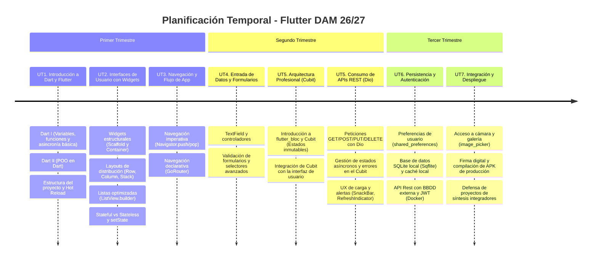

# Presentación

El módulo de **Desarrollo de Aplicaciones Multiplataforma con Flutter** se imparte dentro del segundo curso del Ciclo Formativo de Grado Superior en **Desarrollo de Aplicaciones Multiplataforma (DAM)** en el IES Ágora de Cáceres. 

Esta sección de la web servirá como repositorio oficial para la documentación, guías de clase y enunciados de las actividades prácticas que iremos realizando durante el curso.

---

## Metodología de Trabajo

Las clases están organizadas bajo un modelo híbrido de **Micro-Aprendizaje y Aprendizaje Basado en Proyectos (PBL)**:

1. **Sesión Teórica / Demo (20-25 minutos):** Al inicio de la semana, el profesor realizará una demostración en directo del *Concepto de la Semana* utilizando **Android Studio**.
2. **Sesión Práctica / Reto:** 
   - Durante la primera mitad del curso (conceptos básicos), los retos serán de carácter semanal.
   - En la segunda mitad del curso (temas avanzados como arquitectura BLoC, bases de datos o red), los proyectos se extenderán a ciclos de **2 o 3 semanas**, dejando que los alumnos trabajen autónomamente con tutorización.

---

## Criterios de Evaluación

La calificación del módulo se desglosa de la siguiente manera:

* **🏆 Proyectos (70%):** Proyectos integradores de fin de unidad o entregas del proyecto incremental de largo recorrido.
* **✍️ Actividades de Seguimiento (30%):** Retos cortos y ejercicios semanales independientes para afianzar conceptos clave.

---

## Unidades de Trabajo (UT)

El módulo se compone de **6 meses de formación (aproximadamente 24 semanas)** con una carga horaria de **3 horas semanales**, adaptadas al estándar profesional:

| Unidad | Título | Semanas | Enfoque Principal y Herramientas |
| :--- | :--- | :---: | :--- |
| **UT1** | Introducción a Dart y Flutter | Semanas 1 - 3 | Sintaxis de Dart, POO en Dart, asincronía y el primer proyecto. |
| **UT2** | Construcción de Interfaces con Widgets | Semanas 4 - 7 | Maquetación con widgets estructurales y layouts. Reactividad local con `setState`. |
| **UT3** | Navegación y Flujo de la Aplicación | Semanas 8 - 9 | Navegación imperativa y migración a navegación declarativa con **GoRouter**. |
| **UT4** | Entrada de Datos y Formularios | Semanas 10 - 11 | Validación de datos, controladores y componentes avanzados de entrada. |
| **UT5** | Arquitectura Profesional: BLoC/Cubit y APIs | Semanas 12 - 16 | Desacoplamiento de estado con **Cubit** (paquete `flutter_bloc`) y peticiones REST con **Dio**. |
| **UT6** | Persistencia Local, Autenticación y APIs | Semanas 17 - 21 | Preferencias (`shared_preferences`), SQLite (`Sqflite`) y consumo de API REST con base de datos externa y JWT (Docker). |
| **UT7** | Integración Nativa y Compilación | Semanas 22 - 24 | Acceso al hardware (cámara/galería) y firma de APKs comerciales. |

---

## Cronograma Temporal de Contenidos

---

## Materiales y Entorno de Desarrollo

Para el correcto seguimiento de las sesiones de clase, utilizaremos la pila tecnológica estándar en entornos profesionales:

* **IDE Recomendado:** **Android Studio** (aprovechando los emuladores y configuraciones de Android SDK ya configuradas en las clases de programación nativa).
* **Herramientas de Red y Navegación:** **Dio** (cliente HTTP) y **GoRouter** (enrutamiento oficial).
* **Gestión de Estado:** **BLoC / Cubit** (paquete `flutter_bloc`).
* **Entorno de Pruebas:** Emuladores de Android Studio, simulador de iOS o el dispositivo móvil físico de cada alumno conectado por USB (con depuración USB activada).

:::tip CABLE USB
Se recomienda disponer de un cable USB de datos compatible con tu dispositivo móvil físico para poder realizar pruebas en tiempo real directamente sobre el hardware sin sobrecargar el procesador del ordenador con emuladores.
:::

