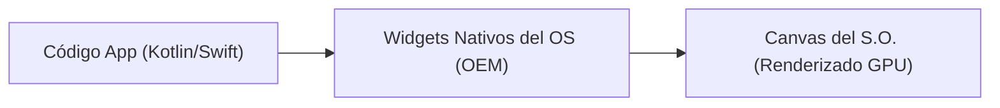
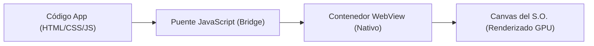
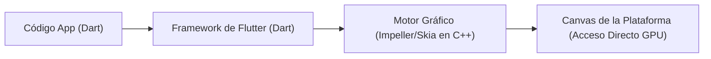

Bienvenido/a al módulo de Desarrollo de Aplicaciones Multiplataforma con **Flutter**.

A lo largo de este curso, aprenderás a construir aplicaciones de alto rendimiento para múltiples plataformas utilizando un único código fuente. Como futuro desarrollador multiplataforma, tu primer paso es entender las bases del ecosistema, qué tecnologías existen en el mercado y por qué Flutter se ha consolidado como la opción preferida por la industria.

---

## El Paradigma Multiplataforma

Hasta hace unos años, si una empresa quería lanzar una aplicación para teléfonos móviles, tenía que afrontar dos proyectos independientes: uno para **Android** (programado en Java/Kotlin) y otro para **iOS** (programado en Objective-C/Swift). Esto implicaba duplicar equipos de desarrollo, presupuestos y tiempos de mantenimiento.

Para solucionar este problema, surgieron diferentes enfoques de desarrollo:

*   **Desarrollo Nativo (Kotlin/Swift):** Cada plataforma tiene su código independiente. Ofrece el máximo rendimiento y acceso total a las APIs del sistema operativo, pero a un coste económico y de tiempo muy elevado.
*   **Híbridos Web (Cordova, Capacitor, Ionic):** La aplicación corre dentro de un contenedor web (un navegador integrado o *WebView* en el dispositivo). Aunque permite usar HTML/CSS/JS tradicionales, el rendimiento se ve comprometido debido al coste de renderizar una página web entera y a la necesidad de usar "puentes" (*bridges*) lentos para acceder al hardware nativo.
*   **Flutter (Compilación Nativa Directa):** Flutter rompe con el modelo de las WebViews y de los puentes. En lugar de pedirle al sistema operativo que dibuje sus propios botones o renderice una página web, Flutter dibuja cada píxel de la interfaz de usuario directamente en un *Canvas* utilizando su propio motor gráfico de alto rendimiento.

### Comparativa de Arquitecturas de Renderizado

Para entender la diferencia de rendimiento, analicemos de forma visual el camino que recorre una instrucción gráfica desde tu código hasta la GPU del dispositivo según la tecnología empleada:

#### 1. Arquitectura Nativa (Android/iOS)
El código de tu aplicación llama a los componentes de interfaz oficiales del sistema operativo (botones, listas, textos), y el propio sistema operativo se encarga de pintarlos en pantalla.


#### 2. Arquitectura Híbrida Web (WebView / Bridge)
El código corre dentro de un navegador integrado oculto. Cualquier acción que requiera acceso a sensores o componentes nativos debe cruzar un canal intermedio de comunicación (puente o *bridge*), lo cual penaliza enormemente la fluidez.


#### 3. Arquitectura de Flutter
Flutter prescinde por completo de los widgets nativos del sistema operativo y de los puentes. El framework de Flutter (en Dart) define la interfaz y el motor nativo de Flutter (en C++ / Impeller / Skia) dibuja directamente cada pixel en el canvas del sistema utilizando la GPU.


:::info ¿Qué son Impeller y Skia?
**Skia** ha sido el motor de renderizado 2D por defecto en Flutter. Sin embargo, el equipo de desarrollo de Flutter ha diseñado **Impeller**, un nuevo motor gráfico diseñado desde cero para aprovechar al máximo las GPUs modernas mediante APIs de bajo nivel (como Metal en iOS y Vulkan en Android). Esto elimina casi por completo los pequeños tirones gráficos (*jank*) durante las animaciones complejas.
:::

---

## Qué es Flutter y Dart

Para entender Flutter, debemos separar dos conceptos clave: el framework de diseño y el lenguaje de programación.

*   **Flutter (El SDK):** Es un conjunto de herramientas de desarrollo de software (SDK) creado por Google. Contiene componentes de interfaz de usuario preconstruidos (llamados *Widgets*), herramientas de compilación, utilidades de prueba y librerías para interactuar con el sistema nativo.
*   **Dart (El Lenguaje):** Es el lenguaje de programación en el que se escribe Flutter. Creado también por Google, destaca por su tipado estático opcional, su sintaxis familiar para programadores de Java/C# y su excelente soporte de asincronía.

### El Caso Particular de Flutter Web

Aunque nació enfocado a dispositivos móviles (Android e iOS), Flutter permite compilar la misma base de código para la **Web**. Cuando compilas para la web, Flutter traduce tu código Dart en una combinación de **HTML, CSS, JavaScript y WebAssembly** (usando motores como CanvasKit).

Como desarrollador multiplataforma, es fundamental que conozcas los límites de este enfoque:
*   **Cuándo utilizarlo:** Para aplicaciones web interactivas (Single Page Applications - SPAs), paneles de administración, intranets o herramientas internas donde desees compartir el 100% de la lógica y la interfaz de usuario de tu versión móvil.
*   **Cuándo evitarlo:** Para sitios web públicos, blogs o comercios electrónicos tradicionales. Dado que Flutter renderiza la app en un lienzo (*canvas*), no genera un árbol HTML estructurado estándar, dificultando enormemente el posicionamiento **SEO** en buscadores y requiriendo un tiempo de carga inicial de recursos superior al de frameworks web dedicados (como React, Angular o Next.js).

### Casos de Éxito de Flutter

Grandes empresas tecnológicas y sectores industriales utilizan Flutter para sus aplicaciones principales debido a su consistencia visual y rendimiento:
*   **Google Pay:** Migró toda su infraestructura global a Flutter, reduciendo drásticamente las líneas de código compartidas.
*   **BMW:** Desarrolló su app de infoentretenimiento y conectividad para vehículos utilizando Flutter para ofrecer una experiencia idéntica en Android e iOS.
*   **Alibaba / eBay:** Utilizan Flutter para sus plataformas de comercio electrónico móvil debido a la velocidad de carga e interactividad de sus interfaces.

---

## Por qué Dart es el Lenguaje de Flutter

Google eligió Dart para sustentar Flutter gracias a su arquitectura de compilación dual única:

1.  **Compilación Just-In-Time (JIT):** Durante la etapa de desarrollo, el código Dart se compila en tiempo de ejecución. Esto permite la característica más querida de Flutter: el **Hot Reload** (Inyección de código en caliente). Puedes cambiar el color de un botón o corregir un bug en el código y ver el resultado en el emulador en menos de un segundo sin perder el estado de la aplicación.
2.  **Compilación Ahead-Of-Time (AOT):** Cuando compilas tu aplicación para subirla a Google Play o App Store, Dart compila todo el código directamente a código máquina nativo (ARM o x64) antes de su ejecución. Esto garantiza un arranque rápido de la app y un rendimiento de renderizado fluido a 60 fps o 120 fps.

:::tip Recolección de Basura Generacional
Dart cuenta con un recolector de basura (*Garbage Collector*) optimizado para crear y destruir objetos de ciclo de vida muy corto de forma extremadamente rápida. Esto es clave en Flutter, donde la UI se reconstruye constantemente al cambiar el estado de la pantalla.
:::

---

## Ecosistema de Herramientas de Desarrollo

Para trabajar de forma profesional en este módulo, necesitarás familiarizarte con las siguientes herramientas:

*   **SDK de Flutter:** El motor principal que compila y gestiona tus aplicaciones. Puedes interactuar con él desde la línea de comandos (ej: `flutter doctor` para verificar la instalación, o `flutter run` para iniciar la ejecución).
*   **IDEs (Entornos de Desarrollo Integrados):**
    *   **Android Studio / IntelliJ IDEA:** Es el entorno recomendado para este curso. Proporciona un asistente gráfico avanzado para crear proyectos, emuladores Android integrados y herramientas robustas de depuración y refactorización de código.
    *   **Visual Studio Code (VS Code):** Una alternativa ligera muy popular. Requiere instalar las extensiones oficiales de *Dart* y *Flutter* para contar con autocompletado y depuración en caliente.
*   **Entornos de Ejecución:**
    *   **Emulador de Android:** Dispositivo Android virtual que se ejecuta en tu ordenador a través de Android SDK.
    *   **Simulador de iOS:** Herramienta exclusiva de ordenadores macOS para simular iPhones y iPads.
    *   **Dispositivo Físico:** Conectando un teléfono mediante cable USB y activando la *Depuración USB* en las opciones de desarrollador.

---

## Primer Vistazo al Código de Flutter

Para despertar tu curiosidad, observa el siguiente bloque de código. Representa una aplicación completa de Flutter que muestra un texto centrado en pantalla. En la Semana 3 analizaremos esta estructura a fondo, pero fíjate en lo legible y declarativa que es la sintaxis:

```dart title="lib/main.dart"
import 'package:flutter/material.dart';

// El punto de entrada obligatorio de toda aplicación Dart y Flutter
void main() {
  // Lanza la ejecución de nuestro widget raíz
  runApp(const MiPrimeraApp());
}

// Widget sin estado (estático) que representa la raíz de la interfaz
class MiPrimeraApp extends StatelessWidget {
  // Constructor constante para optimizar el rendimiento de renderizado en memoria
  const MiPrimeraApp({super.key});

  @override
  Widget build(BuildContext context) {
    // MaterialApp configura los estilos visuales del patrón Material Design de Google
    return MaterialApp(
      title: 'Mi Primera App',
      theme: ThemeData(
        useMaterial3: true,
        primarySwatch: Colors.blue,
      ),
      home: const PantallaPrincipal(),
    );
  }
}

// Widget que define el contenido de nuestra pantalla de bienvenida
class PantallaPrincipal extends StatelessWidget {
  const PantallaPrincipal({super.key});

  @override
  Widget build(BuildContext context) {
    // Scaffold proporciona la estructura visual básica (barra superior, cuerpo, etc.)
    return Scaffold(
      appBar: AppBar(
        title: const Text('¡Hola Flutter!'),
        backgroundColor: Colors.blue.shade100,
      ),
      body: const Center(
        child: Text(
          '¡Bienvenido a DAM con Flutter!',
          style: TextStyle(
            fontSize: 22,
            fontWeight: FontWeight.bold,
            color: Colors.blue,
          ),
        ),
      ),
    );
  }
}
```

A partir de la próxima lección, comenzaremos a explorar **Dart**, el lenguaje que nos permitirá dar vida a este código y controlar toda la lógica de nuestras futuras aplicaciones.
