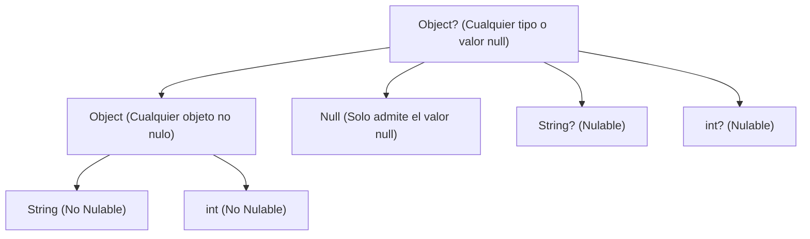

Para programar interfaces fluidas y reactivas en Flutter, primero debemos dominar su motor: **Dart**. Dart es un lenguaje con tipado fuerte, orientado a objetos y con un sistema de seguridad de tipos riguroso que te ayudará a prevenir el error más común en programación móvil: el famoso `NullPointerException` (error de puntero nulo).

Como ya tienes bases de programación en lenguajes como Java o C#, asimilaremos la sintaxis de Dart centrándonos en sus características diferenciales.

---

## Tipado y Variables

Dart es un lenguaje fuertemente tipado, lo que significa que cada variable tiene un tipo de dato definido que el compilador valida rigurosamente.

### Tipos de Datos de Dart

En Dart, al contrario que en lenguajes como Java o C, **todo valor es un objeto** (incluso los números o booleanos heredan de la clase base `Object`), por lo que no existen tipos primitivos puros. Los tipos de datos principales que utilizarás en el día a día son:

*   **Números (`num`):** Es la clase madre de la que heredan los tipos numéricos:
    *   `int`: Representa números enteros (ej. `12`, `-5`).
    *   `double`: Representa números de punto flotante/decimales (ej. `19.99`, `3.0`).
*   **Cadenas de texto (`String`):** Cadena inmutable de caracteres UTF-16. Se pueden usar comillas simples (`'`) o dobles (`"`), aunque la convención de estilo de Dart prefiere comillas simples.
*   **Booleanos (`bool`):** Admite únicamente los valores `true` y `false`.
*   **Colecciones integradas:**
    *   `List<T>`: Colecciones ordenadas de elementos indexados (equivalente a los arrays tradicionales). Ej: `List<int> notas = [5, 8, 10];`.
    *   `Set<T>`: Colecciones no ordenadas de elementos únicos (no admite duplicados). Ej: `Set<String> paises = {'España', 'Francia'};`.
    *   `Map<K, V>`: Estructuras clave-valor muy similares a los diccionarios o HashMaps. Ej: `Map<String, int> stock = {'camisas': 20, 'pantalones': 15};`.

### Declaración Explícita vs. Tipado Inferido

A la hora de declarar variables locales, tienes dos opciones: definir explícitamente el tipo o dejar que el compilador lo deduzca (tipado inferido) usando la palabra clave `var`.

```dart title="main.dart"
// Declaración explícita (sintaxis clásica)
String nombre = 'Juan';
int edad = 21;

// Tipado inferido mediante 'var'
var ciudad = 'Sevilla'; // El compilador infiere automáticamente que es String
var cp = 41001;        // Infiere que es int
```

:::info Buenas Prácticas de Estilo: ¿Qué se prefiere usar?
Siguiendo las directrices oficiales de desarrollo de Dart (*Effective Dart*), se aplica la siguiente regla de oro:
1.  **Tipado inferido (`var` o `final`)** para declarar variables locales dentro de funciones o métodos. Hace el código más legible y ágil de redactar sin perder seguridad de tipos.
2.  **Tipado explícito** obligatorio para las propiedades de clases, los parámetros de las funciones y los tipos de retorno de métodos públicos. Esto facilita que otros programadores comprendan rápidamente el "contrato" de tus funciones sin inspeccionar el código interno.
:::

### Inmutabilidad: final vs const

En el desarrollo de aplicaciones móviles con Flutter, la inmutabilidad es clave para el rendimiento. Dart provee dos palabras clave para declarar variables que no cambian, pero funcionan de manera distinta:

*   **`final` (Constante en tiempo de ejecución):** El valor se define una sola vez, pero puede calcularse mientras la aplicación está corriendo (ej: el resultado de una petición a una API o la hora actual del sistema).
*   **`const` (Constante en tiempo de compilación):** El valor debe conocerse y estar fijo antes de que la aplicación se ejecute.

```dart title="main.dart"
// final: se resuelve en tiempo de ejecución
final DateTime fechaAcceso = DateTime.now(); // Correcto: la fecha cambia según cuándo se ejecute

// const: se resuelve en tiempo de compilación
const double pi = 3.14159; // Correcto: pi siempre vale lo mismo
// const DateTime fechaHoy = DateTime.now(); // ERROR: DateTime.now() no se conoce al compilar
```

:::tip ¿Por qué importa en Flutter?
Flutter utiliza intensivamente constructores `const`. Si declaras un Widget de la interfaz como `const`, Flutter sabrá que ese componente nunca va a cambiar y lo reutilizará en memoria en lugar de volver a dibujarlo desde cero, ahorrando ciclos de CPU y batería.
:::

### Tipado flexible: dynamic vs Object

Si necesitas trabajar con datos cuyo tipo no conoces inicialmente (como la respuesta cruda de un servicio de red), tienes dos opciones con filosofías opuestas:

*   **`dynamic`:** Desactiva por completo el analizador estático de tipos del compilador. Te permite invocar cualquier método o propiedad sin que el editor te muestre un error, pero si dicho método no existe en tiempo de ejecución, la aplicación fallará.
*   **`Object`:** Es la clase base de todos los objetos en Dart (excepto nulos). Al usarla, mantienes la seguridad de tipos; el compilador no te dejará invocar métodos del tipo real del objeto a menos que realices una comprobación o conversión de tipo (*casting*) explícita.

```dart title="main.dart"
dynamic datoFlexible = 'Hola Mundo';
print(datoFlexible.length); // Compila correctamente. Imprime 10.
datoFlexible = 42;
// print(datoFlexible.length); // Compila, pero FALLA al ejecutar (un entero no tiene propiedad length)

Object datoSeguro = 'Hola Mundo';
// print(datoSeguro.length); // ERROR DE COMPILACIÓN: Object no tiene la propiedad 'length'
if (datoSeguro is String) {
  print(datoSeguro.length); // Correcto: la comprobación 'is' promueve el tipo a String
}
```

:::warning ¿Es normal usar tipado flexible en el día a día?
**Rotundamente no.** El uso de `dynamic` rompe la seguridad de tipos y anula las ventajas del compilador de Dart, acercando el código a lenguajes propensos a errores en ejecución como JavaScript. 

La **única excepción común** en la que verás `dynamic` de forma habitual es al recibir datos crudos en formato JSON desde APIs de internet, donde la estructura típicamente es un mapa del tipo `Map<String, dynamic>`. Sin embargo, la buena práctica profesional dictamina que esos datos deben mapearse inmediatamente a una **clase modelo estructurada** (fuertemente tipada) para no propagar el uso de `dynamic` por el resto de la aplicación.
:::

---

## Null Safety Estricto

Dart implementa **Sound Null Safety** (seguridad nula garantizada). Esto significa que las variables no pueden contener el valor `null` a menos que lo indiques explícitamente al compilador.

El sistema de tipos de Dart divide las variables en dos categorías jerárquicas:



Si declaras una variable estándar, el compilador te impedirá asignarle `null`:

```dart title="main.dart"
String correo = 'alumno@correo.com';
// correo = null; // ERROR DE COMPILACIÓN: Un valor de tipo Null no puede asignarse a un String.

// Para permitir nulos, añadimos el modificador '?'
String? telefonoOpcional; // Por defecto vale null
telefonoOpcional = '600123456'; // Correcto
telefonoOpcional = null;        // Correcto
```

### Operadores de Null Safety

Para manipular estas variables nulificables de forma segura sin provocar excepciones en producción, Dart ofrece operadores integrados:

#### 1. Operador de acceso seguro (`?.`)
Ejecuta la propiedad o método del objeto únicamente si este no es nulo. Si es nulo, devuelve directamente `null` sin fallar.

```dart title="main.dart"
String? apellido;
// print(apellido.length); // ERROR: El compilador te avisa de que el valor puede ser nulo.
print(apellido?.length);    // Imprime 'null' en consola sin fallar la aplicación.
```

#### 2. Operador de coalescencia nula (`??`)
Permite establecer un valor por defecto en caso de que la expresión de la izquierda resulte nula.

```dart title="main.dart"
String? temaUsuario;
String temaPorDefecto = temaUsuario ?? 'dark'; // Si temaUsuario es null, asigna 'dark'
print(temaPorDefecto); // Imprime 'dark'
```

#### 3. Operador de asignación condicional (`??=`)
Asigna un valor a una variable únicamente si su valor actual es nulo.

```dart title="main.dart"
double? precioEnvio;
precioEnvio ??= 4.99; // Como precioEnvio era null, ahora vale 4.99
precioEnvio ??= 9.99; // No hace nada porque precioEnvio ya no es nulo
print(precioEnvio);    // Imprime 4.99
```

#### 4. Operador de aserción forzada (`!`)
Le promete formalmente al compilador que la variable **no es nula** en ese punto. Debe usarse con extrema precaución.

```dart title="main.dart"
String? tokenAcceso = obtenerToken();
// Si estás 100% seguro de que el token existe en esta fase
String tokenNoNulo = tokenAcceso!; // Si tokenAcceso es null, lanzará un error de ejecución inmediatamente
```

---

## Estructuras de Control y Funciones

Dart soporta las estructuras clásicas de control de flujo que ya conoces de Java o C#. Su sintaxis básica es idéntica, por lo que las repasaremos mediante ejemplos prácticos breves de cada una.

### Estructuras de Control

#### Condicional `if-else`
```dart title="main.dart"
int calificacion = 8;
if (calificacion >= 5) {
  print('Aprobado');
} else if (calificacion >= 4) {
  print('Aprobado condicional');
} else {
  print('Suspenso');
}
```

#### Condicional `switch` (Clásico)
```dart title="main.dart"
String estadoConexion = 'espera';
switch (estadoConexion) {
  case 'espera':
    print('Conexión pendiente...');
    break;
  case 'conectado':
    print('Conexión establecida.');
    break;
  default:
    print('Conexión perdida.');
}
```

:::tip Switch como Expresión (Dart 3+)
En las versiones modernas de Dart, puedes usar `switch` como una expresión que devuelve un valor directamente, lo cual es muy útil para mapear estados en la interfaz de Flutter:
```dart title="main.dart"
String estado = 'success';
final mensaje = switch(estado) {
  'loading' => 'Cargando datos...',
  'success' => 'Operación completada con éxito.',
  _         => 'Ocurrió un error inesperado.' // El guion bajo actúa como 'default'
};
print(mensaje);
```
:::

#### Bucles `for` y `for-in`
El bucle `for` tradicional funciona igual que en Java. Sin embargo, para recorrer listas o conjuntos es mucho más común usar `for-in`:
```dart title="main.dart"
// For tradicional
for (int i = 1; i <= 3; i++) {
  print('Paso número $i');
}

// For-in (para recorrer colecciones)
List<String> lenguajes = ['Dart', 'Kotlin', 'Swift'];
for (var lenguaje in lenguajes) {
  print('Aprenderemos: $lenguaje');
}
```

#### Bucles `while` y `do-while`
```dart title="main.dart"
int descargas = 0;
while (descargas < 3) {
  descargas++;
  print('Descarga $descargas completada.');
}

int intentos = 0;
do {
  intentos++;
  print('Intento de conexión número $intentos.');
} while (intentos < 1);
```

---

### Funciones y Expresión de Flecha

Las funciones en Dart son objetos de primera clase, lo que significa que pueden asignarse a variables o pasarse como argumentos.

```dart title="main.dart"
// Función con retorno explícito
int sumar(int a, int b) {
  return a + b;
}

// Función flecha (Arrow Syntax) para expresiones de una sola línea
int restar(int a, int b) => a - b;
```

### Gestión de Parámetros

A diferencia de Java, Dart tiene un sistema muy flexible para pasar argumentos a las funciones:

#### Parámetros Posicionales
Son los parámetros tradicionales. El orden en el que los pasas determina su valor.

```dart title="main.dart"
void saludar(String nombre, String saludo) {
  print('$saludo, $nombre');
}
// Uso obligatorio en orden:
saludar('Carlos', 'Buenos días');
```

#### Parámetros Nombrados (Envueltos en `{}`)
Son el estándar absoluto en Flutter. Permiten pasar los argumentos en cualquier orden escribiendo el nombre del parámetro. De forma predeterminada son opcionales, a menos que uses el modificador `required`.

```dart title="main.dart"
// Parámetros con nombre. 'required' obliga a enviarlo; 'saludo' tiene un valor por defecto
void registrarUsuario({required String email, String saludo = 'Hola'}) {
  print('$saludo, tu cuenta vinculada es $email');
}

// Uso (el orden de los parámetros da igual):
registrarUsuario(email: 'alumno@fp.es'); // Imprime: Hola, tu cuenta vinculada es alumno@fp.es
registrarUsuario(saludo: 'Bienvenido', email: 'admin@fp.es'); 
```

#### Parámetros Opcionales Posicionales (Envueltos en `[]`)
Permiten definir parámetros al final de la función que el programador puede omitir si lo desea.

```dart title="main.dart"
void definirPerfil(String nombre, [String? redSocial, int edad = 18]) {
  print('Nombre: $nombre, Red: ${redSocial ?? "No indicada"}, Edad: $edad');
}

// Uso:
definirPerfil('Ana'); // Red: No indicada, Edad: 18
definirPerfil('Ana', '@anadev', 25);
```

---

---

## Ejercicios Prácticos

Pon a prueba los conceptos estudiados resolviendo estos **ejercicios prácticos** en [DartPad](https://dartpad.dev). Están ordenados de menor a mayor complejidad.

### Ejercicio 1: Conversor de Unidades
Escribe dos funciones flecha en un script de Dart:
1. `kmToMiles`: Convierte kilómetros a millas sabiendo que $1 \text{ km} \approx 0.621371 \text{ millas}$.
2. `celsiusToFahrenheit`: Convierte grados Celsius a Fahrenheit usando la fórmula: $F = C \times 1.8 + 32$.

Declara los factores de conversión y valores constantes usando `const`.

```dart title="main.dart"
// Factor de conversión constante: 0.621371

// TODO: Define la función flecha kmToMiles
// TODO: Define la función flecha celsiusToFahrenheit

void main() {
  const double distanciaKm = 10.0;
  const double tempCelsius = 25.0;
  
  // Imprime las conversiones llamando a tus funciones
  // Salida esperada aproximada:
  // 10.0 km equivalen a 6.21 millas.
  // 25.0 ºC equivalen a 77.0 ºF.
}
```

---

### Ejercicio 2: Procesador de Carrito de Compra 
Tienes un listado que representa los artículos de un carrito de compra. Implementa una función llamada `calcularTotalConDescuento` que recorra la lista de productos y sume sus precios. La función debe aplicar un **10% de descuento** únicamente a los productos que pertenezcan a la categoría `'electrónica'`.

```dart title="main.dart"
void main() {
  final List<Map<String, dynamic>> carrito = [
    {'nombre': 'Teclado Mecánico', 'precio': 59.99, 'categoria': 'electrónica'},
    {'nombre': 'Camiseta Algodón', 'precio': 19.99, 'categoria': 'ropa'},
    {'nombre': 'Auriculares Bluetooth', 'precio': 89.90, 'categoria': 'electrónica'},
    {'nombre': 'Libro Flutter Docs', 'precio': 29.95, 'categoria': 'libros'},
  ];

  final total = calcularTotalConDescuento(carrito);
  print('Total a pagar: ${total.toStringAsFixed(2)} €');
  // Salida esperada: Total a pagar: 184.74 €
}

// TODO: Implementa la función calcularTotalConDescuento
```

---

### Ejercicio 3: Configuración de Notificaciones
Un usuario puede configurar o no las alertas de su perfil móvil. Crea una función llamada `obtenerEstadoNotificaciones` que reciba un mapa de configuración. 
1. Si la clave `'permitirSonido'` es nula, inicialízala por defecto a `true` usando el operador de asignación nula (`??=`).
2. Si la clave `'emailAlternativo'` es nula o no existe, obtén su longitud de caracteres de forma segura empleando acceso seguro (`?.`) y asígnale el valor `0` por defecto utilizando coalescencia nula (`??`).

```dart title="main.dart"
void main() {
  Map<String, dynamic> configUsuario1 = {
    'permitirSonido': null,
    'emailAlternativo': 'contacto@correo.com',
  };

  Map<String, dynamic> configUsuario2 = {
    'permitirSonido': false,
    'emailAlternativo': null,
  };

  procesarConfiguracion(configUsuario1);
  procesarConfiguracion(configUsuario2);
}

void procesarConfiguracion(Map<String, dynamic> config) {
  // TODO: Aplica ??= para asegurar que permitirSonido no sea nulo (por defecto true)
  
  // TODO: Obtén la longitud del emailAlternativo de forma segura (?. y ??)
  
  print('Sonido activo: ${config['permitirSonido']}, Longitud Email: ...');
  // Salidas esperadas:
  // Usuario 1 -> Sonido activo: true, Longitud Email: 19
  // Usuario 2 -> Sonido activo: false, Longitud Email: 0
}
```

---

### Ejercicio 4: Enrutador HTTP Simulado
Crea una función llamada `responderSolicitud` que reciba un código HTTP mediante un parámetro nombrado obligatorio. La función debe retornar un mensaje descriptivo basándose en el código recibido usando un `switch` expresión.

```dart title="main.dart"
// TODO: Implementa la función responderSolicitud con parámetro nombrado statusCode

void main() {
  print(responderSolicitud(statusCode: 200)); // Salida: OK
  print(responderSolicitud(statusCode: 404)); // Salida: Recurso no encontrado
  print(responderSolicitud(statusCode: 500)); // Salida: Error interno del servidor
  print(responderSolicitud(statusCode: 302)); // Salida: Código de estado desconocido (302)
}
```

---

### Ejercicio 5: Formateador de Fichas de Estudiantes
Modifica la función `formatearFicha` para que reciba y procese la información de estudiantes desde una base de datos ficticia. El listado contiene valores nulos que debes gestionar para evitar caídas en producción.

```dart title="main.dart"
void main() {
  final List<Map<String, dynamic>> alumnosCrudos = [
    {
      'nombre': 'Alberto',
      'apellido1': 'García',
      'notaMedia': 8.5,
      'telefono': '600111222'
    },
    {
      'nombre': 'Beatriz',
      'apellido1': 'López',
      'apellido2': 'Sánchez',
      'notaMedia': 9.2,
    },
    {
      'nombre': 'Carlos',
      'apellido1': 'Martín',
      'notaMedia': null,
      'telefono': '655999888'
    }
  ];

  for (var alumno in alumnosCrudos) {
    print(formatearFicha(
      nombre: alumno['nombre'],
      apellido1: alumno['apellido1'],
      apellido2: alumno['apellido2'],
      nota: alumno['notaMedia'],
      telefono: alumno['telefono']
    ));
    print('--------------------------------------');
  }
}

// TODO: Implementa aquí la función 'formatearFicha'
// 1. Debe recibir los parámetros usando nomenclatura nombrada.
// 2. El 'nombre' y 'apellido1' son obligatorios (required).
// 3. El 'apellido2' (String?), 'nota' (double?) y 'telefono' (String?) son opcionales y admiten nulos.
// 4. Si la 'nota' es nula, sustituye por "Pendiente de calificar".
// 5. Si el 'telefono' es nulo, sustituye por "Sin teléfono de contacto".
// 6. Debe concatenar el nombre completo agregando el apellido2 solo si este no es nulo.
```

#### Resultado Esperado en Consola
```text
Alumno: Alberto García
Calificación: 8.5
Contacto: 600111222
--------------------------------------
Alumno: Beatriz López Sánchez
Calificación: 9.2
Contacto: Sin teléfono de contacto
--------------------------------------
Alumno: Carlos Martín
Calificación: Pendiente de calificar
Contacto: 655999888
--------------------------------------
```

