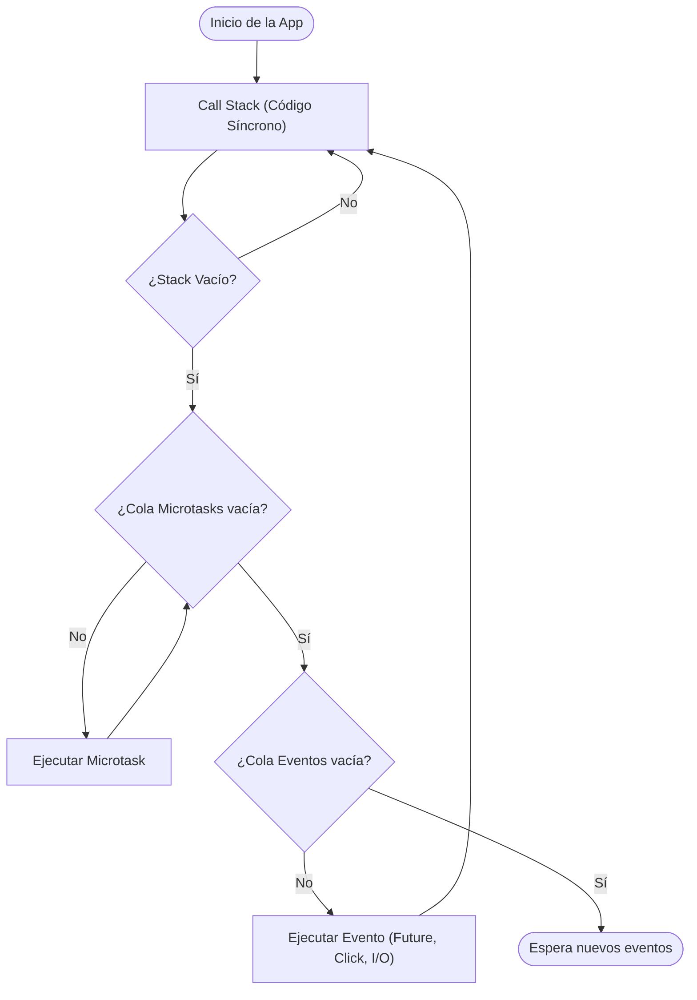

Una vez dominados los fundamentos sintácticos y el sistema de Null Safety de Dart, es hora de dar el salto al desarrollo estructurado. En esta lección profundizaremos en el modelo de **Programación Orientada a Objetos (POO)** avanzado de Dart y en su modelo de **concurrencia asíncrona**, pilares sobre los que se asienta toda la arquitectura de Flutter.

---

## Programación Orientada a Objetos Avanzada

Dart es un lenguaje puramente orientado a objetos. En esta sección analizaremos cómo Dart amplía el concepto clásico de clase y constructor para optimizar el rendimiento del renderizado en dispositivos móviles.

### Declaración de Clases y Encapsulamiento

En Dart, la visibilidad de los atributos o métodos no se controla mediante palabras clave como `private` o `public`. En su lugar, el **guion bajo (`_`)** define un miembro como **privado a nivel de librería** (el archivo `.dart` en el que está escrito).

```dart title="lib/model/producto.dart"
class Producto {
  // Atributos públicos
  String nombre;
  double precio;

  // Atributo privado (solo accesible dentro de este archivo)
  int _stock;

  // Constructor simplificado
  Producto(this.nombre, this.precio, this._stock);
}
```

:::info Diferencia con Java: La filosofía de encapsulamiento en Dart
A diferencia de Java, donde la convención estándar es hacer **todos** los atributos privados y crear getters/setters redundantes para cada uno, **en Dart los atributos deben ser públicos por defecto**.

¿Por qué? En Dart, las propiedades públicas generan implícitamente getters y setters automáticos bajo el capó. Si en el futuro necesitas añadir lógica de validación a un campo público (como haremos con el stock a continuación), puedes transformar ese campo en privado y escribir un `get` y un `set` personalizados **sin necesidad de alterar la sintaxis de las clases que lo consumen** (seguirán haciendo `producto.nombre` en lugar de tener que cambiar a `producto.getNombre()`).
:::

### Getters y Setters

Para acceder y modificar los atributos privados de forma limpia, Dart proporciona los operadores `get` y `set`. Estos permiten exponer propiedades computadas que se comportan sintácticamente como atributos comunes.

```dart title="lib/model/producto.dart"
class Producto {
  String nombre;
  double precio;
  int _stock;

  Producto(this.nombre, this.precio, this._stock);

  // Getter: expone el stock de forma controlada
  int get stock => _stock;

  // Setter: valida los datos antes de actualizar el stock
  set stock(int nuevoStock) {
    if (nuevoStock >= 0) {
      _stock = nuevoStock;
    } else {
      print('El stock no puede ser negativo.');
    }
  }
}
```

### Tipos de Constructores en Dart

Dart ofrece una amplia gama de constructores para cubrir diferentes necesidades de diseño:

#### 1. Constructores con Nombre (Named Constructors)
Permiten definir múltiples constructores para una misma clase con propósitos específicos, incrementando la claridad del código. Es muy común utilizarlos para instanciar objetos a partir de respuestas JSON.

```dart title="main.dart"
class Usuario {
  final String nombre;
  final String rol;

  // Constructor principal
  Usuario(this.nombre, this.rol);

  // Constructor con nombre
  Usuario.invitado()
      : nombre = 'Invitado',
        rol = 'lector';

  // Constructor con nombre a partir de un Mapa (JSON deserializado)
  Usuario.desdeJson(Map<String, dynamic> json)
      : nombre = json['name'] ?? 'Desconocido',
        rol = json['role'] ?? 'usuario';
}
```

#### 2. Constructores Constantes (`const`)
Si una clase genera objetos inmutables cuyos valores se conocen al compilar, podemos definir su constructor como `const`. Esto le indica al compilador de Dart que aplique **canonización**: todas las instancias idénticas compartirán la misma posición física en memoria, reduciendo el consumo de RAM.

```dart title="main.dart"
class Punto {
  final double x;
  final double y;

  // Todos los campos deben ser obligatoriamente 'final'
  const Punto(this.x, this.y);
}

void main() {
  // Ambas variables apuntan a la misma dirección física en memoria
  const p1 = Punto(1.0, 2.0);
  const p2 = Punto(1.0, 2.0);
  
  print(identical(p1, p2)); // Imprime 'true'
}
```

#### 3. Constructores Factoría (`factory`)
Se utiliza cuando el constructor no siempre debe crear una nueva instancia de la clase. Es útil para retornar instancias desde una memoria caché, devolver subtipos de una jerarquía de herencia o validar datos antes de la instanciación.

```dart title="main.dart"
class Logger {
  final String nombre;
  static final Map<String, Logger> _cache = {};

  // El constructor factory intercepta la llamada y decide qué retornar
  factory Logger(String nombre) {
    return _cache.putIfAbsent(nombre, () => Logger._interno(nombre));
  }

  // Constructor privado con nombre
  Logger._interno(this.nombre);
}
```

---

## Herencia y Contratos (Interfaces y Mixins)

En esta sección analizaremos cómo Dart maneja la herencia múltiple y las interfaces, rompiendo con los esquemas rígidos de lenguajes como Java.

### Herencia con extends
La herencia funciona de la manera tradicional: una subclase hereda atributos y métodos de una superclase mediante `extends`, permitiendo sobreescribir métodos usando el decorador `@override`.

```dart title="main.dart"
abstract class Vehiculo {
  final String marca;
  Vehiculo(this.marca);

  void arrancar() => print('El vehículo está listo.');
}

class Coche extends Vehiculo {
  Coche(super.marca);

  @override
  void arrancar() {
    super.arrancar();
    print('Motor de coche encendido.');
  }
}
```

### Interfaces Implícitas
En Dart **no existe la palabra clave `interface`**. En su lugar, **toda clase define implícitamente una interfaz** que contiene todos sus miembros públicos. Cualquier clase puede implementar la interfaz de otra usando `implements`. 

:::warning Regla de Oro de implements
Cuando usas `implements`, estás obligado a redefinir **todos** los atributos y métodos de la clase implementada, sin heredar comportamiento alguno. Esto es útil para crear mockups de servicios durante las pruebas.
:::

```dart title="main.dart"
class ConexionApi {
  void descargarDatos() => print('Descargando datos reales de la red...');
}

// Simulamos la API para pruebas de código
class MockConexionApi implements ConexionApi {
  @override
  void descargarDatos() {
    print('Retornando datos falsos de prueba...');
  }
}
```

### Mixins (Uso de with)
Un `mixin` es una forma de reutilizar código de una clase en múltiples jerarquías de clases distintas, sin necesidad de heredar directamente. Esto solventa la limitación de la herencia única de Dart.

```dart title="main.dart"
mixin Volador {
  void volar() => print('Estoy volando...');
}

mixin Caminador {
  void caminar() => print('Camino sobre el suelo.');
}

// Aplicamos mixins usando la palabra clave 'with'
class Pato extends Vehiculo with Volador, Caminador {
  Pato(super.marca);
}
```

---

## Asincronía en Dart

A diferencia de Java, **Dart es un lenguaje de un solo hilo** (*single-threaded*). Esto significa que toda la aplicación se ejecuta en una única línea de tiempo continua. Sin embargo, soporta operaciones asíncronas concurrentes gracias al **Event Loop** (Bucle de Eventos).

### El Event Loop de Dart

El Event Loop gestiona la ejecución de tareas síncronas y asíncronas repartiéndolas en dos colas principales:
*   **Microtask Queue (Prioritaria):** Tareas del propio sistema que deben ejecutarse inmediatamente después de la línea de código síncrono actual.
*   **Event Queue (Eventos externos):** Tareas asíncronas como respuestas de red, lectura de archivos, temporizadores o interacciones táctiles del usuario en Flutter.



### Futures (async y await)

Un `Future<T>` representa una operación asíncrona que se completará en el futuro. Puede finalizar con éxito (devolviendo un valor de tipo `T`) o fallar con una excepción.

Para escribir código asíncrono legible que simule ser secuencial, empleamos las palabras clave `async` (marca una función como asíncrona) y `await` (pausa la ejecución de la función hasta que el `Future` se resuelva).

```dart title="main.dart"
// Función asíncrona que simula una consulta de base de datos
Future<String> obtenerNombreUsuario(int id) async {
  // Simulamos un retraso de red de 2 segundos de forma no bloqueante
  await Future.delayed(const Duration(seconds: 2));
  return 'María Soler';
}

void main() async {
  print('Iniciando consulta...');
  
  try {
    // await detiene la lectura síncrona local hasta recibir el valor del Future
    final usuario = await obtenerNombreUsuario(105);
    print('Usuario obtenido: $usuario');
  } catch (e) {
    print('Error al consultar: $e');
  }
  
  print('Fin del programa.');
}
```

---

## Ejercicios Prácticos

A continuación, se proponen **4 actividades avanzadas** para consolidar los temas estudiados. Están diseñadas para cubrir un total aproximado de **3 horas de implementación** en [DartPad](https://dartpad.dev).

### Ejercicio 1: Catálogo de Concesionario con Constructores (POO)
*Tiempo estimado de resolución: 40 minutos.*

Escribe una clase llamada `Vehiculo` y sus derivadas que controle el inventario de un concesionario.
1. La clase `Vehiculo` debe tener propiedades `marca`, `modelo` y un atributo privado `_precio` (de tipo `double`).
2. Implementa un constructor convencional, un constructor con nombre `Vehiculo.desdeJson(Map<String, dynamic> json)` y un constructor constante `Vehiculo.promocion(this.marca, this.modelo)` que inicialice el precio a `10000.0`.
3. Crea los correspondientes `getters` y `setters` para `_precio`, impidiendo que el precio de venta sea menor o igual a cero.

```dart title="main.dart"
void main() {
  final coche1 = Vehiculo('Toyota', 'Corolla', 25000.0);
  
  final datosJson = {'marca': 'Hyundai', 'modelo': 'i30', 'precio': 18500.0};
  final coche2 = Vehiculo.desdeJson(datosJson);
  
  const cochePromo = Vehiculo.promocion('Dacia', 'Sandero');

  // Intenta asignar un precio no válido
  coche1.precio = -500.0; 

  print('Coche 1: ${coche1.marca} - ${coche1.precio} €');
  print('Coche 2: ${coche2.marca} - ${coche2.precio} €');
  print('Coche Promo: ${cochePromo.marca} - ${cochePromo.precio} €');
}

// TODO: Implementa la clase Vehiculo con sus constructores y encapsulamiento
```

---

### Ejercicio 2: Sistema de Notificaciones con Mixins (Herencia y Contratos)
*Tiempo estimado de resolución: 40 minutos.*

Diseña un sistema de envío de notificaciones aplicando contratos de interfaces y mixins.
1. Define una clase abstracta `Notificador` que obligue a implementar el método `void enviar(String mensaje)`.
2. Crea un `mixin` llamado `LoggerNotificaciones` que añada un método `void registrarLog(String canal, String mensaje)` que imprima la fecha y el canal en consola.
3. Implementa dos clases: `EmailNotificador` y `SmsNotificador`. Ambas deben extender de `Notificador` y aplicar el mixin `LoggerNotificaciones`.
4. El método `enviar` de cada clase debe invocar a `registrarLog` antes de simular el envío del mensaje.

```dart title="main.dart"
void main() {
  final emailService = EmailNotificador();
  final smsService = SmsNotificador();

  emailService.enviar('Bienvenido a la plataforma.');
  smsService.enviar('Tu código de verificación es 4812.');
}

// TODO: Define la clase abstracta Notificador
// TODO: Define el mixin LoggerNotificaciones
// TODO: Implementa EmailNotificador y SmsNotificador
```

#### Resultado Esperado en Consola
```text
[LOG - Email]: Registrando envío de: Bienvenido a la plataforma.
Enviando Email con el mensaje: Bienvenido a la plataforma.
[LOG - SMS]: Registrando envío de: Tu código de verificación es 4812.
Enviando SMS con el mensaje: Tu código de verificación es 4812.
```

---

### Ejercicio 3: Gestor de Peticiones Concurrentes (Asincronía)
*Tiempo estimado de resolución: 50 minutos.*

Simula la carga inicial de datos de una aplicación móvil consumiendo recursos en segundo plano.
1. Escribe tres funciones asíncronas independientes:
   *   `obtenerDatosPerfil()`: Retorna un `Future<String>` simulando un retardo de 2 segundos.
   *   `obtenerNotificaciones()`: Retorna un `Future<List<String>>` simulando un retardo de 1 segundo.
   *   `obtenerAjustes()`: Retorna un `Future<Map<String, bool>>` simulando un retardo de 1.5 segundos.
2. Crea una función llamada `inicializarApp` que ejecute las tres peticiones en paralelo (pista: investiga cómo funciona `Future.wait()`).
3. Mide el tiempo total de la ejecución de forma dinámica. Si se ejecutan en paralelo, el tiempo total debería ser aproximadamente el de la petición más lenta (2 segundos) y no la suma de todas (4.5 segundos).

```dart title="main.dart"
void main() async {
  print('Iniciando carga de la aplicación...');
  final stopwatch = Stopwatch()..start();

  // TODO: Ejecuta inicializarApp y espera sus resultados

  print('Carga finalizada en: ${stopwatch.elapsed.inSeconds} segundos.');
}

// TODO: Implementa las funciones asíncronas y la lógica de inicializarApp
```

#### Resultado Esperado en Consola
```text
Iniciando carga de la aplicación...
[Perfil] Cargado.
[Ajustes] Cargados.
[Notificaciones] Cargadas.
Carga finalizada en: 2 segundos.
```

---

### Ejercicio 4: Autenticación con Mock database (Integrador)
*Tiempo estimado de resolución: 50 minutos.*

Este ejercicio final integra Programación Orientada a Objetos, constructores de mapeo, control de excepciones y asincronía.
1. Crea una clase `Usuario` con los campos `id`, `email` y un constructor con nombre `Usuario.desdeJson`.
2. Implementa una clase `AuthService` que simule una autenticación de base de datos local:
   *   Tiene un método asíncrono `login(String email, String password)` que tarda 1.5 segundos en ejecutarse.
   *   Si las credenciales coinciden con `'admin@correo.com'` y `'1234'`, devuelve un objeto `Usuario` creado bajo un mapa JSON simulado.
   *   Si las credenciales fallan, lanza una excepción personalizada llamada `AuthException` que contenga un mensaje descriptivo de error.
3. En la función `main()`, realiza una llamada exitosa y otra fallida, capturando y tratando los errores de forma limpia con `try-catch`.

```dart title="main.dart"
// TODO: Define la clase Usuario
// TODO: Define la excepción personalizada AuthException
// TODO: Define la clase AuthService

void main() async {
  final authService = AuthService();

  print('--- Intento 1: Credenciales Correctas ---');
  // TODO: Implementa la llamada a login exitoso y muestra sus datos
  
  print('\n--- Intento 2: Credenciales Incorrectas ---');
  // TODO: Implementa la llamada a login fallido y captura el AuthException
}
```
