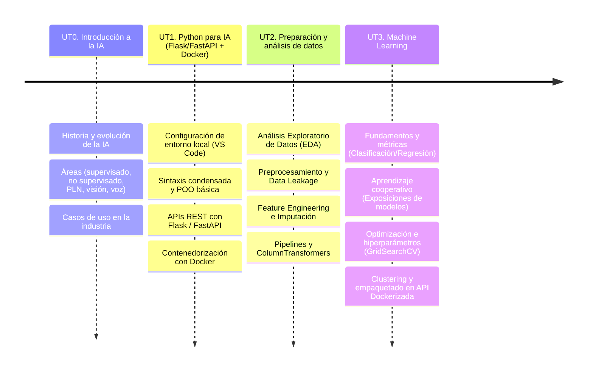
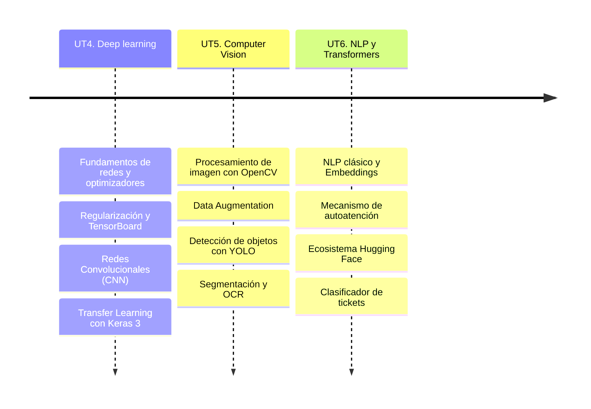
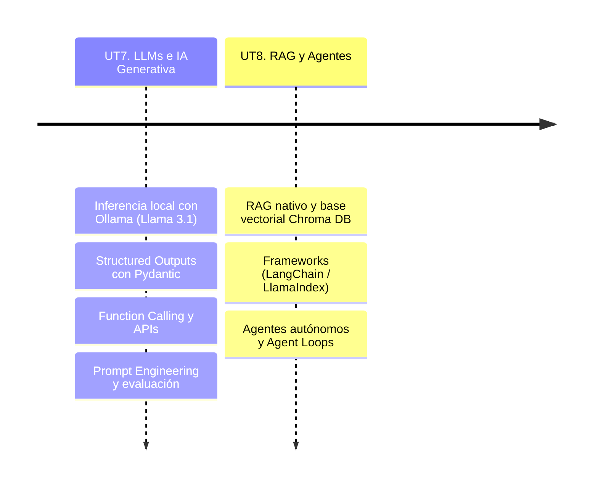

# Presentación

El módulo **Programación de Inteligencia Artificial** (PIA) se encuentra dentro del Curso de especialización en **Inteligencia Artificial y Big Data**. Esta página web servirá de repositorio para agrupar los materiales y actividades de dicho módulo, impartido en el IES Ágora de Cáceres durante el curso académico 2026-2027.

## Resultados de aprendizaje

Los **resultados de aprendizaje (RA)** trabajados en este módulo son los indicados en el **Real Decreto 279/2021**:

| Código | Descripción |
|--------|-------------|
| RA1    | Caracteriza lenguajes de programación valorando su idoneidad en el desarrollo de Inteligencia Artificial. |
| RA2    | Desarrolla aplicaciones de Inteligencia Artificial utilizando entornos de modelado. |
| RA3    | Evalúa las mejoras en los negocios integrando convergencia tecnológica. |
| RA4    | Evalúa modelos de automatización industrial y de negocio relacionándolos con los resultados esperados por las empresas. |

## Unidades de trabajo

El módulo de PIA se ha estructurado de forma eminentemente práctica, sumando un total de **200 horas** distribuidas en las siguientes unidades de trabajo (UT):

| EV. | UNIDAD                                    | RAs       | HORAS |
|------------|-------------------------------------------|-----------|-------|
| 1ª         | UT0. Introducción a la IA                 | RA1       | 2 h   |
| 1ª         | UT1. Python para IA (Flask/FastAPI + Docker)| RA1     | 15 h  |
| 1ª         | UT2. Preparación y análisis de datos      | RA2       | 15 h  |
| 1ª         | UT3. Machine Learning                     | RA2       | 34 h  |
| 2ª         | UT4. Deep learning                        | RA2       | 30 h  |
| 2ª         | UT5. Computer Vision                      | RA3       | 20 h  |
| 2ª         | UT6. NLP y Transformers                   | RA3       | 20 h  |
| 3ª         | UT7. LLMs e IA Generativa                 | RA4       | 39 h  |
| 3ª         | UT8. RAG y Agentes                        | RA4       | 25 h  |
|            | **TOTAL**                                 |           | **200 h** |

## Temporalización

Las unidades de trabajo y sus contenidos clave se organizan a lo largo de los tres trimestres del curso bajo los siguientes esquemas temporales:

### 1ª Evaluación

### 2ª Evaluación

### 3ª Evaluación

## Materiales y recursos de software

Para el desarrollo y seguimiento de las clases, contaremos con los siguientes recursos:

**Materiales didácticos**  
- Apuntes y recursos estructurados disponibles en esta página web.  
- Enunciados de retos, laboratorios y proyectos publicados en la plataforma *Evex*.  

**Software y herramientas necesarias**  
- **VS Code:** Como entorno de desarrollo local principal.
- **Docker Desktop:** Para la creación y orquestación de contenedores.
- **Google Colab:** Para aquellas fases del entrenamiento de redes que requieran aceleración por GPU.

