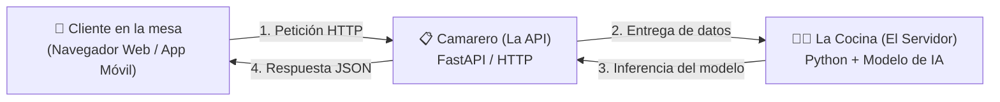
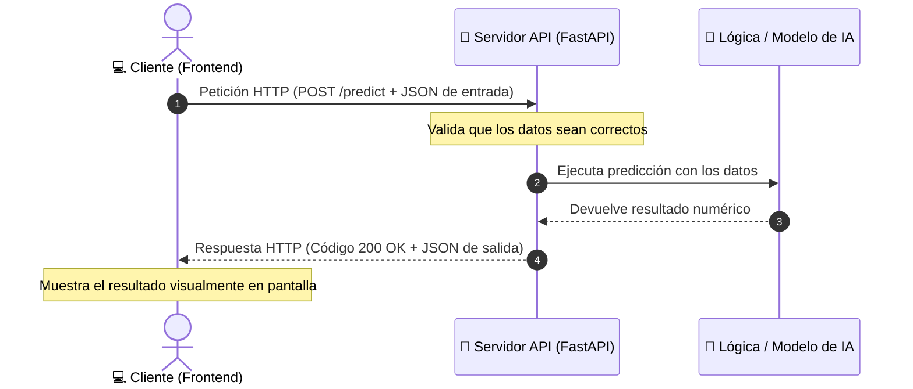

<div class="justify-text">

En las sesiones anteriores hemos aprendido a programar en Python, manipular datos numéricos con **NumPy** y analizar datasets con **Pandas**. El siguiente gran paso en cualquier proyecto real de Inteligencia Artificial es responder a esta pregunta:

> **Una vez que tenemos un modelo de IA funcionando en nuestro código de Python, ¿cómo hacemos para que personas reales o aplicaciones externas puedan utilizarlo?**

La forma habitual de resolver esta necesidad en entornos de producción es mediante el uso de **APIs REST**.

---

## 1. Concepto de API y analogía del servicio

Una **API** (*Application Programming Interface* o Interfaz de Programación de Aplicaciones) es una **interfaz de comunicación** que permite que dos aplicaciones independientes intercambien datos de forma estructurada.

Para visualizar su funcionamiento, puede compararse con el servicio de un restaurante:



* **El cliente (Frontend):** Interfaz gráfica (web, app móvil o panel de control). Realiza solicitudes sin necesidad de conocer los detalles internos de ejecución del servidor.
* **El servidor (Backend / Entorno de IA):** Entorno donde se ejecutan los scripts de Python, se cargan los modelos de machine learning y se procesan los cálculos.
* **La API REST:** Intermediario que recibe la petición del cliente, valida su formato, la transfiere al entorno de ejecución y retorna el resultado en un formato estándar.

---

## 2. Ejecución de modelos en servidor frente al cliente

Muchos principiantes se preguntan por qué no empaquetamos el script de Python o el modelo directamente en el archivo web o en la app móvil del usuario. Existen motivos fundamentales por los que los modelos de IA se alojan casi siempre en un servidor accesible por API:

1. **Peso y consumo de memoria:** Un modelo de *Machine Learning* o *Deep Learning* puede pesar desde decenas de megabytes hasta varios gigabytes (o cientos de gigas en el caso de LLMs). Sería inviable obligar al usuario a descargarse semejante volumen de datos cada vez que entra a una web.
2. **Requisitos de hardware especializado:** Ejecutar cálculos matriciales complejos requiere potencia de cálculo (CPU multi-núcleo o tarjetas gráficas GPU dedicadas) que un teléfono móvil de gama media o un portátil común no poseen.
3. **Seguridad y protección de la propiedad intelectual:** Si descargas el modelo en el dispositivo del cliente, cualquier usuario con conocimientos técnicos podría copiar el archivo del modelo, ingeniería inversa o plagiar tu desarrollo. Al mantenerlo en el servidor, tu modelo queda protegido.
4. **Independencia tecnológica (Multiplataforma):** Una única API desarrollada en Python con FastAPI puede ser consumida a la vez por una web en React, una app de iPhone en Swift, un sistema Android en Kotlin o un software empresarial de escritorio. Todos hablan el mismo idioma universal: **HTTP + JSON**.

---

## 3. La arquitectura Cliente - Servidor y el protocolo HTTP

La comunicación entre el cliente (quien pide) y el servidor (quien responde) se realiza mediante el protocolo **HTTP** (*Hypertext Transfer Protocol*), el mismo estándar que utiliza cualquier navegador para cargar páginas web.



### Anatomía de una Petición HTTP (*Request*)

Cuando el cliente envía información a la API, la petición se compone de:

* **Método o Verbo HTTP:** Indica qué acción queremos realizar:
  * **`GET`**: Solicitar o consultar información existente (por ejemplo, comprobar el estado del servidor o consultar la lista de modelos disponibles). **No suele enviar cuerpo de datos**.
  * **`POST`**: Enviar información al servidor para que sea procesada (por ejemplo, enviar los datos de un usuario para que la IA realice una predicción). **Lleva los datos en el cuerpo (Body)**.
  * *(Existen otros métodos como `PUT` para actualizar o `DELETE` para borrar, pero en el mundo de la IA para inferencia, el 90% del trabajo se concentra en `GET` y `POST`).*
* **URL / Endpoint:** La ruta o dirección concreta a la que llamamos (ej: `http://127.0.0.1:8000/predict`).
* **Cabeceras (*Headers*):** Metadatos técnicos de la petición. La más habitual al trabajar con APIs de IA es `Content-Type: application/json`, que le indica al servidor que los datos que le enviamos vienen en formato JSON.
* **Cuerpo (*Body*):** El paquete de datos que enviamos, generalmente una cadena estructurada en formato **JSON** (*JavaScript Object Notation*):
  ```json
  {
    "edad": 35,
    "ingresos": 2800.0,
    "tiene_deudas": false
  }
  ```

---

### Anatomía de una Respuesta HTTP (*Response*)

El servidor procesa los datos y devuelve una respuesta estructurada con:

1. **Código de Estado HTTP (*Status Code*):** Un número de tres dígitos que indica el resultado de la operación:
   * **`200 OK`**: Todo ha salido perfecto y se adjunta el resultado.
   * **`201 Created`**: El recurso se ha creado correctamente en el servidor.
   * **`400 Bad Request`**: La petición es incorrecta o faltan parámetros indispensables.
   * **`404 Not Found`**: El endpoint o recurso solicitado no existe.
   * **`422 Unprocessable Entity`**: Los datos enviados tienen el formato incorrecto (por ejemplo, se envió texto en un campo que requería un número). **FastAPI genera estos errores de forma automática**.
   * **`500 Internal Server Error`**: Se ha producido un fallo no controlado dentro del código de Python del servidor.
2. **Cuerpo de respuesta (*JSON*):** Los datos resultantes devueltos por el servidor:
   ```json
   {
     "resultado": "Aprobado",
     "score": 0.87,
     "mensaje": "El perfil cumple los requisitos para la concesión."
   }
   ```

---

## 4. ¿Qué es FastAPI y el servidor Uvicorn?

Para construir este servicio en Python utilizaremos **FastAPI**:

* **FastAPI** es un framework web moderno y de altísimo rendimiento diseñado específicamente para construir APIs REST en Python 3.8+ aprovechando las anotaciones de tipo estándar (*Type Hints*).
* **Uvicorn** es el servidor web de ejecución rápida (basado en el estándar ASGI) que se encarga de escuchar las conexiones de red en los puertos de nuestra máquina (por ejemplo en el puerto `8000`) y pasarle las peticiones entrantes a FastAPI.

---

### Preparación del entorno de trabajo

Antes de instalar dependencias, es fundamental **crear y activar un entorno virtual** en la carpeta del proyecto para mantener nuestras librerías aisladas:

1. **Crear el entorno virtual (forzando Python 3.12):**
   ```bash
   # En Windows:
   py -3.12 -m venv .venv

   # En macOS / Linux:
   python3.12 -m venv .venv
   ```

2. **Activar el entorno virtual:**
   ```bash
   # En Windows (PowerShell):
   .\.venv\Scripts\Activate.ps1

   # En macOS / Linux (o Git Bash en Windows):
   source .venv/bin/activate
   ```
   *(Comprobarás que está activo porque aparecerá el prefijo `(.venv)` a la izquierda en tu terminal).*

---

### Instalación de las herramientas y gestión con `requirements.txt`

Para que nuestro proyecto sea reproducible por cualquier compañero o listo para desplegar en la nube, gestionaremos las dependencias mediante un archivo `requirements.txt`.

#### Opción 1: Crear el archivo `requirements.txt` e instalar
Crea un archivo llamado `requirements.txt` en la raíz de tu proyecto con el siguiente contenido:

```text
fastapi
uvicorn[standard]
```

A continuación, con el entorno virtual activado, ejecuta la instalación:

```bash
pip install -r requirements.txt
```

#### Opción 2: Instalación directa y registro con `pip freeze`
Si prefieres instalar las librerías directamente desde la terminal:

```bash
pip install fastapi "uvicorn[standard]"
```

Una vez instaladas, puedes congelar y guardar todas las versiones exactas instaladas en tu entorno virtual ejecutando:

```bash
pip freeze > requirements.txt
```

---

En el siguiente capítulo crearemos nuestra primera API operativa y descubriremos la documentación interactiva automática que genera FastAPI.

</div>
