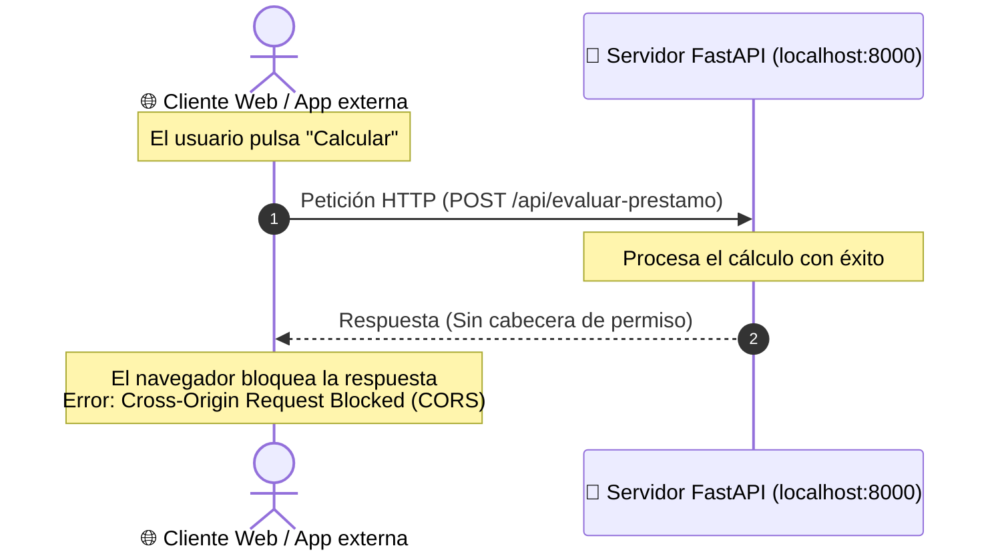

<div class="justify-text">

En este capítulo construiremos una **aplicación completa de principio a fin** compuesta por dos partes independientes:

1. **Un Backend en Python con FastAPI:** Expone un endpoint `POST /api/evaluar-prestamo` que recibe datos financieros, los valida con Pydantic y ejecuta un motor de decisión (*scoring*).
2. **Un Frontend en HTML5 + JavaScript:** Una interfaz gráfica moderna que recoge los datos introducidos por el usuario, realiza la petición HTTP con `fetch()` y muestra el veredicto en pantalla.

Ambos componentes son completamente funcionales y están listos para **copiar, pegar y ejecutar** en tu entorno local.

---

## 1. Control de acceso de origen cruzado: ¿Qué es CORS?

Antes de conectar el *front* con nuestra API, es necesario considerar un mecanismo de seguridad fundamental de la web: **CORS** (*Cross-Origin Resource Sharing* o Intercambio de Recursos de Origen Cruzado).

### ¿Por qué ocurre?
Por motivos de seguridad, los navegadores aplican la **Política del Mismo Origen** (*Same-Origin Policy*): impiden que un archivo HTML abierto desde un origen distinto (por ejemplo una app móvil, un framework frontend como React en otro puerto, o abriendo el HTML de forma aislada) envíe peticiones y lea respuestas de un servidor API sin permiso explícito.



Si se realiza una petición cruzada sin configurar los permisos adecuados en el servidor, el navegador bloqueará la respuesta con el siguiente mensaje de error:
> `Access to fetch at 'http://127.0.0.1:8000/api/evaluar-prestamo' from origin 'null' has been blocked by CORS policy.`

### Configuración de `CORSMiddleware` en FastAPI
Para resolverlo y permitir que nuestra API pueda ser consumida por cualquier cliente externo, añadimos al servidor un **middleware** que incluye la cabecera `Access-Control-Allow-Origin: *`:

```python
from fastapi.middleware.cors import CORSMiddleware

app.add_middleware(
    CORSMiddleware,
    allow_origins=["*"],        # Permite peticiones desde cualquier origen (ideal en desarrollo)
    allow_credentials=True,
    allow_methods=["*"],        # Permite todos los métodos HTTP (GET, POST, OPTIONS...)
    allow_headers=["*"],        # Permite todas las cabeceras (Content-Type, etc.)
)
```

:::tip Frontend y Backend unificados bajo FastAPI
Aunque configuramos CORS para garantizar que la API sea universal y admita clientes de cualquier procedencia, en este proyecto **FastAPI servirá directamente nuestra interfaz gráfica (`index.html`) y los archivos estáticos**. De este modo, **no dependemos de extensiones como Live Server**: un único comando de Uvicorn pone en marcha toda la aplicación.
:::

---

## 2. Estructura del proyecto

Para comprender el flujo completo de forma directa, organizaremos esta demo en los siguientes archivos:

```text
mi_proyecto/
├── static/
│   └── app.js          # Frontend: Lógica cliente y llamadas con fetch()
├── app.py              # Backend: Servidor FastAPI, schemas y endpoints
├── index.html          # Frontend: Estructura visual del formulario
└── requirements.txt    # Dependencias del proyecto
```

:::info Buena práctica en proyectos reales: Separación de esquemas
En proyectos de mayor envergadura, los modelos de Pydantic suelen extraerse a un archivo independiente (`schemas.py` o `models.py`) para mantener el código desacoplado. En esta demo inicial mantendremos los esquemas directamente en `app.py` para visualizar todo el backend en un único archivo.
:::

---

## 3. El Backend (`app.py`)

Crea el archivo `app.py`. En él definiremos tanto los modelos de datos de Pydantic como la aplicación FastAPI, la configuración de CORS y los endpoints:

```python
from fastapi import FastAPI
from fastapi.middleware.cors import CORSMiddleware
from fastapi.staticfiles import StaticFiles
from fastapi.responses import FileResponse
from pydantic import BaseModel, Field

# ==========================================
# 1. Esquemas de datos con Pydantic
# ==========================================

# Esquema de entrada (Validación estricta)
class SolicitudPrestamo(BaseModel):
    nombre: str = Field(min_length=2, max_length=50, description="Nombre del solicitante")
    edad: int = Field(ge=18, le=90, description="Edad del cliente (entre 18 y 90 años)")
    ingresos_mensuales: float = Field(gt=0, description="Ingresos netos mensuales en euros")
    importe_solicitado: float = Field(gt=100, description="Cantidad total solicitada en euros")
    plazo_meses: int = Field(ge=6, le=360, description="Plazo de amortización en meses")
    historial_moroso: bool = Field(default=False, description="¿Tiene antecedentes de impago?")

# Esquema de respuesta tipado
class ResultadoPrestamo(BaseModel):
    solicitante: str
    aprobado: bool
    score_crediticio: float
    cuota_mensual_estimada: float
    motivo: str

# ==========================================
# 2. Servidor FastAPI, CORS y Estáticos
# ==========================================

app = FastAPI(
    title="Motor Inteligente de Evaluación Crediticia",
    description="API para estimar la viabilidad de préstamos personales mediante reglas de scoring",
    version="1.0.0"
)

app.add_middleware(
    CORSMiddleware,
    allow_origins=["*"],
    allow_credentials=True,
    allow_methods=["*"],
    allow_headers=["*"],
)

# Montamos la carpeta static para servir el código JavaScript y estilos
app.mount("/static", StaticFiles(directory="static"), name="static")

# ==========================================
# 3. Endpoints del servicio y Frontend
# ==========================================

# Ruta raíz: sirve la interfaz visual del simulador
@app.get("/", response_class=FileResponse)
def inicio():
    return FileResponse("index.html")

@app.post("/api/evaluar-prestamo", response_model=ResultadoPrestamo)
def evaluar_prestamo(solicitud: SolicitudPrestamo):
    """
    Calcula la viabilidad financiera del préstamo a partir de los datos recibidos.
    """
    # Cálculo de la cuota mensual estimada (amortización lineal simple con interés base del 5% anual)
    tipo_interes_mensual = 0.05 / 12
    interes_total = solicitud.importe_solicitado * tipo_interes_mensual * solicitud.plazo_meses
    cuota_estimada = round((solicitud.importe_solicitado + interes_total) / solicitud.plazo_meses, 2)
    
    # Ratio de endeudamiento: Porcentaje del sueldo que supondrá la cuota
    ratio_endeudamiento = (cuota_estimada / solicitud.ingresos_mensuales) * 100
    
    # Motor de scoring: Cálculo de puntuación de 0 a 100
    score = 70.0
    
    # Bonificaciones y penalizaciones
    if 25 <= solicitud.edad <= 60:
        score += 15.0  # Rango de mayor estabilidad laboral
    if solicitud.ingresos_mensuales >= 2500:
        score += 10.0
        
    if solicitud.historial_moroso:
        score -= 50.0  # Penalización crítica
        
    if ratio_endeudamiento > 40.0:
        score -= 30.0  # Sobreendeudamiento
    elif ratio_endeudamiento <= 20.0:
        score += 10.0
        
    # Acotamos el score entre 0.0 y 100.0
    score = max(0.0, min(100.0, round(score, 1)))
    
    # Decisión final
    aprobado = False
    motivo = ""
    
    if solicitud.historial_moroso:
        motivo = "Denegado automáticamente por antecedentes registrados en ficheros de morosidad."
    elif ratio_endeudamiento > 40.0:
        motivo = f"Denegado: la cuota mensual ({cuota_estimada} €) supera el 40% de sus ingresos mensuales."
    elif score >= 60.0:
        aprobado = True
        motivo = "Aprobado: perfil financiero solvente con bajo riesgo de impago."
    else:
        motivo = "Denegado: puntuación de scoring insuficiente para las condiciones solicitadas."
        
    return {
        "solicitante": solicitud.nombre,
        "aprobado": aprobado,
        "score_crediticio": score,
        "cuota_mensual_estimada": cuota_estimada,
        "motivo": motivo
    }
```

---

## 4. El Frontend

:::info Generación del Frontend con Inteligencia Artificial
El objetivo principal de este módulo es el desarrollo en Python y la creación de APIs robustas para Inteligencia Artificial. El aprendizaje en profundidad de tecnologías frontend (HTML5, CSS, JavaScript, Tailwind CSS, etc.) queda fuera del alcance de este curso.

Por ello, puedes apoyarte en herramientas de Inteligencia Artificial Generativa para generar la interfaz web y el código de consumo con `fetch()`, permitiéndote concentrar el esfuerzo en la arquitectura del backend, la validación de datos con Pydantic y el servicio de modelos.
:::

### 4.1. Interfaz visual (`index.html`)

Crea un archivo llamado `index.html`. Observa que no contiene código JavaScript en su interior; en su lugar, enlaza el archivo externo mediante `<script src="./static/app.js"></script>`:

```html
<!DOCTYPE html>
<html lang="es">
<head>
  <meta charset="UTF-8">
  <meta name="viewport" content="width=device-width, initial-scale=1.0">
  <title>Simulador de Evaluación Crediticia</title>
  <!-- Cargamos Tailwind CSS para un diseño limpio sin dependencias -->
  <script src="https://cdn.tailwindcss.com"></script>
</head>
<body class="bg-slate-50 min-h-screen py-10 px-4 font-sans text-slate-800">

  <div class="max-w-2xl mx-auto bg-white rounded-2xl shadow-xl overflow-hidden border border-slate-100">
    <!-- Cabecera -->
    <div class="bg-indigo-600 px-8 py-6 text-white text-center">
      <h1 class="text-2xl font-bold">💳 Simulador de Crédito Inteligente</h1>
      <p class="text-indigo-100 text-sm mt-1">Conectado a la API REST de evaluación con FastAPI</p>
    </div>

    <!-- Formulario de entrada -->
    <form id="formulario-credito" class="p-8 space-y-6">
      
      <div>
        <label class="block text-sm font-semibold text-slate-700 mb-1">Nombre Completo</label>
        <input type="text" id="nombre" required placeholder="Ej: Marta Gómez"
               class="w-full px-4 py-2 border rounded-lg focus:ring-2 focus:ring-indigo-500 focus:outline-none">
      </div>

      <div class="grid grid-cols-1 md:grid-cols-2 gap-4">
        <div>
          <label class="block text-sm font-semibold text-slate-700 mb-1">Edad</label>
          <input type="number" id="edad" min="18" max="90" required value="32"
                 class="w-full px-4 py-2 border rounded-lg focus:ring-2 focus:ring-indigo-500 focus:outline-none">
        </div>
        <div>
          <label class="block text-sm font-semibold text-slate-700 mb-1">Ingresos Mensuales Netos (€)</label>
          <input type="number" id="ingresos" step="any" min="1" required value="2100"
                 class="w-full px-4 py-2 border rounded-lg focus:ring-2 focus:ring-indigo-500 focus:outline-none">
        </div>
      </div>

      <div class="grid grid-cols-1 md:grid-cols-2 gap-4">
        <div>
          <label class="block text-sm font-semibold text-slate-700 mb-1">Importe Solicitado (€)</label>
          <input type="number" id="importe" step="any" min="101" required value="12000"
                 class="w-full px-4 py-2 border rounded-lg focus:ring-2 focus:ring-indigo-500 focus:outline-none">
        </div>
        <div>
          <label class="block text-sm font-semibold text-slate-700 mb-1">Plazo de Devolución (Meses)</label>
          <input type="number" id="plazo" min="6" max="360" step="1" required value="36"
                 class="w-full px-4 py-2 border rounded-lg focus:ring-2 focus:ring-indigo-500 focus:outline-none">
        </div>
      </div>

      <div class="flex items-center gap-3 p-4 bg-slate-50 rounded-lg border border-slate-200">
        <input type="checkbox" id="moroso" class="w-5 h-5 text-indigo-600 rounded">
        <label for="moroso" class="text-sm text-slate-700 cursor-pointer">
          El solicitante registra antecedentes en listas de morosidad (ASNEF/RAI)
        </label>
      </div>

      <button type="submit" id="btn-enviar"
              class="w-full bg-indigo-600 hover:bg-indigo-700 text-white font-bold py-3 px-6 rounded-lg transition duration-200 shadow-md">
        🔍 Evaluar Solicitud con la API
      </button>
    </form>

    <!-- Panel de Resultados (Oculto inicialmente) -->
    <div id="panel-resultado" class="hidden p-8 border-t border-slate-100 bg-slate-50">
      <div id="resultado-caja" class="p-6 rounded-xl border">
        <!-- Contenido inyectado dinámicamente con JS -->
      </div>
    </div>
  </div>

  <!-- Enlace al archivo JavaScript externo dentro de la carpeta static -->
  <script src="./static/app.js"></script>
</body>
</html>
```

---

### 4.2. Lógica JavaScript (`static/app.js`)

Crea la carpeta `static` y dentro crea el archivo `app.js` para gestionar la escucha del evento de envío, la llamada con `fetch()` y el renderizado del veredicto:

```javascript
const formulario = document.getElementById("formulario-credito");
const panelResultado = document.getElementById("panel-resultado");
const resultadoCaja = document.getElementById("resultado-caja");
const btnEnviar = document.getElementById("btn-enviar");

formulario.addEventListener("submit", async (evento) => {
  // 1. Evitamos que el formulario recargue la página web por defecto
  evento.preventDefault();

  // 2. Extraemos los valores de los campos del formulario
  const datosSolicitud = {
    nombre: document.getElementById("nombre").value,
    edad: parseInt(document.getElementById("edad").value),
    ingresos_mensuales: parseFloat(document.getElementById("ingresos").value),
    importe_solicitado: parseFloat(document.getElementById("importe").value),
    plazo_meses: parseInt(document.getElementById("plazo").value),
    historial_moroso: document.getElementById("moroso").checked
  };

  btnEnviar.disabled = true;
  btnEnviar.textContent = "⏳ Consultando a la API...";

  try {
    // 3. Petición HTTP POST relativa (funciona en local y en producción sin modificar código)
    const respuesta = await fetch("/api/evaluar-prestamo", {
      method: "POST",
      headers: {
        "Content-Type": "application/json"
      },
      body: JSON.stringify(datosSolicitud)
    });

    if (!respuesta.ok) {
      throw new Error(`Error en la API: Código de estado ${respuesta.status}`);
    }

    // 4. Parseamos la respuesta JSON devuelta por FastAPI
    const resultado = await respuesta.json();

    // 5. Mostramos el resultado visualmente según sea Aprobado o Rechazado
    panelResultado.classList.remove("hidden");
    
    if (resultado.aprobado) {
      resultadoCaja.className = "p-6 rounded-xl border border-emerald-200 bg-emerald-50 text-emerald-950";
      resultadoCaja.innerHTML = `
        <div class="flex items-center justify-between mb-4">
          <h3 class="text-xl font-bold text-emerald-800">✅ ¡Préstamo Aprobado!</h3>
          <span class="px-3 py-1 bg-emerald-200 text-emerald-800 rounded-full font-bold text-sm">
            Score: ${resultado.score_crediticio} / 100
          </span>
        </div>
        <p class="text-sm mb-3"><strong>Solicitante:</strong> ${resultado.solicitante}</p>
        <p class="text-sm mb-3"><strong>Cuota mensual estimada:</strong> <span class="text-lg font-bold">${resultado.cuota_mensual_estimada} €/mes</span></p>
        <p class="text-sm text-emerald-800 italic">${resultado.motivo}</p>
      `;
    } else {
      resultadoCaja.className = "p-6 rounded-xl border border-rose-200 bg-rose-50 text-rose-950";
      resultadoCaja.innerHTML = `
        <div class="flex items-center justify-between mb-4">
          <h3 class="text-xl font-bold text-rose-800">❌ Préstamo Denegado</h3>
          <span class="px-3 py-1 bg-rose-200 text-rose-800 rounded-full font-bold text-sm">
            Score: ${resultado.score_crediticio} / 100
          </span>
        </div>
        <p class="text-sm mb-3"><strong>Solicitante:</strong> ${resultado.solicitante}</p>
        <p class="text-sm text-rose-800"><strong>Motivo:</strong> ${resultado.motivo}</p>
      `;
    }

  } catch (error) {
    alert("No se ha podido comunicar con la API. Asegúrate de que el servidor está en ejecución.");
    console.error(error);
  } finally {
    btnEnviar.disabled = false;
    btnEnviar.textContent = "🔍 Evaluar Solicitud con la API";
  }
});
```

---

## 5. Guía de ejecución y prueba paso a paso

Una vez creado el entorno virtual, activado e instaladas las librerías necesarias (`pip install -r requirements.txt`), la puesta en marcha es inmediata:

### Paso 1: Poner en marcha el servidor con Uvicorn
1. Abre la terminal integrada en VS Code en la carpeta del proyecto y con el entorno virtual activo (`(.venv)`).
2. Ejecuta el servidor Uvicorn:
   ```bash
   uvicorn app:app --reload
   ```
3. Comprueba que en la terminal aparece `Uvicorn running on http://127.0.0.1:8000`.

### Paso 2: Abrir la aplicación en el navegador
Abre tu navegador web y accede directamente a:
```text
http://127.0.0.1:8000
```

:::tip Sin necesidad de Live Server
Como FastAPI está configurado con `FileResponse` en la ruta raíz `/` y tiene montada la carpeta `/static`, el propio servidor entrega tanto la interfaz web como los recursos de JavaScript y responde a las llamadas de la API. No necesitas abrir puertos adicionales ni instalar extensiones como Live Server.
:::

### Paso 3: Interactuar y verificar la comunicación
1. Rellena el formulario con datos solventes (ejemplo: Marta, 30 años, 2500 € ingresos, 10000 € préstamo en 36 meses). Pulsa el botón y verás cómo en décimas de segundo se calcula la cuota y aparece la tarjeta verde de **Préstamo Aprobado**.
2. Marca la casilla de morosidad o introduce unos ingresos muy bajos (ej: 400 €) y vuelve a pulsar: la API detectará el riesgo y devolverá la tarjeta roja de **Préstamo Denegado**.
3. Puedes acceder a `http://127.0.0.1:8000/docs` en cualquier momento para comprobar la documentación interactiva Swagger del mismo servidor.

---

## 6. Inspección de peticiones: La pestaña *Network* (Red)

Para comprobar el intercambio de mensajes HTTP entre el navegador y FastAPI:

1. En tu navegador, pulsa la tecla **F12** (o clic derecho → *Inspeccionar*).
2. Ve a la pestaña **Red** (*Network*).
3. Vuelve a pulsar el botón de evaluar en el formulario.
4. Verás aparecer una petición llamada `evaluar-prestamo`:
   * Haz clic sobre ella:
     * En **Headers**, verás el método `POST`, el código `200 OK` y las cabeceras CORS.
     * En **Payload / Carga útil**, verás el JSON exacto que tu JavaScript envió.
     * En **Response / Vista previa**, verás el JSON exacto devuelto por Python.

---

## 7. Integración futura con modelos de Machine Learning

En la **UT4**, cuando entrenemos modelos de clasificación con *Scikit-learn*, **la estructura del backend y del frontend se mantendrá idéntica**.

La adaptación consistirá en cargar el archivo del modelo entrenado y sustituir las reglas condicionales por la inferencia directa del algoritmo:

```python
import joblib

# 1. Cargamos el modelo previamente entrenado
modelo_ia = joblib.load("modelo_scoring.pkl")

@app.post("/api/evaluar-prestamo", response_model=ResultadoPrestamo)
def evaluar_prestamo(solicitud: SolicitudPrestamo):
    # 2. Convertimos los datos de Pydantic en el formato que espera el modelo
    vector_caracteristicas = [[
        solicitud.edad, 
        solicitud.ingresos_mensuales, 
        solicitud.importe_solicitado, 
        solicitud.plazo_meses
    ]]
    
    # 3. Inferencia directa del modelo
    prediccion = modelo_ia.predict(vector_caracteristicas)[0]        # 1 (Aprobado) o 0 (Denegado)
    probabilidad = modelo_ia.predict_proba(vector_caracteristicas)[0][1] # Probabilidad entre 0 y 1
    
    return {
        "solicitante": solicitud.nombre,
        "aprobado": bool(prediccion == 1),
        "score_crediticio": round(probabilidad * 100, 1),
        "cuota_mensual_estimada": ...,
        "motivo": "Predicción calculada mediante modelo de Machine Learning"
    }
```

De este modo queda estructurado el flujo de comunicación entre una aplicación web y un servicio de predicción en Python.

</div>
