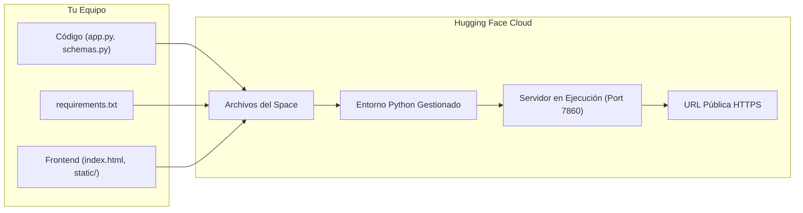

<div class="justify-text">

## 1. Introducción al Despliegue en la Nube

Hasta ahora hemos ejecutado nuestras APIs en el entorno local de desarrollo (`http://127.0.0.1:8000`). Sin embargo, en el ciclo de vida de cualquier solución de Inteligencia Artificial, el modelo y su API deben ponerse a disposición de otros sistemas, aplicaciones móviles o clientes web mediante una **URL pública accesible en internet**.

Existen múltiples plataformas de computación en la nube (Cloud Providers). No obstante, para el servicio de modelos y prototipos de IA en el ámbito educativo y profesional, **Hugging Face Spaces** se ha consolidado como el estándar de referencia.



---

## 2. ¿Por qué Hugging Face Spaces?

Hugging Face no es únicamente un repositorio de modelos y datasets; su servicio **Spaces** permite alojar y ejecutar aplicaciones de Machine Learning de forma gratuita con especificaciones especialmente dimensionadas para IA:

* **Hardware gratuito:** Hugging Face ofrece para Spaces con SDK de Gradio su infraestructura **ZeroGPU**, permitiendo desplegar y ejecutar aplicaciones en la nube de forma gratuita en cuentas personales sin necesidad de suscripciones de pago.
* **Acceso público directo:** Genera automáticamente una URL pública segura con certificado **HTTPS**.
* **Despliegue directo sin coste:** Permite publicar y compartir proyectos en la comunidad mediante repositorios públicos accesibles con URL directa.

---

## 3. Arquitectura del Proyecto en Hugging Face Spaces

Al utilizar el **SDK de Gradio** en Hugging Face Spaces, la plataforma proporciona un entorno Python totalmente gestionado. Hugging Face instala automáticamente las librerías listadas en `requirements.txt` y ejecuta el archivo principal del proyecto.

Por convenio de la plataforma, el punto de entrada de la aplicación debe llamarse obligatoriamente **`app.py`**.

### 3.1. Organización de archivos en el proyecto:
```text
mi_proyecto/
├── static/
│   └── app.js             # Lógica JavaScript del cliente web
├── schemas.py             # Modelos de datos Pydantic
├── app.py                 # Backend FastAPI + Punto de entrada
├── index.html             # Interfaz web del usuario
└── requirements.txt       # Dependencias del proyecto
```

### 3.2. Archivo de dependencias (`requirements.txt`)
En la raíz de tu proyecto, define las librerías necesarias:

```text title="requirements.txt"
fastapi
uvicorn
gradio
```

:::info ¿Por qué incluimos `gradio`?
Gradio está construido internamente sobre **FastAPI y Starlette**. Al incluir `gradio` en las dependencias y montar una interfaz en una ruta auxiliar de nuestra aplicación, el motor de Hugging Face Spaces reconoce y valida nuestro servicio dentro de su infraestructura gratuita, permitiéndonos servir a la vez nuestros endpoints REST y nuestro Frontend en HTML, CSS y JavaScript.
:::

---

## 4. Servir Frontend y Backend en `app.py`

Para que un usuario pueda abrir la URL pública del Space y utilizar directamente la interfaz gráfica (`index.html`) conectada a la API sin abrir archivos en local, configuramos FastAPI para que sirva tanto la API como los archivos estáticos.

### 4.1. Configuración del servidor en `app.py`:

```python title="app.py"
# highlight-start
# Soporte para Hugging Face ZeroGPU (capa gratuita) y ejecución en local
try:
    import spaces
except ImportError:
    class spaces:
        @staticmethod
        def GPU(fn):
            return fn
# highlight-end

import os
import time
import uvicorn
from fastapi import FastAPI
from fastapi.middleware.cors import CORSMiddleware
# highlight-next-line
from fastapi.staticfiles import StaticFiles
# highlight-next-line
from fastapi.responses import FileResponse
# highlight-next-line
import gradio as gr
from schemas import SolicitudInferencia, ResultadoInferencia

# 1. Instanciamos la aplicación FastAPI
app = FastAPI(
    title="API de Inferencia de IA",
    description="Servicio en producción desplegado en Hugging Face Spaces",
    version="1.0.0"
)

# 2. CORS habilitado para admitir peticiones del cliente
app.add_middleware(
    CORSMiddleware,
    allow_origins=["*"],
    allow_credentials=True,
    allow_methods=["*"],
    allow_headers=["*"],
)

# 3. Montamos la carpeta de archivos estáticos para servir app.js y estilos
# highlight-next-line
app.mount("/static", StaticFiles(directory="static"), name="static")

# 4. Ruta raíz: devuelve el archivo index.html al acceder con el navegador
# highlight-next-line
@app.get("/", response_class=FileResponse)
# highlight-next-line
def home():
# highlight-next-line
    return FileResponse("index.html")

# 5. Endpoint POST de la API
@app.post("/api/predecir", response_model=ResultadoInferencia)
def predecir(datos: SolicitudInferencia):
    # Lógica de inferencia / scoring
    return {
        "prediccion": "Aprobado",
        "score": 0.88,
        "mensaje": "Evaluación completada con éxito."
    }

# 6. Integración con Gradio para compatibilidad con Hugging Face Spaces (ZeroGPU)
# highlight-start
@spaces.GPU
def probe_gpu(texto: str = "ping") -> str:
    time.sleep(0.001)  # Asegura ejecución en backend Python y evita transpilación a JS
    return f"Servicio activo en ZeroGPU: {texto}"

with gr.Blocks(title="Panel de Diagnóstico Gradio / ZeroGPU") as demo:
    gr.Markdown("### Estado del Servicio")
    inp = gr.Textbox(label="Mensaje", value="ping")
    out = gr.Textbox(label="Respuesta")
    btn = gr.Button("Verificar Estado")
    btn.click(fn=probe_gpu, inputs=inp, outputs=out)

app = gr.mount_gradio_app(app, demo, path="/gradio", ssr_mode=False)

# Notificación al supervisor de ZeroGPU durante el arranque de FastAPI
@app.on_event("startup")
def startup_zerogpu():
    try:
        from spaces.zero import client as zero_client
        zero_client.startup_report()
    except Exception:
        pass
# highlight-end

# 7. Arranque del servidor Uvicorn en el puerto asignado por Hugging Face (7860 por defecto)
# highlight-next-line
if __name__ == "__main__":
    try:
        from spaces.zero import client as zero_client
        zero_client.startup_report()
    except Exception:
        pass
# highlight-next-line
    port = int(os.environ.get("PORT", 7860))
# highlight-next-line
    uvicorn.run(app, host="0.0.0.0", port=port)
```

:::warning El puerto 7860 y host 0.0.0.0 son obligatorios
Hugging Face Spaces enruta internamente el tráfico web hacia el **puerto 7860** y la interfaz `0.0.0.0`. Si dejas configurado el puerto por defecto `8000` o la IP local `127.0.0.1`, la plataforma no podrá conectar con tu aplicación y el despliegue indicará un error de conexión.
:::

### 4.2. Enlace en `index.html`
En tu archivo `index.html`, asegúrate de que la etiqueta `<script>` apunta a la ruta estática:

```html
<script src="./static/app.js"></script>
```

---

## 5. Procedimiento de Despliegue en Hugging Face

### Paso 1: Crear una cuenta en Hugging Face
Accede a [huggingface.co](https://huggingface.co/) y crea una cuenta si no dispones de una.

### Paso 2: Crear un nuevo Space
1. En la esquina superior derecha de tu perfil, haz clic en **New Space**.
2. Completa los campos del formulario:
   * **Space name:** Nombre identificativo (por ejemplo `api-evaluador-credito`).
   * **License:** Puedes seleccionar `mit` o `apache-2.0`.
   * **Select the Space SDK:** Selecciona **Gradio**.
   * **Space hardware:** Selecciona **ZeroGPU** (la capa de hardware gratuita ofrecida por Hugging Face para Spaces con Gradio en cuentas estándar).
   * **Space visibility:** Selecciona **Public**.
3. Haz clic en **Create Space**.

:::danger Integridad académica y código público
Al crear el Space con visibilidad **Public**, cualquier usuario en internet que disponga del enlace podrá visualizar tu código fuente en la pestaña *Files and versions*.

* **No compartas el enlace de tu Space con ningún compañero de clase.**
* El desarrollo de la práctica y su despliegue son estrictamente individuales.
* La detección de copias o plagio (total o parcial) entre proyectos se penalizará con una calificación de **0 para ambos alumnos**: tanto para el alumno que copia como para el alumno del que han copiado.
:::

---

### Paso 3: Subir los archivos del proyecto

Subiremos los archivos directamente a través de la interfaz web de Hugging Face:

1. En la pestaña **Files and versions** de tu Space, pulsa el botón **Add file** $\rightarrow$ **Upload files**.
2. Arrastra o selecciona los archivos de tu proyecto:
   * `app.py`
   * `schemas.py`
   * `requirements.txt`
   * `index.html`
   * Carpeta `static/` con `app.js` en su interior.
3. Escribe un mensaje de commit (por ejemplo `Initial commit`) y pulsa **Commit changes to main**.

:::tip Qué archivos NO debes subir al Space
Asegúrate de **no subir nunca** archivos innecesarios o confidenciales:
* **El entorno virtual (`.venv/`, `venv/`):** Ocupa cientos de megabytes y contiene binarios compilados exclusivamente para tu sistema operativo local. Hugging Face se encargará de instalar las dependencias limpias en la nube a partir de tu `requirements.txt`.
* **Archivos de caché de Python:** Carpetas `__pycache__/` o archivos `.pyc`.
* **Variables de entorno y secretos:** Ficheros como `.env` que contengan claves API, contraseñas o tokens privados.
* **Metadatos del sistema operativo:** Archivos como `.DS_Store` (en macOS) o `Thumbs.db` (en Windows).
:::

---

### Paso 4: Monitorización del Despliegue (Logs)

Una vez subidos los archivos:
1. Observarás que el estado en la parte superior cambia a **Building**.
2. Pulsa en el botón **Logs** (icono de terminal o texto):
   - Verás la instalación automática de las librerías listadas en `requirements.txt` mediante `pip`.
   - A continuación, verás la ejecución de `app.py` y el inicio de Uvicorn en el puerto 7860.
3. Cuando el arranque finaliza con éxito, el estado cambiará a **Running** con un indicador verde.

---

### Paso 5: Comprobación de la Aplicación en Producción

Una vez en estado `Running`:
* La ventana principal del Space mostrará directamente tu aplicación web interactiva (`index.html`).
* Puedes acceder a la documentación interactiva Swagger UI añadiendo `/docs` al final de la URL del Space.

:::tip Cómo obtener la URL directa de la aplicación
Para consultar o compartir la URL directa sin el marco de Hugging Face:
1. Haz clic en el menú de opciones (tres puntos verticales en la esquina superior derecha del Space).
2. Selecciona **Embed this Space** o copia el enlace directo que tiene el formato:
   `https://TU_USUARIO-NOMBRE_DEL_SPACE.hf.space`
3. La documentación OpenAPI estará accesible en:
   `https://TU_USUARIO-NOMBRE_DEL_SPACE.hf.space/docs`
:::

</div>
