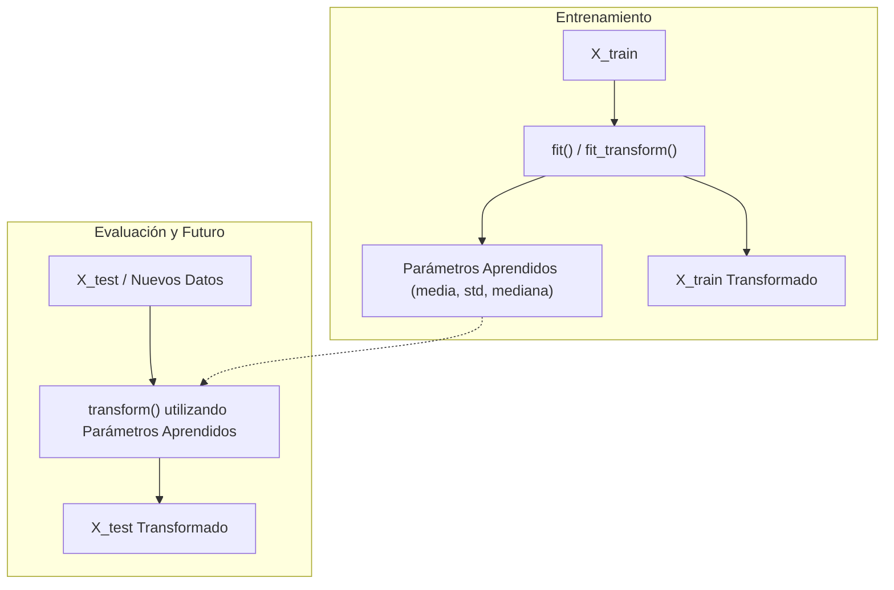

# Sesión 5: Preprocesamiento I: Imputación, Escalado y Data Leakage

**Duración estimada:** 2 horas (120 minutos)  
**Bloque:** Bloque 3 — Preprocesamiento y Prevención de Data Leakage  
**Entorno de trabajo:** Jupyter Notebook (`.ipynb`) en VS Code / Google Colab  
**Objetivo de la sesión:** Dominar la API de transformadores de Scikit-learn de forma explícita (paso a paso), comprender el significado estricto de `fit()` frente a `transform()`, aplicar técnicas de imputación y escalado a variables numéricas y comprobar en código cómo se produce y previene la fuga de datos (*Data Leakage*).

---

## ⏱️ Distribución de la Sesión

* **00:00 - 00:20 (20 min) — Píldora Teórica:** ¿Por qué no usar `pandas.fillna()` en producción? La API de Scikit-learn (`fit`, `transform`), demostración visual de *Data Leakage* y comparación de escaladores.
* **00:20 - 01:45 (85 min) — Reto Práctico:** «Transformación manual controlada de variables numéricas en Train y Test».
* **01:45 - 02:00 (15 min) — Cierre y Puesta en Común:** Verificación de parámetros aprendidos (`scaler.mean_`, `imputer.statistics_`) y contraste de distribuciones.

---

## 📚 Guion de Contenidos a Desarrollar en los Apuntes

### 1. ¿Por qué Scikit-learn y no Pandas a mano?
* Pandas es excelente para exploración, pero para preprocesar en producción genera problemas de reproducibilidad:
  * Si haces `df['edad'].fillna(df['edad'].mean())`, ¿cómo recuerdas esa media cuando llegue un nuevo cliente a la API en producción?
* Los transformadores de Scikit-learn son **objetos con estado (parámetros aprendidos)** que se guardan y reutilizan en inferencia.

### 2. El Contrato Sagrado: `fit()` vs. `transform()`
* **`fit(X_train)`:** El transformador **aprende** los parámetros estadísticos exclusivamente de los datos de entrenamiento (ej. la mediana de los ingresos o la media y desviación de la edad).
* **`transform(X)`:** El transformador **aplica** la fórmula matemática utilizando los parámetros previamente aprendidos. Se aplica tanto sobre `X_train` como sobre `X_test`.
* **`fit_transform(X_train)`:** Atajo optimizado para ejecutar ambos pasos en una sola línea. **¡Prohibido ejecutar `fit_transform` sobre el test set!**

### 3. Fuga de Datos (Data Leakage) Demostrada en Código
* Demostración con los alumnos:
  * Si ajustas el escalador con todo el dataset junto, la media y desviación del test set contaminan el modelo.
  * El modelo obtiene métricas artificialmente optimistas en local, pero fracasará al desplegarse en producción.

### 4. Técnicas de Imputación Numérica con `SimpleImputer`
* **Estrategias:**
  * `strategy='median'`: Recomendada cuando el EDA reveló asimetría o presencia de outliers.
  * `strategy='mean'`: Válida únicamente en distribuciones simétricas gaussianas.
  * `strategy='constant'`, `fill_value=k`: Para imputación por valores fijos.
* **Mantenimiento de señal de ausencia:** Parámetro `add_indicator=True` para generar automáticamente una columna booleana que recuerde al modelo que dicho dato era originalmente ausente.

### 5. Escalado y Normalización: Comparativa de Opciones
* ¿Por qué escalamos? Modelos basados en distancias (KNN, SVM, K-Means) o basados en gradientes (Regresión Lineal/Logística, Redes Neuronales) son sensibles a la escala de las variables.
* **`StandardScaler`:** Estandarización a media 0 y varianza 1:
  $$z = \frac{x - \mu}{\sigma}$$
  *Sensible a outliers extremos (los outliers distorsionan $\mu$ y $\sigma$).*
* **`MinMaxScaler`:** Rango acotado $[0, 1]$:
  $$x_{\text{scaled}} = \frac{x - x_{\min}}{x_{\max} - x_{\min}}$$
  *Peligro: Si entra un outlier en producción mayor que $x_{\max}$, el valor resultante será $> 1$.*
* **`RobustScaler`:** Centrado en la mediana y escalado por el rango intercuartílico (IQR):
  $$x_{\text{robust}} = \frac{x - \text{mediana}}{\text{IQR}}$$
  *Ideal cuando el EDA detectó valores extremos legítimos que no queremos eliminar.*

---

## 💻 Ejercicio / Reto Práctico: «Transformación Numérica Paso a Paso»

### Enunciado del Reto
Siguiendo la tabla de prescripción técnica elaborada en la Sesión 4, el alumno debe transformar de forma aislada y controlada todas las variables numéricas de su dataset.

### Tareas a Realizar por el Alumno:
1. **Sustitución de centinelas:** Reemplazar los valores `-1`, `999` o ceros imposibles por `np.nan` tanto en `X_train` como en `X_test`.
2. **Imputación rigurosa:**
   * Instanciar `SimpleImputer` con la estrategia decidida en el EDA.
   * Ejecutar `.fit()` sobre las columnas numéricas de `X_train`.
   * Inspeccionar `.statistics_` para conocer los valores que ha memorizado.
   * Transformar `X_train` y `X_test`.
3. **Escalado:**
   * Instanciar el escalador adecuado (`StandardScaler` o `RobustScaler`).
   * Ajustar en `X_train` y transformar `X_train` y `X_test`.
4. **Verificación visual del escalado:**
   * Pintar el histograma de una columna antes y después del escalado.
   * Constatar que la **forma** de la distribución es exactamente idéntica y solo han variado los valores del eje $X$.

---

## 🔍 Criterios Docentes y Errores Habituales a Prevenir

:::danger Error crítico de evaluación
Hacer `scaler.fit(X_test)` o `scaler.fit_transform(X_test)`. Este error debe penalizarse severamente para fijar en el alumno la noción de estanqueidad entre entrenamiento y evaluación.
:::

