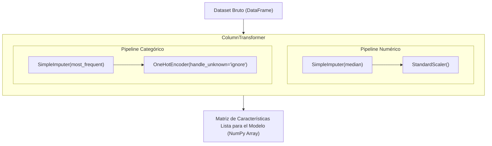

<div class="justify-text">

# Sesión 8: Orquestación con Pipelines, ColumnTransformer y Puesta en Producción

**Duración estimada:** 2 horas (120 minutos)  
**Bloque:** Bloque 5 — Orquestación mediante Pipelines de Scikit-learn (Cierre de la UT3)  
**Entorno de trabajo:** Transición de Jupyter Notebook (`.ipynb`) a Script Python (`.py`) en VS Code  
**Objetivo de la sesión:** Sustituir todo el código manual de preprocesamiento por un flujo automatizado y blindado contra *Data Leakage* utilizando `ColumnTransformer` y `Pipeline` de Scikit-learn; serializar el preprocesador con `joblib` y conectarlo con la mentalidad de ingeniería de software (FastAPI y Docker de la UT2) listo para los modelos de la UT4.

---

## ⏱️ Distribución de la Sesión

* **00:00 - 00:20 (20 min) — Píldora Teórica:** La arquitectura de `Pipeline` y `ColumnTransformer`, serialización con `joblib` y la transición a un script `.py` de ingeniería.
* **00:20 - 01:40 (80 min) — Reto Práctico / Mini-Proyecto:** «Empaquetado integral del Pipeline y script de producción `prepare_data.py`».
* **01:40 - 02:00 (20 min) — Cierre de Unidad:** Prueba de fuego: cargar el archivo `.joblib` en una función de inferencia simulando una petición JSON de FastAPI.

---

## 📚 Guion de Contenidos a Desarrollar en los Apuntes

### 1. El Momento «¡Eureka!»: Por Qué Existen los Pipelines
* En las sesiones 5 y 6 sufrimos el código manual:
  * Imputar numéricas $\rightarrow$ Escalar numéricas $\rightarrow$ Imputar categóricas $\rightarrow$ Codificar con OneHot $\rightarrow$ Concatenar matrices a mano con `np.hstack`.
  * Repetir exactamente lo mismo para el test set cuidando no confundir variables.
* Si mañana llega un nuevo cliente a la API con una petición POST JSON de 5 campos, reconstruir ese flujo manualmente en Python puro es una fuente inagotable de errores en producción (*mismatch* de columnas, escalas diferentes, excepciones por categorías no vistas).

### 2. Las Dos Piezas Clave de Scikit-learn



#### A. `Pipeline`: Transformaciones Secuenciales
* Encadena estimadores donde la salida de uno es la entrada del siguiente:
  ```python
  from sklearn.pipeline import Pipeline
  from sklearn.impute import SimpleImputer
  from sklearn.preprocessing import StandardScaler

  num_pipeline = Pipeline([
      ('imputer', SimpleImputer(strategy='median')),
      ('scaler', StandardScaler())
  ])
  ```

#### B. `ColumnTransformer`: Rutas Paralelas por Tipo de Columna
* Aplica diferentes pipelines a diferentes listas de columnas en un único paso:
  ```python
  from sklearn.compose import ColumnTransformer
  from sklearn.preprocessing import OneHotEncoder

  preprocessor = ColumnTransformer(transformers=[
      ('num', num_pipeline, cols_numericas),
      ('cat', OneHotEncoder(handle_unknown='ignore'), cols_categoricas)
  ], remainder='drop')
  ```
* Todo el preprocesamiento de meses de trabajo se resume en dos órdenes:
  ```python
  X_train_prep = preprocessor.fit_transform(X_train)
  X_test_prep = preprocessor.transform(X_test)
  ```

### 3. De Jupyter Notebook a Script de Producción (`.py`)
* Un Notebook es genial para experimentar, pero el código final de preparación de datos de una empresa debe vivir en un módulo Python estructurado.
* Serialización del preprocesador entrenado con `joblib`:
  ```python
  import joblib

  # Guardar el artefacto en disco
  joblib.dump(preprocessor, 'preprocessor.joblib')

  # En la API de FastAPI (producción):
  preprocessor_cargado = joblib.load('preprocessor.joblib')
  datos_nuevos_procesados = preprocessor_cargado.transform(nuevo_dataframe)
  ```

---

## 💻 Ejercicio / Mini-Proyecto de Cierre: «El Pipeline de Producción»

### Enunciado del Reto
Los alumnos deben unificar todo el trabajo realizado durante la UT3 en una solución reproducible, profesional y lista para ser consumida en la UT4 (Machine Learning).

### Tareas a Realizar por el Alumno:
1. **Construcción del Pipeline Integral en Notebook:**
   * Diseñar el `ColumnTransformer` que recoja todas las decisiones de preprocesamiento tomadas en las sesiones 5, 6 y 7.
   * Ejecutar `fit_transform` sobre `X_train` y `transform` sobre `X_test`.
   * Verificar que las dimensiones resultantes coinciden con lo esperado.
2. **Serialización del Pipeline:**
   * Guardar el objeto preprocesador ajustado en un archivo binario `preprocessor.joblib`.
3. **Paso a VS Code y Creación del Script `prepare_data.py`:**
   * Crear un archivo Python limpio en VS Code que contenga una función:
     ```python
     def preprocesar_datos_nuevos(df_crudo):
         preprocessor = joblib.load('preprocessor.joblib')
         return preprocessor.transform(df_crudo)
     ```
   * Simular la entrada de un diccionario con los datos de un cliente ficticio (el mismo payload JSON que recibiría un endpoint `@app.post("/predict")` de FastAPI de la UT2) y verificar que se transforma correctamente en una matriz lista para modelado.

---

## 🔍 Criterios Docentes y Enlace Directo con la UT4

:::tip Conexión con la siguiente unidad (UT4: Machine Learning)
Felicita a los alumnos: **han completado con éxito la fase más difícil y crítica del Machine Learning**.  
A partir de la próxima sesión (UT4.1 Regresión), bastará con añadir una línea al final del pipeline:
```python
full_pipeline = Pipeline([
    ('preprocessor', preprocessor),
    ('model', LinearRegression())  # o RandomForest, etc.
])
```
Los datos están limpios, estandarizados, sin fugas y listos para alimentar los algoritmos.
:::

</div>
