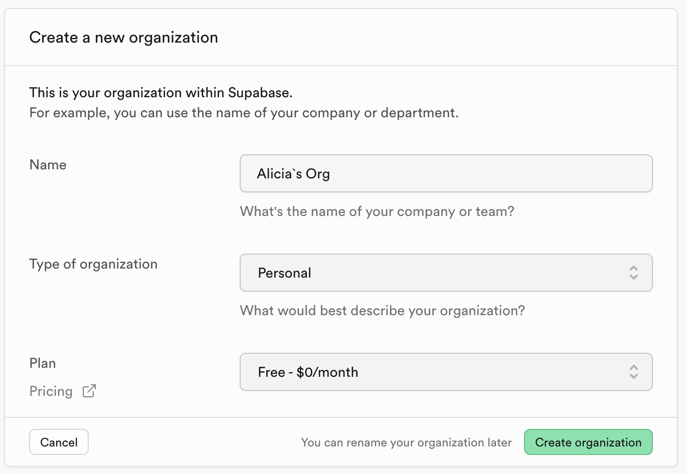
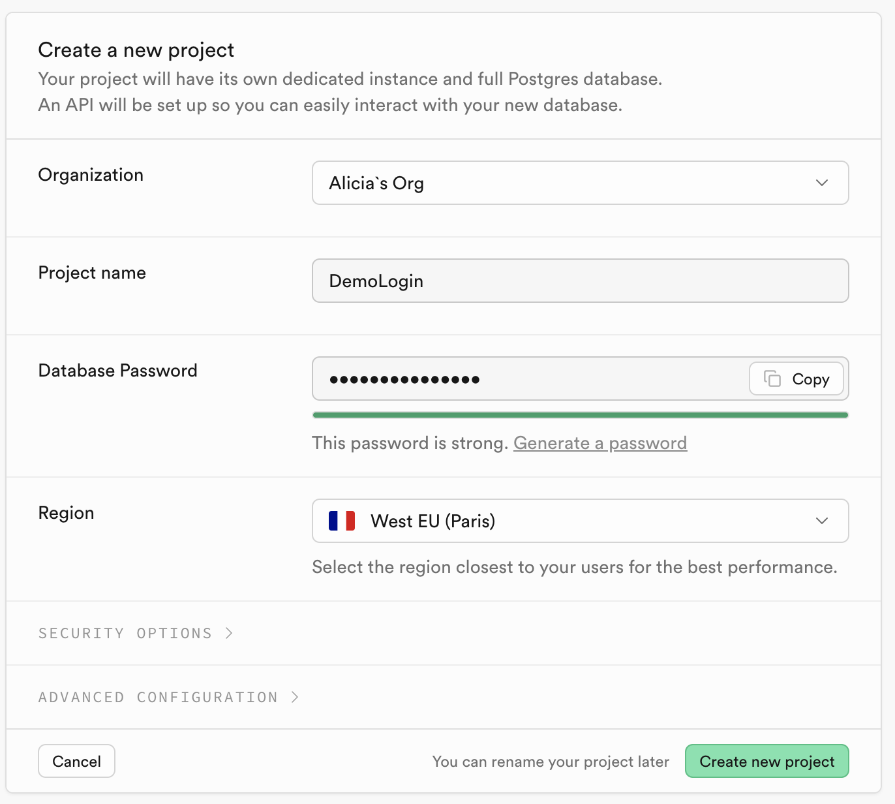
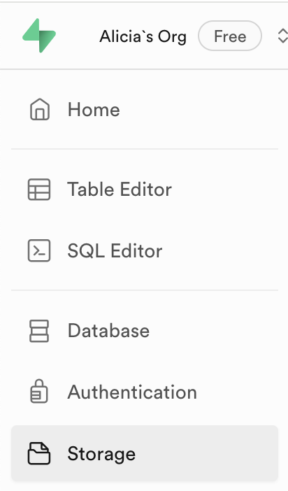
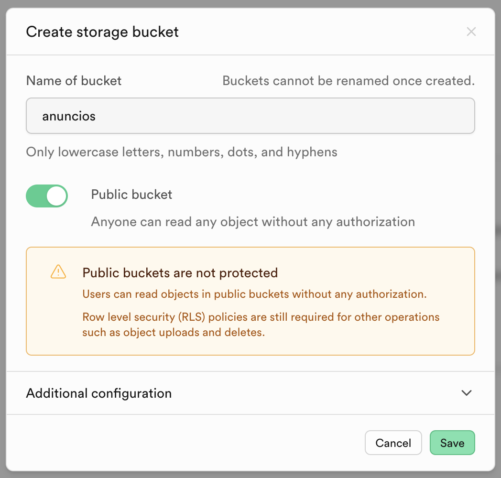
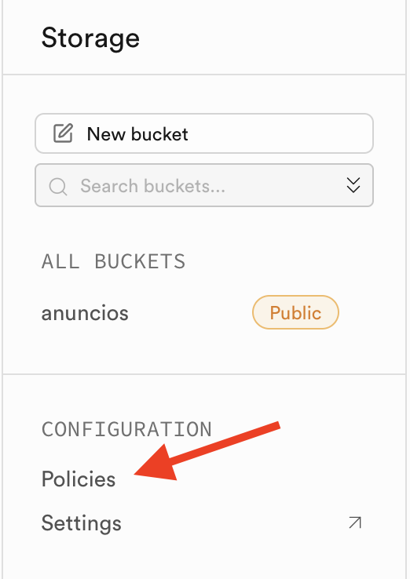
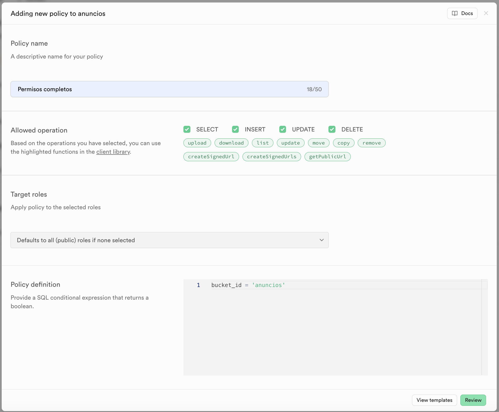

En este apartado aprenderemos a **crear un proyecto en Supabase**, activar **Supabase Storage** y **configurar permisos y políticas de acceso** para gestionar la seguridad de los archivos.

---

## 1 Crear un Proyecto en Supabase  

Para usar **Supabase Storage**, primero debemos crear un proyecto en Supabase. Sigue estos pasos:  

### Paso 1: Crear una cuenta en Supabase  
1️⃣ Ve a [Supabase](https://supabase.com/) y crea una cuenta o inicia sesión con GitHub.  
- Crea una nueva organización seleccionado el plan gratuito
  

2️⃣ Una vez dentro, haz clic en **"New Project"**.  
- Si acabas de crear la cuenta, te aparecerá directamente el diálogo de creación del proyecto.

### Paso 2: Configurar un nuevo proyecto  
1️⃣ Introduce un **nombre para tu proyecto**.  
2️⃣ Selecciona la **región** más cercana a tu ubicación para mejor rendimiento.  
3️⃣ **Establece una contraseña** para la base de datos (debes guardarla bien).  
4️⃣ Haz clic en **"Create new project"** y espera unos minutos a que se configure.  

### Paso 3: Obtener la URL del proyecto y la API Key  
1️⃣ En el panel de Supabase, ve a **"Project Settings" > "API"**.  
2️⃣ Posteriormente, para conectarnos desde nuestro proyecto Android necesitaremos: 
- La **"URL del proyecto"** (Base de datos y APIs).  
- La **"API Key"** (Usaremos la `anon` para nuestra aplicación).  

---

## 2 Activar y Configurar Supabase Storage  
 
1️⃣ En el panel de Supabase, ve a **"Storage"** en el menú lateral.  

2️⃣ Haz clic en **"New Bucket"** para crear un **contenedor** donde se almacenarán las imágenes o archivos.  
3️⃣ Asigna un **nombre al bucket** (Ejemplo: `anuncios`).  
4️⃣ Selecciona si quieres que el bucket sea **público o privado**.  
   - **Público**: Cualquiera puede ver los archivos sin autenticación.  
   - **Privado**: Solo usuarios autenticados pueden acceder.  
  

5️⃣ Haz clic en **"Save"**.  

:::info ¿BUCKETS PÚBLICOS O PRIVADOS?
**Por lo general, es recomendable que los buckets sean privados**, permitiendo el acceso únicamente a usuarios autenticados. Sin embargo, para facilitar el aprendizaje de esta tecnología, **crearemos los buckets como públicos**.    
Es importante destacar que hacer un bucket público **solo permite la lectura de archivos a cualquier usuario**. Si deseamos que cualquier usuario, incluso sin autenticación, pueda **subir o eliminar archivos**, será necesario modificar las **políticas de acceso (Row Level Security - RLS)** en Supabase.
:::

---

## 3 Gestionar Permisos y Políticas de Acceso  

Supabase utiliza **Row Level Security (RLS)** para controlar el acceso a los datos. Si no configuramos las reglas, las solicitudes de nuestra app serán **denegadas (Error 403: Unauthorized)**.

1️⃣ Ve a **"Storage" > "Policies"**.  
 
2️⃣ Selecciona el bucket donde guardaremos las imágenes (`anuncios`).  
3️⃣ Haz clic en **"New Policy"** para crear una nueva política de acceso.  
 
4️⃣ Selecciona la opción **For full customization**  
5️⃣ **Configura las reglas** según el acceso que necesites. En nuestro caso, **vamos a dar todos los permisos a cualquier usuarios**, esté o no autenticado. 
 

:::danger ¡OJO!
Este último paso que hemos realizado de otorgar todos los permisos a cualquier usuario es **muy mala práctica**. Nunca se deberá realizar en entornos de Producción. 
:::