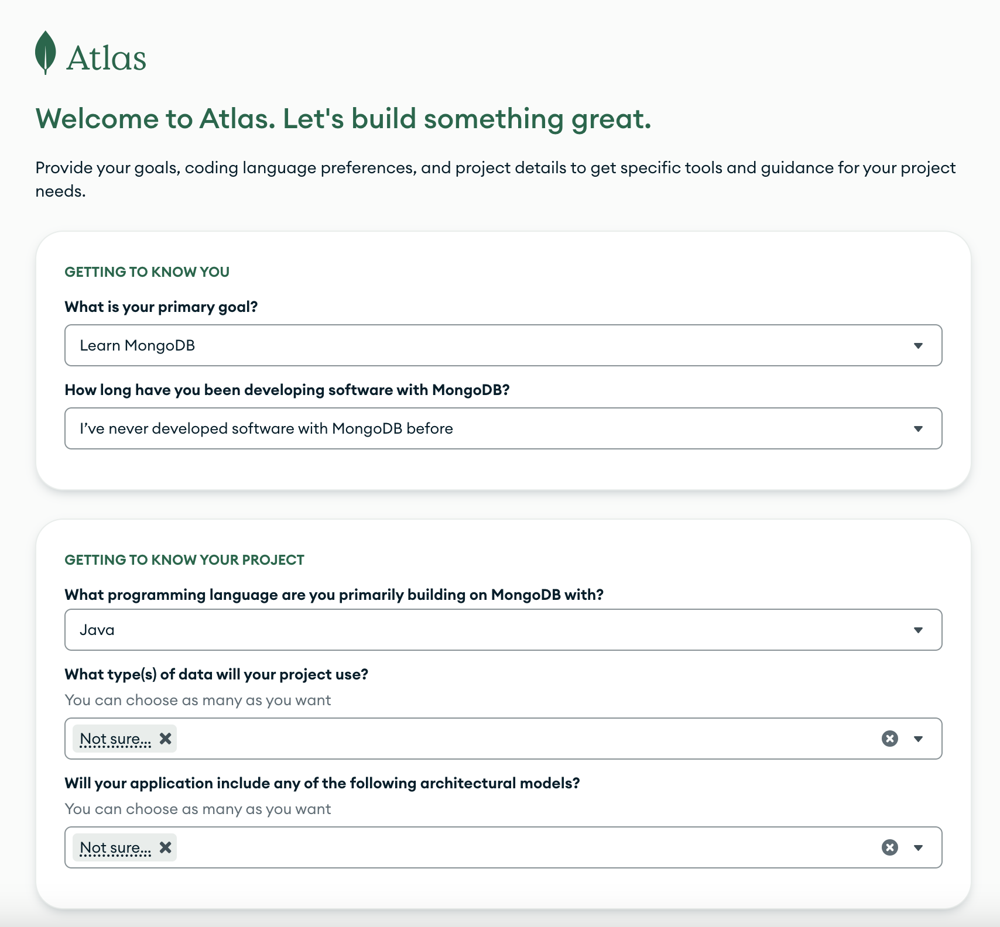
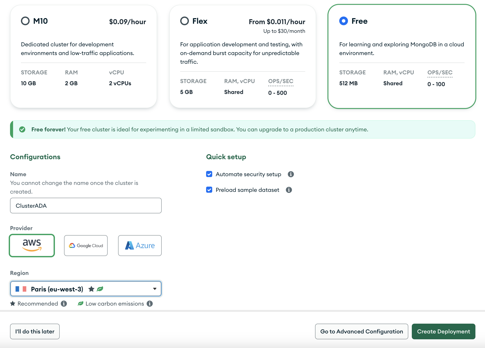
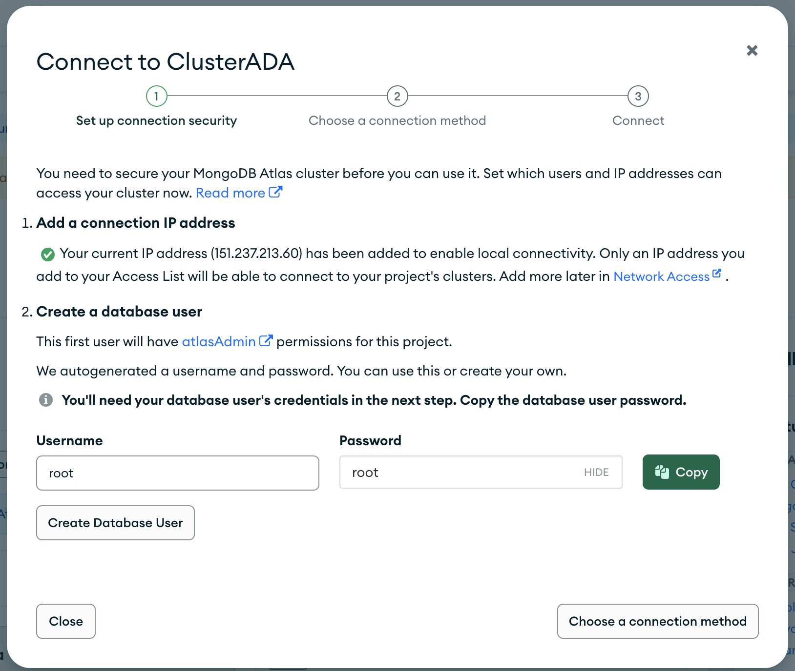
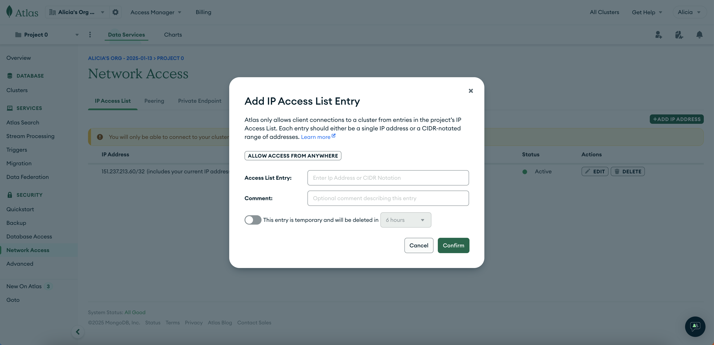
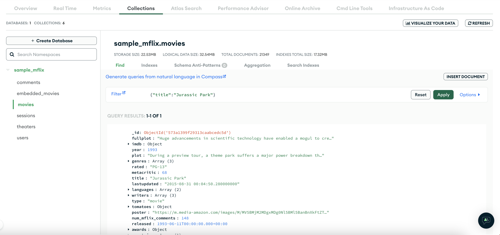

<div class="justify-text">

MongoDB ofrece varios productos y servicios que cubren diferentes necesidades, desde bases de datos gratuitas hasta soluciones empresariales avanzadas:

1. **MongoDB Community Server**: Es la versión gratuita y de código abierto de MongoDB. Ideal para desarrolladores individuales, pruebas locales o pequeños proyectos. Puedes desplegarlo en tu propio ordenador local o en Docker.

2. **MongoDB Atlas**: Es la solución en la nube de MongoDB, completamente administrada. Proporciona todo lo necesario para ejecutar y escalar una base de datos MongoDB sin preocuparte por la infraestructura. Ofrece un cluster gratuito (512 MB de almacenamiento, instancias compartidas) y configuraciones de pago.

3. **MongoDB Enterprise Server**: Es una versión comercial de MongoDB diseñada para entornos empresariales que requieren características avanzadas de seguridad, monitoreo y soporte profesional.

Por sencillez y debido a las limitaciones de instalación de aplicaciones en los equipos del centro, nosotros utilizamos MongoDB Atlas en su versión gratuita.

:::info Conceptos útiles
- **Cluster**: conjunto de servidores que trabajan juntos para hospedar tu base de datos. Puede incluir uno o más nodos.
- **Instancias compartidas**: tu base de datos está alojada en un servidor donde otras bases de datos de otros usuarios también están ejecutándose. Es una forma de optimizar recursos en la nube para aplicaciones pequeñas y entornos de desarrollo.
:::

---

## MongoDB Atlas

Para crear una base de datos en la solución **cloud** de MongoDB debes seguir estos pasos:

### 1. Registro en MongoDB Atlas
**Crea una cuenta gratuita:** Ve a [MongoDB Atlas](https://www.mongodb.com/cloud/atlas) y regístrate. Durante el registro, Atlas te pedirá que crees una organización y un proyecto para administrar tus bases de datos.

 


---

### 2. Creación de un Cluster
Un **cluster** es un grupo de servidores que alojan tus bases de datos. MongoDB Atlas ofrece un cluster gratuito para comenzar.

1. **Selecciona el proveedor de la nube:**
   - Puedes elegir entre AWS, Google Cloud o Microsoft Azure. Nosotros seleccionaremos **AWS**.
   - Si usas la capa gratuita, Atlas seleccionará la opción más cercana a tu ubicación.

2. **Configura el cluster:**
   - Elige la región del servidor (cercana a tu ubicación para menor latencia).
   - En la opción gratuita, elige el tamaño predeterminado (M0 Free Tier).

3. **Nombra tu cluster:**
   - Dale un nombre significativo (por ejemplo, `ClusterADA`).

4. **Crea el cluster:**
   - Haz clic en "Crear Cluster". Esto puede tardar algunos minutos.

 

### 3. Configuración de Acceso
1. **Crear un usuario de base de datos:**
   - En el pop up que aparece, crea el usuario administrador.
   - Este usuario será el que utilizarás para conectarte al cluster.
   - Por sencillez, usa el username **root** con contraseña **root**. ¡OJO! Esto es peligroso en entornos de producción, nosotros lo realizamos para simplificar el trabajo.

 

2. **Configura las reglas de red:**
   - Ve a la pestaña **Network Access** y añade la dirección IP de tu máquina para permitir el acceso al cluster.
   - Para que te puedas conectar desde casa y el instituto sin preocuparte por las IPs, selecciona la opción **Allow access from anywhere**. Ten en cuenta que no es lo más seguro, pero en nuestras bases de datos de prueba no hay problema.

 


### 4. Conexión al Cluster
**Obtén la cadena de conexión:**
   - En la pestaña **Clusters**, haz clic en el botón **Connect** y sigue las instrucciones:
     - Opción 1: Drivers (para conectarnos desde nuestra aplicación). Es la que utilizaremos nosotros.
     - Opción 2: Usa MongoDB Compass. Es una herramienta para MongoDB similar a MySQL Workbench. En los equipos del instituto no podemos instalarlo.
     - Opción 3: Usa la terminal con el cliente MongoDB.
   - Cuando conectemos a la base de datos desde Java volveremos a este apartado.
   - Como puedes ver, se genera un String de conexión que utilizaremos desde nuestra aplicación:
   ```
    mongodb+srv://root:<db_password>@clusterada.epwni.mongodb.net/?retryWrites=true&w=majority&appName=ClusterADA
   ```

### 5. Gestión de colecciones

Lo más completo sería utilizar **MongoDB Compass**, una herramienta gráfica que permite gestionar bases de datos MongoDB, pero debido a las limitaciones de instalación en los equipos del instituto, utilizaremos la opción **Browse Collections** que ofrece Atlas dentro del apartado **Clusters**.

Esta herramienta permite realizar operaciones básicas en las colecciones de tu cluster directamente desde el navegador. Además, inicialmente se crea la base de datos de prueba `sample_mflix`, que incluye varias colecciones. En la siguiente imagen, se está realizando una consulta sobre la colección movies.

 

</div>