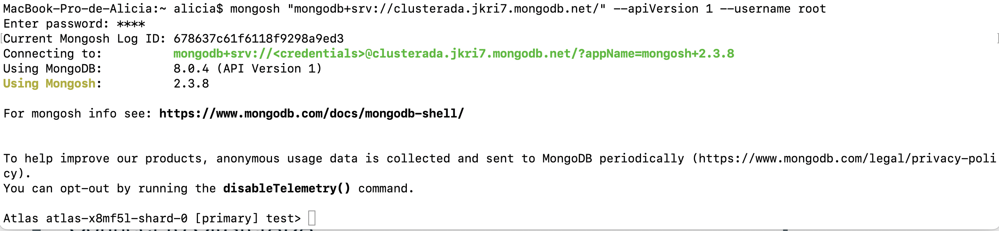

<div class="justify-text">

Antes de conectar nuestra aplicación Java con MongoDB, vamos a aprender el lenguaje de consulta MQL (Mongo Query Language). Para ello, vamos a descargar el software `mongosh`.

## `mongosh`
**`mongosh`** (abreviatura de **MongoDB Shell**) es la herramienta oficial de línea de comandos para interactuar con bases de datos MongoDB. Es un shell moderno y flexible que te permite realizar tareas administrativas, ejecutar consultas, escribir scripts y trabajar directamente con datos almacenados en MongoDB. Puedes usar `mongosh` para conectarte a clusters en MongoDB Atlas, además de bases de datos locales o en servidores remotos.

### Instalación

Puedes instalar `mongosh` desde varias fuentes:

1. **Página Oficial:**
   - Descárgalo desde el [sitio oficial de MongoDB](https://www.mongodb.com/try/download/shell).
   - Disponible para Windows, macOS y Linux.

2. **Gestores de Paquetes:**
   - En sistemas basados en Debian/Ubuntu:
     ```bash
     sudo apt install mongodb-mongosh
     ```
   - En macOS con Homebrew:
     ```bash
     brew install mongosh
     ```

3. **Con Docker:**
   - Ejecuta un contenedor con `mongosh`:
     ```bash
     docker run -it --rm mongo mongosh "mongodb+srv://<usuario>:<contraseña>@<miCluster>.mongodb.net/"
     ```
    - Ten en cuenta que *-it* permite interacción con la terminal de la máquina Docker y *--rm* elimina el contenedor una vez que has terminado de usarlo. 
    - Debes sustituir "usuario" y "contraseña" por los que hayas establecido durante la configuración y "miCluster" por el nombre de tu Cluster. Puedes ver el nombre del cluster siguiendo los pasos del siguiente apartado.

### Conexión a un Cluster Remoto

Dentro del panel de MongoDB Atlas, selecciona **Overview > Connect**. De todas las herramientas de conexión, selecciona `Shell`. En el panel aparecerá el comando que tienes que ejecutar para conectarte a tu cluster.

 

Copia la cadena de conexión en en la terminal de tu equipo o del contenedor Docker e introduce la contraseña del usuario `root`. A partir de ese momento ya estás listo para comunicarte con tus bases de datos.

 

Comprueba que la conexión funciona realizando una consulta básica, que debe devolverte un registro:

```javascript
use sample_mflix; // Indicamos la base de datos a utilizar y que se referenciará mediante db
db.movies.find({ title: "Jurassic Park" }); // Buscamos la película con título Jurassic Park
   ```

## Recordatorio JSON

**JSON** (JavaScript Object Notation) es un formato ligero de intercambio de datos, fácil de leer y escribir tanto para humanos como para máquinas. Se utiliza ampliamente para enviar y recibir datos en aplicaciones web debido a su simplicidad y compatibilidad con casi todos los lenguajes de programación.

### Tipos de datos
1. **Cadenas de Texto:** Valores encerrados entre comillas dobles (`"`).
   ```json
   "nombre": "Juan"
   ```
2. **Números:** Pueden ser enteros o decimales.
   ```json
   "edad": 25
   ```
3. **Booleanos:** Valores `true` o `false`.
   ```json
   "activo": true
   ```
4. **Nulos:** Representados por `null`.
   ```json
   "vacío": null
   ```
5. **Objetos:** Colecciones de pares clave-valor.
   ```json
   "direccion": { "ciudad": "Madrid", "pais": "España" }
   ```
6. **Arrays:** Listas de valores.
   ```json
   "notas": [90, 85, 88]
   ```
---

## MongoDB Query Language (MQL)

**MongoDB Query Language (MQL)** es el lenguaje que utilizamos para interactuar con bases de datos MongoDB. Permite realizar operaciones CRUD (Crear, Leer, Actualizar y Eliminar) y ejecutar consultas avanzadas.

### Campo `_id` y `ObjectId`

El campo **`_id`** en MongoDB es un campo especial que actúa como el **identificador único** de cada documento dentro de una colección. Es obligatorio para todos los documentos y garantiza que cada uno sea único en su colección.

Si no especificas un campo `_id` al insertar un documento, MongoDB generará automáticamente uno. El valor generado es un **ObjectId**, un tipo especial de identificador. También puedes proporcionar tu propio valor para `_id` al insertar un documento, siempre que sea único dentro de la colección.

Un **ObjectId** autogenerado es un identificador hexadecimal de 12 bytes que incluye información como:
- **Timestamp (4 bytes):** Fecha y hora de creación del ObjectId.
- **Identificador de Máquina (3 bytes):** Un identificador único para la máquina donde se creó.
- **Proceso (2 bytes):** Un identificador único para el proceso de MongoDB.
- **Contador Aleatorio (3 bytes):** Un número incremental para evitar colisiones.

**Ejemplo de ObjectId:**
```text
64a1f5a7b1d0d0385eaf1d2c
```

### Crear una Base de Datos
MongoDB no requiere un comando explícito para crear bases de datos. Se crea automáticamente al usarla y añadir una colección o documento.

**Ejemplo: Seleccionar o Crear una Base de Datos:**
```javascript
use miBaseDeDatos
```
- Esto selecciona `miBaseDeDatos`. Si no existe, se crea cuando se inserta el primer dato.

### Crear una Colección
Las colecciones en MongoDB son equivalentes a las tablas en bases de datos relacionales. Este comando no es obligatorio, ya que se puede crear la colección al insertar el primer documento en ella, con el comando que veremos en el siguiente apartado.

**Crear una Colección Vacía:**
```javascript
db.createCollection("miColeccion")
```

**Ver las Colecciones Existentes:**
```javascript
show collections
```

### Insertar Documentos
Un documento es una estructura JSON que almacena datos en MongoDB.

**Insertar un Documento en una Colección:**
```javascript
db.miColeccion.insertOne({
  nombre: "Juan Pérez",
  edad: 30,
  correo: "juan@example.com"
})
```

**Insertar Varios Documentos:**
```javascript
db.miColeccion.insertMany([
  { nombre: "Ana García", edad: 25, correo: "ana@example.com" },
  { nombre: "Carlos López", edad: 40, correo: "carlos@example.com" }
])
```

:::info campo _id
Si insertas un documento sin especificar `_id`, MongoDB lo generará automáticamente:
```javascript
db.usuarios.insertOne({
  nombre: "Juan Pérez",
  edad: 30
})
```

MongoDB generará algo como esto:
```json
{
  "_id": ObjectId("64a1f5a7b1d0d0385eaf1d2c"),
  "nombre": "Juan Pérez",
  "edad": 30
}
```

Si deseas especificar tu propio `_id`:
```javascript
db.usuarios.insertOne({
  "_id": "usuario_001",
  "nombre": "Ana García",
  "edad": 25
})
```

El documento queda así:
```json
{
  "_id": "usuario_001",
  "nombre": "Ana García",
  "edad": 25
}
```
:::

### Consultar Documentos
Puedes usar `find()` para buscar documentos en una colección. Además, puedes aplicar filtros similares a las condiciones que se ponen en el campo WHERE de una consulta SQL. Vamos a ver algunos ejemplos sobre la colección `movies`de la base de datos de ejemplo 


#### **1. Consulta Básica**
Para obtener todos los documentos de la colección `movies`:
```javascript
db.movies.find()
```

#### 2. Filtros Básicos

#### **Filtrar por Igualdad**
Buscar películas con el título `"The Great Train Robbery"`:
```javascript
db.movies.find({ "title": "The Great Train Robbery" })
```

#### **Filtrar por Múltiples Campos**
Buscar películas dirigidas por `"Edwin S. Porter"` en el año `1903`:
```javascript
db.movies.find({ "directors": "Edwin S. Porter", "year": 1903 })
```


#### 3. Operadores de Comparación

MongoDB ofrece varios operadores para filtrar documentos basándose en valores.

#### **Ejemplos Comunes:**
- `$gt`: Mayor que.
- `$lt`: Menor que.
- `$gte`: Mayor o igual que.
- `$lte`: Menor o igual que.
- `$ne`: No igual.

**Ejemplo:**
Películas con calificación de IMDb mayor a `7.0`:
```javascript
db.movies.find({ "imdb.rating": { "$gt": 7.0 } })
```

Películas con duración entre `10` y `20` minutos:
```javascript
db.movies.find({ "runtime": { "$gte": 10, "$lte": 20 } })
```


#### **4. Operadores Lógicos**

Los operadores lógicos permiten combinar múltiples condiciones.

**Ejemplos:**
- `$and`: Todas las condiciones deben cumplirse.
- `$or`: Al menos una condición debe cumplirse.
- `$not`: Niega una condición.

Películas con calificación mayor a `7.0` **o** dirigidas por `"Edwin S. Porter"`:
```javascript
db.movies.find({
  "$or": [
    { "imdb.rating": { "$gt": 7.0 } },
    { "directors": "Edwin S. Porter" }
  ]
})
```

Películas con calificación **no** mayor a `7.0`:
```javascript
db.movies.find({ "imdb.rating": { "$not": { "$gt": 7.0 } } })
```


#### **5. Consultas con Arrays**

Puedes filtrar documentos basados en valores dentro de arrays.

**Ejemplos:**
Buscar películas en las que `"English"` sea uno de los idiomas:
```javascript
db.movies.find({ "languages": "English" })
```

#### **6. Proyecciones**

Usa proyecciones para incluir o excluir campos en el resultado.

**Ejemplo:**
Mostrar solo los campos `title` y `year` de las películas dirigidas por `"Edwin S. Porter"`:
```javascript
db.movies.find({"directors": "Edwin S. Porter"}, { "title": 1, "year": 1, "_id": 0 })
```


#### **7. Ordenar Resultados**

Usa `sort()` para ordenar los resultados por un campo.

**Ejemplo:**
Ordenar películas por calificación IMDb en orden descendente:
```javascript
db.movies.find().sort({ "imdb.rating": -1 })
```

#### **8. Limitar y Saltar Resultados**

**Limitar Resultados**
Mostrar solo las primeras `5` películas:
```javascript
db.movies.find().limit(5)
```

**Saltar Resultados**
Omitir los primeros `10` resultados:
```javascript
db.movies.find().skip(10)
```

**Combinar Ambos**
Paginación básica (página 2, 5 resultados por página):
```javascript
db.movies.find().skip(5).limit(5)
```


#### **9. Buscar Documentos con Campos Existentes o Faltantes**
Películas que tienen el campo `awards`:
```javascript
db.movies.find({ "awards": { "$exists": true } })
```

Películas que **no** tienen el campo `plot`:
```javascript
db.movies.find({ "plot": { "$exists": false } })
```

#### **10. Resumen de Comandos**
| Operador/Función        | Uso                                         | Ejemplo                                  |
|-------------------------|---------------------------------------------|------------------------------------------|
| `$eq`                   | Igual a                                     | `{ "year": { "$eq": 1903 } }`           |
| `$gt`, `$lt`, `$gte`, `$lte` | Comparaciones numéricas                   | `{ "imdb.rating": { "$gt": 7.0 } }`     |
| `$and`, `$or`, `$not`   | Operadores lógicos                         | `{ "$or": [{...}, {...}] }`             |
| `$exists`               | Verificar existencia de un campo           | `{ "awards": { "$exists": true } }`     |
| `sort()`, `limit()`, `skip()` | Ordenar, limitar y paginar resultados    | `sort({ "year": -1 })`                  |
| Proyección              | Incluir/excluir campos en resultados        | `{ "title": 1, "_id": 0 }`              |


### Actualizar Documentos
Puedes actualizar uno o más documentos con `updateOne` y `updateMany`.

**Actualizar un Documento:**
```javascript
db.miColeccion.updateOne(
  { nombre: "Juan Pérez" }, 
  { $set: { edad: 35 } }
)
```

**Actualizar Varios Documentos:**
```javascript
db.miColeccion.updateMany(
  { edad: { $lt: 30 } }, 
  { $set: { activo: true } }
)
```

### Eliminar Documentos
Usa `deleteOne` o `deleteMany` para eliminar documentos.

**Eliminar un Documento:**
```javascript
db.miColeccion.deleteOne({ nombre: "Carlos López" })
```

**Eliminar Varios Documentos:**
```javascript
db.miColeccion.deleteMany({ edad: { $lt: 25 } })
```

**Eliminar Todos los Documentos de una Colección:**
```javascript
db.miColeccion.deleteMany({})
```

### Eliminar una Colección
Para eliminar una colección completa:
```javascript
db.miColeccion.drop()
```

---

### Eliminar una Base de Datos
Elimina la base de datos seleccionada:
```javascript
db.dropDatabase()
```


### Otros Comandos Útiles

**Contar Documentos en una Colección:**
```javascript
db.miColeccion.countDocuments()
```

## Ejercicios
Realiza las siguientes consultas en `mongosh` sobre la base de datos `sample_mflix`.

1. Encuentra todas las películas dirigidas por "Edwin S. Porter".

2. Busca las películas que fueron lanzadas después del año 2000.

3. Obtén todas las películas cuyo idioma sea "Spanish".

4. Muestra solo los títulos y años de todas las películas.

5. Encuentra las películas cuyo género incluya "Western".

6. Busca las películas con una calificación IMDb mayor o igual a 8.

7. Encuentra las películas con una duración entre 90 y 120 minutos.

8. Muestra las películas que tienen más de 10,000 votos en IMDb.

9. Encuentra las películas que tienen un actor llamado "Gilbert M. 'Broncho Billy' Anderson".

10. Busca películas lanzadas antes de 1950 que tengan una calificación IMDb mayor a 7.

11. Encuentra películas que no tengan el idioma "English".

12. Encuentra películas con más de 5 reseñas de críticos y un índice de aceptación (meter) mayor al 80%.

13. Encuentra las 5 películas mejor calificadas en IMDb y muestra solo sus títulos y calificaciones.

14. Muestra las películas que tienen al menos un género, pero no tienen director asignado.

15. Busca películas donde alguno de los géneros sea "Action" y tenga a "Bruce Willis" como actor.

</div>