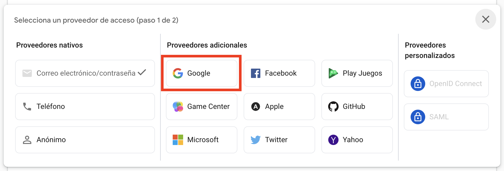
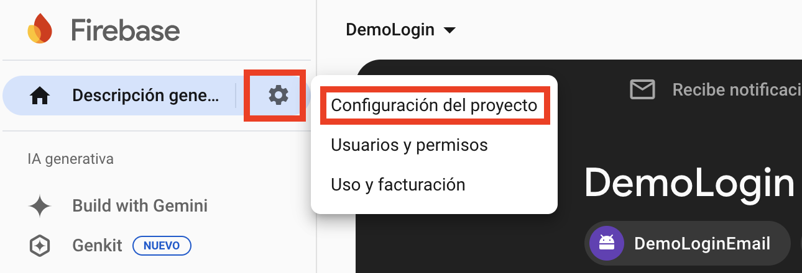
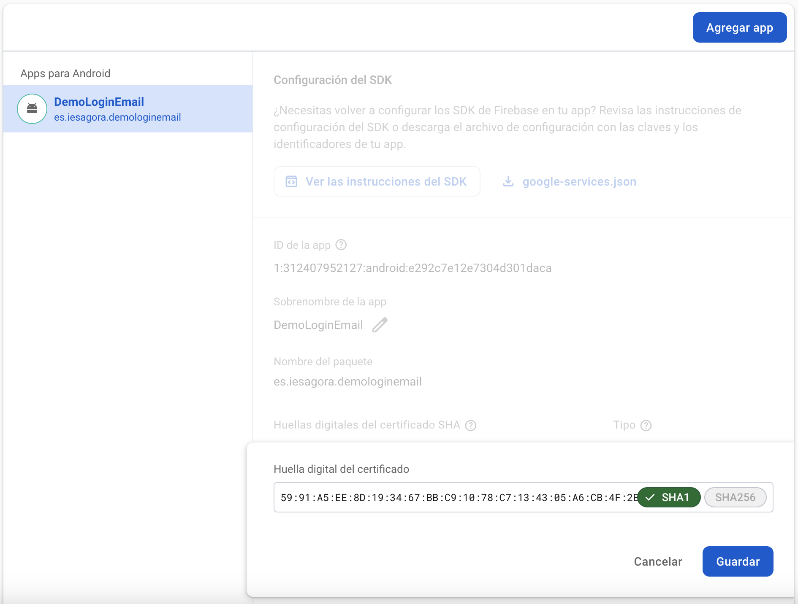

<div class="justify-text">

Vamos a **agregar la autenticación con Google** en nuestro proyecto anterior, donde implementamos login con email/contraseña.

Antes de empezar, entendamos las tecnologías que usaremos:

**🔹 Firebase Authentication**:  es un servicio que nos permite autenticar usuarios de forma segura sin necesidad de gestionar un backend propio.

**🔹 OAuth 2.0**: Google utiliza **OAuth 2.0** para autenticar a los usuarios. Es un protocolo seguro que permite a las apps acceder a la información de Google del usuario sin exponer sus credenciales.

No obstante, **Firebase simplifica el proceso**, por lo que **no necesitas manejar tokens de OAuth manualmente**. Solo necesitas configurar Firebase y usar su SDK.

---

## 1. Habilitar Google Sign-In en Firebase
1. Ve a la **[Firebase Console](https://console.firebase.google.com/)**.  
2. Entra en tu proyecto y ve a **Authentication** > **Método de inicio de sesión**.  
3. Habilita **Google** y **guarda los cambios**.  



4. Introduce el nombre de tu aplicación (será el que se muestre en el correo que les llega a los usuarios después de acceder por primera vez) y el correo de asistencia al proyecto.


## 2. Huella digital SHA-1

Cuando activas **autenticación con Google en Firebase**, Firebase necesita **verificar** que tu aplicación está realmente conectada a tu proyecto de Firebase y a Google Cloud.

Para ello, requiere **una huella digital SHA-1**, que es un identificador único generado a partir de la clave de firma de la app. 

Esto es necesario porque **Google Sign-In usa OAuth 2.0**, y para que Firebase pueda autenticar a los usuarios con sus cuentas de Google, necesita asociar la app con un **SHA-1 válido**.

Hay dos tipos de claves SHA-1 que puedes agregar:

1. **SHA-1 de desarrollo** (para pruebas en Android Studio).  
2. **SHA-1 de producción** (para versiones firmadas y subidas a Google Play).  

A continuación se explica cómo obtener SHA-1 de Desarrollo (Modo Debug):

#### **Paso 1: Obtener la huella SHA-1 en Android Studio**
1. **Abre Android Studio** y ve a la **terminal** (`View > Tool Windows > Terminal`).
2. Escribe el siguiente comando y presiona `Enter`:

   ```sh
   ./gradlew signingReport
   ```
   **En Windows**, usa:  
   ```sh
   gradlew signingReport
   ```

3. Espera unos segundos y verás una salida como esta:

   ```
   Variant: debug
   Config: debug
   Store: /Users/tuusuario/.android/debug.keystore
   Alias: AndroidDebugKey
   MD5:  A1:B2:C3:D4:E5:F6:G7:H8:I9:J0
   SHA1: 11:22:33:44:55:66:77:88:99:AA:BB:CC:DD:EE:FF:GG:HH:II:JJ
   SHA-256: XX:YY:ZZ...
   ```

4. **Copia el SHA-1** (solo los números después de `SHA1:`).


#### **Paso 2: Agregar SHA-1 en Firebase**
1. **Ve a la [Firebase Console](https://console.firebase.google.com/)**.
2. En tu proyecto, haz clic en ⚙ **Configuración del Proyecto**.

    

3. En la sección **Tus apps**, selecciona tu app de Android.
4. **En la parte de "Huellas digitales del certificado SHA"**, selecciona `Agregar huella digital`.

    

5. Guarda los cambios y vuelve a descargar y añadir a tu proyecto el archivo **google-services.json**.


---

## 3. Agregar Dependencias en build.gradle
Abre `build.gradle (Module: app)` y **añade estas dependencias** (si has implementado el ejercicio anterior, ya debes tener las dos primera dependencias):

```gradle
dependencies {
    // Firebase BOM (Gestiona automáticamente las versiones de las dependencias de Firebase)
    implementation(platform("com.google.firebase:firebase-bom:33.8.0"))

    // Firebase Authentication
    implementation("com.google.firebase:firebase-auth")

    // Google Sign-In (Fuera de BOM, ya que no es parte de Firebase)
    implementation("com.google.android.gms:play-services-auth:20.7.0")
}
```
Luego, **sincroniza el proyecto** (`Sync Now`).

---

## 4. Agregar el Botón de Google en LoginActivity
En `activity_login.xml`, **agrega un botón para iniciar sesión con Google**:

```xml
<com.google.android.gms.common.SignInButton
    android:id="@+id/googleSignInButton"
    android:layout_width="wrap_content"
    android:layout_height="wrap_content"
    android:layout_marginTop="30dp"/>
```

📌 **Este botón es el oficial de Google Sign-In** y se verá como el botón típico de **"Iniciar sesión con Google"**.

---

## 5. Implementar Google Sign-In en `LoginActivity.java`
Abre `LoginActivity.java` y sigue estos pasos:

### 🔹 Paso 1: Agregar Variables
Dentro de la clase `LoginActivity`, **declara estas variables**:

```java
private GoogleSignInClient googleSignInClient;
private static final int RC_SIGN_IN = 9001;
```

📌 **Explicación**  
✔ `GoogleSignInClient` es una clase que administra el flujo de autenticación con Google.  
✔ `RC_SIGN_IN = 9001` es un **código de solicitud (`Request Code`)** que se usa para identificar el resultado del inicio de sesión con Google.   

### 🔹 Paso 2: Obtener el Web Client Id
El **Web Client ID** (o **Client ID de OAuth 2.0**) es un identificador único generado por **Google Cloud Platform (GCP)** que permite a tu aplicación comunicarse con los servidores de Google para autenticar a los usuarios mediante **Google Sign-In**.

- **Es necesario para que Firebase pueda validar la identidad de los usuarios que inician sesión con Google.**  
- **Se usa en Android para obtener un "ID Token"** que luego se intercambia con Firebase para autenticar al usuario.  
- **Cada proyecto de Firebase tiene su propio Web Client ID**, y debe configurarse correctamente para que Google Sign-In funcione en tu app.


Para obtener el Web Client ID en Firebase sigue estos pasos:

1. **Abre Firebase Console**: [https://console.firebase.google.com/](https://console.firebase.google.com/)  
2. **Selecciona tu proyecto**.  
3. En el menú lateral, ve a **"Configuración del Proyecto"** (⚙).  
4. Dirígete a la pestaña **"Métodos de acceso"**.  
5. Selecciona el proveedor **Google** que hemos configurado previamente.
6. Despliega el apartado **Configuración del SDK web** y copia el primer campo.

    

7. Agrégalo a `res/values/strings.xml` para mayor organización:
    ```xml
    <string name="default_web_client_id">1234567890-abcdefghij.apps.googleusercontent.com</string>
    ```


### 🔹 Paso 3: Configurar Google Sign-In en `onCreate`
Agrega esta configuración dentro de `onCreate()`:

```java
@Override
protected void onCreate(Bundle savedInstanceState) {
    ...

    // Configurar Google Sign-In
    GoogleSignInOptions gso = new GoogleSignInOptions.Builder(GoogleSignInOptions.DEFAULT_SIGN_IN)
            .requestIdToken(getString(R.string.default_web_client_id)) // Usa tu Web client ID
            .requestEmail()
            .build();

    // Inicializar Google Sign-In a partir de la configuración previa
    googleSignInClient = GoogleSignIn.getClient(this, gso);

    // Evento para el botón de Google Sign-In
    binding.googleSignInButton.setOnClickListener(v -> signInWithGoogle());
}
```

### 📌 **Explicación**  
✔ **Configura Google Sign-In** con `GoogleSignInOptions`, estableciendo `DEFAULT_SIGN_IN` y solicitando el **ID Token** (debe coincidir con el Web Client ID de Firebase) y **correo** del usuario.  
✔ **Inicializa `GoogleSignInClient`** con la configuración previa para gestionar el flujo de autenticación.  
✔ **Asigna un evento al botón de Google Sign-In**, ejecutando `signInWithGoogle()` al hacer clic para iniciar el proceso de autenticación.  

---

SEGUIR AQUI
startActivityForResult está deprecado. Usar private ActivityResultLauncher<Intent> googleSignInLauncher;

### **🔹 Paso 3: Iniciar el Flujo de Google Sign-In**
Agrega este método:

```java
private void signInWithGoogle() {
    Intent signInIntent = googleSignInClient.getSignInIntent();
    startActivityForResult(signInIntent, RC_SIGN_IN);
}
```

---

### **🔹 Paso 4: Manejar la Respuesta del Login de Google**
Agrega `onActivityResult()` para manejar el resultado del login:

```java
@Override
public void onActivityResult(int requestCode, int resultCode, Intent data) {
    super.onActivityResult(requestCode, resultCode, data);
    if (requestCode == RC_SIGN_IN) {
        Task<GoogleSignInAccount> task = GoogleSignIn.getSignedInAccountFromIntent(data);
        try {
            GoogleSignInAccount account = task.getResult(ApiException.class);
            firebaseAuthWithGoogle(account);
        } catch (ApiException e) {
            Toast.makeText(this, "Error al iniciar sesión con Google", Toast.LENGTH_SHORT).show();
        }
    }
}
```

---

### **🔹 Paso 5: Autenticar en Firebase con la Cuenta de Google**
Agrega este método para autenticar al usuario en Firebase:

```java
private void firebaseAuthWithGoogle(GoogleSignInAccount account) {
    AuthCredential credential = GoogleAuthProvider.getCredential(account.getIdToken(), null);
    mAuth.signInWithCredential(credential)
        .addOnCompleteListener(this, task -> {
            if (task.isSuccessful()) {
                Toast.makeText(LoginActivity.this, "Inicio de sesión con Google exitoso", Toast.LENGTH_SHORT).show();
                redirectToMain();
            } else {
                Toast.makeText(LoginActivity.this, "Error: " + task.getException().getMessage(), Toast.LENGTH_SHORT).show();
            }
        });
}
```

---

## **📌 6. Verificar que el Usuario está Logueado**
En `MainActivity.java`, **muestra el usuario logueado**:

```java
FirebaseUser user = FirebaseAuth.getInstance().getCurrentUser();
if (user != null) {
    String email = user.getEmail();
    Toast.makeText(this, "Usuario: " + email, Toast.LENGTH_SHORT).show();
}
```

---

## **📌 7. Cerrar Sesión**
Si quieres que el usuario pueda cerrar sesión, **agrega este código en `MainActivity.java`**:

```java
private void logoutUser() {
    FirebaseAuth.getInstance().signOut();
    googleSignInClient.signOut().addOnCompleteListener(this, task -> {
        Toast.makeText(MainActivity.this, "Sesión cerrada", Toast.LENGTH_SHORT).show();
        startActivity(new Intent(MainActivity.this, LoginActivity.class));
        finish();
    });
}
```

</div>