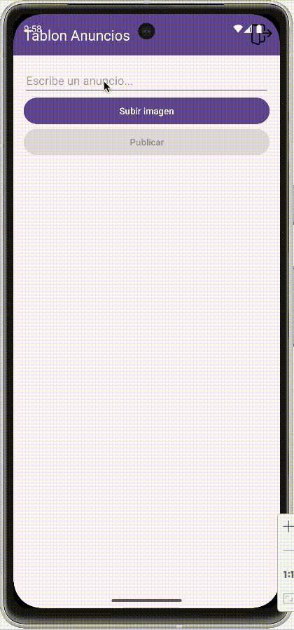
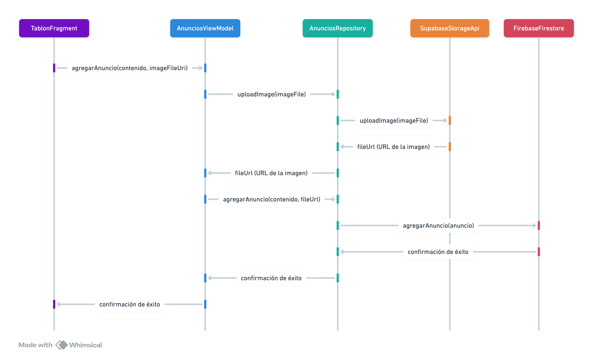

<div class="justify-text">


En este ejemplo, partimos del **Tablón de Anuncios** implementado con Firestore. En `TablonFragment` hemos añadido un botón para subir la imagen del anuncio. Hasta que no se ha subido una imagen, no se podrá publicar el anuncio ya que se deshabilita el botón de Publicar.



**Estructura del proyecto:**  
1. **`LoginActivity`** → Maneja el inicio de sesión con Firebase Authentication.  
2. **`MainActivity`** → Contiene el `TablonFragment`, donde se muestran los anuncios.  
3. **`TablonFragment`** → Muestra los anuncios en un `RecyclerView` y permite agregar nuevos anuncios.  
4. **`AnuncioViewModel`** → Gestiona los datos entre la UI y Firestore.  
5. **`AnuncioRepository`** → Se encarga de la conexión con Firestore y la API de Supabase.
6. **`SupabaseClient`** → Cliente de Retrofit para gestionar la comunicación con Supabase.
7. **`SupabaseStorageAPI`**  → Interfaz que implementa los métodos para enviar peticiones a Supabase.

**Diagrama de secuencia** que ilustra el flujo de llamadas entre las clases para publicar un anuncio con imagen:



---

## 1. Configurar las dependencias del proyecto
Revisa el apartado `Configuración Inicial de Supabase` y añade las dependencias necesarias para utilizar Supabase Storage.

---

## 2. Modificar los Layouts
### 2.1. Layout de `TablonFragment`
En el layout vamos a añadir un botón para subir las imágenes y vamos a poner el botón Publicar deshabilitado por defecto. Lo habilitaremos cuando se suba una imagen para el anuncio.

```xml title="fragment_tablon.xml"
<LinearLayout xmlns:android="http://schemas.android.com/apk/res/android"
    xmlns:app="http://schemas.android.com/apk/res-auto"
    android:layout_width="match_parent"
    android:layout_height="match_parent"
    android:orientation="vertical"
    android:padding="16dp">

    <EditText
        android:id="@+id/etAnuncio"
        android:layout_width="match_parent"
        android:layout_height="wrap_content"
        android:hint="Escribe un anuncio..." />

    <!-- Botón nuevo -->
    <Button
        android:id="@+id/btnSubirImagen"
        android:layout_width="match_parent"
        android:layout_height="wrap_content"
        android:text="Subir imagen" />

    <Button
        android:id="@+id/btnPublicar"
        android:layout_width="match_parent"
        android:layout_height="wrap_content"
        android:enabled="false"
        android:text="Publicar" />

    <androidx.recyclerview.widget.RecyclerView
        android:id="@+id/recyclerAnuncios"
        app:layoutManager="androidx.recyclerview.widget.LinearLayoutManager"
        android:layout_width="match_parent"
        android:layout_height="match_parent" />
</LinearLayout>
```

### 2.2. Layout de `AnuncioViewHolder`
Modificamos el ViewHolder para mostrar la imagen asociada al anuncio.
```xml title="viewholder_anuncio.xml"
<?xml version="1.0" encoding="utf-8"?>
<androidx.cardview.widget.CardView xmlns:android="http://schemas.android.com/apk/res/android"
    xmlns:app="http://schemas.android.com/apk/res-auto"
    android:layout_width="match_parent"
    android:layout_height="wrap_content"
    android:layout_margin="8dp"
    app:cardCornerRadius="8dp"
    app:cardElevation="4dp">

    <LinearLayout
        android:layout_width="match_parent"
        android:layout_height="wrap_content"
        android:orientation="horizontal"
        android:padding="16dp">

        <!-- Imagen del anuncio -->
        <ImageView
            android:id="@+id/ivImagenNoticia"
            android:layout_width="80dp"
            android:layout_height="80dp"
            android:scaleType="centerCrop"
            android:src="@drawable/ic_launcher_background"
            android:layout_marginEnd="12dp"
            android:contentDescription="Imagen de la noticia" />

        <!-- Contenedor del contenido de la noticia -->
        <LinearLayout
            android:layout_width="0dp"
            android:layout_height="wrap_content"
            android:orientation="vertical"
            android:layout_weight="1">

            <!-- Contenido del anuncio -->
            <TextView
                android:id="@+id/tvContenido"
                android:layout_width="wrap_content"
                android:layout_height="wrap_content"
                android:text="Contenido"
                android:textStyle="bold"
                android:textSize="16sp"
                android:textColor="@android:color/black" />

            <!-- Fecha del anuncio -->
            <TextView
                android:id="@+id/tvFecha"
                android:layout_width="wrap_content"
                android:layout_height="wrap_content"
                android:text="Fecha"
                android:textSize="14sp"
                android:textColor="@android:color/darker_gray"
                android:layout_marginTop="4dp" />

            <!-- Nombre del usuario -->
            <TextView
                android:id="@+id/tvUsuario"
                android:layout_width="wrap_content"
                android:layout_height="wrap_content"
                android:text="Usuario"
                android:textSize="14sp"
                android:textColor="@android:color/darker_gray"
                android:layout_marginTop="4dp" />

        </LinearLayout>
    </LinearLayout>
</androidx.cardview.widget.CardView>
```

---

## 3. Modificar el modelo de datos
Nuestro anuncio ahora debe almacenar la URL de la imagen en Supabase.
```java title="model/Anuncio.java"
public class Anuncio {
    private String id;
    private String contenido;
    private long fecha;
    private String emailAutor;
    private String urlImagen; // Atributo nuevo

    // Constructor vacío requerido por Firestore
    public Anuncio() {}

    // Getters y setters
}
```

---

## 4. Implementar el acceso a datos

Recuerda que Supabase ofrece una API para comunicarnos con los servicios, de manera que tenemos que utilizar Retrofit para establecer la comunicación.

### 4.1. Cliente de Retrofit
En esta clase establecemos la conexión entre Retrofit y el servicio de Supabase. Recuerda que en el apartado `Configuración Inicial` puedes ver dónde obtener la URL base y API key de Supabase.

```java title="supabase/SupabaseClient.java"
import retrofit2.Retrofit;
import retrofit2.converter.gson.GsonConverterFactory;

public class SupabaseClient {

    private static Retrofit retrofit = null;
    private static final String BASE_URL = "https://<TU_URL_BASE>.supabase.co/";

    public static Retrofit getClient() {
        if (retrofit == null) {
            retrofit = new Retrofit.Builder()
                    .baseUrl(BASE_URL)
                    .addConverterFactory(GsonConverterFactory.create())
                    .build();
        }
        return retrofit;
    }
}
```

### 4.2. Interfaz con las operaciones

Siguiendo la arquitectura de Retrofit, debemos implementar una `interface` que defina los métodos HTTP que vamos a utilizar. En el caso de nuestra aplicación, solo se contempla la subida de imágenes.

```java title="supabase/SupabaseStorageApi.java"
import okhttp3.MultipartBody;
import retrofit2.Call;
import retrofit2.http.Header;
import retrofit2.http.Multipart;
import retrofit2.http.POST;
import retrofit2.http.Part;
import retrofit2.http.Path;

public interface SupabaseStorageApi {

    @Multipart
    @POST("storage/v1/object/{bucket}/{fileName}")
    Call<Void> uploadImage(
            @Header("Authorization") String authToken,
            @Path("bucket") String bucket,
            @Path("fileName") String fileName,
            @Part MultipartBody.Part file
    );

}
```

### 4.3. Repositorio de datos

Recuerda que el Repository debe actuar como **intermediario entre el ViewModel y las fuentes de datos**, por ello, añadimos en él el código necesario para subir una imagen.

```java title="repository/AnunciosRepository.java"
public class AnunciosRepository {
    // Instancia de Firestore para acceder a la base de datos de anuncios
    private FirebaseFirestore db;
    // Instancia de Authentication para consultar el usuario conectado
    private FirebaseAuth mAuth;
    // Referencia a la colección de anuncios
    private CollectionReference coleccionAnuncios;
    // Instancia de Supabase Storage para almacenar imágenes
    private SupabaseStorageApi storageApi;
    
    private static final String API_KEY = "<TU_API_KEY>"; // Reemplaza con tu API Key

    public AnunciosRepository() {
        // Inicialización de los atributos de clase
        db = FirebaseFirestore.getInstance();
        mAuth = FirebaseAuth.getInstance();
        coleccionAnuncios = db.collection("anuncios");
        storageApi = SupabaseClient.getClient().create(SupabaseStorageApi.class);
    }

    ...

    // En este método no cambia nada porque el anuncio ya llega con el atributo urlImagen setteado
    public LiveData<Boolean> agregarAnuncio(Anuncio anuncio) {
        MutableLiveData<Boolean> anuncioAgregado = new MutableLiveData<>();
        // Generar un nuevo ID para el documento en Firestore
        String idGenerado = coleccionAnuncios.document().getId();

        // Asignar el ID generado al anuncio antes de guardarlo
        anuncio.setId(idGenerado);

        // Insertar el anuncio con el ID generado
        coleccionAnuncios.document(idGenerado)
                .set(anuncio)
                .addOnSuccessListener(aVoid -> anuncioAgregado.postValue(true))
                .addOnFailureListener(e -> anuncioAgregado.postValue(false));

        return anuncioAgregado;
    }

    // Método para subir una imagen a Supabase Storage
    // Recibe el fichero de la imagen a subir
    public LiveData<String> uploadImage(File imageFile) {
        // LiveData en el que devolveremos la URL pública de la imagen generada
        MutableLiveData<String> liveDataUrl = new MutableLiveData<>();

        // Crear el cuerpo de la petición para enviar a Supabase (en él se envía el fichero)
        RequestBody requestFile = RequestBody.create(MediaType.parse("image/*"), imageFile);
        MultipartBody.Part body = MultipartBody.Part.createFormData("file", imageFile.getName(), requestFile);

        // Llamada a la API de Supabase
        // Param 1: Tu API KEY (Autenticación)
        // Param 2: nombre de tu bucket
        // Param 3: nombre con el que se creará el fichero en Supabase
        // Param 4: cuerpo de la petición (imagen)
        Call<Void> call = storageApi.uploadImage("Bearer " + API_KEY, "anuncios", imageFile.getName(), body);

        // Enviamos la petición en segundo plano
        call.enqueue(new Callback<Void>() {
            @Override
            public void onResponse(Call<Void> call, Response<Void> response) {
                if (response.isSuccessful()) {
                    // Si todo va bien, recuperamos la URL pública de la imagen en Supabase
                    // Esta URL será la que guardemos en nuestra base de datos
                    String fileUrl = response.raw().request().url().toString();
                    // Almacenamos el valor en el LiveData
                    liveDataUrl.postValue(fileUrl);
                } else {
                    // Si no se ha podido completar la petición, devolvemos null
                    liveDataUrl.postValue(null);
                }
            }

            @Override
            public void onFailure(Call<Void> call, Throwable t) {
                // Si no se ha podido completar la petición, devolvemos null
                liveDataUrl.postValue(null);
            }
        });

        // Devolvemos el LiveData con la URL de nuestra imagen
        return liveDataUrl;
    }
}
```


### 4.4. ViewModel

El `ViewModel` implementa el método `agregarAnuncio`, que se encarga de realizar dos operaciones de manera secuencial:

1. **Subir la imagen a Supabase Storage** mediante `repository.uploadImage(imageFile)`.
2. **Guardar el anuncio en Firestore** mediante `repository.agregarAnuncio(anuncio)`, pero **solo después de haber obtenido la URL de la imagen**.

#### 🔹 **Problema: Dependencia entre las dos operaciones**
El principal desafío en este proceso es que **el anuncio no puede subirse hasta que la imagen haya sido almacenada correctamente en Supabase**, ya que necesitamos la URL generada por el servidor para incluirla en el objeto `Anuncio` antes de guardarlo en Firestore.

Dado que **Retrofit maneja las llamadas de forma asíncrona**, no podemos simplemente llamar a los métodos uno tras otro. En su lugar, necesitamos un mecanismo que garantice que `agregarAnuncio` solo se ejecute una vez que `uploadImage` haya finalizado con éxito.

Para resolver esto, utilizamos `Transformations.switchMap`, que nos permite **encadenar** la subida de la imagen y el guardado del anuncio de manera reactiva.

#### 🔹 **¿Qué es `Transformations.switchMap`?**
`Transformations.switchMap` es una utilidad de LiveData en Android que nos permite **transformar y encadenar datos en tiempo real**. Funciona de la siguiente manera:

- **Recibe un LiveData de entrada** (en este caso, el `LiveData<String>` de `uploadImage()` que devuelve la URL de la imagen).
- **Transforma el valor emitido por ese LiveData** en un nuevo LiveData (en este caso, el `LiveData<Boolean>` que devuelve `agregarAnuncio()`).
- **Retorna el nuevo LiveData**, asegurando que solo se ejecute después de que el primer LiveData haya emitido un valor.

Gracias a esto, conseguimos que:
- `repository.uploadImage(imageFile)` se ejecute primero.
- Cuando la imagen se sube con éxito, `switchMap` obtiene la URL.
- Solo entonces se llama a `repository.agregarAnuncio(anuncio)`.


```java
public class AnunciosViewModel extends AndroidViewModel {

    private AnunciosRepository repository;

    public AnunciosViewModel(@NonNull Application application) {
        super(application);
        repository = new AnunciosRepository();
    }

    ...

    public LiveData<Boolean> agregarAnuncio(String contenido, Uri imageFileUri) {
        MutableLiveData<Boolean> resultadoLiveData = new MutableLiveData<>();

        try {
            // Convertimos el Uri en un File para enviarlo a Supabase
            // Más abajo tienes el código de esa clase estática
            File imageFile = ImageUtils.getFileFromUri(getApplication().getApplicationContext(), imageFileUri);

            // Usamos switchMap para esperar a que la imagen se suba antes de guardar el anuncio
            return Transformations.switchMap(repository.uploadImage(imageFile), fileUrl -> {
                if (fileUrl != null) {
                    // Creamos el anuncio solo si tenemos la URL de la imagen
                    Anuncio anuncio = new Anuncio(contenido, System.currentTimeMillis(), getConnectedUserEmail(), fileUrl);
                    return repository.agregarAnuncio(anuncio);
                } else {
                    // Si la subida falla, devolvemos false
                    resultadoLiveData.postValue(false);
                    return resultadoLiveData;
                }
            });

        } catch (IOException e) {
            // Capturamos posibles errores en la conversión del archivo
            resultadoLiveData.postValue(false);
        }

        return resultadoLiveData;
    }
}
```


#### ¿Por qué usar `switchMap` en lugar de un simple `Observer`?
No es buena práctica utiliza `Observers` dentro del ViewModel y además, tendríamos que utilizar el método `.observeForever()`, que puede producir fugas de memoria.

:::info OBTENER EL FICHERO (FILE) A PARTIR DE LA URI
En la siguiente clase encontrarás el código para pasar de una URI a un fichero:

```java title="utils/ImageUtils.java"
public class ImageUtils {

    public static File getFileFromUri(Context context, Uri uri) throws IOException {
        InputStream inputStream = context.getContentResolver().openInputStream(uri);
        File tempFile = File.createTempFile("upload_", ".jpg", context.getCacheDir());
        tempFile.deleteOnExit();

        FileOutputStream outputStream = new FileOutputStream(tempFile);
        byte[] buffer = new byte[1024];
        int length;

        while ((length = inputStream.read(buffer)) > 0) {
            outputStream.write(buffer, 0, length);
        }

        outputStream.close();
        inputStream.close();

        return tempFile;
    }
}
```
:::

---

## 5. Adaptar el código de `TablonFragment`

Actualizamos el código para establecer el Listener del botón que sube la imagen, utilizando para ello un `ActivityResultLauncher` como ya estudiamos.

```java title="TablonFragment.java"
public class TablonFragment extends Fragment {

    ...

    // Lanzador que gestiona actividades externas
    private ActivityResultLauncher<Intent> imagePickerLauncher;
    private Uri selectedImageUri;

    ...

    @Override
    public void onViewCreated(@NonNull View view, @Nullable Bundle savedInstanceState) {
        super.onViewCreated(view, savedInstanceState);

        ...

        binding.btnPublicar.setOnClickListener(v -> publicarAnuncio());

        ...

        // Indicamos al lanzador qué debe hacer cuando se haya seleccionado la imagen y hayamos vuelto al fragment
        imagePickerLauncher = registerForActivityResult(
                new ActivityResultContracts.StartActivityForResult(),
                new ActivityResultCallback<ActivityResult>() {
                    @Override
                    public void onActivityResult(ActivityResult result) { //  Se ejecuta automáticamente cuando el usuario selecciona una imagen o cancela.
                        // Si se ha seleccionado una imagen, la recuperamos del parámetro del método
                        if (result.getResultCode() == RESULT_OK && result.getData() != null) {
                            selectedImageUri = result.getData().getData();  // URI de la imagen seleccionada
                            // Ponemos el botón de Publicar como habilitado
                            binding.btnPublicar.setEnabled(true);
                        }
                    }
                }
        );

        binding.btnSubirImagen.setOnClickListener(v -> {
            Intent intent = new Intent(Intent.ACTION_PICK, MediaStore.Images.Media.EXTERNAL_CONTENT_URI);
            imagePickerLauncher.launch(intent);
        });
    }

    private void publicarAnuncio() {
        String contenido = binding.etAnuncio.getText().toString();
        if (!contenido.isEmpty() && selectedImageUri != null) {
            // Llamamos al método del ViewModel para insertar el anuncio
            anunciosViewModel.agregarAnuncio(contenido, selectedImageUri).observe(getViewLifecycleOwner(), new Observer<Boolean>() {
                @Override
                public void onChanged(Boolean anadido) {
                    if (anadido) {
                        Toast.makeText(getContext(), "Anuncio añadido", Toast.LENGTH_SHORT).show();
                        // Ponemos el botón de Publicar como deshabilitado
                        binding.btnPublicar.setEnabled(false);
                    } else {
                        Toast.makeText(getContext(), "Error al añadir anuncio", Toast.LENGTH_SHORT).show();
                    }
                }
            });
            // Reseteamos el valor del EditText
            binding.etAnuncio.setText("");
        }
    }
}
```


</div>